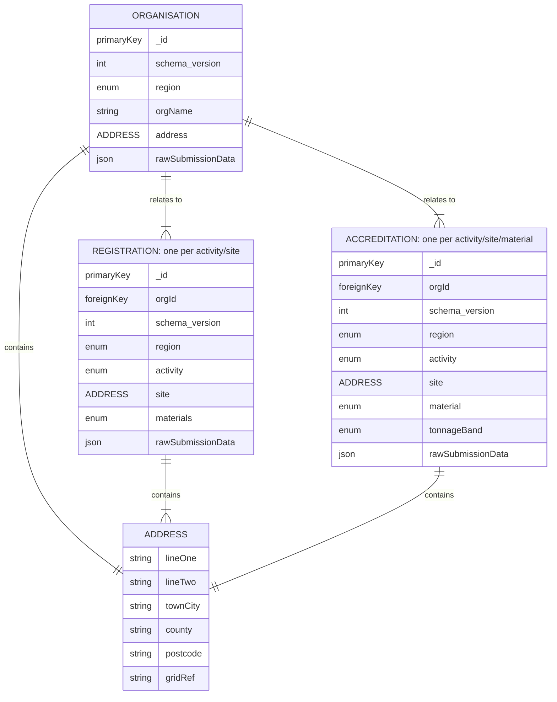

# 2. Registration & Accreditation form database schema

Date: 2025-08-05

## Status

Accepted

## Context

Defra forms will be [submitted to this backend service for persistent storage against an OrgId](docs/architecture/defined/2025-reg-acc-hld.md). This will need to be optimised for write operations if possible.

In addition, the forms represented above will vary by operator activity (e.g. Reprocessor or Exporter), where the remaining data provided to the API service will depend on the activity type.

### Future requirements

We will need to access this data at a later stage in the pEPR portal to join it with data sent from the regulator. Data will likely be transferred to another database or collection(s) that can be optimised for read operations.

### Workload

| Action                         | Query Type | Information                                                    | Frequency  | Priority |
| ------------------------------ | ---------- | -------------------------------------------------------------- | ---------- | -------- |
| Submit Organisation form data  | Write      | orgId, orgName, other fields defined by form                   | ~0-100/day | High     |
| Submit Registration form data  | Write      | orgId, activity, site, materials, other fields defined by form | ~0-500/day | High     |
| Submit Accreditation form data | Write      | orgId, activity, site, material, other fields defined by form  | ~0-500/day | High     |

## Decision

Use references between Organisation, Registration & Accreditation entities [optimised for write performance, described by the mongodb docs](https://www.mongodb.com/docs/manual/data-modeling/schema-design-process/map-relationships/#:~:text=Improve%20update%20performance):

> Improve update performance
>
> If your application frequently updates related data, consider storing the data in its own collection and using a reference to access it.
>
> When you use a reference, you reduce your application's write workload by only needing to update the data in a single place.

### Relationship map

### Design Patterns

As well as write optimised references, the following patterns are likely to be useful during the implementation:

1. [Polymorphic pattern](https://www.mongodb.com/docs/manual/data-modeling/design-patterns/polymorphic-data/polymorphic-schema-pattern/): native to mongodb and will be useful to vary the "otherFields" by activity type
2. [Schema Versioning pattern](https://www.mongodb.com/company/blog/building-with-patterns-the-schema-versioning-pattern): simple to implement, may reduce complexities in future requirements if the schema changes part way through the project

#### Discounted patterns

The following patterns may be useful for [future requirements](0002-registration-accreditation-form-database-schema.md#future-requirements), but present more challenges than solutions at this stage:

1. [Extended Reference pattern](https://www.mongodb.com/company/blog/building-with-patterns-the-extended-reference-pattern): may speed up read operations but will slow down the write optimisation
2. [Attributes pattern](https://www.mongodb.com/company/blog/building-with-patterns-the-attribute-pattern): may simplify read operations on REGISTRATION & ACCREDITATION entities but will slow down the write optimisation
3. [Tree pattern](https://www.mongodb.com/company/blog/building-with-patterns-the-tree-pattern): may reduce complexities converting the data to a read optimised schema, can be applied as a one-off at a later stage but would complicate and slow down the write optimisation
4. [Outlier pattern](https://www.mongodb.com/company/blog/building-with-patterns-the-outlier-pattern): may be useful for some entities on a read optimised schema, but complex to implement for write optimisation with little value

## Consequences

By designing a schema that is optimised for write operations, we are likely committing to a migration of this schema to a read optimised collection at a later phase.

It is expected that future requirements (as yet not fully defined) will introduce the need for a migration anyway.
The working assumption here is that the regulator will manage data changes offline and provide them back to us once the registrations and accreditations are approved.
At this point we will need to locate, merge and restructure the data into a read optimised schema for use in the pEPR portal.
