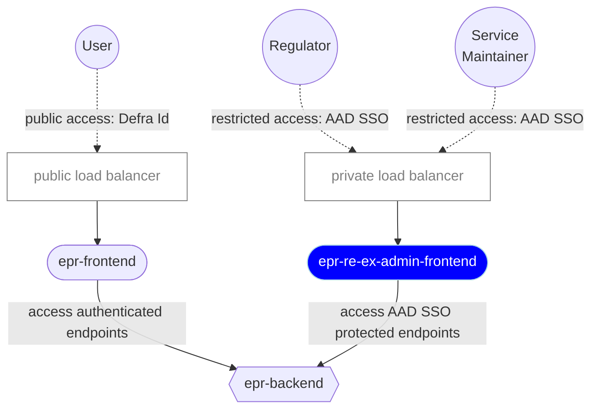

# 5. Admin UI

Date: 2025-09-17

## Status

Proposed

## Context

As a team building systems for the Reprocessors and Exporters side of the EPR (Extended Producer Responsibilities) service we need to fulfill the needs of various privileged stakeholders in the space including administrators of the service and the Regulator.

At the moment, there isn't a way for those stakeholders to access the information submitted by the Operators (Reprocessors and Exporters) and kept in our service's database.

It's especially pressing for the team supporting the EPR service to gain the ability to debug potential problems with the existing forms for submitting `organisation`, `registration` and `accreditation` information as soon as possible, as mentioned in the [Data Extraction ADR](0004-data-extraction.md).

## Decision

We have chosen to build an Admin UI (`epr-re-ex-admin-frontend`) for the EPR service.

The goal of the service is to act as an administrative tool for both system administrators and for the Regulator of EPR service to perform their duties based on different user's authorisation levels.

### Service features

The service will have the following characteristics:

- It will be based on the CDP Node.js Frontend Template
- It will live in CDP's protected zone with all users signing in via AAD/SSO (Entra Id)
- Authorisation will be based on role-based access control approach (RBAC) supporting only two different roles (at least initially): System Administrator and Regulator.
- A simple secret-based mechanism will be used initially to map users to roles.
- All AAD (Entra Id) users will be allowed to login (authenticate). Access to the different resources will follow a "route guarding" approach by which different pages will require different user roles, i.e. a user without the right access level will receive 403 response and see a "You do not have access to this page" message when visiting that page/resource.
- The app will get all its data from `epr-backend`. Calls to `epr-backend` will relay AAD's auth token to ensure the user is authorised to access the affected endpoint.
- The app will not support multiple languages, at least not initially, and English will be the only language available.

### Place in the Re-Ex EPR architecture

The following diagram outlines how `epr-re-ex-admin-frontend` fits into the overall architecture of the EPR service:

### Other considerations

This service is taking inspiration from the following projects in the CDP space:

- [CDP Portal Frontend](https://github.com/DEFRA/cdp-portal-frontend)
- [Forms Designer](https://github.com/DEFRA/forms-designer)
- [BTMS Portal Frontend](https://github.com/DEFRA/btms-portal-frontend)

A proof-of-concept of a first protected endpoint in the `epr-backend` service is already being discussed, which is helping refine the system's requirements and future ADRs.

## Consequences

Having an Admin UI in CDP's private space adds an additional layer of security to the system by making access to the private network an additional requirement.

From the organisational point of view, it establishes a clear separation between the publicly and privately accessible functions while helping the product team to separate concerns and define parallel streams of works, which will help us divide our tasks.

The full scope of the project is still being defined as part of the [High Level Design](../discovery/pepr-hld.md), but we believe there are no risks associated with creating an Admin UI as a starting point for managing the needs of Service Maintainers and the Regulator, and as a gateway to the protected endpoints in `epr-backend`.

In the future a more sophisticated mechanism that enables user management capabilities will need to be devised. This implies that user administration will be performed manually by the team in the initial phases.

The decision to **authenticate** users with AAD, with **authorization** happening within the service (via a simple RBAC implementation):

- is consistent with the approach taken in other CDP services (so should be familiar to future maintainers)
- means user administration will be performed manually by the team in the initial phases
- may need to be replaced with a more sophisticated mechanism for enabling user management capabilities in the future
