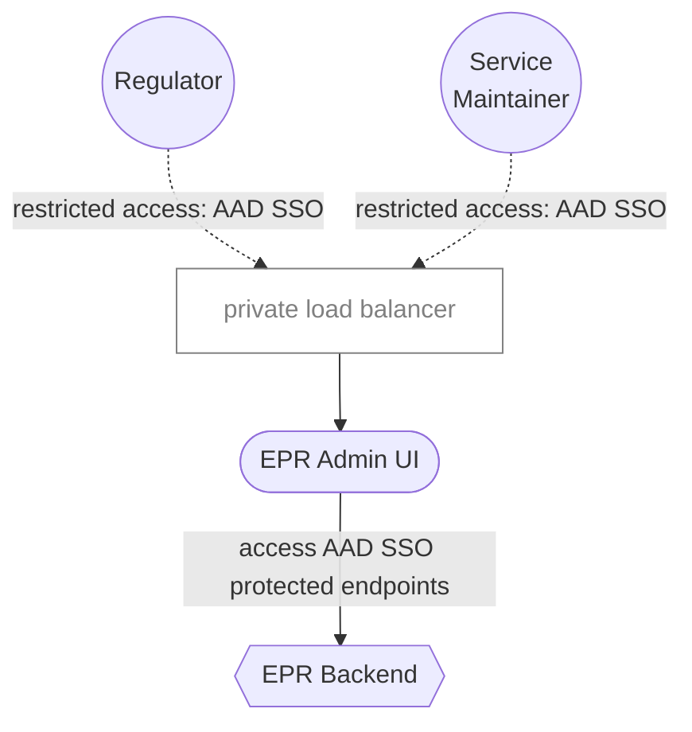

# 6. Data updates: processing pipeline vs Admin UI

Date: 2025-09-15

## Status

Proposed

## Context

There are two ways to update data in the pEPR service from Regulators:

1. Through a data processing pipeline, where a feed of data is provided via a file store, e.g. SFTP uploads, processed on a schedule and then imported into the system in the form of database updates
2. Directly via an Admin UI: Regulators log in, locate entities and edit them directly

## Decision

The long-term goal of this project is to use an Admin UI for most Service Maintenance and Regulator access/edit tasks.

The data processing pipeline was only ever intended as a temporary solution to save time.
It comes with the drawback of being very opinionated about incoming and target data shapes
Future capabilities such as continual updates on final data structures will require more data processing pipelines and thus more maintenance.

Whilst difficult to quantify at this point, the Admin UI will likely take a similar amount of time to build than the data processing pipeline.
In addition, it will likely be more robust, less maintenance and easier to reason about.

### Admin UI Architecture

## Consequences

Benefits of an Admin UI over a data processing pipeline:

1. Provides Regulators with access to the system
2. Provides Service Maintainers with management tools for Regulator access
3. Provides a single solution to initial provision and subsequent updates of data
4. Additional: Provides a platform earlier in the project lifecycle to monitor the running System
5. Additional: Provides a System Log of actions completed by Service Maintainers, Regulators, Operators & Consultants

The trade-off is that we also have to commit to building and maintaining an additional UI, which is a non-trivial task.

I believe that the trade-off is worthwhile, given the benefits and lack of wasted effort over the lifecycle of the project.
