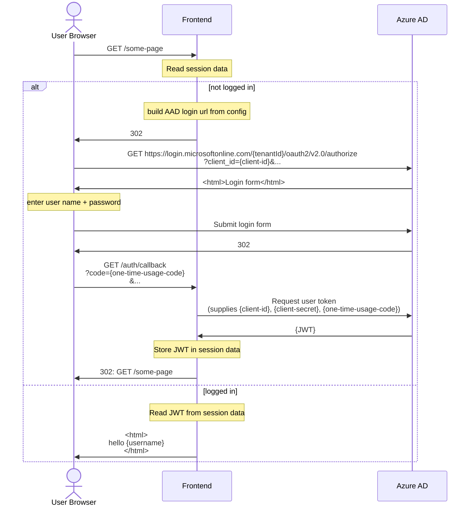
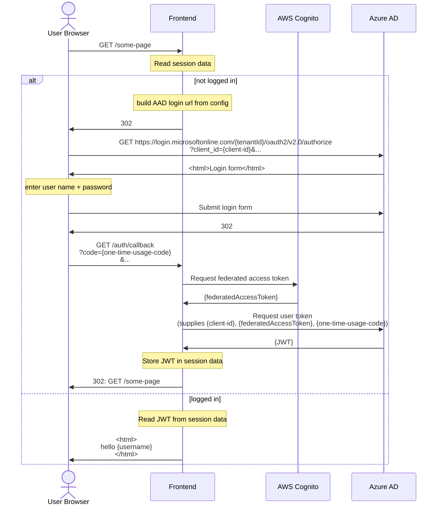

# 9. Admin-UI: Approach for authenticating with Azure AD

Date: 2025-10-02

## Status

Accepted

## Context

As per the [Admin UI ADR](./0005-admin-ui-adr), the Admin UI will leverage Azure Active Directory (AAD) to present a single-sign-on journey to **authenticate** users trying to access the Admin UI. The Admin UI itself must authenticate with AAD to support the SSO interactions.

At the time of writing, there are two supported approaches in the CDP platform.

> [!NOTE]
> The Admin UI runs on the CDP platform (which is an abstraction over AWS), whereas AAD runs in (central) Defra's Azure account.

### Approach 1 - secrets-based authentication

1. Register the Admin UI app with AAD, receive a `client-id` and `client-secret`
1. Supply `client-id` and `client-secret` to Admin UI app
1. At runtime the app uses `client-id` and `client-secret` to authenticate interactions with AAD
1. Periodically acquire a new `client-secret` (it expires)

### Approach 2 - federated authentication

1. Register the Admin UI app with AAD, receive a `client-id`
1. Register the Admin UI app with AWS Cognito (on CDP)
1. Update the Admin UI app in AAD to support federated access (using details from the AWS Cognito registration)
1. At runtime the app
   - Integrates with AWS Cognito to get a temporary token
   - uses `client-id` and the temporary token (from AWS Cognito) to authenticate interactions with AAD

> [!IMPORTANT]
> Compared to secrets-based authentatication, federated authentication
>
> - has more external dependencies at runtime (and thus a more involved implementation)
> - requires more requests to external teams during intial set up

## Decision

- Initially **secrets-based authentication** will be used
- Federated authentication remains an option to explore _in the future_

The primary motivation for the chosen approach is to expediate initial deliivery time for our initial delivery. This decision optimises for this as

1. there is not currently a known/documented approach for integrating with the CDP AWS Cognito instance during local development - this presents an additional challenge for PoC + development activities
1. requests to external teams are needed to create configuration/credentials - these have an associated time-delay (expect 2-3 days)
   - For secrets-based auth
     - 1 x ServiceNow ticket (per environment) for secrets-based auth (create Admin UI app in AAD tenant, define redirect and logout URLs)
   - For federated auth, as secrets-based auth plus
     - 1 x request (per environment) to CDP support team to register Admin UI with AWS Cognito
     - 1 x ServiceNow ticket (per environment) to enable the use of Federated Authentication (on Admin UI app in AAD tenant)

## Consequences

1. We anticipate a shorter timescale for the initial build
1. The `client-secret` (in each environment) will expire after 12 months
   - (Risk) Expiry will cause an outage for users
   - (Maintenance) We will need to acquire (and provision Admin UI with) a new secret before it expires
1. Expect further investigation + build of federated authentication to be slower, relative to doing it _now_, due to
   - attrition of our knowledge in this area
   - context switching
