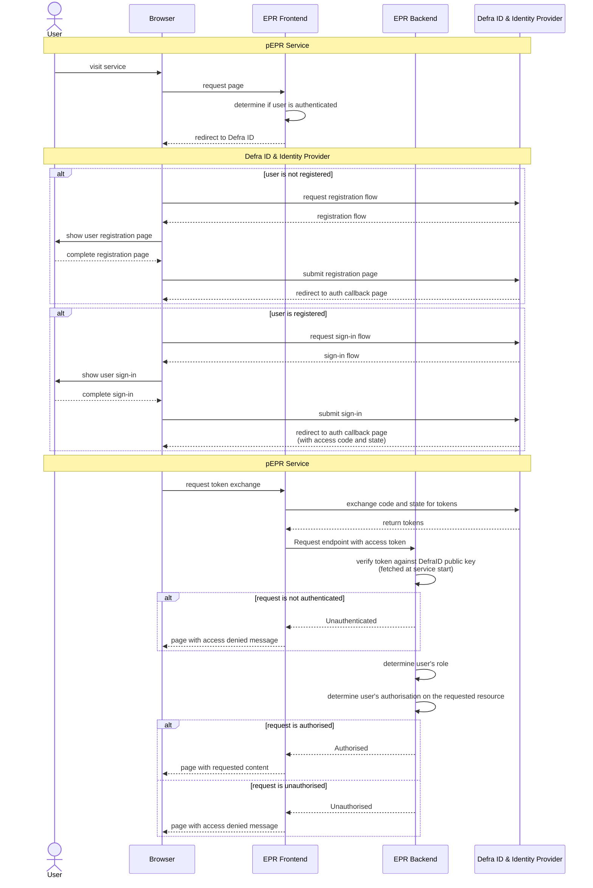
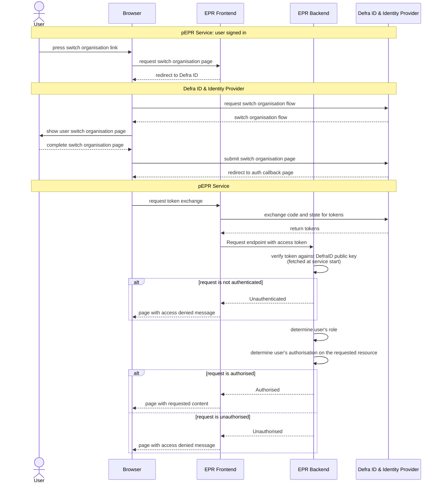
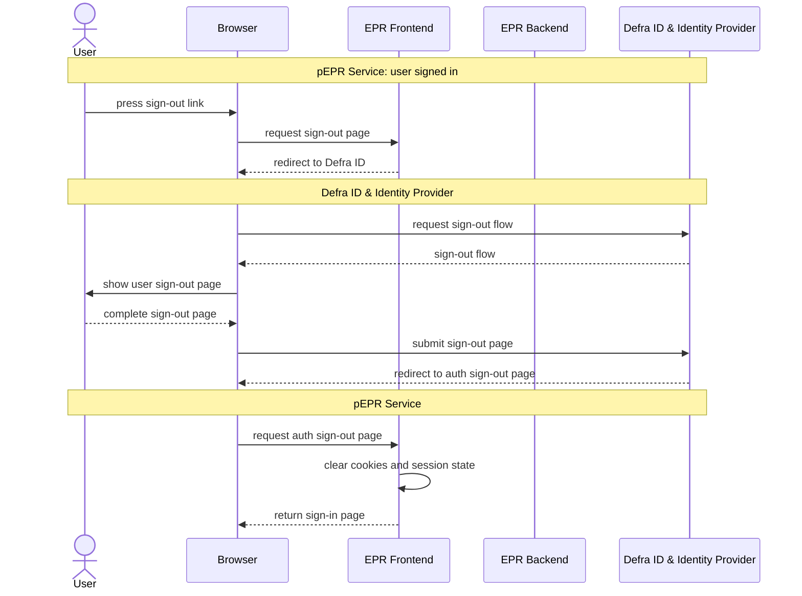

# 14. Defra ID

Date: 2025-10-08

## Status

Accepted

## Context

As a Defra digital service we need to ensure that public users are Authenticated to access our service
and Authorised to read/write data associated to their access within the service.

## Decision

As a foregone conclusion, we are required to use DefraID as it provides a consistent experience for users,
especially where those users access more than one Defra digital service.

Defra ID is a centralised authentication and authorisation service that provides a single sign-on experience for all Defra digital services.

It is essentially a credential broker between digital services and Identity Providers such as Government Gateway and One Signin.

For reasons of simplicity, the diagrams below demonstrate Defra ID & Identity Provider as a single service.
The goal of the diagrams is to explain how our service will integrate with Defra ID rather than to explain how it works with Identity Providers.

### Registration & sign-in flow

### Change Organisation flow

Defra ID allows users to switch organisations within the same session, which allows users to access multiple organisations without having to re-authenticate.

### Sign-out flow

[Relevant resources can be found here](https://eaflood.atlassian.net/wiki/spaces/MWR/pages/5952995350/Defra+ID)

### Limitations

#### DefraID assumes that the user has logged in before providing any data to the service

We therefore need to find a way to map the user's session data to the relevant organisation data.

This may prove tricky where there is not an exact match between the Defra ID organisation name and the Organisation name in our service's data.

It may be possible to use a combination of techniques to match automatically:

1. Use the Approved Person's email address to find registrations and related organisations they are associated with
2. Use fuzzy matching on the organisation name
3. Ask the user to input their System Reference Number before or after being redirected to Defra ID

> [!WARNING]
> If a match is not found, the service would direct the user towards the regulator for support.
>
> The regulator would need the appropriate processes to resolve the issue for the user.

#### DefraID assumes roles are applied to the user per organisation

We will very likely need to apply roles to the user on a per Registration/Accreditation basis, because:

1. The PRN Signatory role is stored on Accreditations
2. Defra forms provide the Approved Person on the registration form and this discrepancy will be difficult to patch automatically.

## Consequences

Primarily, the consequences are positive in that a single centralised service is used for Authentication that provides a consistent experience for users.

That said, there are some [potential downsides](https://eaflood.atlassian.net/wiki/spaces/MWR/pages/5966299368/Defra+ID+issues) documented in Confluence for privacy reasons.
