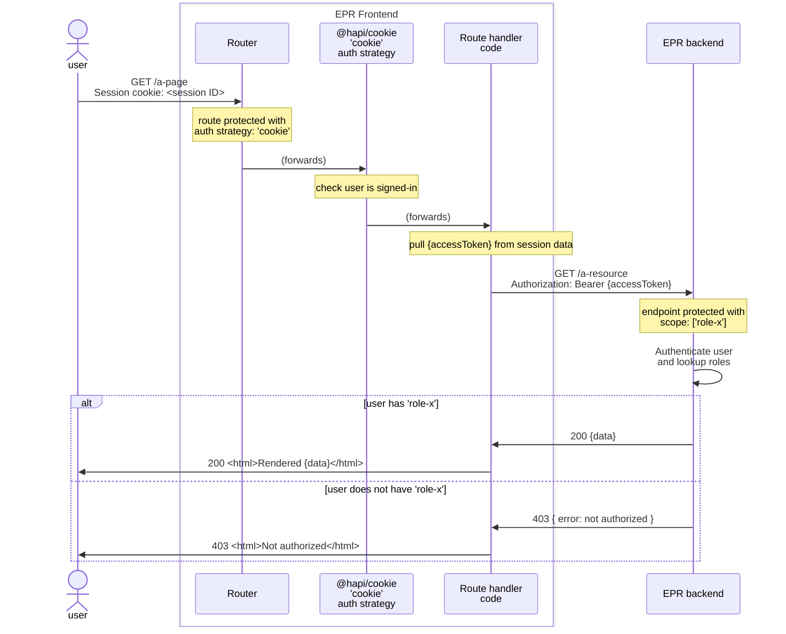

# 16. Admin UI Authorisation MVP

Date: 2025-10-13

## Status

Accepted

## Context

The `epr-re-ex- admin-frontend` application leverages Entra Id for authentication. This ADR outlines an approach for authorisation that builds on the authentication implementation.

Authorisation is an enabler for overlaying Role Based Access Control (RBAC) onto

- page access in the `epr-re-ex-admin-frontend` application
- API access in the `erp-backend` application (which will be called by the `frontend`)

The initial approach

- must ensure protected content can only be accessed by users with the appropriate role (just `service_maintainer` initially, with the potential for more roles in the future)
- should be optimised for a short delivery time (to reduce risk in the project)
- should be consistent with a "north star" design, allowing the team to iterate on and improve the implementation incrementally (towards that design)

### Options

Access protection of either a page or an API endpoint will be done based on whether the logged in user has the role(s) required to access that page/endpoint. The mapping of users to roles will sit within the pEPR service (ie it will not come as part of the token obtained from Entra ID) - the options for _where in the service_ this mapping exists are

#### 1. Embedded in both frontend and backend

Both `frontend` and `backend` applications have user to role mapping embedded within them, allowing them to internally lookup a user's assigned roles

#### 2. Embedded in backend and exposed to frontend over API

The `backend` application has user to role mapping embedded within it, allowing an internal lookup of a user's assigned roles

Additionally, the `backend` exposes an endpoint, say `GET /user-roles`, that returns the roles for a given user.

> [!NOTE]
> The `GET /user-roles` endpoint will itself be protected - it will required incoming calls to be from a logged in user (identified by providing an access token) with the appropriate role

To implement page access protection the `frontend` will make an API call to lookup the user's assigned roles.

#### 3. Infer protection of pages from API responses

The `backend` application has user to role mapping embedded within it, allowing an internal lookup of a user's assigned roles

Page access protection in the `frontend` will be _inferred_ - when rendering a page where a protected API endpoint is called the `frontend` will

- assume access to the page if the protected endpoint returns data and a `2xx` response
- assume the user is not authorised to access the page if the endpoint returns a `401|403` response

## Decision

We will implement **option 3** (infer protection of pages from API responses) for the MVP.

Intially, the user to roles mapping will be supplied to the `backend` application via CDP config

- details of the config (specifics of env var name and value) will be worked out (and documented) at implementation time
- we expect this to be a short-lived implementation

The supplied config will list email addresses (from Entra Id accounts) against the `service_maintainer` role for team members who need access to `epr-re-ex-admin-frontend`.

## Consequences

The chosen (MVP) authorisation approach (option 3) enables the team to implement an authorisation mechanism quickly, without being dependent on defining the (end-state) needs of the project with regards to roles and permissions.

This unblocks the delivery and deployment of the initial version of the service (having authentication + authorisation in place is a must for initial deployment).

Further the implementation

- can be iterated on towards **option 2** (the "north star" design) in the future
- allows us to defer solving problems like
  - what is the performance impact (on page load time) of the `frontend` requesting roles from the `backend` on serving every page? Is performance optimisation (eg. caching) required?
  - assuming caching of roles in the `frontend` is employed, how are role changes (embedded in the `backend`) kept in sync across the service? How should the system handle the scenario where a role change occurs during a user session?
  - speccing out an endpoint on the `backend` for exposing roles that meets the needs of both `epr-re-ex-admin-frontend` **and** `epr-frontend`

Limitations imposed on `frontend` application

- can not optionally render parts/components within a page based on users role (eg render page for all users but only render `delete` button if user has `role-x`)
