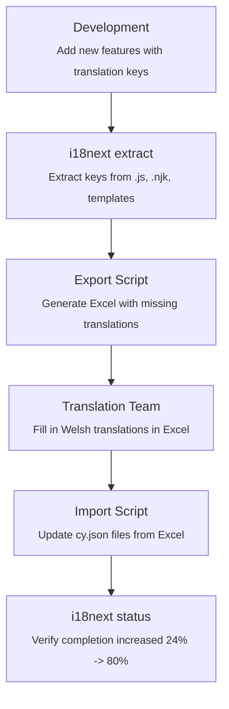

# 22. Translation process for English/Welsh strings

Date: 2025-11-06

## Status

Accepted

## Context

### Current Setup

The application uses JSON locale files (`en.json` and `cy.json`) to store translated strings across different namespaces (typically corresponding to feature folders under `src/server/**`).

Currently, the translation process is manual. To move toward a structured and partially automated workflow, we need to define how untranslated or updated strings are sent to translators and how completed translations are brought back into the codebase.

We also need to ensure consistency between English and Welsh locale files by validating that both exist and contain matching keys.

### Current Translation Validation

The project currently uses **`@lingual/i18n-check`** for basic translation validation, but it has limitations:

- Manual process requiring separate script execution
- No automated key extraction from source code
- Limited reporting capabilities
- No built-in translation progress tracking

### Translation Format and Delivery

The translation team accepts **Excel** files as standard.  
Data can be sent via email to the contact to pass it on to the translation team.

---

## Decision

We will implement an automated translation workflow using **i18next-cli** with a custom Nunjucks plugin, combined with Excel-based export/import scripts.

### Why i18next-cli Replaces @lingual/i18n-check

i18next-cli provides comprehensive translation management capabilities that make `@lingual/i18n-check` redundant:

**i18next-cli provides:**

- Automated key extraction from source code (`.js`, `.njk` files)
- Built-in validation of translation file pairs
- Real-time translation progress tracking (`status` command)
- Automatic synchronization of keys across languages
- Detection of missing/extra keys
- Plugin system for custom file formats (Nunjucks)

By adopting i18next-cli, we consolidate translation extraction, validation, and reporting into a single tool with a modern plugin architecture.

### Solution Components

#### 1. Automated Key Extraction: i18next-cli + Custom Plugin

**i18next-cli** provides automated extraction of translation keys from source code with built-in commands:

- **`extract`** - Scans source code for translation keys and updates JSON files in place
  - Adds newly discovered keys to translation files
  - Preserves existing translations
  - Updates files directly in `src/server/*/en.json` and `cy.json`
  - Does NOT provide exportable files for translators

- **`status`** - Show translation completion progress (e.g., "Welsh: 32% complete")

- **`sync`** - Synchronize keys across languages (ensures en.json and cy.json have matching keys)

**Custom Nunjucks Plugin** extends i18next-cli to handle `.njk` template files:

- Uses the `onEnd` hook to process files after standard JS parsing
- Scans all `.njk` files using `glob`
- Extracts translation function calls (`localise()` and `t()`) via regex
- Adds extracted keys directly to the collection

#### 2. Excel Export/Import for Translation Team

**Excel Structure:**

| field name                | en                           | cy  |
| ------------------------- | ---------------------------- | --- |
| home:pageTitle            | Home                         |     |
| home:services.description | Use the service to manage... |     |

**Export Script** (`scripts/export-translations.js`):

- Discovers all namespaces by scanning for `en.json` files
- Flattens nested JSON to dot notation
- Identifies keys with empty Welsh translations
- Generates Excel file with only untranslated strings
- Uses `ExcelJS` library for Excel generation

**Import Script** (`scripts/import-translations.js`):

- Reads completed Excel file
- Parses `namespace:key` format from "field name" column
- Reconstructs nested JSON structure
- Validates keys exist in `en.json` before importing
- Updates corresponding `cy.json` files
- Reports success/errors

---

## Consequences

### Translation Workflow

The complete workflow integrates i18next-cli commands with custom Excel export/import scripts:



### Summary Table

| Aspect           | Decision                                    |
| ---------------- | ------------------------------------------- |
| Extraction tool  | i18next-cli with custom Nunjucks plugin     |
| Export format    | Excel (.xlsx)                               |
| Columns          | field name, en, cy                          |
| Delivery method  | Email                                       |
| Automation scope | Highly automated (extract + export/import)  |
| Key format       | namespace:key (e.g., `home:pageTitle`)      |
| Nested keys      | Dot notation (e.g., `services.description`) |

### Available npm Scripts

```bash
# Extract translation keys from source code
npm run i18n:extract

# Check translation completion status
npm run i18n:status

# Export missing translations to Excel
npm run export:translations

# Import completed translations from Excel
npm run import:translations

```

### References

- i18next-cli documentation: https://github.com/i18next/i18next-cli
- i18next plugin system: https://github.com/i18next/i18next-cli#plugins
- ExcelJS documentation: https://github.com/exceljs/exceljs
- Frontend i18n implementation: [ADR 0013](0013-i18n-options.md)


---
