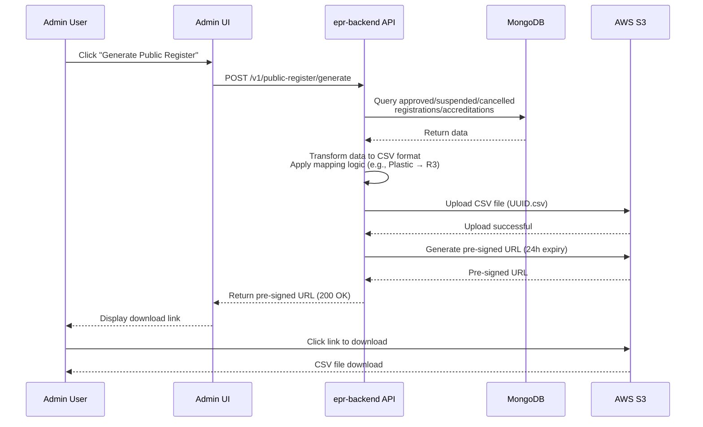

# 23. Public Register of Registrations/Accreditations

Date: 2025-01-20

## Status

Accepted

## Context

The system must generate an export file containing all registerations/accreditations from reprocessors and exporters. This file will undergo a Defra review before being added to the public register.

The public register provides transparency by publishing information about organisations that have registered and/or been accredited to reprocess or export packaging waste.

### The Public Register Fields

The public register will contain the following fields:

| Column Header                                                    | Sample Value        |
| ---------------------------------------------------------------- | ------------------- |
| Type                                                             | Reprocessor         |
| Business name                                                    | Waste Ltd           |
| Registered office Head office Main place of business in UK | 1 Waste Road N1     |
| Appropriate Agency                                               | Environment Agency  |
| Registration number                                              | R12345678PL         |
| Trading name                                                     | Waste Recovery      |
| Registered Reprocessing site (UK)                                | 2, Waste Site, EC1  |
| Packaging Waste Category                                         | Plastic             |
| Annex II Process                                                 | R3                  |
| Accreditation status (active, suspended, cancelled)              | ACTIVE              |
| Accreditation No                                                 | A123456PL           |
| Tonnage Band                                                     | up to 10,000 tonnes |
| Active Date (Start date for the accreditation)                   | 1/1/2026            |
| Date last changed                                                | 1/1/2026            |

## Decision

We will implement an **on-demand** public register generation that:

1. **User-initiated generation** - Admin user requests generation via API endpoint
2. **Generates CSV files** containing registration and accreditation data using `@fast-csv/format`
3. **Stores files in S3** bucket `re-ex-public-register` with a 30-day retention policy
4. **Returns pre-signed URL** - Generates S3 pre-signed URL (1-hour expiry) and returns to user immediately

### File Generation Process

Find all organisations in the `epr-organisations` database and generate the public register file as follows:

1. Read all registrations with status: approved, suspended, or cancelled
2. Read any corresponding accreditations with status: approved, suspended, or cancelled
3. Create a row for each registration/accreditation and populate the relevant fields. Process in batches to keep the event loop responsive during generation.
4. Apply mapping logic as required (e.g., mapping Plastic to R3 for "Annex II Process")
5. Generate CSV file using `@fast-csv/format` library with proper quoting
6. Write the file to S3 bucket `re-ex-public-register` with object key format: `[UUID].csv`

### File Access Flow

