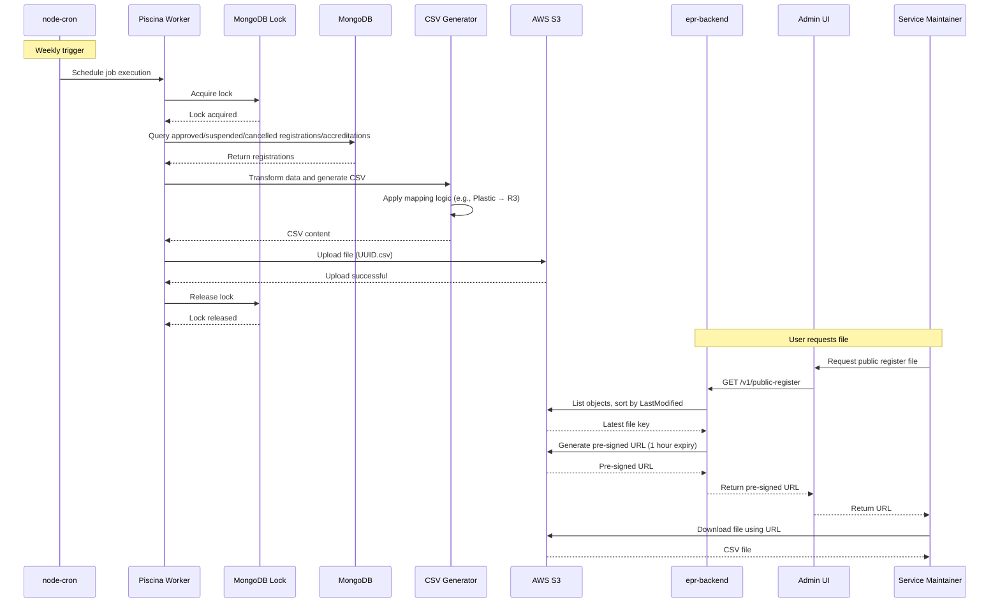

# 23. Public Register of Registrations/Accreditations

Date: 2025-01-20

## Status

Proposed

## Context

The system must generate an export file containing all registerations/accreditations from reprocessors and exporters. This file will undergo a Defra review before being added to the public register.

The public register provides transparency by publishing information about organisations that have registered and/or been accredited to reprocess or export packaging waste.

### The Public Register Fields

The public register will contain the following fields:

| Column Header                                                    | Sample Value                                                               |
| ---------------------------------------------------------------- | -------------------------------------------------------------------------- |
| Header to appear in Public Register                              | Sample Entry                                                               |
| Type                                                             | Reprocessor                                                                |
| Business name                                                    | Waste Ltd                                                                  |
| Registered office Head office Main place of business in UK | 1 Waste Road N1                                                            |
| Appropriate Agency                                               | Environment Agency                                                         |
| Registration number                                              | R12345678PL                                                                |
| Registration history (Status + Effective from)                   | _(empty)_                                                                  |
| Trading name                                                     | Waste Recovery                                                             |
| Registered Reprocessing site (UK)                                | 2, Waste Site, EC1                                                         |
| Packaging Waste Category                                         | Plastic                                                                    |
| Annex II Process                                                 | R3                                                                         |
| Accreditation status (active, suspended, cancelled)              | ACTIVE                                                                     |
| Accreditation No                                                 | A123456PL                                                                  |
| Tonnage Band                                                     | up to 10,000 tonnes                                                        |
| Active Date (Start date for the accreditation)                   | 1/1/2026                                                                   |
| Date last changed                                                | 1/1/2026                                                                   |
| Accreditation history (Status + Effective from)                  | Approved 1/1/26 Suspended 2/1/26 Approved 3/1/26 Cancelled 5/1/26 |

## Decision

We will implement an automated public register generation system that:

1. **Runs weekly** using `node-cron` scheduler with `Piscina` worker threads
2. **Generates CSV files** containing registration and accreditation data using `@fast-csv/format`
3. **Stores files in S3** bucket `re-ex-public-register` with a 30-day retention policy
4. **Provides access** through admin UI using pre-signed S3 URLs with 1-hour expiry
5. **Ensures single execution** using MongoDB locks to prevent duplicate generation across multiple instances

### File Generation Process

Find all organisations in the `epr-organisations` database and generate the public register file as follows:

1. Read all registrations with status: approved, suspended, or cancelled
2. Read any corresponding accreditations with status: approved, suspended, or cancelled
3. Create a row for each registration/accreditation and populate the relevant fields
4. Apply mapping logic as required (e.g., mapping Plastic to R3 for "Annex II Process")
5. Generate CSV file using `@fast-csv/format` library with proper quoting
6. Write the file to S3 bucket `re-ex-public-register` with object key format: `[UUID].csv`

### Scheduling Strategy

The public register file should be generated weekly, so a scheduler is required.

#### Option 1: node-cron with Worker Threads (Chosen)

Use `node-cron` to schedule the job. Use `Piscina` for sandboxed worker execution and MongoDB locks (`mongo-locks`) to ensure only one application instance generates the file at a time.

**Pros:**

- Simple implementation using existing dependencies
- No additional infrastructure required
- Sufficient for weekly generation use case

**Cons:**

- Jobs don't persist across application restarts
- Limited monitoring capabilities

#### Option 2: Full-Featured Job Scheduler

Use a dedicated scheduler like `@pulsecron/pulse` (MongoDB-backed) or BullMQ (Redis-backed). This would require a proof of concept to choose the right scheduler and set it up.

**Pros:**

- Job persistence across restarts
- Built-in monitoring and retry logic
- Better for complex scheduling needs

**Cons:**

- Additional complexity
- May require new infrastructure (Redis for BullMQ)

#### Decision

**Option 1 is chosen** as it's simple, uses existing dependencies, and adequately serves the weekly public register generation use case.

### File Access Strategy

The S3 file link will be made available from the admin UI. A pre-signed S3 URL will be created on demand:

1. Find the latest file in the bucket using `LastModified` timestamp
2. Create a pre-signed URL for the file with 1 hour expiry time
3. Return the URL to the admin UI

### Sequence Diagram

