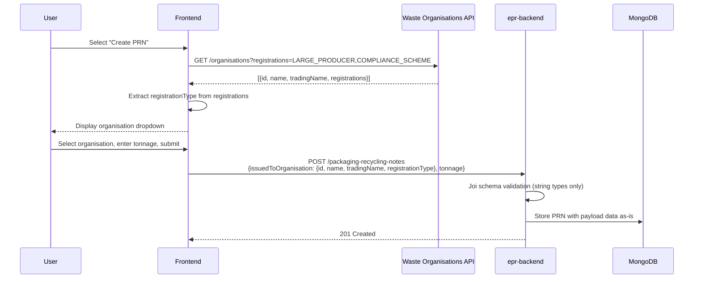
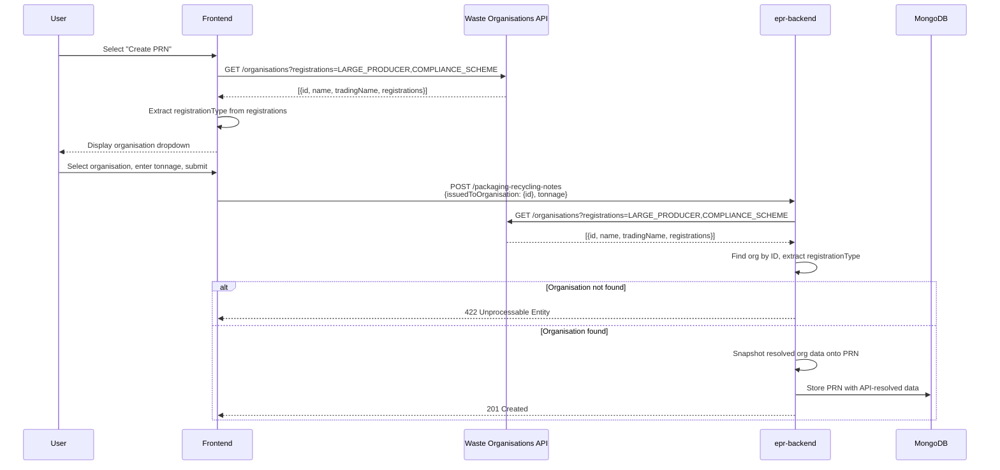
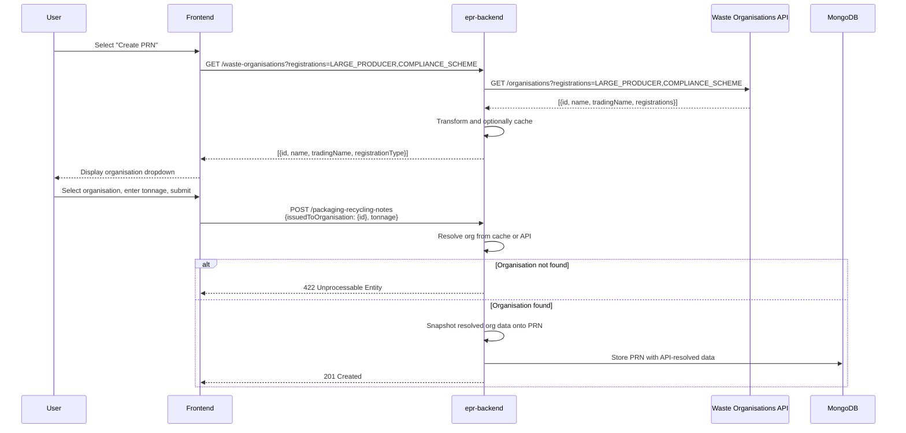

# 28. Waste Organisation Resolution for PRN Creation

Date: 2026-02-20

## Status

Proposed

## Context

When a recycler/exporter creates a Packaging Recycling Note (PRN), the PRN records which producer organisation it is issued to. This `issuedToOrganisation` data includes the organisation's ID, registered name, trading name and registration type (large producer or compliance scheme).

Currently, the frontend calls the waste organisations API to populate a dropdown for the user to select the target organisation. When the user submits the PRN, the frontend sends the full organisation details (id, name, tradingName, registrationType) in the POST payload to epr-backend. The backend performs only schema validation (correct types and required fields) and stores whatever it receives.

This means:

- **The backend trusts the frontend completely** for the accuracy of waste organisation data
- **API consumers bypassing the frontend** (e.g. automated integrations, testing tools) can submit arbitrary organisation names and details
- **Stale data** could be stored if the frontend's cached organisation list is out of date
- **No server-side verification** that the organisation ID actually exists in the waste organisations register

The `issuedToOrganisation` snapshot is used downstream for display (e.g. on PRN detail pages, in reports) and the `registrationType` field determines whether the legal name or trading name is shown. Incorrect data here propagates through the system.

Beyond PRN creation, the backend is likely to need access to the waste organisations API for data migration — e.g. backfilling PRNs created before fields like `registrationType` were captured. This makes the backend integration with the waste organisations API useful beyond the PRN creation path.

## Options

### Option 1: Status quo - frontend is trusted

The backend continues to accept and store whatever `issuedToOrganisation` data the frontend sends. No server-side validation or resolution against the waste organisations API.

**Pros:**

- No backend changes required
- No additional API dependency for the backend
- Simpler backend code with fewer failure modes
- Lower latency on PRN creation (no additional API call)

**Cons:**

- No protection against fabricated or stale organisation data
- API consumers not using the frontend can store arbitrary data
- The backend has no way to verify the organisation exists or is currently registered
- The `registrationType` field (which controls display logic) is entirely client-controlled

### Option 2: Backend resolves organisation from waste organisations API

The backend accepts only the organisation `id` in the payload and calls the waste organisations API itself to resolve the name, trading name and registration type. The frontend continues to call the waste organisations API independently for its own UI needs (populating the dropdown).

This is the approach implemented on branch `PAE-1113-resolve-org-from-id`:

- Payload schema reduced to `{ issuedToOrganisation: { id } }`
- New `wasteOrganisationsService` Hapi plugin calls the waste organisations API
- Backend returns 422 if the organisation ID is not found
- Resolved data is snapshotted onto the PRN

**Pros:**

- The backend becomes the authority for what gets stored - no trust in the frontend required
- Organisation data is verified as current at the time of PRN creation
- API consumers cannot fabricate organisation details
- `registrationType` is always accurate, ensuring correct display logic downstream
- Follows the same pattern as the existing `organisationsRepository` (the issuing org is already resolved server-side)

**Cons:**

- Both frontend and backend call the waste organisations API independently, duplicating the integration
- Additional API call on the PRN creation path adds latency (mitigated by `Promise.all` with existing lookups)
- New failure mode: PRN creation fails if the waste organisations API is unavailable
- Backend needs configuration for waste organisations API credentials

### Option 3: Backend owns waste organisation data entirely

The backend exposes its own endpoint(s) for waste organisation lookup, acting as a proxy or cache for the upstream waste organisations API. The frontend retrieves organisation data from the backend rather than calling the waste organisations API directly. The backend also resolves organisation data on PRN creation.

**Pros:**

- Single integration point with the waste organisations API (backend only)
- Frontend has one fewer external dependency
- Backend could cache organisation data, reducing upstream API calls
- Complete control over data transformation and enrichment
- Consistent data between what the user sees and what gets stored

**Cons:**

- Significant additional backend development (new proxy endpoints replacing the frontend's existing integration)
- The backend becomes a proxy for an API the frontend already integrates with successfully
- The frontend's existing waste organisations integration works well and would need to be replaced
- Goes beyond the current problem statement, which is specifically about trust at write time

## Decision

Option 2: Backend resolves organisation from the waste organisations API.

The backend is likely to need access to the waste organisations API for other purposes such as data migration, so the "additional dependency" cost of Option 2 is not specific to PRN creation. Option 1 leaves untrusted data in the system for no meaningful saving.

Option 3 solves a problem we don't have. The frontend's existing waste organisations integration works well and doesn't need replacing. The single-integration-point benefit doesn't justify the additional proxy endpoints and the effort of replacing a working integration.

Both frontend and backend call the waste organisations API, but for different reasons. The frontend uses it for presentation (populating a dropdown, choosing the right display name). The backend uses it to verify and snapshot authoritative data at write time. This is not duplicated logic — it is the same data consumed independently for different purposes.

The backend's waste organisations adapter should be a general-purpose client that returns organisation data without frontend-specific transformation. What gets snapshotted onto a PRN is a domain concern belonging to the PRN creation handler, not the adapter. This keeps the adapter reusable for other purposes such as migration.

## Consequences

- The backend gains a new dependency on the waste organisations API, with credentials managed through environment configuration
- PRN creation makes an additional API call, run in parallel with existing lookups to minimise latency impact
- If the waste organisations API is unavailable, PRN creation fails — though this is largely academic since the frontend cannot populate its dropdown either
- The POST payload contract changes: `issuedToOrganisation` requires only `{ id }` rather than the full organisation object
- The same adapter can be reused for data migration and any future features that need waste organisation data
- Frontend changes are minimal: it can continue sending extra fields (the backend ignores them) or be updated to send only the ID
- Option 2's waste organisations adapter provides a natural foundation for evolving towards Option 3 in the future, should a concrete driver emerge (e.g. new API clients, performance requirements)
