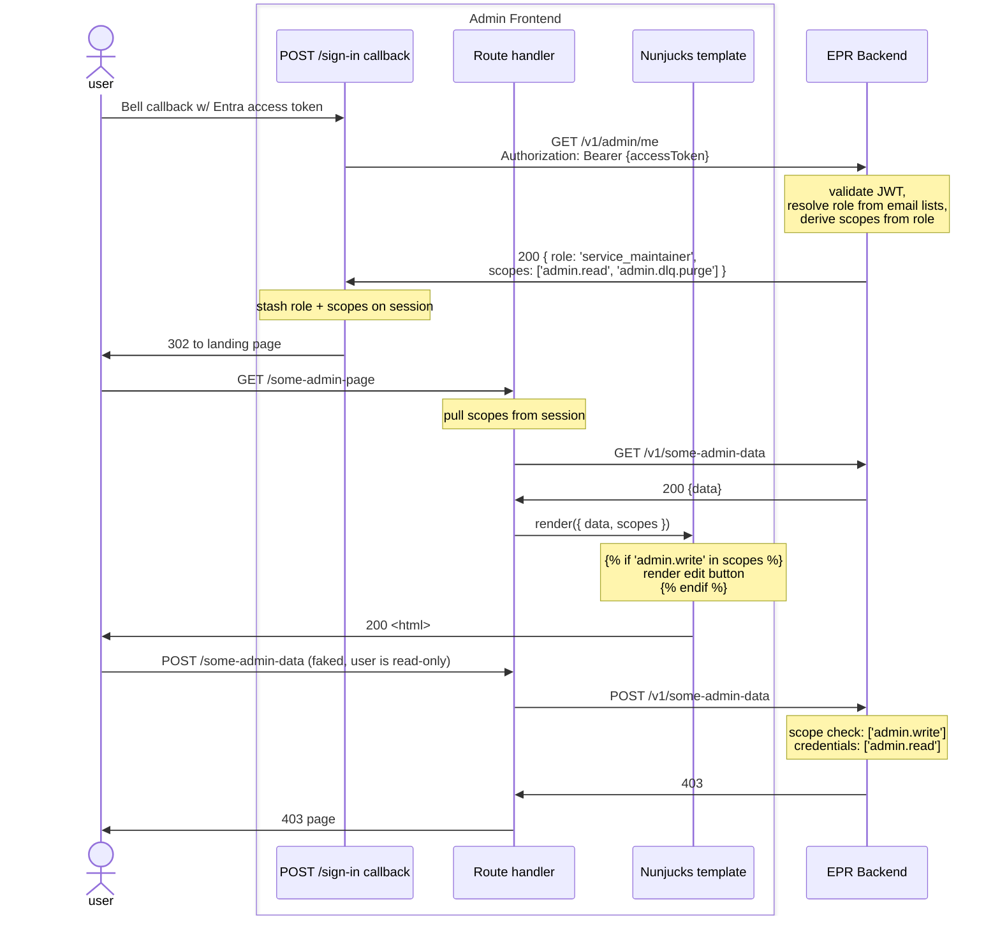

# 33. Admin UI scope-based RBAC

Date: 2026-05-06

## Status

Proposed

Supersedes the "option 3" portion of [ADR 0016 (Admin UI Authorisation MVP)](0016-admin-ui-authorisation-mvp.md) for service-maintainer scopes specifically. ADR 0016 explicitly identified option 2 (roles/scopes endpoint) as the north star; this ADR adopts it.

## Context

[PAE-1430] requires that the Admin UI distinguish between service maintainers who can *read* operator data (the bulk of the team, doing routine triage) and those who can *write* (a small group given ad-hoc access for regulator-driven changes). Today there is no distinction: every service maintainer has the single `service_maintainer` scope and can call any admin endpoint, mutating included.

### Current state

- A single scope `service_maintainer` is granted to any Entra ID user whose email appears in `SERVICE_MAINTAINER_EMAILS` (see `epr-backend/src/common/helpers/auth/get-entra-user-roles.js`).
- This scope grants access to ~16 production routes, mixing reads (`GET /v1/admin/queues/dlq/messages`, `GET /v1/organisations/{id}`, reports, summary logs, …) and writes (`PUT /v1/organisations/{id}`, `POST /v1/admin/queues/dlq/purge`, `POST /v1/public-register/generate`, the overseas-sites mutating routes, …).
- A subset of admin endpoints are currently gated by Entra ID *authentication* only, not by *scope* — anyone with a valid admin-UI Entra token can call them. The ticket flags this as another problem to fix in this work.
- Per ADR 0016 the admin frontend has zero scope awareness — it relies on backend `403`s to surface authorisation failures. There is no UI hint of who can do what; read-only users would currently see (and click) buttons that always 403.

### What ADR 0016 deferred

ADR 0016 chose option 3 (infer protection from API responses) for delivery speed, but identified option 2 (a backend-exposed roles/scopes endpoint that the frontend consumes) as the eventual target. PAE-1430 is the first concrete need that requires option 2 — without scopes on the frontend, we cannot hide write controls from read-only users.

### Constraints

- Existing service maintainers must not lose any access they have today. Routine ops actions (notably DLQ purge) must remain available to them.
- Permission lists must remain sourced from `cdp-app-config` (per the ticket).
- The change must be additive at the route level: each admin endpoint declares the scope it needs, and unfamiliar scopes don't fall through to a default-allow.

## Decision

We will introduce three scopes, three email-list-driven tiers, a backend self-introspection endpoint, and corresponding admin-frontend awareness.

### 1. Scopes (three)

| Scope             | Granted to                                     | Used by                                                            |
| ----------------- | ---------------------------------------------- | ------------------------------------------------------------------ |
| `admin.read`      | Anyone in any of the three lists below         | All admin GET routes; admin POST routes that are searches; reports |
| `admin.write`     | Write tier only                                | All admin mutating routes (PUT/PATCH/DELETE; POSTs that mutate)    |
| `admin.dlq.purge` | Write tier and the existing service-maintainer tier | The DLQ purge POST                                                 |

`admin.dlq.purge` is deliberately separate from `admin.write`. It is a routine ops action that current service maintainers retain access to; carving it into its own scope avoids forcing them into the write tier just to clear a DLQ. This is a deliberate refinement of the AC's literal "PUT/POST/PATCH require write" wording, preserving today's operational access for the regular maintainer tier.

Report-generation endpoints sit under `admin.read`. They produce output but do not mutate authoritative state, so a read-tier user can run them.

### 2. Roles (bundles of scopes) and resolution from email lists

A new `ROLES` map bundles scopes by tier:

```js
export const ROLES = {
  service_maintainer_write: [SCOPES.adminRead, SCOPES.adminWrite, SCOPES.adminDlqPurge],
  service_maintainer:       [SCOPES.adminRead, SCOPES.adminDlqPurge],
  support:                  [SCOPES.adminRead]
}
```

Role names are snake_case strings — they're stable wire identifiers (returned in the `/v1/admin/me` payload) and i18n lookup keys for the frontend tier label, so we keep them as plain strings rather than JS-style camelCase identifiers.

Three email lists are read from `cdp-app-config`, each mapping 1:1 to a role:

| Env var                            | Role                       | Notes                                                            |
| ---------------------------------- | -------------------------- | ---------------------------------------------------------------- |
| `SERVICE_MAINTAINER_EMAILS`        | `service_maintainer`       | Kept under existing name; current list of service maintainers is unchanged. |
| `SERVICE_MAINTAINER_WRITE_EMAILS`  | `service_maintainer_write` | New. Empty in production by default; populated ad-hoc when a write user is needed. |
| `SUPPORT_EMAILS`                   | `support`                  | New. Support team members who need to read but never had access before. |

Resolution in `getEntraUserRole(email)`:

```js
if (writeList.includes(email))      return 'service_maintainer_write'
if (maintainerList.includes(email)) return 'service_maintainer'
if (supportList.includes(email))    return 'support'
return null
```

The user's scopes are then derived from their role: `ROLES[role] ?? []`. First-match-wins on the role lookup means a user appearing in multiple lists silently takes the highest tier they qualify for; no list-membership consistency check is required.

Routes never declare a role; they declare the scope they need. The role concept exists purely as the named bundle for assignment and for human-readable tier labelling on the frontend.

### 3. Rename existing `ROLES` → `SCOPES`; reborn `ROLES` is the new bundling map

The existing constant `ROLES` in `epr-backend/src/common/helpers/auth/constants.js` is used as a flat list of Hapi scopes — that's a misnomer. We rename it to `SCOPES`. All four existing entries (`standard_user`, `inquirer`, `linker`, plus the about-to-be-removed `service_maintainer`) are functionally scopes — they appear in `auth.scope: [...]` declarations and are matched against `request.auth.credentials.scope`.

The freed-up `ROLES` name is taken by the new bundling map described in section 2. Both constants live in `auth/constants.js` (or split across `auth/scopes.js` + `auth/roles.js` — implementation choice; they're tightly related and the file isn't large).

Note that `standard_user`, `inquirer`, and `linker` are *per-request context gates* (issued by `getDefraUserRoles` based on the request itself) rather than *durable permissions* on the user, while the new `admin.*` scopes are durable. They share the Hapi scope mechanism, so a single `SCOPES` constant covers both. The new `ROLES` bundling layer applies only to durable scopes — it makes no sense to bundle per-request gates like `linker`.

The rename ships in the same PR as the route re-scoping; every file touched for the latter is already a re-edit, so the rename is incremental churn rather than a precursor PR.

### 4. New endpoint: `GET /v1/admin/me`

Returns `{ role: string | null, scopes: string[] }` — the user's resolved role name and the scopes that role bundles. Auth: requires any of `[admin.read, admin.write, admin.dlq.purge]`. No DB call — pure echo of the validated token's resolved role and scopes. Path under `/v1/admin/` to keep the existing `/v1/me/*` namespace (Defra-side, operator self-service) untouched.

Returning the role alongside the scopes lets the frontend show a human-readable tier label (`service_maintainer`, `support`, etc.) without having to derive one from the scope set, and lets the frontend gate visual elements on either the role name (e.g. tier badges) or specific scopes (e.g. action buttons).

### 5. Route changes in `epr-backend`

All admin routes adopt explicit scope-based gating (closing out the "auth-based not scope-based" gap noted in the ticket):

- Existing `/v1/admin/queues/dlq/messages.get.js` → `[admin.read]`
- Existing `/v1/admin/queues/dlq/purge.post.js` → `[admin.dlq.purge]`
- Routes today scoped to `[serviceMaintainer]` only (overseas-sites admin list, PRN admin list, public register generation, system-logs search, etc.) → `[admin.read]` for reads/searches, `[admin.write]` for mutations
- Routes today scoped to `[standardUser, serviceMaintainer]` (org get-by-id, reports get/get-detail, waste-balance get, etc.) → `[standardUser, admin.read]`. All three admin tiers carry `admin.read`, so any tier can still triage these routes.
- Operator-only routes scoped to `[standardUser]` (PRN create/update, summary log post/submit, etc.) → unchanged. Out of scope for this ticket.

A small number of routes warrant per-route judgement and are documented at implementation time:

- `routes/v1/system-logs/post-search.js` — POST verb but a search; classed `admin.read`.
- `routes/v1/public-register/generate/post.js` — generates output; classed `admin.write`.
- `routes/v1/organisations/registrations/summary-logs/{file,reports/uploads,list}/get.js` — reads; `admin.read`.

### 6. Admin frontend changes

The admin frontend gains scope awareness:

- `UserSession` shape (in `epr-re-ex-admin-frontend/src/server/common/helpers/auth/`) extends with `role: string | null` and `scopes: string[]`.
- The post-Bell sign-in flow calls `GET /v1/admin/me` with the just-acquired Entra access token and stashes both `role` and `scopes` on the session alongside `userId`, `displayName`, etc. Single fetch per session.
- The refresh-token flow re-fetches `/v1/admin/me` so configuration changes pick up at the next refresh rather than only at re-login.
- A request decorator (or `onPreResponse` extension) pushes `role` and `scopes` into Nunjucks view context, making `…` available in any template.
- A pass over the admin templates wraps every write-action button/form with the appropriate scope guard. Pages whose entire purpose is write (the queue-management mutations, etc.) get a route-level guard that redirects/403s users without `admin.write`.
- A persistent indicator in the admin layout shows the user's tier label, derived from `role` via a small i18n-friendly lookup (`service_maintainer_write` → "Service maintainer (write)", etc.) so absence of buttons is never mysterious.

Frontend hiding is UX, not security. The backend scope checks remain the actual gate — a read-only user who fakes a POST gets a 403 from the backend.

### 7. New auth flow



### 8. Tests

- **Backend integration tests** (per AC): every admin route gets a four-tier matrix — support, maintainer, write, unscoped — with per-tier expected status. A small test helper generates the four token variants.
- **Admin UI journey tests** (per AC): existing test users are upgraded to the write tier so existing journeys keep passing. New journey: a read-only test user attempts a mutating action and is denied.
- **Backend unit tests**: `getEntraUserRole` first-match-wins behaviour across all four list-membership combinations; `ROLES` map produces the expected scope arrays for each role.

### 9. Rollout order

1. `cdp-app-config`: add `SERVICE_MAINTAINER_WRITE_EMAILS` (empty in prod; populated for dev/test) and `SUPPORT_EMAILS`. Leave `SERVICE_MAINTAINER_EMAILS` untouched.
2. `epr-backend`: rename `ROLES` → `SCOPES`, replace `service_maintainer` with the three new scopes, re-scope every admin route, add `/v1/admin/me`, add integration tests.
3. `epr-re-ex-admin-frontend`: extend session shape, fetch `/v1/admin/me`, add view-context plumbing, add template hide-guards, add tier label.
4. `epr-re-ex-admin-frontend-tests`: update existing journeys to the write tier; add a read-only journey.

PRs 2 and 3 can ship together or 2-then-3 (3 with no prod write users is harmless — every admin user is read-only until prod gets write users added). PR 1 must precede PR 2 to avoid a brief window where service maintainers temporarily have no access.

## Consequences

### Enabled

- Read-only access for the bulk of service maintainers, eliminating accidental mutation as a class of incident.
- Ad-hoc write access by adding an email to `SERVICE_MAINTAINER_WRITE_EMAILS` — a `cdp-app-config` PR rather than code changes.
- Read-only access for support staff who previously had no admin access at all.
- Admin UI hides write controls from users who can't use them, instead of relying on backend 403s as the only signal.
- Closes the "auth-based not scope-based" gap on admin endpoints.
- Establishes the option-2 pattern from ADR 0016, making future fine-grained scopes (e.g. `admin.cache.invalidate`, `admin.feature-flag.toggle`) cheap to add.
- The `ROLES` bundling layer means adding a new admin tier is a one-line addition to the `ROLES` map plus a new email list — routes don't need to know about new tiers, only about the scopes they require.

### Costs

- ~33 files in `epr-backend` import the renamed constant; mechanical churn but a large diff.
- A new endpoint, a new session field, and a new view-context channel on the admin frontend.
- Configuration changes don't take effect until a user signs out and in (or their session refreshes). Acceptable: RBAC changes are infrequent and "sign in again" is a fine answer.

### Not solved

- Operator-side scopes (`standard_user`, `inquirer`, `linker`) are unchanged. The operator frontend still infers authorisation from API responses (ADR 0016 option 3 still applies on the Defra side). These per-request gates are not bundled by the new `ROLES` map.
- Email-list-as-source-of-truth still doesn't scale beyond the single-team admin use case. Group-based assignment via Entra is a future concern.
- The `admin.dlq.purge` carve-out is deliberate but does mean the conceptual line between "write" and "ops" needs thought as new admin actions are added. We expect this to remain a per-action judgement rather than a general principle.

[PAE-1430]: https://eaflood.atlassian.net/browse/PAE-1430
