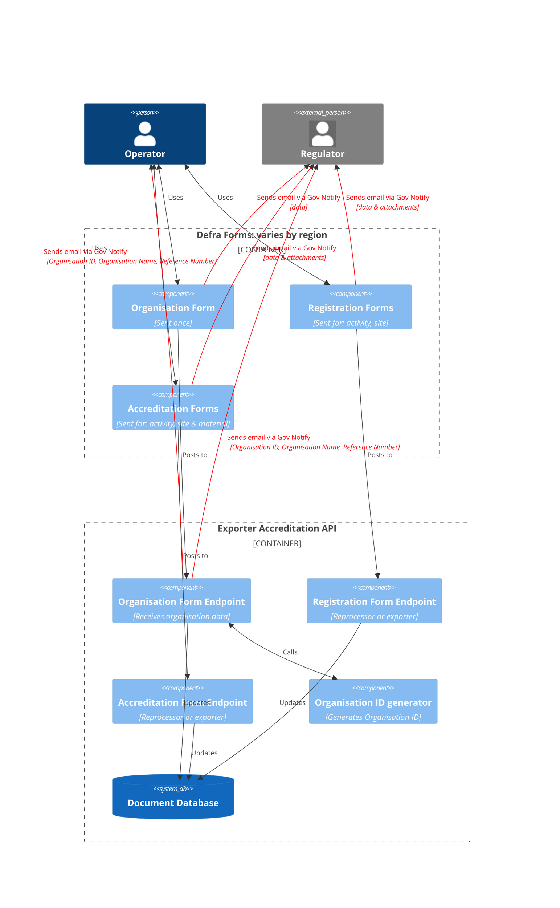

# 2025 Registration & Accreditation applications: High Level Design

For 2025 pEPR registration & accreditation applications, we will be using Defra Forms created and managed by the EA.

The diagram below describes a high-level view of how we understand the integration points between those forms
and a pEPR backend service. This is subject to further negotiation and change as the project evolves.

