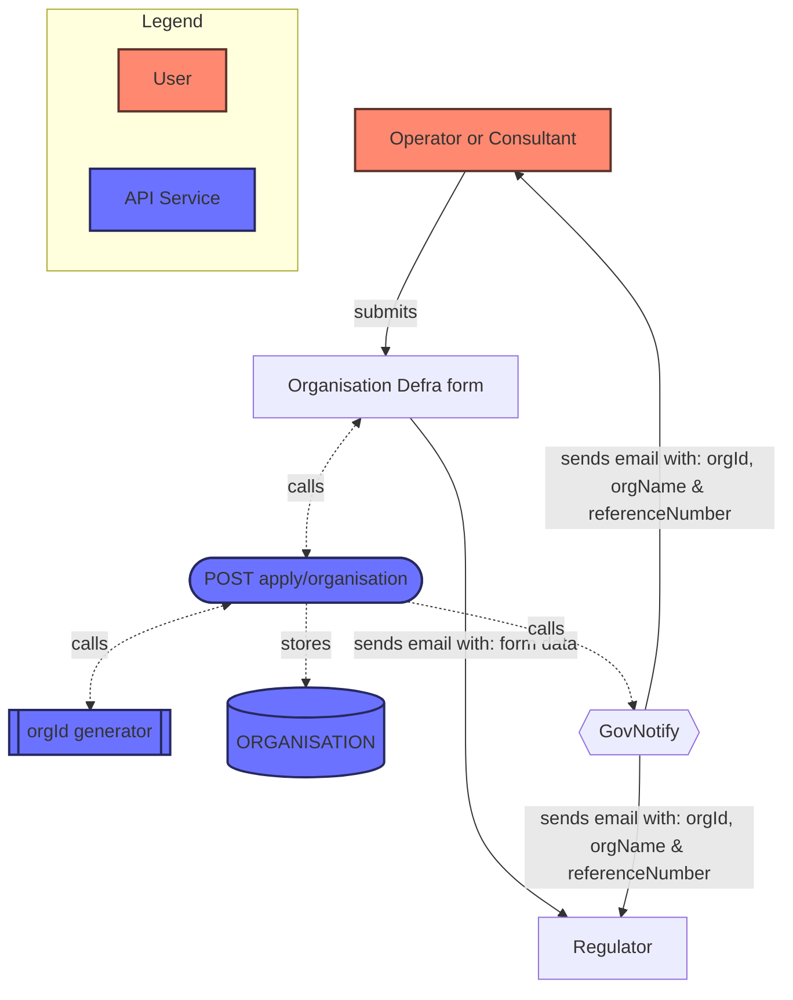
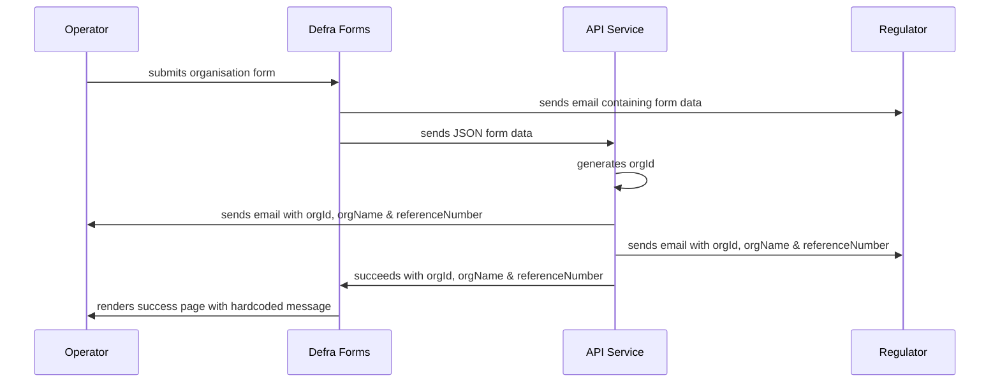
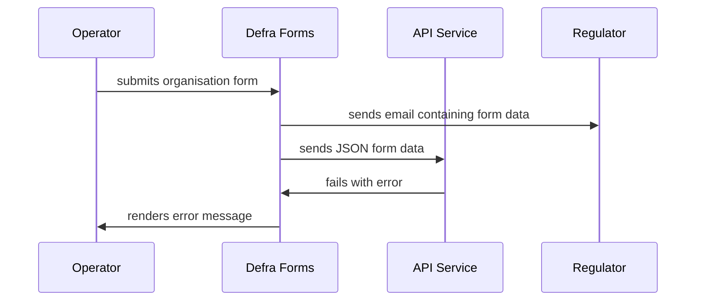
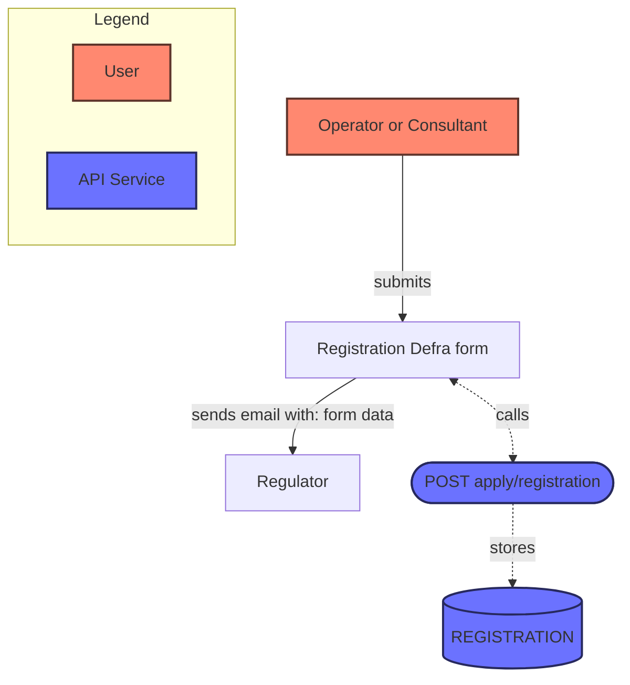
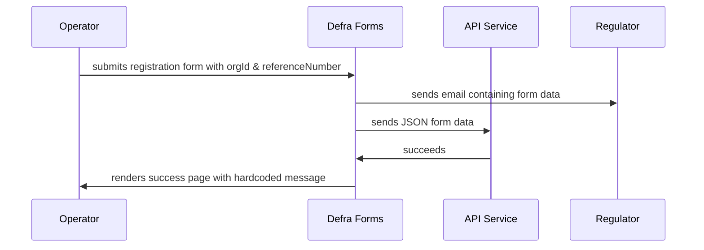
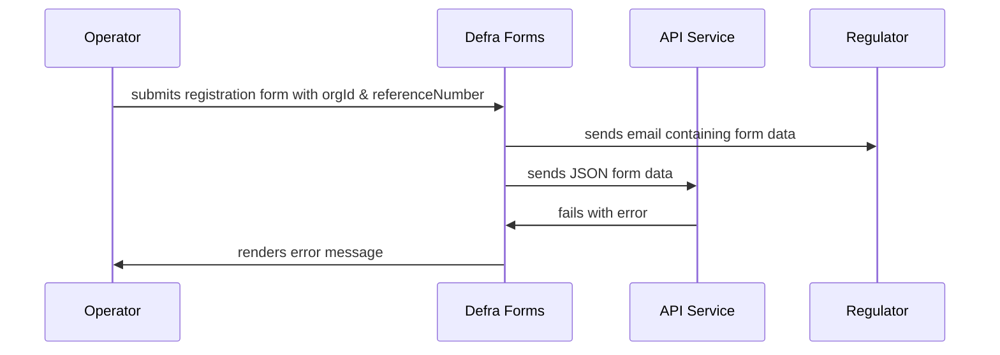
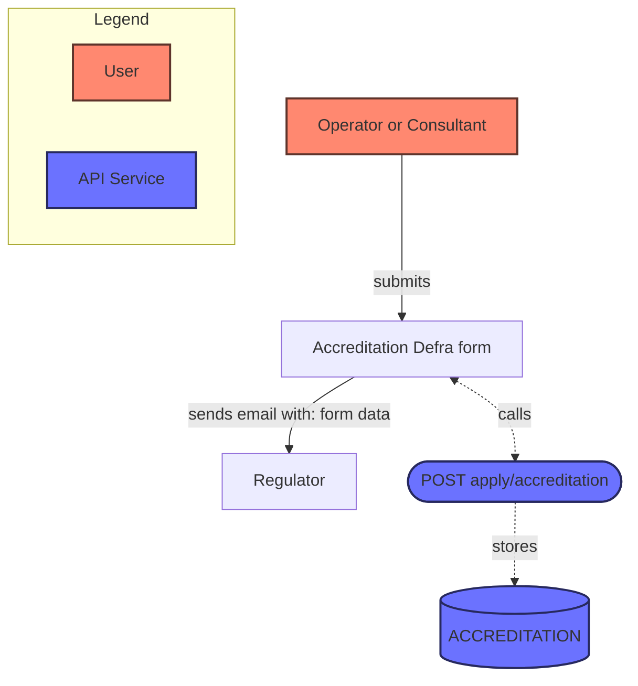
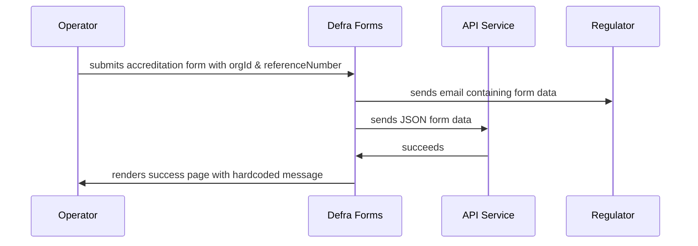
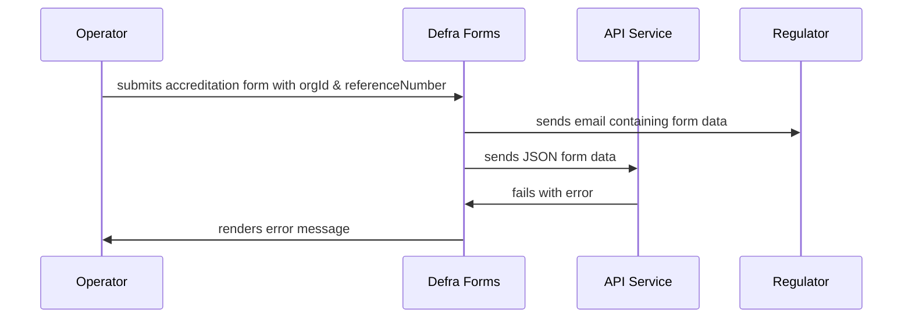
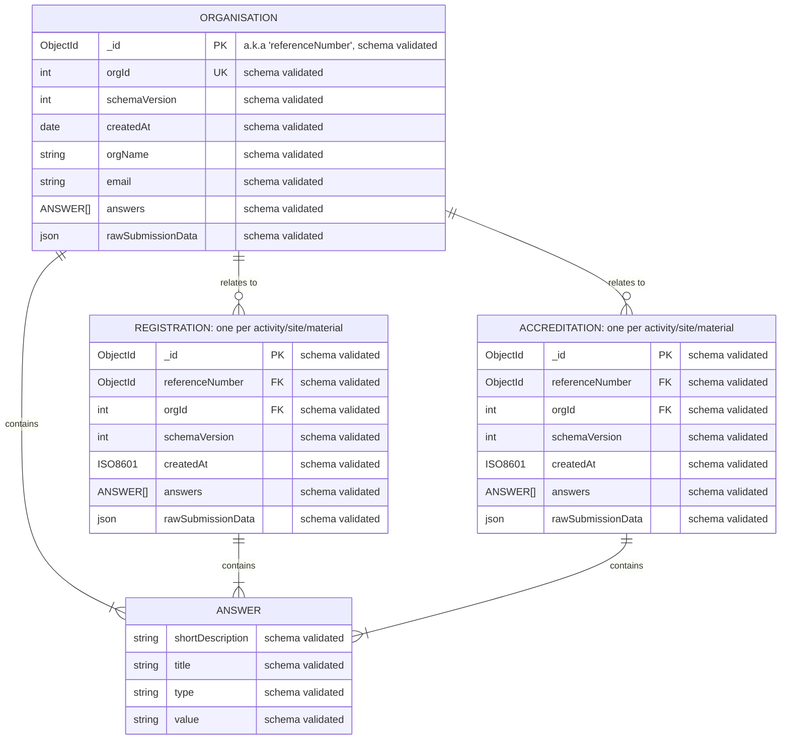

# 2025 Registration & Accreditation applications: Low Level Design

For 2025 pEPR registration & accreditation applications, we will be using Defra Forms created and managed by the EA.

Please see the [High Level Design](2025-reg-acc-hld.md) for an overview.

<!-- prettier-ignore-start -->
<!-- TOC -->
* [2025 Registration & Accreditation applications: Low Level Design](#2025-registration--accreditation-applications-low-level-design)
  * [Project scope](#project-scope)
    * [Functional requirements](#functional-requirements)
    * [Non-functional requirements](#non-functional-requirements)
  * [Technical approach](#technical-approach)
    * [Endpoint: `POST` `/v1/apply/organisation`](#endpoint-post-v1applyorganisation)
      * [Success case](#success-case)
      * [Error case](#error-case)
    * [Endpoint: `POST` `/v1/apply/registration`](#endpoint-post-v1applyregistration)
      * [Success case](#success-case-1)
      * [Error case](#error-case-1)
    * [Endpoint: `POST` `/v1/apply/accreditation`](#endpoint-post-v1applyaccreditation)
      * [Success case](#success-case-2)
      * [Error case](#error-case-2)
    * [Database mappings](#database-mappings)
<!-- TOC -->

<!-- prettier-ignore-end -->

## Project scope

We need to deliver an API Service hosted on CDP (Core Delivery Platform) providing multiple endpoints that each:

### Functional requirements

1. Accept form submission data in JSON from an associated Defra Form(s)
2. Minimally map the submitted data to the relevant entity schema
3. Store the submitted data in a schema versioned and minimally validated collection
4. Send an email via Gov Notify to the nominated email address in the form data with further information, e.g. `orgId`, `orgName` & `referenceNumber`

> [!NOTE]
> The Defra forms will call the API Service endpoints be the `onSave` page event,
> [see docs](https://defra.github.io/forms-engine-plugin/features/configuration-based/PAGE_EVENTS.html).

### Non-functional requirements

1. Open source codebase, secured with security and dependency scanning
2. Is secured by the CDP protected zone, including egress proxy setup
3. Handle secrets in a secure manner
4. Handle PII (Personally Identifiable Information) in a GDPR-compliant manner
5. Leverages observability instrumentation:
   1. Metrics, including a "single-pane of glass" dashboard
   2. Logging, including a "single-pane of glass" dashboard
   3. Alerting, including an out of hours support structure
6. Auditing for any events that mutate data stored in the system
7. Playbook(s) for resolving common issues in support

## Technical approach

### Endpoint: `POST` `/v1/apply/organisation`

#### Success case

> [!WARNING]
> Defra Forms built with the standalone Forms Builder cannot render values into its success page that are returned by
> the API Service, meaning that this design is reliant on an email (sent by the API Service) being received by the form
> submitter.

> [!INFO]
> For automated testing purposes this endpoint will return a success response body containing `orgId`, `orgName` &
> `referenceNumber`

#### Error case

This case should only happen if there are technical issues with the API Service or Gov Notify

> [!WARNING]
> This results in the Regulator receiving the form submission data, but that data may not be stored in the database of
> the API Service

### Endpoint: `POST` `/v1/apply/registration`

#### Success case

#### Error case

This case should only happen if there are technical issues with the API Service or Gov Notify

> [!WARNING]
> This results in the Regulator receiving the form submission data, but that data may not be stored in the database of
> the API Service

### Endpoint: `POST` `/v1/apply/accreditation`

#### Success case

#### Error case

This case should only happen if there are technical issues with the API Service or Gov Notify

> [!WARNING]
> This results in the Regulator receiving the form submission data, but that data may not be stored in the database
> of the API Service

### Database mappings

The API Service database collections will be mapped to one another via a foreign key on the
`REGISTRATION` and `ACCREDITATION` entities which correspond to the primary key on the `ORGANISATION` entity.

> [!IMPORTANT]
> All Defra forms field values will be stored in the `rawSubmissionData` database field.
>
> Answers will be cloned from `rawSubmissionData` for debugging convenience.
> This process will be undertaken on a "best-efforts" basis and depending on the data quality the answers values
> may not be reliable for future processing

All entities will contain embedded entities of `ANSWER`

