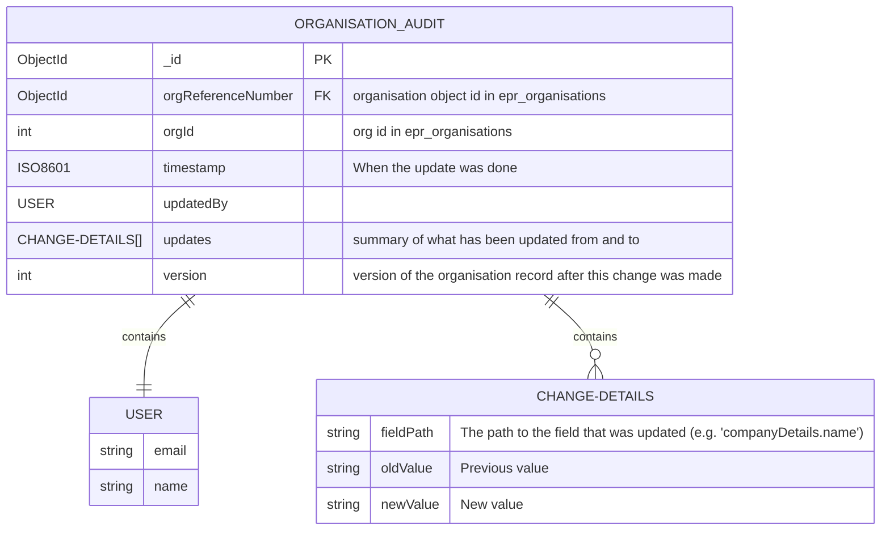

# Auditing updates to organisation

> [!WARNING]
> This document is a work in progress and is subject to change.

## Overview

There's no requirement to show changes to organisation data over time. However, it will be good to store history for auditing/debugging.
For summary log it has been decided to track changes over time as a field inside same record. This is a variation of [slowly changing dimension Type 3](https://en.wikipedia.org/wiki/Slowly_changing_dimension).

Two options are being considered for organisation data.

1. Store the current version and historical versions in separate collections following [slowly changing dimension Type 4](https://en.wikipedia.org/wiki/Slowly_changing_dimension).
   As organisation is a complex nested structure, it's easier to store full historic versions than working out what has changed
   One option is to write to organisation_audit everytime there's an update to organisation using [MongoDB change streams](https://www.mongodb.com/docs/manual/changestreams/).

2. Every time there's an update a new record will be written to the audit table describing old and new value, who has changed.

Option 2 is being chosen as it can show summary of what has been changed and who.

## Audit model



### Example audit record

```json
{
  "_id": "507f1f77bcf86cd799439011",
  "orgReferenceNumber": "6507f1f77bcf86cd79943901",
  "orgId": 50002,
  "timestamp": "2025-08-23T10:15:30.944Z",
  "updatedBy": {
    "email": "admin@defra.gov.uk",
    "name": "Admin User"
  },
  "updates": [
    {
      "fieldPath": "companyDetails.name",
      "oldValue": "ACME Limited",
      "newValue": "ACME Ltd"
    },
    {
      "fieldPath": "companyDetails.tradingName",
      "oldValue": "ACME Limited",
      "newValue": "ACME Ltd"
    }
  ],
  "version": "2"
}
```
