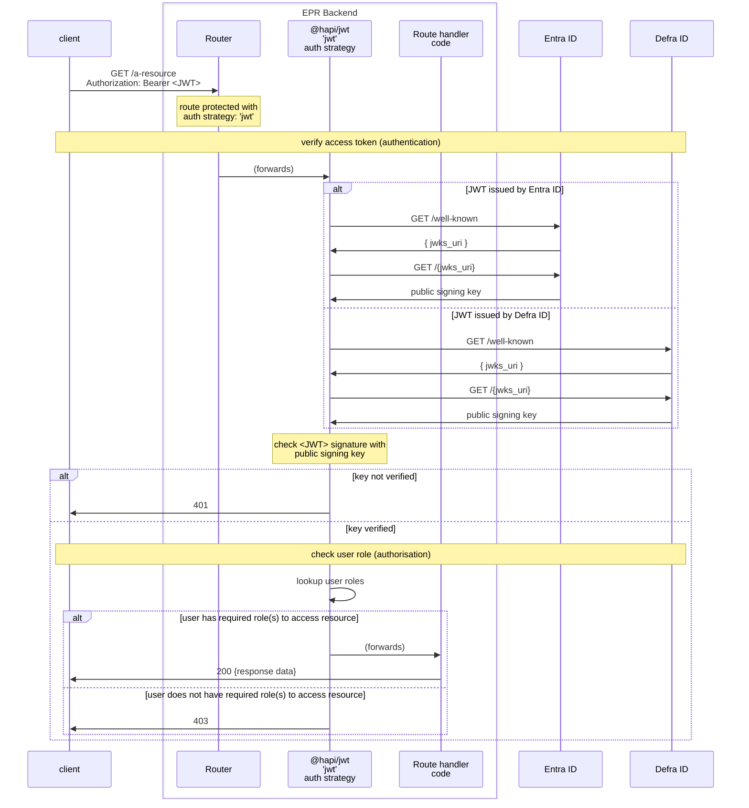

# pEPR: Low level design - API (epr-backend) Authentication & Authorisation

> [!WARNING]
> This document is a work in progress and is subject to change.

<!-- prettier-ignore-start -->
<!-- TOC -->
* [pEPR: Low level design - API (epr-backend) Authentication & Authorisation](#pepr-low-level-design---api-epr-backend-authentication--authorisation)
  * [Overview](#overview)
  * [Authentication](#authentication)
  * [Authorisation](#authorisation)
<!-- TOC -->

<!-- prettier-ignore-end -->

## Overview

The API exposed by `epr-backend` must allow or prevent actions (reading or editing data) based on who the client (authentication) and what actions they are allowed to perform (authorisation).

There are two principal clients of the API

1. `epr-frontend`
   1. this is the application used by `Operators`
   2. requests to the API from this service will supply an access token minted by Defra ID
2. `epr-re-ex-admin-frontend`
   1. this is the application used by `Service Maintainers` and `regulators`
   2. requests to the API from this service will supply an access token minted by Entra ID

## Authentication

1. Requests to the API must supply a Bearer token (access token) via the `Authoriation` header
2. The API will verify the signature of the access token using the public signing key from either Entra ID or Defra ID
3. The verification will be performed using the `@hapi/jwt` library

## Authorisation

Initially a select group of team members will be assigned to the "service_maintainer" role

- these users will be identified by the email address on their (Entra ID) access token
- a list of (email addresses of) service maintainers will be supplied to the `epr-backend` application via config
- APIs built to support the admin UI will only be accessible to users with the service_maintainer role

We expect this simple authorisation approach to be short-lived - it enables launch of the admin UI service.

It will be replaced with a more sophisticated approach (details TBC) that additionally meets to the authorisation requirements for _operators_ and _regulators_
