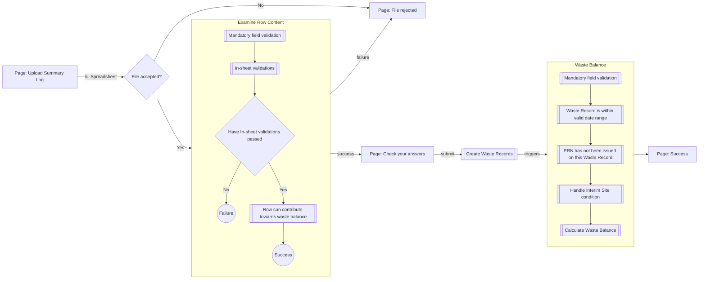
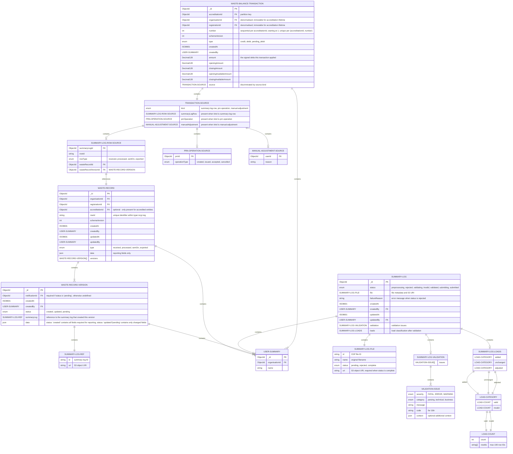
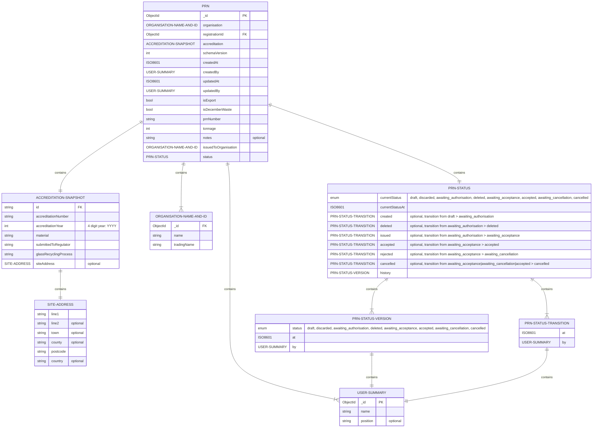
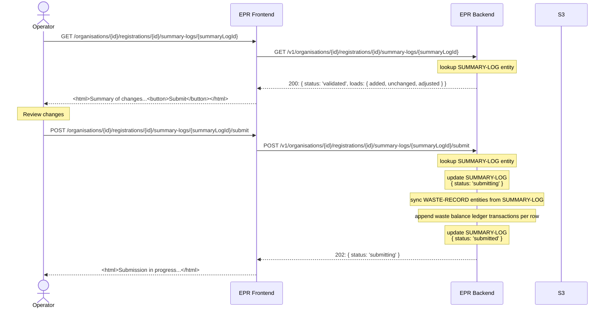

# pEPR Low level design

> [!WARNING]
> This document is a work in progress and is subject to change.

<!-- prettier-ignore-start -->
<!-- TOC -->
* [pEPR Low level design](#pepr-low-level-design)
  * [API Endpoints](#api-endpoints)
  * [CRUD by Entity Type](#crud-by-entity-type)
  * [Role-Based Access Control](#role-based-access-control)
  * [Entity Relationships](#entity-relationships)
    * [Users](#users)
    * [Waste Record & Waste Balance](#waste-record--waste-balance)
      * [Disambiguation](#disambiguation)
      * [User Journey](#user-journey)
      * [Summary Log LLDs](#summary-log-llds)
      * [Entity Relationships](#entity-relationships-1)
      * [Waste Record Type: Received](#waste-record-type-received)
      * [Waste Record Type: processed](#waste-record-type-processed)
      * [Waste Record Type: sentOn](#waste-record-type-senton)
      * [Waste Balance](#waste-balance)
    * [PRN](#prn)
      * [PRN creation schema & sequence diagram](#prn-creation-schema--sequence-diagram)
    * [Report](#report)
    * [Summary Log upload & ingest](#summary-log-upload--ingest)
      * [Phase 1: upload & async processes: preprocessing, file parsing & data validation](#phase-1-upload--async-processes-preprocessing-file-parsing--data-validation)
      * [Phase 2: validation results & submission](#phase-2-validation-results--submission)
<!-- TOC -->

<!-- prettier-ignore-end -->

## API Endpoints

The swagger documentation can be found [here](../api-definitions/index.md)

## CRUD by Entity Type

| Entity Type   | Admin: SuperUser | Admin: Regulator | Public: User | Notes                                                                                             |
| ------------- | ---------------- | ---------------- | ------------ | ------------------------------------------------------------------------------------------------- |
| User          | CRU-             | CRU-             | -R--         | Users can only be soft deleted via status change                                                  |
| Organisation  | -RU-             | -RU-             | -R--         | Created on application                                                                            |
| Registration  | -RU-             | -RU-             | -R--         | Created on application, unique to Activity & Site, contains Accreditation                         |
| Accreditation | -RU-             | -RU-             | -R--         | Created on application, nested under Material                                                     |
| Summary-Log   | -R--             | -R--             | CR--         | Summary Logs are immutable and stored in S3 for history purposes                                  |
| Waste-Record  | -R--             | -R--             | -RU-         | Update is result of Summary-Log create                                                            |
| Waste-Balance | -R--             | -R--             | -RU-         | Update is result of Summary-Log create or PRN create/update                                       |
| PRN           | -RU-             | -RU-             | CRU-         |                                                                                                   |
| Report        | -R--             | -R--             | CRU-         |                                                                                                   |
| Notification  | -RU-             | -RU-             | -RU-         | All Notifications are system generated, updates take place via status changes on related entities |
| System-Log    | -R--             | ----             | ----         | For monitoring purposes, not to be confused with SOC auditing                                     |

## Role-Based Access Control

| Permission                      | Super User    | Regulator     | Approved Person     | PRN Signatory     | User     |
| ------------------------------- | ------------- | ------------- | ------------------- | ----------------- | -------- |
| **User:ApprovedPerson:view**    | ✅            | ✅            | ✅                  | ✅                | ✅       |
| **User:ApprovedPerson:add**     | ✅            | ✅            |                     |                   |          |
| **User:ApprovedPerson:edit**    | ✅            | ✅            |                     |                   |          |
| **User:PRNSignatory:view**      | ✅            | ✅            | ✅                  | ✅                | ✅       |
| **User:PRNSignatory:add**       | ✅            | ✅            |                     |                   |          |
| **User:PRNSignatory:edit**      | ✅            | ✅            |                     |                   |          |
| **User:view**                   | ✅            | ✅            | ✅                  | ✅                | ✅       |
| **User:add**                    | ✅            | ✅            | ✅                  |                   |          |
| **User:edit**                   | ✅            | ✅            | ✅                  |                   |          |
| =============================== | ============= | ============= | =================   | ===============   | ======   |
| **Organisation:view**           | ✅            | ✅            | ✅                  | ✅                | ✅       |
| **Organisation:edit**           | ✅            | ✅            |                     |                   |          |
| **Organisation:approve**        | ✅            | ✅            |                     |                   |          |
| **Organisation:reject**         | ✅            | ✅            |                     |                   |          |
| ============================    | ============= | ============= | =================== | ================= | ======   |
| **Registration:view**           | ✅            | ✅            | ✅                  | ✅                | ✅       |
| **Registration:edit**           | ✅            | ✅            |                     |                   |          |
| **Registration:approve**        | ✅            | ✅            |                     |                   |          |
| **Registration:reject**         | ✅            | ✅            |                     |                   |          |
| ========================        | ============= | ============= | =================== | ================= | ======== |
| **Accreditation:view**          | ✅            | ✅            | ✅                  | ✅                | ✅       |
| **Accreditation:edit**          | ✅            | ✅            |                     |                   |          |
| **Accreditation:approve**       | ✅            | ✅            |                     |                   |          |
| **Accreditation:reject**        | ✅            | ✅            |                     |                   |          |
| ========================        | ============= | ============= | =================== | ================= | ======== |
| **Summary-Log:view**            | ✅            | ✅            | ✅                  | ✅                | ✅       |
| **Summary-Log:validate**        |               |               | ✅                  | ✅                | ✅       |
| **Summary-Log:submit**          |               |               | ✅                  | ✅                | ✅       |
| ========================        | ============= | ============= | =================== | ================= | ======== |
| **Waste-Record:view**           | ✅            | ✅            | ✅                  | ✅                | ✅       |
| ========================        | ============= | ============= | =================== | ================= | ======== |
| **Waste-Balance:view**          | ✅            | ✅            | ✅                  | ✅                | ✅       |
| ========================        | ============= | ============= | =================== | ================= | ======== |
| **PRN:view**                    | ✅            | ✅            | ✅                  | ✅                | ✅       |
| **PRN:add**                     |               |               | ✅                  | ✅                | ✅       |
| **PRN:edit**                    |               |               | ✅                  | ✅                | ✅       |
| **PRN:approve**                 |               |               |                     | ✅                |          |
| **PRN:reject**                  |               |               |                     | ✅                |          |
| ========================        | ============= | ============= | =================== | ================= | ======== |
| **Report:view**                 | ✅            | ✅            | ✅                  | ✅                | ✅       |
| **Report:add**                  |               |               | ✅                  | ✅                | ✅       |
| **Report:edit**                 |               |               | ✅                  | ✅                | ✅       |
| **Report:approve**              |               |               | ✅                  |                   |          |
| **Report:reject**               |               |               | ✅                  |                   |          |
| ========================        | ============= | ============= | =================== | ================= | ======== |
| **Notification:view**           | ✅            | ✅            | ✅                  | ✅                | ✅       |
| ========================        | ============= | ============= | =================== | ================= | ======== |
| **System-Log:view**             | ✅            |               |                     |                   |          |

## Entity Relationships

### Users

TBD

### Waste Record & Waste Balance

#### Disambiguation

The Waste Record is the entity used to track key reporting data uploaded by Summary Logs.
The Waste Balance is the running total in tonnes of waste received minus PRNs issued.

#### User Journey



#### Summary Log LLDs

For detailed Summary Log LLDs, see the following:

1. [Summary Log validation](./summary-log-validation-lld.md)
1. [Summary Log row validation classification](./summary-log-row-validation-classification.md)
1. [Summary Log submission](./summary-log-submission-lld.md)

#### Entity Relationships

> [!NOTE]
> `accreditationId` is optional on waste records to support organisations that have a registration but no accreditation.



#### Waste Record Type: Received

In this example:

1. Alice has created a `received` waste record
2. Bob has updated the waste record, but introduced a mistake
3. Alice has corrected the mistake, but the reporting period is closed and the record is now pending

```json5
{
  _id: 'a1234567890a12345a01',
  organisationId: 'e1234567890a12345a01',
  registrationId: 'f1234567890a12345a01',
  accreditationId: 'b1234567890a12345a01', // optional
  rowId: '12345678910',
  type: 'received',
  createdAt: '2026-01-08T12:00:00.000Z',
  createdBy: {
    _id: 'c1234567890a12345a01',
    name: 'Alice'
  },
  updatedAt: '2026-01-09T12:00:00.000Z',
  updatedBy: {
    _id: 'c1234567890a12345a02',
    name: 'Bob'
  },
  data: {
    dateReceived: '2026-01-01',
    grossWeight: 10.0,
    tonnageForPrn: 0.5
    // ...
  },
  versions: [
    {
      id: 'd1234567890a12345a01',
      status: 'created',
      createdAt: '2026-01-08T12:00:00.000Z',
      createdBy: {
        _id: 'c1234567890a12345a01',
        name: 'Alice'
      },
      summaryLog: {
        id: 's1234567890a12345a01',
        uri: 's3://bucket/path/to/summary/log/upload/1'
      },
      data: {
        dateReceived: '2026-01-01',
        grossWeight: 1.0,
        tonnageForPrn: 0.5
        // ...
      }
    },
    {
      id: 'd1234567890a12345a02',
      status: 'updated',
      createdAt: '2026-01-09T12:00:00.000Z',
      createdBy: {
        _id: 'c1234567890a12345a02',
        name: 'Bob'
      },
      summaryLog: {
        id: 's1234567890a12345a02',
        uri: 's3://bucket/path/to/summary/log/upload/2'
      },
      data: {
        grossWeight: 10.0
      }
    },
    {
      id: 'd1234567890a12345a03',
      notificationId: 'e1234567890a12345a01',
      status: 'pending',
      createdAt: '2026-02-28T12:00:00.000Z',
      createdBy: {
        _id: 'c1234567890a12345a01',
        name: 'Alice'
      },
      summaryLog: {
        id: 's1234567890a12345a03',
        uri: 's3://bucket/path/to/summary/log/upload/3'
      },
      data: {
        grossWeight: 1.0
      }
    }
  ]
}
```

#### Waste Record Type: processed

In this example Alice has created a `processed` waste record

```json5
{
  _id: 'a1234567890a12345a02',
  organisationId: 'e1234567890a12345a01',
  registrationId: 'f1234567890a12345a01',
  accreditationId: 'b1234567890a12345a01', // optional
  rowId: '12345678911',
  type: 'processed',
  createdAt: '2026-01-08T12:00:00.000Z',
  createdBy: {
    _id: 'c1234567890a12345a01',
    name: 'Alice'
  },
  updatedAt: null,
  updatedBy: null,
  data: {
    dateLoadLeftSite: '2026-01-01',
    sentTo: 'name',
    weight: 1.0
    // ...
  },
  versions: [
    {
      id: 'd1234567890a12345a01',
      status: 'created',
      createdAt: '2026-01-08T12:00:00.000Z',
      createdBy: {
        _id: 'c1234567890a12345a01',
        name: 'Alice'
      },
      summaryLog: {
        id: 's1234567890a12345a01',
        uri: 's3://bucket/path/to/summary/log/upload/1'
      },
      data: {
        dateLoadLeftSite: '2026-01-01',
        sentTo: 'name',
        weight: 1.0
        // ...
      }
    }
  ]
}
```

#### Waste Record Type: sentOn

In this example Alice has created a `sentOn` waste record

```json5
{
  _id: 'a1234567890a12345a03',
  organisationId: 'e1234567890a12345a01',
  registrationId: 'f1234567890a12345a01',
  accreditationId: 'b1234567890a12345a01', // optional
  rowId: '12345678912',
  type: 'sentOn',
  createdAt: '2026-01-08T12:00:00.000Z',
  createdBy: {
    _id: 'c1234567890a12345a01',
    name: 'Alice'
  },
  updatedAt: null,
  updatedBy: null,
  data: {
    dateLoadLeftSite: '2026-01-01',
    sentTo: 'name',
    weight: 1.0
    // ...
  },
  versions: [
    {
      id: 'd1234567890a12345a01',
      status: 'created',
      createdAt: '2026-01-08T12:00:00.000Z',
      createdBy: {
        _id: 'c1234567890a12345a01',
        name: 'Alice'
      },
      summaryLog: {
        id: 's1234567890a12345a01',
        uri: 's3://bucket/path/to/summary/log/upload/1'
      },
      data: {
        dateLoadLeftSite: '2026-01-01',
        sentTo: 'name',
        weight: 1.0
        // ...
      }
    }
  ]
}
```

#### Waste Balance

The waste balance for an accreditation is an append-only ledger of transactions, one document per balance-affecting event. Each transaction carries the running totals it produced (`closingAmount`, `closingAvailableAmount`), so the current balance for an accreditation is the closing totals on its highest-numbered transaction — a single indexed read. No separate balance document exists; the ledger is the authoritative and sole store of balance state. See [ADR 0031](../decisions/0031-waste-balance-transaction-ledger.md) for the full design rationale.

One balance-affecting event produces exactly one transaction, referring to exactly one affected entity. A summary-log row produces one transaction referencing one waste record; a PRN operation (creation, issuance, acceptance, cancellation) produces one transaction referencing one PRN; a manual adjustment produces one transaction. The affected entity is identified within the transaction's `source` object, discriminated by `source.kind`.

Example ledger transactions for a single accreditation, in insertion order (by `number`):

```json5
[
  // #1: Alice adds a received waste record, increasing the balance
  {
    _id: 'a1234567890a12345a01',
    accreditationId: 'b1234567890a12345a01',
    organisationId: 'e1234567890a12345a01',
    registrationId: 'f1234567890a12345a01',
    number: 1,
    type: 'credit',
    createdAt: '2026-01-01T09:00:00.000Z',
    createdBy: {
      _id: 'c1234567890a12345a01',
      name: 'Alice'
    },
    amount: 10.0,
    openingAmount: 0,
    closingAmount: 10.0,
    openingAvailableAmount: 0,
    closingAvailableAmount: 10.0,
    source: {
      kind: 'summary-log-row',
      summaryLogRow: {
        summaryLogId: 's1234567890a12345a01',
        rowId: '10000000001',
        rowType: 'received',
        wasteRecordId: 'd1234567890a12345a01',
        wasteRecordVersionId: 'v1234567890a12345a01'
      }
    }
  },
  // #2: Bob adds a received waste record, increasing the balance
  {
    _id: 'a1234567890a12345a02',
    accreditationId: 'b1234567890a12345a01',
    organisationId: 'e1234567890a12345a01',
    registrationId: 'f1234567890a12345a01',
    number: 2,
    type: 'credit',
    createdAt: '2026-01-02T09:00:00.000Z',
    createdBy: {
      _id: 'c1234567890a12345a04',
      name: 'Bob'
    },
    amount: 20.0,
    openingAmount: 10.0,
    closingAmount: 30.0,
    openingAvailableAmount: 10.0,
    closingAvailableAmount: 30.0,
    source: {
      kind: 'summary-log-row',
      summaryLogRow: {
        summaryLogId: 's1234567890a12345a02',
        rowId: '10000000002',
        rowType: 'received',
        wasteRecordId: 'd1234567890a12345a02',
        wasteRecordVersionId: 'v1234567890a12345a02'
      }
    }
  },
  // #3: Bob adds a second received waste record in the same summary log
  {
    _id: 'a1234567890a12345a03',
    accreditationId: 'b1234567890a12345a01',
    organisationId: 'e1234567890a12345a01',
    registrationId: 'f1234567890a12345a01',
    number: 3,
    type: 'credit',
    createdAt: '2026-01-02T09:00:00.000Z',
    createdBy: {
      _id: 'c1234567890a12345a04',
      name: 'Bob'
    },
    amount: 20.0,
    openingAmount: 30.0,
    closingAmount: 50.0,
    openingAvailableAmount: 30.0,
    closingAvailableAmount: 50.0,
    source: {
      kind: 'summary-log-row',
      summaryLogRow: {
        summaryLogId: 's1234567890a12345a02',
        rowId: '10000000003',
        rowType: 'received',
        wasteRecordId: 'd1234567890a12345a03',
        wasteRecordVersionId: 'v1234567890a12345a03'
      }
    }
  },
  // #4: Charlie adds a sent_on waste record, decreasing the balance
  {
    _id: 'a1234567890a12345a04',
    accreditationId: 'b1234567890a12345a01',
    organisationId: 'e1234567890a12345a01',
    registrationId: 'f1234567890a12345a01',
    number: 4,
    type: 'debit',
    createdAt: '2026-01-03T09:00:00.000Z',
    createdBy: {
      _id: 'c1234567890a12345a03',
      name: 'Charlie'
    },
    amount: 1.01,
    openingAmount: 50.0,
    closingAmount: 48.99,
    openingAvailableAmount: 50.0,
    closingAvailableAmount: 48.99,
    source: {
      kind: 'summary-log-row',
      summaryLogRow: {
        summaryLogId: 's1234567890a12345a03',
        rowId: '10000000004',
        rowType: 'sentOn',
        wasteRecordId: 'd1234567890a12345a04',
        wasteRecordVersionId: 'v1234567890a12345a04'
      }
    }
  },
  // #5: Alice creates a PRN, decreasing the available balance
  {
    _id: 'a1234567890a12345a05',
    accreditationId: 'b1234567890a12345a01',
    organisationId: 'e1234567890a12345a01',
    registrationId: 'f1234567890a12345a01',
    number: 5,
    type: 'pending_debit',
    createdAt: '2026-01-04T09:00:00.000Z',
    createdBy: {
      _id: 'c1234567890a12345a01',
      name: 'Alice'
    },
    amount: 25.0,
    openingAmount: 48.99,
    closingAmount: 48.99,
    openingAvailableAmount: 48.99,
    closingAvailableAmount: 23.99,
    source: {
      kind: 'prn-operation',
      prnOperation: {
        prnId: 'p1234567890a12345a01',
        operationType: 'created'
      }
    }
  }
]
```

The current balance for this accreditation is the closing totals on transaction `#5` — `amount: 48.99`, `availableAmount: 23.99`.

### PRN



### PRN creation & issuing

The journey goes through two stages

- creating a PRN (sets PRN status to `AWAITING_AUTHORISATION`)
- issuing a PRN (sets PRN status to `AWAITING_ACCEPTANCE`)

This is supported through two API endpoints

#### POST /v1/organisations/{organisationId}/registrations/{registrationId}/accreditations/{accreditationId}/packaging-recycling-notes

Creates a PRN in `draft` status

**payload values**

- tonnage, floating point number to two decimal places, required
- issuedToOrganisation, object, required
  - id: string, uuid, required
  - name: string, required
  - tradingName: string, optional
- notes, string, max length 200, optional

**example**

```javascript
{
  tonnage: 100.00,
  issuedToOrganisation: {
    id: 'ebdfb7d9-3d55-4788-ad33-dbd7c885ef20',
    name: 'Sauce Makers Limited',
    tradingName: 'Awesome Sauce',
  },
  notes: 'REF: 101010'
}
```

**returns**
201 CREATED

Response body is an object that is a partial representation of the PRN, including the (object) ID of the created PRN.

```javascript
{
  id: '167bd693-3e8a-4291-b2c0-4d1740744180',
  // ... other datapoints
}
```

#### POST /v1/organisations/{organisationId}/registrations/{registrationId}/accreditations/{accreditationId}/packaging-recycling-notes/{id}/status

Update the status of a PRN.

**payload values**

- status: enum, required

**status values**

- DRAFT
- AWAITING_AUTHORISATION
- AWAITING_ACCEPTANCE
- AWAITING_CANCELLATION
- ACCEPTED
- CANCELLED
- DELETED

**example**

```javascript
{
  status: 'AWAITING_AUTHORISATION'
}
```

**returns**
204 OK

#### Sequence Diagram

```mermaid
sequenceDiagram
  actor user
  participant epr-frontend
  participant epr-backend
  participant mongodb@{ "type": "database" }
  participant waste-organisations

  user ->> epr-frontend: View Enter PRN details page
  epr-frontend ->> waste-organisations: GET (organisations)
  waste-organisations -->> epr-frontend: 200 (organisations)
  epr-frontend ->> user: <html><form/></html>
  user ->> epr-frontend: Submit Enter PRN details page
  epr-frontend ->> epr-backend: POST /prn (create draft)
  epr-backend ->> mongodb: find epr-organisation (id)
  mongodb -->> epr-backend: (organisation)
  epr-backend ->> mongodb: insert PRN (prn)
  mongodb -->> epr-backend: (prnId)
  epr-backend -->> epr-frontend: 201 Created (prnId)
  note over epr-frontend: redirect to <br/>check answers page

  user ->> epr-frontend: View check answers
  epr-frontend ->> epr-backend: GET /prn/{id}
  epr-backend ->> mongodb: find PRN (id)
  mongodb -->> epr-backend: (prn)
  epr-backend -->> epr-frontend: 200 OK (full draft prn)

  user ->> epr-frontend: Create PRN (Submit CYA page)
  epr-frontend ->> epr-backend: POST /prn/{id}/status
  epr-backend ->> mongodb: update available waste balance
  epr-backend ->> mongodb: update PRN (status)
  epr-backend -->> epr-frontend: 200 OK (AWAITING_AUTHORISATION)

  note over epr-frontend: redirect to <br/>/prn/{id}

  opt Re/Ex issue PRN
    user ->> epr-frontend: Issue PRN
    epr-frontend ->> epr-backend: POST /prn/{id}/status
    epr-backend ->> mongodb: update total waste balance
    epr-backend ->> mongodb: update PRN (status)
    epr-backend -->> epr-frontend: 200 OK (AWAITING_ACCEPTANCE)
  end


  opt Re/Ex delete PRN
    user ->> epr-frontend: delete PRN
    epr-frontend ->> epr-backend: POST /prn/{id}/status
    epr-backend ->> mongodb: update available waste balance
    epr-backend ->> mongodb: update PRN (status)
    epr-backend -->> epr-frontend: 200 OK (DELETED)
  end

```



### Report

TBD

### Summary Log upload & ingest

> [!NOTE]
> The frontend only needs a single page to handle the entire upload and validation flow. The page polls the backend state document and updates the UI based on the current status, without requiring redirects between different URLs.

#### Phase 1: upload & async processes: preprocessing, file parsing & data validation

```mermaid
sequenceDiagram
  actor Op as Operator
  participant Frontend as EPR Frontend
  participant Backend as EPR Backend
  participant BackendWorker as EPR Backend Worker
  participant SQS as SQS Queue
  participant CDPUploader as CDP Uploader
  participant S3

  Op->>Frontend: GET /organisations/{id}/registrations/{id}/summary-logs/upload
  Frontend->>Backend: POST /v1/organisations/{id}/registrations/{id}/summary-logs
  Note over Backend: generate summaryLogId
  Note over Backend: create SUMMARY-LOG entity<br>{ status: 'preprocessing' }
  Backend->>CDPUploader: POST /initiate<br>{ redirect, callback, s3Bucket, s3Path, metadata }<br>redirect: `{eprFrontend}/organisations/{id}/registrations/{id}/summary-logs/{summaryLogId}`<br>callback: `{eprBackend}/v1/organisations/{id}/registrations/{id}/summary-logs/{summaryLogId}/upload-completed`
  CDPUploader-->>Backend: 200: { uploadId, uploadUrl, statusUrl }
  Note over Backend: update SUMMARY-LOG entity<br>{ uploadId }
  Backend-->>Frontend: 200: { summaryLogId, uploadId, uploadUrl, statusUrl }
  Frontend-->>Op: <html><h2>upload a summary log</h2><form>...</form></html>
  Op->>CDPUploader: POST /upload-and-scan/{uploadId}
  CDPUploader->>S3: store
  CDPUploader-->>Op: 302: redirect to {eprFrontend}/organisations/{id}/registrations/{id}/summary-logs/{summaryLogId}

  Op->>Frontend: GET /organisations/{id}/registrations/{id}/summary-logs/{summaryLogId}
  Frontend-->>Op: 200: summary log status page<br>(status: preprocessing)

  Note over CDPUploader: START async preprocessing<br>(virus scan, file validation, move to S3)
  Note over CDPUploader: END async preprocessing

  alt FileStatus: complete
    CDPUploader->>Backend: POST /v1/organisations/{id}/registrations/{id}/summary-logs/{summaryLogId}/upload-completed<br>{ form: { summaryLogUpload: { fileStatus: 'complete', s3Bucket, s3Key, ... } } }
    Note over Backend: create/update SUMMARY-LOG entity<br>{ status: 'validating', file: { uri: s3Uri } }
    Backend->>SQS: send ValidateSummaryLog command<br>{ summaryLogId, organisationId, registrationId, s3Bucket, s3Key }
    Backend-->>CDPUploader: 200
    Note over BackendWorker: START async content validation
    BackendWorker->>SQS: poll for messages
    SQS-->>BackendWorker: ValidateSummaryLog command<br>{ summaryLogId, organisationId, registrationId, s3Bucket, s3Key }
    BackendWorker->>S3: fetch: s3Bucket/s3Key
    S3-->>BackendWorker: S3 file
    loop each row
      Note over BackendWorker: parse row<br>compare to WASTE-RECORD for rowId<br>update SUMMARY-LOG.validation in batches
    end
    alt validation successful
      BackendWorker->>Backend: update SUMMARY-LOG entity<br>{ status: 'validated', data }
    else validation failed
      BackendWorker->>Backend: update SUMMARY-LOG entity<br>{ status: 'invalid', errors }
    end
    Note over BackendWorker: END async content validation

    loop polling until final state
      Note over Op: Poll using<br> <meta http-equiv="refresh" content="3">
      Op->>Frontend: GET /organisations/{id}/registrations/{id}/summary-logs/{summaryLogId}
      Frontend->>Backend: GET /v1/organisations/{id}/registrations/{id}/summary-logs/{summaryLogId}
      Note over Backend: lookup SUMMARY-LOG entity
      alt status: preprocessing or validating
        Backend-->>Frontend: 200: { status: 'preprocessing' | 'validating' }
        Frontend-->>Op: <html>Processing...</html>
      else status: invalid
        Backend-->>Frontend: 200: { status: 'invalid', errors }
        Frontend-->>Op: <html>Validation failed...<form>Upload new file</form></html>
        Note over Op: End Journey
      else status: validated
        Backend-->>Frontend: 200: { status: 'validated', data }
        Frontend-->>Op: <html>Summary of changes...<button>Submit</button></html>
        Note over Op: End Journey
      end
    end
  else FileStatus: rejected
    CDPUploader->>Backend: POST /v1/organisations/{id}/registrations/{id}/summary-logs/{summaryLogId}/upload-completed<br>{ form: { summaryLogUpload: { fileStatus: 'rejected', errorMessage: '...' } } }
    Note over Backend: create/update SUMMARY-LOG entity<br>{ status: 'rejected', failureReason }
    Backend-->>CDPUploader: 200

    loop polling until final state
      Note over Op: Poll using<br> <meta http-equiv="refresh" content="3">
      Op->>Frontend: GET /organisations/{id}/registrations/{id}/summary-logs/{summaryLogId}
      Frontend->>Backend: GET /v1/organisations/{id}/registrations/{id}/summary-logs/{summaryLogId}
      Backend-->>Frontend: 200: { status: 'rejected', failureReason }
      Frontend-->>Op: <html>Upload rejected...<form>Upload new file</form></html>
      Note over Op: End Journey
    end
  end


```



#### Phase 2: validation results & submission


