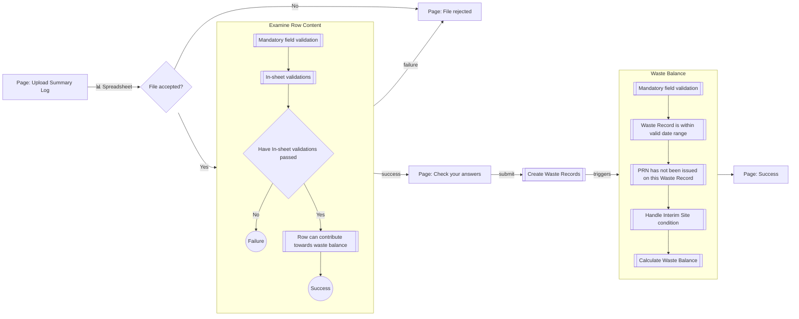
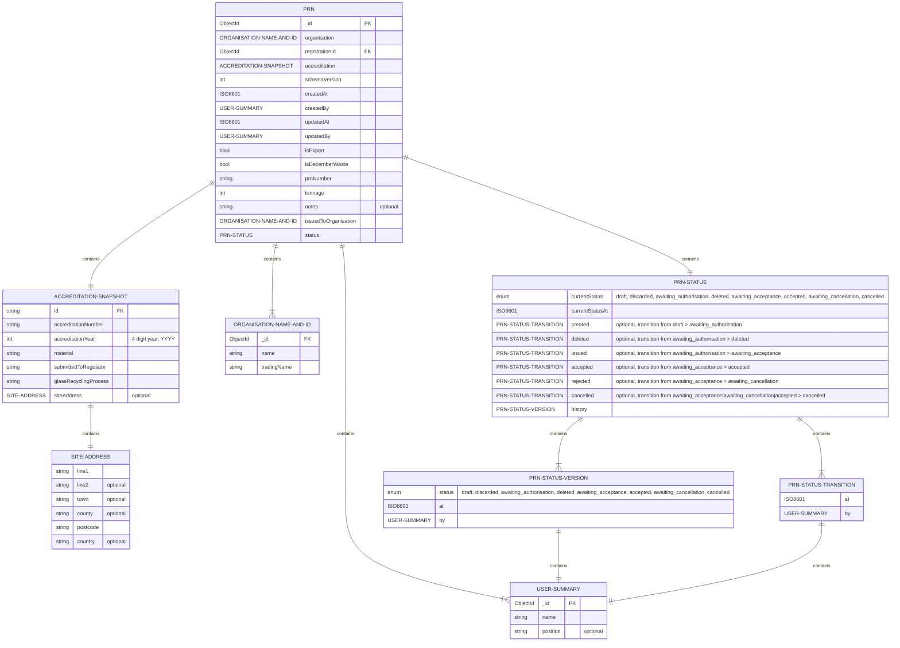
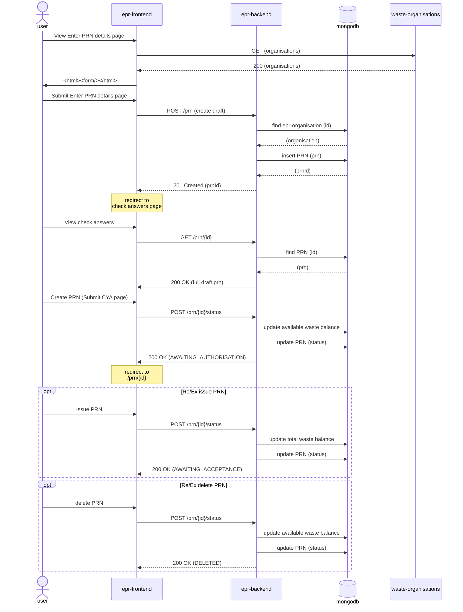
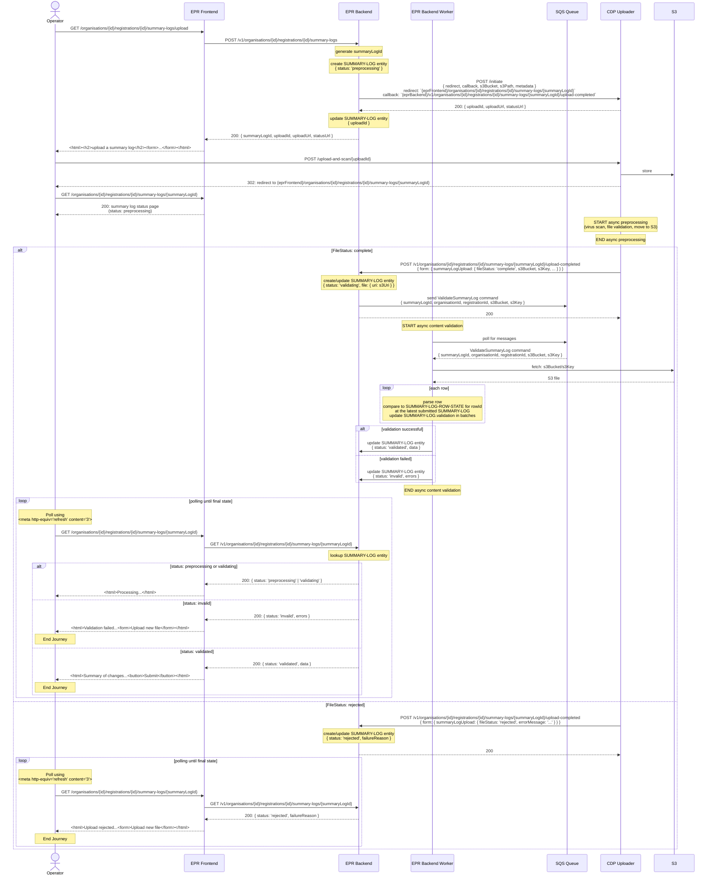
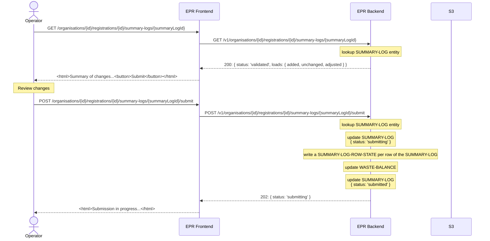

# pEPR Low level design

> [!WARNING]
> This document is a work in progress and is subject to change.

<!-- prettier-ignore-start -->
<!-- TOC -->
* [pEPR Low level design](#pepr-low-level-design)
  * [API Endpoints](#api-endpoints)
  * [CRUD by Entity Type](#crud-by-entity-type)
  * [Role-Based Access Control](#role-based-access-control)
  * [Entity Relationships](#entity-relationships)
    * [Users](#users)
    * [Waste Record & Waste Balance](#waste-record--waste-balance)
      * [Disambiguation](#disambiguation)
      * [User Journey](#user-journey)
      * [Summary Log LLDs](#summary-log-llds)
      * [Entity Relationships](#entity-relationships-1)
      * [Waste Record Type: Received](#waste-record-type-received)
      * [Waste Record Type: processed](#waste-record-type-processed)
      * [Waste Record Type: sentOn](#waste-record-type-senton)
      * [Waste Balance](#waste-balance)
    * [PRN](#prn)
      * [PRN creation schema & sequence diagram](#prn-creation-schema--sequence-diagram)
    * [Report](#report)
    * [Summary Log upload & ingest](#summary-log-upload--ingest)
      * [Phase 1: upload & async processes: preprocessing, file parsing & data validation](#phase-1-upload--async-processes-preprocessing-file-parsing--data-validation)
      * [Phase 2: validation results & submission](#phase-2-validation-results--submission)
<!-- TOC -->

<!-- prettier-ignore-end -->

## API Endpoints

The swagger documentation can be found [here](../api-definitions/index.md)

## CRUD by Entity Type

| Entity Type   | Admin: SuperUser | Admin: Regulator | Public: User | Notes                                                                                             |
| ------------- | ---------------- | ---------------- | ------------ | ------------------------------------------------------------------------------------------------- |
| User          | CRU-             | CRU-             | -R--         | Users can only be soft deleted via status change                                                  |
| Organisation  | -RU-             | -RU-             | -R--         | Created on application                                                                            |
| Registration  | -RU-             | -RU-             | -R--         | Created on application, unique to Activity & Site, contains Accreditation                         |
| Accreditation | -RU-             | -RU-             | -R--         | Created on application, nested under Material                                                     |
| Summary-Log   | -R--             | -R--             | CR--         | Summary Logs are immutable and stored in S3 for history purposes                                  |
| Waste-Record  | -R--             | -R--             | -RU-         | Update is result of Summary-Log create                                                            |
| Waste-Balance | -R--             | -R--             | -RU-         | Update is result of Summary-Log create or PRN create/update                                       |
| PRN           | -RU-             | -RU-             | CRU-         |                                                                                                   |
| Report        | -R--             | -R--             | CRU-         |                                                                                                   |
| Notification  | -RU-             | -RU-             | -RU-         | All Notifications are system generated, updates take place via status changes on related entities |
| System-Log    | -R--             | ----             | ----         | For monitoring purposes, not to be confused with SOC auditing                                     |

## Role-Based Access Control

| Permission                      | Super User    | Regulator     | Approved Person     | PRN Signatory     | User     |
| ------------------------------- | ------------- | ------------- | ------------------- | ----------------- | -------- |
| **User:ApprovedPerson:view**    | ✅            | ✅            | ✅                  | ✅                | ✅       |
| **User:ApprovedPerson:add**     | ✅            | ✅            |                     |                   |          |
| **User:ApprovedPerson:edit**    | ✅            | ✅            |                     |                   |          |
| **User:PRNSignatory:view**      | ✅            | ✅            | ✅                  | ✅                | ✅       |
| **User:PRNSignatory:add**       | ✅            | ✅            |                     |                   |          |
| **User:PRNSignatory:edit**      | ✅            | ✅            |                     |                   |          |
| **User:view**                   | ✅            | ✅            | ✅                  | ✅                | ✅       |
| **User:add**                    | ✅            | ✅            | ✅                  |                   |          |
| **User:edit**                   | ✅            | ✅            | ✅                  |                   |          |
| =============================== | ============= | ============= | =================   | ===============   | ======   |
| **Organisation:view**           | ✅            | ✅            | ✅                  | ✅                | ✅       |
| **Organisation:edit**           | ✅            | ✅            |                     |                   |          |
| **Organisation:approve**        | ✅            | ✅            |                     |                   |          |
| **Organisation:reject**         | ✅            | ✅            |                     |                   |          |
| ============================    | ============= | ============= | =================== | ================= | ======   |
| **Registration:view**           | ✅            | ✅            | ✅                  | ✅                | ✅       |
| **Registration:edit**           | ✅            | ✅            |                     |                   |          |
| **Registration:approve**        | ✅            | ✅            |                     |                   |          |
| **Registration:reject**         | ✅            | ✅            |                     |                   |          |
| ========================        | ============= | ============= | =================== | ================= | ======== |
| **Accreditation:view**          | ✅            | ✅            | ✅                  | ✅                | ✅       |
| **Accreditation:edit**          | ✅            | ✅            |                     |                   |          |
| **Accreditation:approve**       | ✅            | ✅            |                     |                   |          |
| **Accreditation:reject**        | ✅            | ✅            |                     |                   |          |
| ========================        | ============= | ============= | =================== | ================= | ======== |
| **Summary-Log:view**            | ✅            | ✅            | ✅                  | ✅                | ✅       |
| **Summary-Log:validate**        |               |               | ✅                  | ✅                | ✅       |
| **Summary-Log:submit**          |               |               | ✅                  | ✅                | ✅       |
| ========================        | ============= | ============= | =================== | ================= | ======== |
| **Waste-Record:view**           | ✅            | ✅            | ✅                  | ✅                | ✅       |
| ========================        | ============= | ============= | =================== | ================= | ======== |
| **Waste-Balance:view**          | ✅            | ✅            | ✅                  | ✅                | ✅       |
| ========================        | ============= | ============= | =================== | ================= | ======== |
| **PRN:view**                    | ✅            | ✅            | ✅                  | ✅                | ✅       |
| **PRN:add**                     |               |               | ✅                  | ✅                | ✅       |
| **PRN:edit**                    |               |               | ✅                  | ✅                | ✅       |
| **PRN:approve**                 |               |               |                     | ✅                |          |
| **PRN:reject**                  |               |               |                     | ✅                |          |
| ========================        | ============= | ============= | =================== | ================= | ======== |
| **Report:view**                 | ✅            | ✅            | ✅                  | ✅                | ✅       |
| **Report:add**                  |               |               | ✅                  | ✅                | ✅       |
| **Report:edit**                 |               |               | ✅                  | ✅                | ✅       |
| **Report:approve**              |               |               | ✅                  |                   |          |
| **Report:reject**               |               |               | ✅                  |                   |          |
| ========================        | ============= | ============= | =================== | ================= | ======== |
| **Notification:view**           | ✅            | ✅            | ✅                  | ✅                | ✅       |
| ========================        | ============= | ============= | =================== | ================= | ======== |
| **System-Log:view**             | ✅            |               |                     |                   |          |

## Entity Relationships

### Users

TBD

### Waste Record & Waste Balance

#### Disambiguation

The Waste Record is the entity used to track key reporting data uploaded by Summary Logs. Updating a row does not rewrite a stored document: a submission writes one row state per row, holding that row's data and its waste balance classification, and the row's history is the set of states carrying its identity. A state is written once and never edited, so two submissions reporting the same content for a row under the same template share one state document, which records the submissions that reported it.

The Waste Balance is the running total in tonnes of waste received minus PRNs issued. It is held as a per-accreditation append-only event stream: each balance-affecting business operation (a summary log submission, a PRN transition) appends one immutable event carrying the resulting `closingBalance`. The current balance is the `closingBalance` on the highest-numbered event — a single indexed read, with no separately materialised total to drift. See [ADR-0036](../decisions/0036-event-sourced-waste-balance-stream.md) for the design rationale.

#### User Journey


```mermaid
flowchart LR
UploadFile[Page: Upload Summary Log]
FileRejected[Page: File rejected]

UploadFile-- 📊 Spreadsheet -->FileChecks{File accepted?}
FileChecks-- Yes -->ExamineRows
FileChecks-- No -->FileRejected

ExamineRows-- success -->CheckYourAnswers[Page: Check your answers]
ExamineRows-- failure -->FileRejected
CheckYourAnswers-- submit -->CreateWasteRecords[[Create Waste Records]]
CreateWasteRecords-- triggers -->WasteBalance

subgraph ExamineRows[Examine Row Content]
  MandatoryFieldValidation[[Mandatory field validation]]-->InSheetValidations[[In-sheet validations]]
  InSheetValidations-->HaveInSheetValidationsPassed{Have In-sheet validations passed}
  HaveInSheetValidationsPassed-- No -->Failure((Failure))
  HaveInSheetValidationsPassed-- Yes -->RowCanContributeTowardsWasteBalance[[Row can contribute towards waste balance]]
  RowCanContributeTowardsWasteBalance-->Success((Success))
end

subgraph WasteBalance[Waste Balance]
  MandatoryFieldValidation_2[[Mandatory field validation]]-->
  WasteRecordIsWithinValidRange[[Waste Record is within valid date range]]-->
  PRNHasNotBeenIssuedOnWasteRecord[[PRN has not been issued on this Waste Record]]-->
  HandleInterimSiteCondition[[Handle Interim Site condition]]-->
  CalculateWasteBalance[[Calculate Waste Balance]]
end

WasteBalance-->SummaryLogSuccess[Page: Success]
```

#### Summary Log LLDs

For detailed Summary Log LLDs, see the following:

1. [Summary Log validation](./summary-log-validation-lld.md)
1. [Summary Log row validation classification](./summary-log-row-validation-classification.md)
1. [Summary Log submission](./summary-log-submission-lld.md)

#### Entity Relationships

> [!NOTE]
> `accreditationId` is `null` rather than absent on a row state whose registration has no accreditation, so registered-only reporting has the same identity shape as accredited reporting.


```mermaid
erDiagram
  SUMMARY-LOG-ROW-STATE {
    ObjectId _id PK
    ObjectId organisationId FK
    ObjectId registrationId FK
    ObjectId accreditationId FK "null when the registration has no accreditation"
    enum wasteRecordType "received, processed, sentOn, exported"
    string rowId "the operator's row identifier within the registration's records of that type"
    string processingType "the template the row reported under"
    json data "the row's reporting fields, less ROW_ID and processingType, weights and tonnages at two decimal places"
    ROW-CLASSIFICATION classification
    string[] summaryLogIds "every submission that reported this exact state"
    string contentHash "sha256 over processingType, data and classification"
  }

  ROW-CLASSIFICATION {
    enum outcome "INCLUDED, EXCLUDED, IGNORED, NOT_APPLICABLE"
    CLASSIFICATION-REASON[] reasons "why a row is not INCLUDED"
    number transactionAmount "tonnes contributed, zero unless INCLUDED"
  }

  CLASSIFICATION-REASON {
    string code "e.g. PRN_ISSUED, OUTSIDE_ACCREDITATION_PERIOD, ORS_NOT_APPROVED"
    string field "optional - the reporting field the reason refers to"
  }

  USER-SUMMARY {
    ObjectId _id PK
    ObjectId organisationId FK
    string name
  }

  SUMMARY-LOG {
    ObjectId _id PK
    enum status "preprocessing, rejected, validating, invalid, validated, submitting, submitted"
    SUMMARY-LOG-FILE file "file metadata and S3 URI"
    string failureReason "error message when status is rejected"
    ISO8601 createdAt
    USER-SUMMARY createdBy FK
    ISO8601 updatedAt
    USER-SUMMARY updatedBy FK
    SUMMARY-LOG-VALIDATION validation "validation issues"
    SUMMARY-LOG-LOADS loads "load classification after validation"
  }

  SUMMARY-LOG-FILE {
    string id "CDP file ID"
    string name "original filename"
    enum status "pending, rejected, complete"
    string uri "S3 object URI, required when status is complete"
  }

  SUMMARY-LOG-VALIDATION {
    VALIDATION-ISSUE[] issues
  }

  VALIDATION-ISSUE {
    enum severity "FATAL, ERROR, WARNING"
    enum category "parsing, technical, business"
    string message
    string code "for i18n"
    json context "optional additional context"
  }

  SUMMARY-LOG-LOADS {
    LOAD-CATEGORY added
    LOAD-CATEGORY unchanged
    LOAD-CATEGORY adjusted
  }

  LOAD-CATEGORY {
    LOAD-COUNT valid
    LOAD-COUNT invalid
  }

  LOAD-COUNT {
    int count
    string[] rowIds "max 100 row IDs"
  }

  WASTE-BALANCE-EVENT {
    ObjectId _id PK
    ObjectId registrationId FK "stream partition"
    ObjectId accreditationId FK "stream partition - null for registered-only"
    ObjectId organisationId FK "denormalised for org-level queries"
    int number "sequential per stream from 1"
    enum kind "summary-log-submitted, prn-created, prn-issued, prn-creation-cancelled, prn-cancelled-after-issue, prn-accepted, prn-rejected"
    STREAM-EVENT-PAYLOAD payload "kind-specific"
    STREAM-BALANCE-SNAPSHOT openingBalance
    STREAM-BALANCE-SNAPSHOT closingBalance
    ISO8601 createdAt
    USER-SUMMARY createdBy "the actor who triggered the event"
  }

  STREAM-EVENT-PAYLOAD {
    string summaryLogId "summary-log-submitted only"
    Decimal128 creditTotal "summary-log-submitted only"
    string prnId "PRN kinds only"
    Decimal128 amount "PRN kinds only"
  }

  STREAM-BALANCE-SNAPSHOT {
    Decimal128 amount "credits minus confirmed debits"
    Decimal128 availableAmount "amount minus ringfenced (pending) debits"
  }

  SUMMARY-LOG-ROW-STATE ||--|| ROW-CLASSIFICATION : contains
  ROW-CLASSIFICATION ||--o{ CLASSIFICATION-REASON : contains
  SUMMARY-LOG }|--o{ SUMMARY-LOG-ROW-STATE : "submitted"
  SUMMARY-LOG ||--|{ USER-SUMMARY : contains
  SUMMARY-LOG ||--|| SUMMARY-LOG-FILE : contains
  SUMMARY-LOG ||--o| SUMMARY-LOG-VALIDATION : contains
  SUMMARY-LOG ||--o| SUMMARY-LOG-LOADS : contains
  SUMMARY-LOG-VALIDATION ||--|{ VALIDATION-ISSUE : contains
  SUMMARY-LOG-LOADS ||--|| LOAD-CATEGORY : "added"
  SUMMARY-LOG-LOADS ||--|| LOAD-CATEGORY : "unchanged"
  SUMMARY-LOG-LOADS ||--|| LOAD-CATEGORY : "adjusted"
  LOAD-CATEGORY ||--|| LOAD-COUNT : "valid"
  LOAD-CATEGORY ||--|| LOAD-COUNT : "invalid"
  WASTE-BALANCE-EVENT ||--|| STREAM-EVENT-PAYLOAD : contains
  WASTE-BALANCE-EVENT ||--|| USER-SUMMARY : contains
  WASTE-BALANCE-EVENT ||--|| STREAM-BALANCE-SNAPSHOT : "openingBalance"
  WASTE-BALANCE-EVENT ||--|| STREAM-BALANCE-SNAPSHOT : "closingBalance"
```

The examples below all report under the `REPROCESSOR_INPUT` template, so `data` is keyed by that template's column names. `contentHash` is omitted throughout: it is derived from `processingType`, `data` and `classification`, and is stripped again on read.

#### Waste Record Type: Received

Row `1001` was reported in two submissions: the first named the supplier as `Acme Waste`, the second corrected it to `Acme Waste Ltd`. No weight changed, so both readings classify the same way — but the data differs, so the row has two state documents.

```json5
{
  _id: 'a1234567890a12345a01',
  organisationId: 'e1234567890a12345a01',
  registrationId: 'f1234567890a12345a01',
  accreditationId: 'b1234567890a12345a01',
  wasteRecordType: 'received',
  rowId: '1001',
  processingType: 'REPROCESSOR_INPUT',
  data: {
    DATE_RECEIVED_FOR_REPROCESSING: '2026-01-01',
    EWC_CODE: '15 01 01',
    DESCRIPTION_WASTE: 'Paper - sorted mixed paper or board',
    WERE_PRN_OR_PERN_ISSUED_ON_THIS_WASTE: 'No',
    GROSS_WEIGHT: 1.0,
    TARE_WEIGHT: 0.15,
    PALLET_WEIGHT: 0.05,
    NET_WEIGHT: 0.8,
    BAILING_WIRE_PROTOCOL: 'No',
    WEIGHT_OF_NON_TARGET_MATERIALS: 0.05,
    HOW_DID_YOU_CALCULATE_RECYCLABLE_PROPORTION: 'National protocol percentage',
    RECYCLABLE_PROPORTION_PERCENTAGE: 0.8,
    TONNAGE_RECEIVED_FOR_RECYCLING: 0.6,
    SUPPLIER_NAME: 'Acme Waste'
    // ...
  },
  classification: {
    outcome: 'INCLUDED',
    reasons: [],
    transactionAmount: 0.6
  },
  summaryLogIds: ['s1234567890a12345a01']
}
```

```json5
{
  _id: 'a1234567890a12345a02',
  organisationId: 'e1234567890a12345a01',
  registrationId: 'f1234567890a12345a01',
  accreditationId: 'b1234567890a12345a01',
  wasteRecordType: 'received',
  rowId: '1001',
  processingType: 'REPROCESSOR_INPUT',
  data: {
    DATE_RECEIVED_FOR_REPROCESSING: '2026-01-01',
    EWC_CODE: '15 01 01',
    DESCRIPTION_WASTE: 'Paper - sorted mixed paper or board',
    WERE_PRN_OR_PERN_ISSUED_ON_THIS_WASTE: 'No',
    GROSS_WEIGHT: 1.0,
    TARE_WEIGHT: 0.15,
    PALLET_WEIGHT: 0.05,
    NET_WEIGHT: 0.8,
    BAILING_WIRE_PROTOCOL: 'No',
    WEIGHT_OF_NON_TARGET_MATERIALS: 0.05,
    HOW_DID_YOU_CALCULATE_RECYCLABLE_PROPORTION: 'National protocol percentage',
    RECYCLABLE_PROPORTION_PERCENTAGE: 0.8,
    TONNAGE_RECEIVED_FOR_RECYCLING: 0.6,
    SUPPLIER_NAME: 'Acme Waste Ltd'
    // ...
  },
  classification: {
    outcome: 'INCLUDED',
    reasons: [],
    transactionAmount: 0.6
  },
  summaryLogIds: ['s1234567890a12345a02']
}
```

Where all their constituent fields are present and valid, the upload validates two identities across these weights, on the values as submitted: `NET_WEIGHT` is `GROSS_WEIGHT` less `TARE_WEIGHT` and `PALLET_WEIGHT`, and `TONNAGE_RECEIVED_FOR_RECYCLING` is `NET_WEIGHT` less `WEIGHT_OF_NON_TARGET_MATERIALS`, times the recyclable proportion, less a further 0.15% where the bailing wire protocol applies. The write then rounds each stored weight to two decimal places and re-derives `NET_WEIGHT` from its rounded components, so the first identity still holds exactly in the stored row; the second holds only to the rounding.

A third submission repeating the corrected row writes no third document: under the same template, the row's `data` and `classification` hash to the same identity, so that submission's id joins the second document's `summaryLogIds`.

#### Waste Record Type: processed

The reprocessed loads table on a reprocessor input template feeds no waste balance decision, so its rows are stamped `NOT_APPLICABLE` even under a live accreditation.

```json5
{
  _id: 'a1234567890a12345a03',
  organisationId: 'e1234567890a12345a01',
  registrationId: 'f1234567890a12345a01',
  accreditationId: 'b1234567890a12345a01',
  wasteRecordType: 'processed',
  rowId: '4001',
  processingType: 'REPROCESSOR_INPUT',
  data: {
    DATE_LOAD_LEFT_SITE: '2026-01-01',
    PRODUCT_DESCRIPTION: 'Baled board',
    PRODUCT_TONNAGE: 1.0,
    CUSTOMER_NAME: 'name'
    // ...
  },
  classification: {
    outcome: 'NOT_APPLICABLE',
    reasons: [],
    transactionAmount: 0
  },
  summaryLogIds: ['s1234567890a12345a01']
}
```

#### Waste Record Type: sentOn

Waste sent on leaves the reprocessor, so an included sent-on row carries a negative `transactionAmount` and debits the balance the received loads credited.

```json5
{
  _id: 'a1234567890a12345a04',
  organisationId: 'e1234567890a12345a01',
  registrationId: 'f1234567890a12345a01',
  accreditationId: 'b1234567890a12345a01',
  wasteRecordType: 'sentOn',
  rowId: '5001',
  processingType: 'REPROCESSOR_INPUT',
  data: {
    DATE_LOAD_LEFT_SITE: '2026-01-01',
    TONNAGE_OF_UK_PACKAGING_WASTE_SENT_ON: 0.2,
    FINAL_DESTINATION_NAME: 'name',
    EWC_CODE: '15 01 01',
    DESCRIPTION_WASTE: 'Paper - sorted mixed paper or board'
    // ...
  },
  classification: {
    outcome: 'INCLUDED',
    reasons: [],
    transactionAmount: -0.2
  },
  summaryLogIds: ['s1234567890a12345a01']
}
```

#### Waste Balance

The waste balance is an **event-sourced stream**. The authoritative design — the event taxonomy, the on-the-wire event shape, the frozen-`creditTotal` delta arithmetic, decimal handling, concurrency, and partial-failure recovery — lives in [ADR-0036](../decisions/0036-event-sourced-waste-balance-stream.md) and is not restated here. In summary: each balance-affecting business operation (a summary-log submission or a PRN transition) appends one immutable event to a per-`(registrationId, accreditationId)` stream carrying `openingBalance` and `closingBalance` snapshots. The current balance is the `closingBalance` on the highest-numbered event — a single indexed read, with no embedded `transactions[]` array and no separately materialised total to drift.

##### PRN transition → event mapping

PRN status is a projection of the stream: each balance-affecting PRN transition appends one event, and the two-phase lifecycle is why `amount` and `availableAmount` are separate fields. The event kinds are defined in [ADR-0036](../decisions/0036-event-sourced-waste-balance-stream.md#event-taxonomy-v1); their balance effects:

| PRN transition                                 | Stream event                | Balance effect                                                     |
| ---------------------------------------------- | --------------------------- | ------------------------------------------------------------------ |
| `DRAFT → AWAITING_AUTHORISATION`               | `prn-created`               | Ringfence: `availableAmount −= amount`                             |
| `AWAITING_AUTHORISATION → AWAITING_ACCEPTANCE` | `prn-issued`                | Confirm debit: `amount −= amount` (`availableAmount` already down) |
| `AWAITING_AUTHORISATION → DELETED`             | `prn-creation-cancelled`    | Release ringfence: `availableAmount += amount`                     |
| `AWAITING_CANCELLATION → CANCELLED`            | `prn-cancelled-after-issue` | Reverse both: `amount += amount`, `availableAmount += amount`      |
| `AWAITING_ACCEPTANCE → ACCEPTED`               | `prn-accepted`              | None — lifecycle only                                              |
| Rejection of an issued PRN                     | `prn-rejected`              | None — lifecycle only                                              |

This table is illustrative of the balance effects, not the exhaustive PRN state machine. The authoritative transition-to-event mapping lives in the write-side decider in `epr-backend`, so it can track the PRN state machine without amending the design.

### PRN


```mermaid
erDiagram
  PRN {
    ObjectId _id PK
    ORGANISATION-NAME-AND-ID organisation
    ObjectId registrationId FK
    ACCREDITATION-SNAPSHOT accreditation
    int schemaVersion
    ISO8601 createdAt
    USER-SUMMARY createdBy
    ISO8601 updatedAt
    USER-SUMMARY updatedBy
    bool isExport
    bool isDecemberWaste
    string prnNumber
    int tonnage
    string notes "optional"
    ORGANISATION-NAME-AND-ID issuedToOrganisation
    PRN-STATUS status
  }

  ACCREDITATION-SNAPSHOT {
    string id FK
    string accreditationNumber
    int accreditationYear "4 digit year: YYYY"
    string material
    string submittedToRegulator
    string glassRecyclingProcess
    SITE-ADDRESS siteAddress "optional"
  }

  SITE-ADDRESS {
    string line1
    string line2 "optional"
    string town "optional"
    string county "optional"
    string postcode
    string country "optional"
  }

  ORGANISATION-NAME-AND-ID {
    ObjectId _id FK
    string name
    string tradingName
  }

  PRN-STATUS {
    enum currentStatus "draft, discarded, awaiting_authorisation, deleted, awaiting_acceptance, accepted, awaiting_cancellation, cancelled"
    ISO8601 currentStatusAt
    PRN-STATUS-TRANSITION created "optional, transition from draft > awaiting_authorisation"
    PRN-STATUS-TRANSITION deleted "optional, transition from awaiting_authorisation > deleted"
    PRN-STATUS-TRANSITION issued "optional, transition from awaiting_authorisation > awaiting_acceptance"
    PRN-STATUS-TRANSITION accepted "optional, transition from awaiting_acceptance > accepted"
    PRN-STATUS-TRANSITION rejected "optional, transition from awaiting_acceptance > awaiting_cancellation"
    PRN-STATUS-TRANSITION cancelled "optional, transition from awaiting_acceptance|awaiting_cancellation|accepted > cancelled"
    PRN-STATUS-VERSION history
  }

  PRN-STATUS-TRANSITION {
    ISO8601 at
    USER-SUMMARY by
  }

  PRN-STATUS-VERSION {
    enum status "draft, discarded, awaiting_authorisation, deleted, awaiting_acceptance, accepted, awaiting_cancellation, cancelled"
    ISO8601 at
    USER-SUMMARY by
  }

  USER-SUMMARY {
    ObjectId _id PK
    string name
    string position "optional"
  }

  PRN ||--|{ ORGANISATION-NAME-AND-ID : contains
  PRN ||--|| PRN-STATUS : contains
  PRN ||--|{ USER-SUMMARY : contains
  PRN-STATUS ||--|{ PRN-STATUS-VERSION : contains
  PRN-STATUS-VERSION ||--|| USER-SUMMARY : contains
  PRN-STATUS ||--|{ PRN-STATUS-TRANSITION : contains
  PRN-STATUS-TRANSITION ||--|| USER-SUMMARY : contains
  PRN ||--|| ACCREDITATION-SNAPSHOT : contains
  ACCREDITATION-SNAPSHOT ||--|| SITE-ADDRESS : contains
```

### PRN creation & issuing

The journey goes through two stages

- creating a PRN (sets PRN status to `AWAITING_AUTHORISATION`)
- issuing a PRN (sets PRN status to `AWAITING_ACCEPTANCE`)

This is supported through two API endpoints

#### POST /v1/organisations/{organisationId}/registrations/{registrationId}/accreditations/{accreditationId}/packaging-recycling-notes

Creates a PRN in `draft` status

**payload values**

- tonnage, floating point number to two decimal places, required
- issuedToOrganisation, object, required
  - id: string, uuid, required
  - name: string, required
  - tradingName: string, optional
- notes, string, max length 200, optional

**example**

```javascript
{
  tonnage: 100.00,
  issuedToOrganisation: {
    id: 'ebdfb7d9-3d55-4788-ad33-dbd7c885ef20',
    name: 'Sauce Makers Limited',
    tradingName: 'Awesome Sauce',
  },
  notes: 'REF: 101010'
}
```

**returns**
201 CREATED

Response body is an object that is a partial representation of the PRN, including the (object) ID of the created PRN.

```javascript
{
  id: '167bd693-3e8a-4291-b2c0-4d1740744180',
  // ... other datapoints
}
```

#### POST /v1/organisations/{organisationId}/registrations/{registrationId}/accreditations/{accreditationId}/packaging-recycling-notes/{id}/status

Update the status of a PRN.

**payload values**

- status: enum, required

**status values**

- DRAFT
- AWAITING_AUTHORISATION
- AWAITING_ACCEPTANCE
- AWAITING_CANCELLATION
- ACCEPTED
- CANCELLED
- DELETED

**example**

```javascript
{
  status: 'AWAITING_AUTHORISATION'
}
```

**returns**
204 OK

#### Sequence Diagram


```mermaid
sequenceDiagram
  actor user
  participant epr-frontend
  participant epr-backend
  participant mongodb@{ "type": "database" }
  participant waste-organisations

  user ->> epr-frontend: View Enter PRN details page
  epr-frontend ->> waste-organisations: GET (organisations)
  waste-organisations -->> epr-frontend: 200 (organisations)
  epr-frontend ->> user: <html><form/></html>
  user ->> epr-frontend: Submit Enter PRN details page
  epr-frontend ->> epr-backend: POST /prn (create draft)
  epr-backend ->> mongodb: find epr-organisation (id)
  mongodb -->> epr-backend: (organisation)
  epr-backend ->> mongodb: insert PRN (prn)
  mongodb -->> epr-backend: (prnId)
  epr-backend -->> epr-frontend: 201 Created (prnId)
  note over epr-frontend: redirect to <br/>check answers page

  user ->> epr-frontend: View check answers
  epr-frontend ->> epr-backend: GET /prn/{id}
  epr-backend ->> mongodb: find PRN (id)
  mongodb -->> epr-backend: (prn)
  epr-backend -->> epr-frontend: 200 OK (full draft prn)

  user ->> epr-frontend: Create PRN (Submit CYA page)
  epr-frontend ->> epr-backend: POST /prn/{id}/status
  epr-backend ->> mongodb: update available waste balance
  epr-backend ->> mongodb: update PRN (status)
  epr-backend -->> epr-frontend: 200 OK (AWAITING_AUTHORISATION)

  note over epr-frontend: redirect to <br/>/prn/{id}

  opt Re/Ex issue PRN
    user ->> epr-frontend: Issue PRN
    epr-frontend ->> epr-backend: POST /prn/{id}/status
    epr-backend ->> mongodb: update total waste balance
    epr-backend ->> mongodb: update PRN (status)
    epr-backend -->> epr-frontend: 200 OK (AWAITING_ACCEPTANCE)
  end


  opt Re/Ex delete PRN
    user ->> epr-frontend: delete PRN
    epr-frontend ->> epr-backend: POST /prn/{id}/status
    epr-backend ->> mongodb: update available waste balance
    epr-backend ->> mongodb: update PRN (status)
    epr-backend -->> epr-frontend: 200 OK (DELETED)
  end

```

### Report

TBD

### Summary Log upload & ingest

> [!NOTE]
> The frontend only needs a single page to handle the entire upload and validation flow. The page polls the backend state document and updates the UI based on the current status, without requiring redirects between different URLs.

#### Phase 1: upload & async processes: preprocessing, file parsing & data validation


```mermaid
sequenceDiagram
  actor Op as Operator
  participant Frontend as EPR Frontend
  participant Backend as EPR Backend
  participant BackendWorker as EPR Backend Worker
  participant SQS as SQS Queue
  participant CDPUploader as CDP Uploader
  participant S3

  Op->>Frontend: GET /organisations/{id}/registrations/{id}/summary-logs/upload
  Frontend->>Backend: POST /v1/organisations/{id}/registrations/{id}/summary-logs
  Note over Backend: generate summaryLogId
  Note over Backend: create SUMMARY-LOG entity<br>{ status: 'preprocessing' }
  Backend->>CDPUploader: POST /initiate<br>{ redirect, callback, s3Bucket, s3Path, metadata }<br>redirect: `{eprFrontend}/organisations/{id}/registrations/{id}/summary-logs/{summaryLogId}`<br>callback: `{eprBackend}/v1/organisations/{id}/registrations/{id}/summary-logs/{summaryLogId}/upload-completed`
  CDPUploader-->>Backend: 200: { uploadId, uploadUrl, statusUrl }
  Note over Backend: update SUMMARY-LOG entity<br>{ uploadId }
  Backend-->>Frontend: 200: { summaryLogId, uploadId, uploadUrl, statusUrl }
  Frontend-->>Op: <html><h2>upload a summary log</h2><form>...</form></html>
  Op->>CDPUploader: POST /upload-and-scan/{uploadId}
  CDPUploader->>S3: store
  CDPUploader-->>Op: 302: redirect to {eprFrontend}/organisations/{id}/registrations/{id}/summary-logs/{summaryLogId}

  Op->>Frontend: GET /organisations/{id}/registrations/{id}/summary-logs/{summaryLogId}
  Frontend-->>Op: 200: summary log status page<br>(status: preprocessing)

  Note over CDPUploader: START async preprocessing<br>(virus scan, file validation, move to S3)
  Note over CDPUploader: END async preprocessing

  alt FileStatus: complete
    CDPUploader->>Backend: POST /v1/organisations/{id}/registrations/{id}/summary-logs/{summaryLogId}/upload-completed<br>{ form: { summaryLogUpload: { fileStatus: 'complete', s3Bucket, s3Key, ... } } }
    Note over Backend: create/update SUMMARY-LOG entity<br>{ status: 'validating', file: { uri: s3Uri } }
    Backend->>SQS: send ValidateSummaryLog command<br>{ summaryLogId, organisationId, registrationId, s3Bucket, s3Key }
    Backend-->>CDPUploader: 200
    Note over BackendWorker: START async content validation
    BackendWorker->>SQS: poll for messages
    SQS-->>BackendWorker: ValidateSummaryLog command<br>{ summaryLogId, organisationId, registrationId, s3Bucket, s3Key }
    BackendWorker->>S3: fetch: s3Bucket/s3Key
    S3-->>BackendWorker: S3 file
    loop each row
      Note over BackendWorker: parse row<br>compare to SUMMARY-LOG-ROW-STATE for rowId<br>at the latest submitted SUMMARY-LOG<br>update SUMMARY-LOG.validation in batches
    end
    alt validation successful
      BackendWorker->>Backend: update SUMMARY-LOG entity<br>{ status: 'validated', data }
    else validation failed
      BackendWorker->>Backend: update SUMMARY-LOG entity<br>{ status: 'invalid', errors }
    end
    Note over BackendWorker: END async content validation

    loop polling until final state
      Note over Op: Poll using<br> <meta http-equiv="refresh" content="3">
      Op->>Frontend: GET /organisations/{id}/registrations/{id}/summary-logs/{summaryLogId}
      Frontend->>Backend: GET /v1/organisations/{id}/registrations/{id}/summary-logs/{summaryLogId}
      Note over Backend: lookup SUMMARY-LOG entity
      alt status: preprocessing or validating
        Backend-->>Frontend: 200: { status: 'preprocessing' | 'validating' }
        Frontend-->>Op: <html>Processing...</html>
      else status: invalid
        Backend-->>Frontend: 200: { status: 'invalid', errors }
        Frontend-->>Op: <html>Validation failed...<form>Upload new file</form></html>
        Note over Op: End Journey
      else status: validated
        Backend-->>Frontend: 200: { status: 'validated', data }
        Frontend-->>Op: <html>Summary of changes...<button>Submit</button></html>
        Note over Op: End Journey
      end
    end
  else FileStatus: rejected
    CDPUploader->>Backend: POST /v1/organisations/{id}/registrations/{id}/summary-logs/{summaryLogId}/upload-completed<br>{ form: { summaryLogUpload: { fileStatus: 'rejected', errorMessage: '...' } } }
    Note over Backend: create/update SUMMARY-LOG entity<br>{ status: 'rejected', failureReason }
    Backend-->>CDPUploader: 200

    loop polling until final state
      Note over Op: Poll using<br> <meta http-equiv="refresh" content="3">
      Op->>Frontend: GET /organisations/{id}/registrations/{id}/summary-logs/{summaryLogId}
      Frontend->>Backend: GET /v1/organisations/{id}/registrations/{id}/summary-logs/{summaryLogId}
      Backend-->>Frontend: 200: { status: 'rejected', failureReason }
      Frontend-->>Op: <html>Upload rejected...<form>Upload new file</form></html>
      Note over Op: End Journey
    end
  end


```

#### Phase 2: validation results & submission


```mermaid
sequenceDiagram
  actor Op as Operator
  participant Frontend as EPR Frontend
  participant Backend as EPR Backend
  participant S3


  Op->>Frontend: GET /organisations/{id}/registrations/{id}/summary-logs/{summaryLogId}
  Frontend->>Backend: GET /v1/organisations/{id}/registrations/{id}/summary-logs/{summaryLogId}
  Note over Backend: lookup SUMMARY-LOG entity
  Backend-->>Frontend: 200: { status: 'validated', loads: { added, unchanged, adjusted } }
  Frontend-->>Op: <html>Summary of changes...<button>Submit</button></html>

  Note over Op: Review changes

  Op->>Frontend: POST /organisations/{id}/registrations/{id}/summary-logs/{summaryLogId}/submit
  Frontend->>Backend: POST /v1/organisations/{id}/registrations/{id}/summary-logs/{summaryLogId}/submit
  Note over Backend: lookup SUMMARY-LOG entity
  Note over Backend: update SUMMARY-LOG<br>{ status: 'submitting' }
  Note over Backend: write a SUMMARY-LOG-ROW-STATE per row of the SUMMARY-LOG
  Note over Backend: update WASTE-BALANCE
  Note over Backend: update SUMMARY-LOG<br>{ status: 'submitted' }
  Backend-->>Frontend: 202: { status: 'submitting' }
  Frontend-->>Op: <html>Submission in progress...</html>
```
