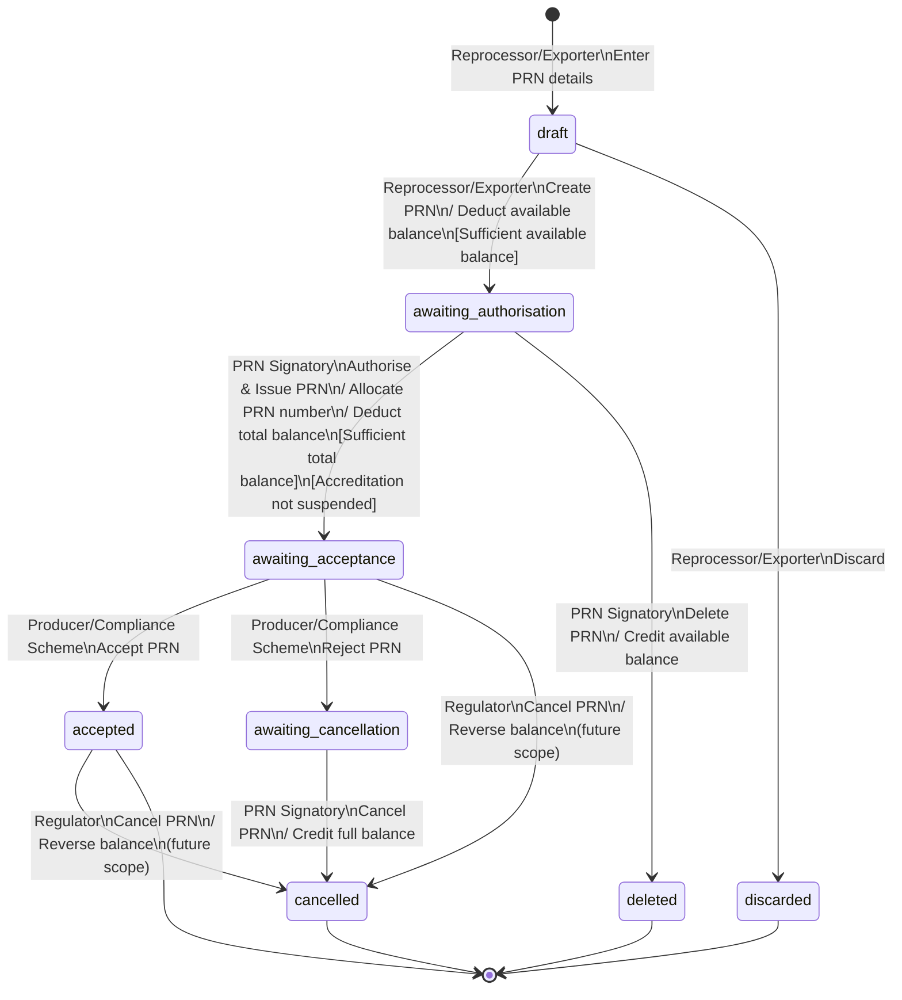

# PRN State Transitions

This document describes the state machine for Packaging Recycling Notes (PRNs) in
the EPR backend: the statuses a PRN moves through, the actors permitted to drive
each transition, the waste balance effects, and the preconditions that gate them.

For related context, see:

- [ADR 24: Create PRN API strategy](../decisions/0024-create-prn-api-strategy.md) - how draft PRNs are created and incrementally updated
- [ADR 36: Event-sourced waste balance stream](../decisions/0036-event-sourced-waste-balance-stream.md) - the stream the balance effects append to

<!-- prettier-ignore-start -->
<!-- TOC -->

- [PRN State Transitions](#prn-state-transitions)
  - [States](#states)
  - [Actors](#actors)
  - [Diagram](#diagram)
  - [Transitions in detail](#transitions-in-detail)
  - [Waste balance effects](#waste-balance-effects)
  - [Preconditions](#preconditions)
  - [Scope](#scope)
  - [Implementation](#implementation)

<!-- TOC -->
<!-- prettier-ignore-end -->

## States

| Status                   | Description                                                                                                   |
| ------------------------ | ------------------------------------------------------------------------------------------------------------- |
| `draft`                  | PRN details being entered. Not yet created.                                                                   |
| `awaiting_authorisation` | PRN created by the reprocessor/exporter, awaiting a signatory to issue it. Available balance is ringfenced.   |
| `awaiting_acceptance`    | PRN authorised and issued. PRN number allocated, total balance deducted. Awaiting producer/scheme acceptance. |
| `accepted`               | Producer/compliance scheme accepted the PRN. Terminal state.                                                  |
| `awaiting_cancellation`  | Producer/compliance scheme rejected the PRN. Awaiting the signatory to cancel it.                             |
| `cancelled`              | PRN cancelled after issue. Waste balance fully reversed. Terminal state.                                      |
| `deleted`                | PRN deleted before issue. Ringfenced balance released. Terminal state.                                        |
| `discarded`              | Draft discarded before creation. No balance interaction. Terminal state.                                      |

## Actors

| Actor                        | Code value             | Actions                                                                |
| ---------------------------- | ---------------------- | ---------------------------------------------------------------------- |
| Reprocessor / Exporter       | `reprocessor_exporter` | Enters PRN details (draft), creates PRN, discards draft                |
| PRN Signatory                | `signatory`            | Authorises & issues, deletes (pre-issue), cancels (post-rejection)     |
| Producer / Compliance Scheme | `producer`             | Accepts or rejects an issued PRN (via the external API)                |
| Regulator                    | _(none yet)_           | Direct cancellation of an issued or accepted PRN — not yet implemented |

## Diagram

> The two regulator-initiated transitions (`awaiting_acceptance → cancelled` and
> `accepted → cancelled`) are not implemented. The only cancellation path in the
> code runs through `awaiting_cancellation` after a producer rejection.

## Transitions in detail

| From                     | To                       | Actor                | Trigger           | Stream event                | Balance effect           |
| ------------------------ | ------------------------ | -------------------- | ----------------- | --------------------------- | ------------------------ |
| `draft`                  | `awaiting_authorisation` | Reprocessor/Exporter | Create PRN        | `PRN_CREATED`               | Deduct available balance |
| `draft`                  | `discarded`              | Reprocessor/Exporter | Discard draft     | _(none)_                    | None                     |
| `awaiting_authorisation` | `awaiting_acceptance`    | Signatory            | Authorise & issue | `PRN_ISSUED`                | Deduct total balance     |
| `awaiting_authorisation` | `deleted`                | Signatory            | Delete PRN        | `PRN_CREATION_CANCELLED`    | Credit available balance |
| `awaiting_acceptance`    | `accepted`               | Producer             | Accept PRN        | `PRN_ACCEPTED`              | None (status only)       |
| `awaiting_acceptance`    | `awaiting_cancellation`  | Producer             | Reject PRN        | `PRN_REJECTED`              | None (status only)       |
| `awaiting_cancellation`  | `cancelled`              | Signatory            | Cancel PRN        | `PRN_CANCELLED_AFTER_ISSUE` | Credit full balance      |

Accept and reject are driven by the producer through the external API; the other
transitions are driven internally and the permitted actor is inferred from the
PRN's current status.

## Waste balance effects

The waste balance carries two figures: a **total** amount and the **available**
amount (total less anything ringfenced by in-flight PRNs). PRNs move balance in
two phases so that a created-but-not-yet-issued PRN cannot be double-spent:

- **On create** (`draft → awaiting_authorisation`): the tonnage is deducted from
  **available** balance, ringfencing it while the PRN awaits a signatory.
- **On issue** (`awaiting_authorisation → awaiting_acceptance`): the tonnage is
  deducted from **total** balance, completing the spend, and the PRN number is
  allocated.

Reversals mirror whichever phases had been applied:

- **Delete** (`awaiting_authorisation → deleted`) credits **available** balance,
  releasing the creation ringfence.
- **Cancel** (`awaiting_cancellation → cancelled`) credits **both** total and
  available balance, reversing the create and issue deductions.

Accept and reject are balance-neutral: they append a status-only event to the
stream and move no balance.

## Preconditions

- **Sufficient available balance** at create — `availableAmount` must be at least
  the PRN tonnage, otherwise creation is rejected.
- **Sufficient total balance** at issue — `amount` must be at least the PRN
  tonnage, otherwise issue is rejected.
- **A waste balance must exist** for the accreditation at both create and issue.
- **The accreditation must not be suspended** at issue.

## Scope

Delivered: `draft`, `discarded`, `awaiting_authorisation`, `awaiting_acceptance`,
`accepted`, `awaiting_cancellation`, `deleted`, `cancelled`, including producer
acceptance/rejection and signatory cancellation.

Future scope: regulator-initiated direct cancellation of an issued
(`awaiting_acceptance`) or accepted PRN, shown dashed in the diagram above.

## Notes

- A PRN must not be edited by a reprocessor/exporter once issued. Where the
  producer has rejected it, the only action is to cancel — it cannot be re-issued.
- "Pending" (uncommitted) waste balance is not considered here.

## Implementation

| Concern                                          | Location                                                                     |
| ------------------------------------------------ | ---------------------------------------------------------------------------- |
| Status values, actors, transition table          | `src/packaging-recycling-notes/domain/model.js`                              |
| Status update handler                            | `src/packaging-recycling-notes/routes/status.js`                             |
| Transition orchestration & PRN number allocation | `src/packaging-recycling-notes/application/update-status.js`                 |
| Waste balance effects per transition             | `src/packaging-recycling-notes/application/update-status-balance-effects.js` |
| External accept / reject endpoints               | `src/packaging-recycling-notes/routes/accept.js`, `reject.js`                |

> Paths are relative to the `epr-backend` repository root.
