# Data Flow and Invalidation

This document maps how changes to entities ripple through the system. Its purpose is to make clear: **when something changes, what becomes stale, and how (or whether) the system corrects it.**

For detailed implementation, see the related LLDs:

- [Summary Log Validation LLD](summary-log-validation-lld.md)
- [Summary Log Row Validation Classification](summary-log-row-validation-classification.md)
- [Summary Log Submission LLD](summary-log-submission-lld.md)
- [Summary Log Processing Failure Handling](summary-log-processing-failure-handling.md)

## System Overview

The system has a clear data flow direction: upstream entities influence how downstream entities are created, but downstream entities do not feed back upstream.

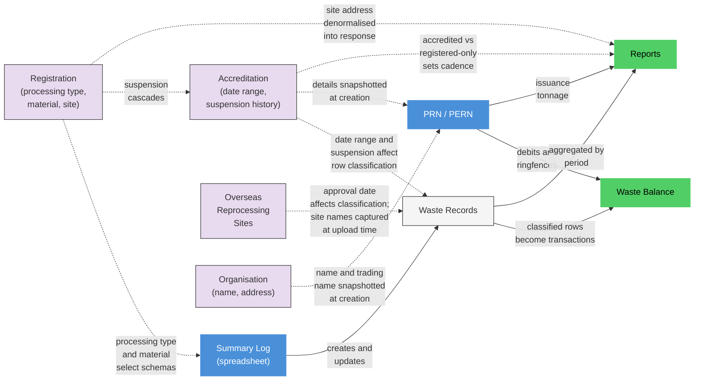

## What Reads What

Before looking at invalidation, it helps to know what data each entity actually uses from other entities.

### Summary Log Validation reads

| Source | Data used | Purpose |
| --- | --- | --- |
| **Registration** | `registrationNumber` | Compared against spreadsheet metadata (FATAL if mismatch) |
| **Registration** | `wasteProcessingType`, `reprocessingType` | Selects which table schemas and validation rules apply |
| **Registration** | `material`, `glassRecyclingProcess` | Compared against spreadsheet metadata (FATAL if mismatch) |
| **Accreditation** | `accreditationNumber` | Compared against spreadsheet metadata (FATAL if mismatch) |
| **Accreditation** | `validFrom`, `validTo` | Used to mark rows as IGNORED if dates fall outside the period |
| **Accreditation** | `statusHistory` | Used to mark rows as IGNORED if accreditation was suspended at the load date |
| **Existing Waste Records** | `type`, `rowId` | Row continuity check — previously submitted rows must not be removed |
| **Feature flags** | `isRegisteredOnlyEnabled` | Controls whether registered-only template variants are accepted |
| **Template version thresholds** | Minimum per processing type | Rejects spreadsheets using outdated template versions |

### Waste Balance calculation reads

| Source | Data used | Purpose |
| --- | --- | --- |
| **Accreditation** | `validFrom`, `validTo` | Date range for row classification (INCLUDED vs IGNORED) |
| **Accreditation** | `statusHistory` | Suspension check at each load date |
| **Waste Record data** | Required fields per table | Missing required fields → row EXCLUDED from balance |
| **Waste Record data** | `WERE_PRN_OR_PERN_ISSUED_ON_THIS_WASTE` | If "Yes" → row EXCLUDED (already accounted for) |
| **Waste Record data** | `ADD_PRODUCT_WEIGHT` (reprocessor output only) | If not "Yes" → row EXCLUDED |
| **Waste Record data** | `DID_WASTE_PASS_THROUGH_AN_INTERIM_SITE` (exporter only) | Switches which tonnage field is used |
| **Waste Record data** | Tonnage field (varies by table) | The actual credit or debit amount |
| **ORS approval data** (exporter only) | ORS `validFrom` date matched against export date | VAL014: if the ORS was not yet approved at the date of export → row EXCLUDED from balance |
| **Existing balance** | Prior transactions per rowId | Delta mechanism — only creates a transaction if the target amount differs from what was previously credited |

### PRN operations read

| Source | Data used | Purpose |
| --- | --- | --- |
| **Waste Balance** | `availableAmount` | Checked at PRN creation — must have sufficient available tonnage |
| **Waste Balance** | `amount` | Checked at PRN issue — must have sufficient total tonnage |
| **Accreditation** | `status` | Checked at PRN issue — cannot issue if accreditation is suspended |
| **Accreditation** | Number, year, material, glass process, site address | Snapshotted into the PRN at creation (never updated) |
| **Organisation** | `name`, `tradingName` | Snapshotted into the PRN at creation (never updated) |

### Reports read

| Source | Data used | Purpose |
| --- | --- | --- |
| **Waste Records** | Date fields (varies by operator category) | Determines which records fall in which reporting period |
| **Waste Records** | Tonnage fields | Summed for received, exported, sent-on totals |
| **Waste Records** | `SUPPLIER_NAME`, `ACTIVITIES_CARRIED_OUT_BY_SUPPLIER` | Listed in recycling activity section |
| **Waste Records** | `OSR_ID`, `OSR_NAME` | Listed as overseas sites in export activity section |
| **Waste Records** | `FINAL_DESTINATION_NAME`, `FINAL_DESTINATION_FACILITY_TYPE` | Listed in waste sent section, categorised by facility type |
| **PRNs** (accredited only) | Tonnage of PRNs with `status.issued.at` in period | PRN issuance data in report |
| **Registration** | `accreditationId` (present or absent) | Determines cadence: monthly (accredited) or quarterly (registered-only) |
| **Registration** | `wasteProcessingType` | Determines operator category and which report sections apply |
| **Registration** | `material`, `site.address` | Appended to report response |

## Invalidation Map

Each section below answers: **when this changes, what breaks, and how is it fixed?**

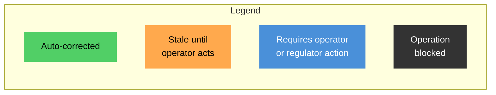

### New Summary Log submitted

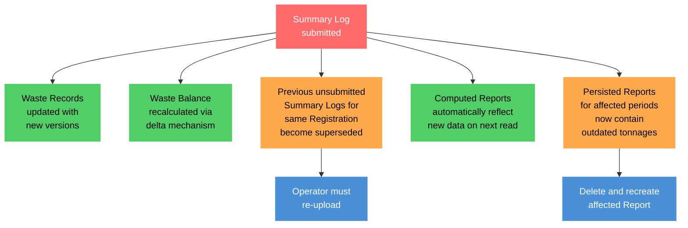

### PRN lifecycle changes

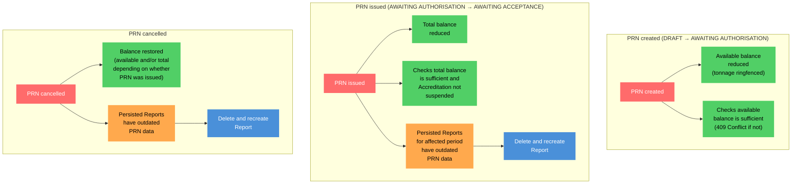

### Accreditation dates changed

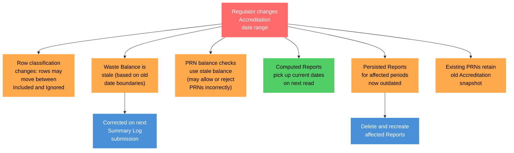

### Accreditation or Registration suspended

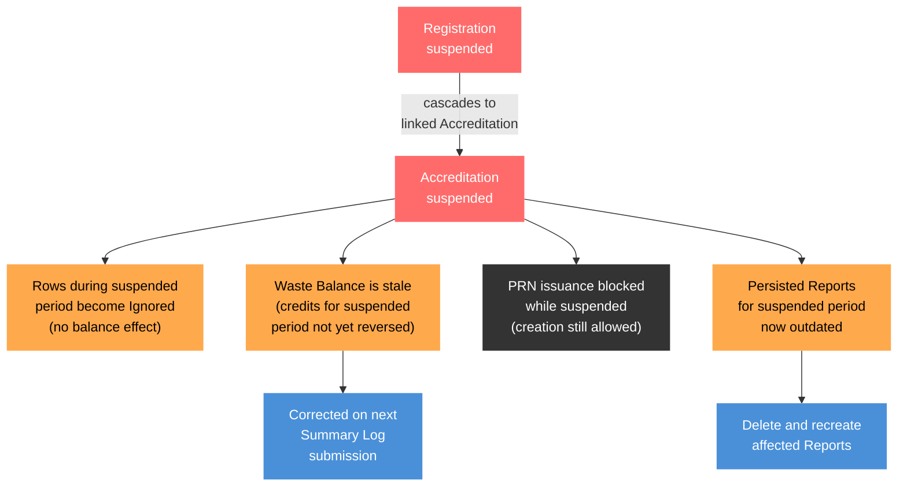

### Accreditation granted or removed

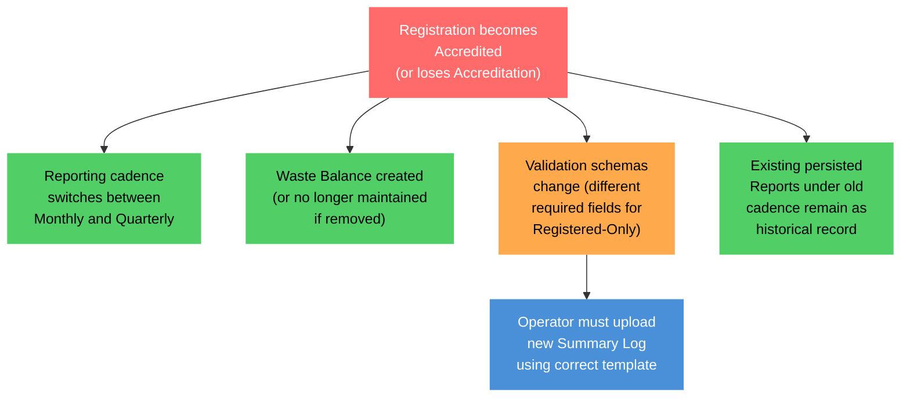

### Registration details changed (material, processing type, site address)

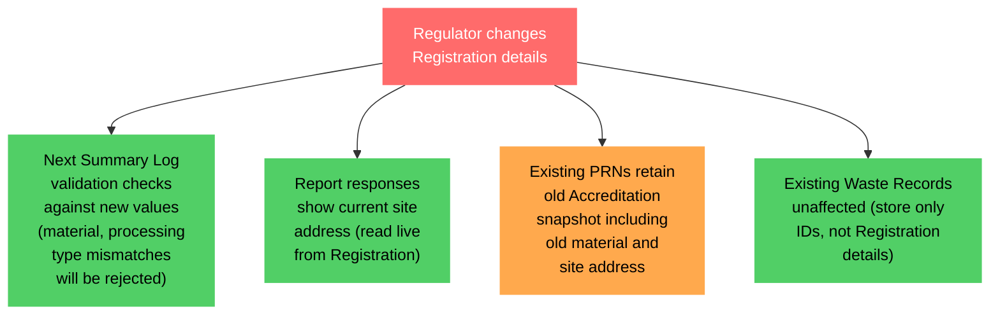

### Organisation details changed (name, trading name)

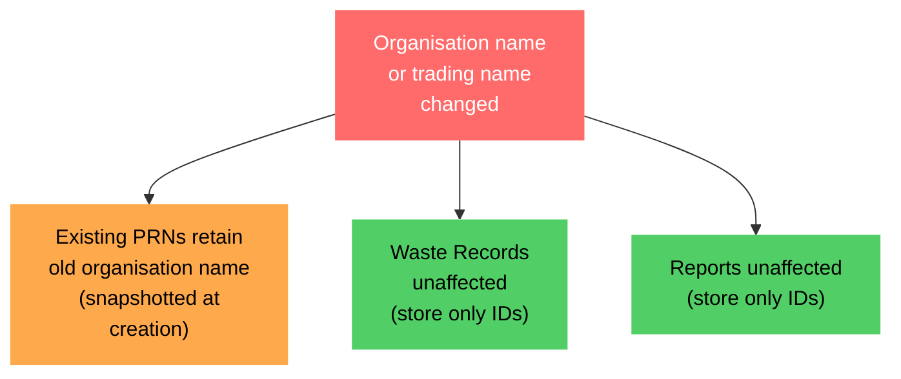

### Overseas Reprocessing Site data changed

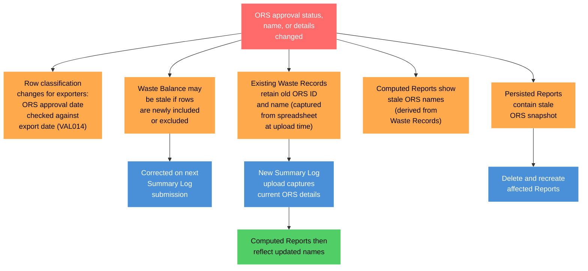

### Pending Report blocks submission (VAL012)

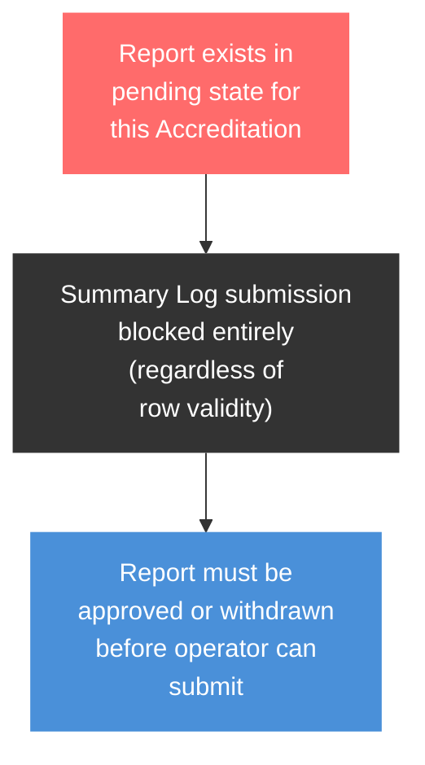

## Invalidation Summary

| Change | Waste Records | Waste Balance | Computed Reports | Persisted Reports | PRNs |
| --- | --- | --- | --- | --- | --- |
| **Summary Log submitted** | Updated (new versions) | Auto-corrected (delta) | Auto-corrected | **Stale** — recreate | — |
| **PRN created** | — | Auto-corrected (ringfence) | Auto-corrected | — | — |
| **PRN issued** | — | Auto-corrected (debit) | Auto-corrected | **Stale** — recreate | — |
| **PRN cancelled** | — | Auto-corrected (reversal) | Auto-corrected | **Stale** — recreate | — |
| **Accreditation dates changed** | Classification changes | **Stale** until next submission | Auto-corrected | **Stale** — recreate | Retain old snapshot |
| **Accreditation suspended** | Classification changes | **Stale** until next submission | Auto-corrected | **Stale** — recreate | Issuance blocked |
| **Registration suspended** | Via accreditation cascade | Via accreditation cascade | Via cascade | Via cascade | Via cascade |
| **Accreditation granted/removed** | Schema changes | Created or removed | Cadence changes | Historical | — |
| **Registration details changed** | Unaffected (IDs only) | Unaffected | Site address auto-corrected | — | Retain old snapshot |
| **Organisation details changed** | Unaffected (IDs only) | Unaffected | Unaffected | Unaffected | Retain old snapshot |
| **ORS data changed** | Retain old snapshot | **Stale** until next submission (VAL014 classification) | **Stale** (old names) | **Stale** — recreate | — |
| **Pending Report exists** | — | — | — | — | — (submission blocked) |

## Key Architectural Insight

The system has three correction mechanisms, each with different latency:

1. **Immediate** — PRN transactions update the waste balance straight away.
2. **On next submission** — The delta mechanism re-classifies all waste records against the current accreditation state and creates corrective transactions. Changes to accreditation dates or suspension status are **not reflected in the waste balance until the operator uploads a new summary log**.
3. **On read** — Computed reports always aggregate from current waste records, so they self-correct. Persisted reports are snapshots that must be manually deleted and recreated.

**There is no background recalculation.** If a regulator changes accreditation dates and no new summary log is submitted, the waste balance remains incorrect. This also means PRN balance sufficiency checks may use stale figures.

PRNs and waste records deliberately use a **snapshot** pattern for denormalised data (organisation name, accreditation details, ORS names). This preserves what was true at the time of creation for audit purposes, but means these snapshots become stale when upstream entities change.
