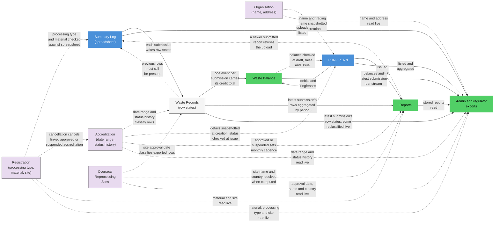

# Data Flow and Invalidation

This document maps how changes to entities ripple through the system. Its purpose is to make clear: **when something changes, what becomes stale, and how (or whether) the system corrects it.**

For detailed implementation, see the related LLDs:

- [Summary Log Validation LLD](summary-log-validation-lld.md)
- [Summary Log Row Validation Classification](summary-log-row-validation-classification.md)
- [Summary Log Submission LLD](summary-log-submission-lld.md)
- [Summary Log Processing Failure Handling](summary-log-processing-failure-handling.md)

## System Overview

Solid arrows show data flowing downstream. Dotted arrows show a read: reference data, or a downstream entity read back by the next step upstream. Three reads run against the flow. The next upload reads the previous submission's rows and the registration's reports, and each PRN step reads the balance.

```mermaid
flowchart LR
    classDef source fill:#4a90d9,color:#fff,stroke:none
    classDef core fill:#f5f5f5,stroke:#333
    classDef downstream fill:#51cf66,color:#000,stroke:none
    classDef reference fill:#e8daef,stroke:#333

    SL["Summary Log\n(spreadsheet)"]:::source
    PRN["PRN / PERN"]:::source

    REG["Registration\n(processing type,\nmaterial, site)"]:::reference
    ACC["Accreditation\n(date range,\nstatus history)"]:::reference
    ORS["Overseas\nReprocessing\nSites"]:::reference
    ORG["Organisation\n(name, address)"]:::reference

    WR["Waste Records\n(row states)"]:::core
    WB["Waste Balance"]:::downstream
    RPT["Reports"]:::downstream
    EXP["Admin and regulator\nexports"]:::downstream

    SL -->|"each submission\nwrites row states"| WR
    WR -->|"one event per\nsubmission carries\nits credit total"| WB
    PRN -->|"debits and\nringfences"| WB
    WR -->|"latest submission's\nrows aggregated\nby period"| RPT
    PRN -->|"issued\ntonnage"| RPT

    ACC -.->|"date range and\nstatus history\nclassify rows"| WR
    REG -.->|"processing type\nand material checked\nagainst spreadsheet"| SL
    REG -.->|"cancellation cancels\nlinked approved or\nsuspended accreditation"| ACC
    REG -.->|"material and site\nread live"| RPT
    ORS -.->|"site approval date\nclassifies exported rows"| WR
    ORS -.->|"site name and\ncountry resolved\nwhen computed"| RPT
    ORG -.->|"name and trading\nname snapshotted\nat creation"| PRN
    ACC -.->|"details snapshotted\nat creation; status\nchecked at issue"| PRN
    ACC -.->|"approved or\nsuspended sets\nmonthly cadence"| RPT
    WR -.->|"previous rows\nmust still\nbe present"| SL
    RPT -.->|"a newer submitted\nreport refuses\nthe upload"| SL
    WB -.->|"balance checked\nat draft, raise\nand issue"| PRN

    SL -->|"uploads\nlisted"| EXP
    WR -->|"latest submission's\nrow states; some\nreclassified live"| EXP
    WB -->|"balances and\nlatest submission\nper stream"| EXP
    PRN -->|"listed and\naggregated"| EXP
    RPT -->|"stored reports\nread"| EXP
    ACC -.->|"date range and\nstatus history\nread live"| EXP
    ORS -.->|"approval date,\nname and country\nread live"| EXP
    REG -.->|"material, processing\ntype and site\nread live"| EXP
    ORG -.->|"name and address\nread live"| EXP
```

## What Reads What

Each consumer below reads some data live and keeps a copy of the rest. A copy is what goes stale.

### Summary Log validation

Validation checks the spreadsheet against the registration as it is now. The registration number, accreditation number, material and processing type in the spreadsheet must match the registration and its accreditation, or the upload is rejected outright. That includes the template variant: a registration whose accreditation has a number must use an accredited template, and one without a registered-only template. The spreadsheet's own processing type then selects the table schemas its rows are read against.

Every row submitted before must still be present. The baseline is the row states of the latest submission on the waste balance stream of the registration's current accreditation.

Validation then classifies the rows the way a submission would, to preview the effect on the balance. It uses the current accreditation and, for exporters, the current overseas site approval dates. It also compares each row with the previous submission's row state to count what was added or changed. It sorts the rows by reporting period against the registration's reports, and stores which already-submitted periods the upload restates. Nothing is written to the balance until the operator submits.

### Summary Log submission

Submission is refused if another summary log was submitted for the registration after this one was uploaded, or a report was submitted after it was created. Otherwise it classifies every row again against the current accreditation and overseas site data, and writes:

- **Row states.** Each row is stored with its classification in the summary log row states collection. A row whose data and classification are both unchanged is not rewritten. The new submission's id is added to its membership instead, and a changed row gets a new row state. See [ADR-0037](../decisions/0037-summary-log-row-states-with-membership.md).
- **One event on the waste balance stream**, carrying the submission's credit total.
- **Report flags.** The registration's in-progress and ready-to-submit reports are marked stale. A submitted report for a period the upload restates is flagged for resubmission, using the periods validation stored.

A row's classification decides whether its tonnage counts towards the balance. It depends on the row's own data, on whether the accreditation's date range covered the row's date and the accreditation was neither suspended nor cancelled on it, and, for exported rows, on whether the overseas site was approved by the export date. An overseas site is found through the registration's list of sites, and its approval date belongs to the site record.

### Waste Balance — the event-sourced stream

The waste balance is an **event-sourced stream** per organisation, registration and accreditation. A registration has one stream for each accreditation it has held, plus a registered-only stream whose submissions append events that carry no credit. A submission appends **one `summary-log-submitted` event** carrying a frozen `creditTotal`: the credit contribution of all the submission's rows, classified against the accreditation and overseas site data in force at submit time. The balance shifts by the difference between this submission's `creditTotal` and the previous one's. The current balance is the closing balance on the latest event, so there is no separate balance store to drift. December waste is tracked the same way in a separate dimension of the balance. See [ADR-0036](../decisions/0036-event-sourced-waste-balance-stream.md) for the event taxonomy and the arithmetic, and [ADR-0049](../decisions/0049-december-waste-prns.md) for December waste.

Three consequences matter for data flow:

- **Frozen snapshots set the correction latency.** Because `creditTotal` is fixed at write time, a later change to a contextual factor, such as an amended accreditation date range, does not move the balance until the next submission recomputes its own snapshot. This is the mechanism behind the invalidation behaviour below.
- **The stream says which submission is current.** Every reader of the current rows finds the latest `summary-log-submitted` event on the stream, then reads the row states whose membership includes that submission. Validation, submission, reports and exports all read rows this way. The balance itself reads only the stream.
- **Only the current accreditation's stream is read for the operator.** Validation, submission and computed reports read the stream of the registration's current accreditation. When a registration gains an accreditation, the row continuity baseline starts empty and computed reports stop seeing the registered-only rows. Exports read every stream.

### PRN operations

- **Draft.** Creating a draft checks the available balance and refuses a cancelled accreditation, but moves nothing. It copies the organisation's name and trading name, and the accreditation's details including material, site address and regulator, into the PRN. These copies are never updated.
- **Raise (PRN created).** Raising the draft for authorisation checks the available balance again and ringfences the tonnage. It also records which pool the PRN draws on: December waste or general.
- **Issue.** Issuing refuses a suspended or cancelled accreditation, or a total balance too small for the tonnage. It reads the live accreditation's regulator to number the PRN, and debits the balance from the pool the raise recorded.
- **Reversals.** Deleting a PRN awaiting authorisation returns the ringfenced tonnage. A rejection by the recipient moves nothing, and the tonnage returns to the balance only when the cancellation completes. A report computed in between already leaves the PRN out, so the report and the balance disagree until then.

### Reports

Cadence comes from the accreditation: monthly while it is approved or suspended, quarterly otherwise. The operator's category, and so which date fields and report sections apply, comes from the registration's processing type together with that test. This is a different test from validation's template check, which asks whether the accreditation has a number. An accreditation keeps its number when it is suspended or cancelled, so a cancelled accreditation still needs the accredited template while its reports fall back to quarterly.

A report the operator has not yet created is computed on every read, from live data. It aggregates the row states of the latest submission by period, adds the tonnage of PRNs issued in the period that are not cancelled or awaiting cancellation, and resolves overseas site names and countries from the site records. Once the operator creates the report, it is stored and returned as it was saved. The report detail response adds the registration's current material and site either way.

### Admin and regulator exports read

The admin UI's reports and CSV downloads, and the market insights and waste records downloads on epr-frontend's regulator pages, are built from the current data each time they are requested. An export that reads waste records finds the latest submitted summary log on each waste balance stream and reads that submission's row states. Credited tonnage, the waste records export and the market insights waste balance figures then classify those rows again against the current accreditation and overseas site data, rather than using the classification stamped at submission. Tonnage monitoring sums the rows without classifying them at all.

## Invalidation Map

Each section below answers: **when this changes, what goes stale, and how is it corrected?**

Three rules decide most of the answers:

- **The balance moves only when an event is appended.** Raising, issuing, deleting before issue and completing a cancellation move it at once. A change to accreditation or overseas site data reaches it only through the next submission's credit total. Nothing recalculates it in the background.
- **A stored report is flagged, never rewritten.** An in-progress or ready-to-submit report can be marked stale, and then cannot be edited or submitted until the operator deletes it and creates it again from current data. A submitted report can be flagged for resubmission, and the operator then creates and submits a new submission for the period. Operators can also ask to resubmit a submitted report themselves.
- **Anything computed on read reflects the change on its next read.** That covers a report the operator has not created and the admin and regulator exports. The exports that reclassify rows can therefore disagree with the balance until the next submission.

### New Summary Log submitted

- **Waste balance.** One event is appended and the balance moves by the difference in credit total. Any accreditation or overseas site change since the previous submission reaches the balance here.
- **Row states.** The new submission's rows become current, each stamped with its classification against the accreditation and site data in force now.
- **Other uploads.** Any other upload for the registration that was validated against the previous submission is refused when the operator tries to submit it. The operator uploads again.
- **Stored reports.** Every in-progress or ready-to-submit report for the registration is marked stale, whatever its period. A submitted report for a period whose rows the upload adds or changes is flagged for resubmission.
- **Computed reports and exports.** They show the new rows on their next read.

### Report submitted

- **Uploads in progress.** Any upload for the registration created before the report was submitted is refused at submission, whichever periods it touches. The operator uploads again.
- **The period is closed.** A later upload that adds or changes rows in the period flags the report for resubmission when it is submitted.
- **Exports.** Those that list stored reports show the submission on their next read.

### PRN lifecycle changes

- **Draft.** Nothing moves. The organisation and accreditation details copied into the PRN are never refreshed.
- **Raise, or delete before issue.** Raising ringfences available balance and deleting a PRN awaiting authorisation returns it, both at once. Reports count only issued PRNs, so neither affects them.
- **Issue.** Total balance is debited at once, and a computed report for the period includes the PRN on its next read. An issue cannot affect a stored report, because a report can be created only once its period has ended.
- **Rejection or cancellation.** Computed reports drop the PRN at once, but the balance is restored only when the cancellation completes, so the two disagree until then. The in-progress or ready-to-submit report for the month the PRN was issued is marked stale. A submitted report for that month is not flagged, and keeps counting the PRN unless the operator asks to resubmit it.
- **Exports.** PRN listings and aggregates show the new status on their next read.

### Accreditation dates changed

- **Waste balance and row states.** Rows that move into or out of the date range keep their old classification, and the balance keeps its old figure, until the next submission. PRN balance checks use that figure meanwhile.
- **Exports.** Credited tonnage, the waste records export and the market insights waste balance figures reclassify on read. Where rows moved, they show the new answer at once and disagree with the balance until the next submission.
- **Reports.** Report figures do not read accreditation dates, so computed and stored reports are unaffected. The accreditation's start date does bound which monthly periods the operator is asked to report, and that is read live.
- **PRNs.** Existing PRNs keep the accreditation details copied when they were drafted.

### Accreditation suspended or cancelled

- **Waste balance and row states.** Rows dated on or after the suspension or cancellation stop counting towards the balance, but only from the next submission. PRN balance checks use the old figure meanwhile.
- **Exports.** The exports that reclassify rows show the change at once. Where rows are affected, they disagree with the balance until the next submission.
- **PRNs.** Issuing is refused at once, while drafting continues during a suspension. Drafting is refused once the accreditation is cancelled. Existing PRNs keep their copied details.
- **Reports.** Suspension leaves reports alone: figures do not read accreditation status, and cadence stays monthly. Cancellation moves the operator to quarterly periods and to the registered-only report category, so a computed report can show different figures from the same rows. Monthly reports already stored keep their figures but drop out of the operator's list.

Cancelling a registration cancels a linked approved or suspended accreditation, with the same effects.

### Accreditation granted

- **Uploads.** Once the accreditation has a number, the next upload must use the accredited template, or validation rejects it.
- **Waste balance.** The accreditation's stream opens with its first submission, and the row continuity baseline starts empty. The registered-only stream keeps its history, and exports still read it.
- **Reports.** Cadence becomes monthly, bounded by the accreditation's start date, and computed reports use the accredited report category. They stop seeing the registered-only rows. Quarterly reports already stored stay but drop out of the operator's list.

### Registration details changed (material, processing type, site address)

- **Uploads.** Validation checks the next upload against the new material and processing type, and rejects a mismatch outright.
- **Reports.** Report responses, stored or computed, show the registration's current material and site. A computed report takes its category from the current processing type.
- **PRNs.** Existing PRNs keep the material and site address copied from the accreditation when they were drafted.
- **Waste records and balance.** Unaffected. Row states hold ids, not registration details.
- **Exports.** They read registration details live, so they show the change on their next read.

### Organisation details changed (name, trading name)

- **PRNs.** Existing PRNs keep the name and trading name copied when they were drafted. PRN listings show that copy.
- **Exports.** Those that read the organisation show the new name on their next read.
- **Waste records, balance and reports.** Unaffected. None of them holds organisation details.

### Overseas Reprocessing Site data changed

This covers a site's approval date, name or country, and the list of sites on the registration.

- **Waste balance and row states.** A change to a site's approval date, or to the registration's list of sites, can change whether an exported row counts. The row keeps its old classification, and the balance its old figure, until the next submission. A name or country change affects neither.
- **Exports.** The exports that reclassify rows show a classification change at once, and disagree with the balance until the next submission.
- **Computed reports.** They resolve each site's name and country, and whether it was approved by the export date, on every read.
- **Stored reports.** They keep the site details as they were when created. Nothing flags them, so an unsubmitted report stays stale until the operator deletes and recreates it, and a submitted one until the operator asks to resubmit it.
- **Waste records.** Rows hold the site id and whatever name the operator typed, so no site change reaches them.

## Invalidation Summary

| Change                                   | Waste balance                                                    | Row states                                                       | Uploads                                                        | Computed reports                                                          | Stored reports                                                               | PRNs                | Admin and regulator exports                         |
| ---------------------------------------- | ---------------------------------------------------------------- | ---------------------------------------------------------------- | -------------------------------------------------------------- | ------------------------------------------------------------------------- | ---------------------------------------------------------------------------- | ------------------- | --------------------------------------------------- |
| **Summary Log submitted**                | Moves by the credit total difference                             | New submission current, freshly stamped                          | Others **refused** at submission                               | Next read                                                                 | In-progress and ready **marked stale**; submitted **flagged** where restated | —                   | Next read                                           |
| **Report submitted**                     | —                                                                | —                                                                | Earlier ones **refused** at submission                         | —                                                                         | Period closed; later changes flag it                                         | —                   | Stored-report listings on next read                 |
| **PRN raised or deleted before issue**   | Available balance moves at once                                  | —                                                                | —                                                              | Unaffected                                                                | Unaffected                                                                   | —                   | Next read                                           |
| **PRN issued**                           | Total balance debited at once                                    | —                                                                | —                                                              | Next read                                                                 | Cannot be affected                                                           | —                   | Next read                                           |
| **PRN rejected or cancelled**            | Restored when cancellation completes                             | —                                                                | —                                                              | PRN dropped at once                                                       | Issue month's active report **marked stale**; submitted **not flagged**      | —                   | Next read                                           |
| **Accreditation dates changed**          | **Stale** until next submission                                  | **Stale** until next submission                                  | —                                                              | Figures unaffected; monthly periods due move                              | Unaffected                                                                   | Keep copied details | Reclassified at once; can **disagree** with balance |
| **Accreditation suspended or cancelled** | **Stale** until next submission                                  | **Stale** until next submission                                  | —                                                              | Suspension: unaffected. Cancellation: quarterly, registered-only category | Unaffected; cancellation drops monthly ones from the list                    | Issue refused       | Reclassified at once; can **disagree** with balance |
| **Accreditation granted**                | New stream from first submission                                 | —                                                                | Accredited template required; continuity baseline starts empty | Monthly, accredited category; registered-only rows drop out               | Quarterly reports drop out of the list                                       | —                   | Read every stream                                   |
| **Registration details changed**         | Unaffected                                                       | Unaffected                                                       | Checked against the new values                                 | Current material and site                                                 | Current material and site shown                                              | Keep copied details | Next read                                           |
| **Organisation details changed**         | Unaffected                                                       | Unaffected                                                       | —                                                              | Unaffected                                                                | Unaffected                                                                   | Keep copied name    | Next read                                           |
| **Overseas site data changed**           | **Stale** until next submission if approval or site list changed | **Stale** until next submission if approval or site list changed | —                                                              | Next read                                                                 | **Stale**, not flagged                                                       | —                   | Reclassified at once; can **disagree** with balance |

## Key Architectural Insight

**There is no background recalculation.** An accreditation or overseas site change that alters which rows count reaches the balance and the stamped row classifications only when the operator submits another summary log. Until then PRN balance checks use the old figure, and the exports that reclassify rows disagree with the balance.

Stored reports are never rewritten. A summary log submission or a PRN cancellation flags them for the operator to act on. A change that flags nothing, such as an overseas site change or a PRN cancelled after its month was submitted, leaves a stored report as it was. The operator has to notice, then delete and recreate an unsubmitted report or ask to resubmit a submitted one.

Two kinds of copy are kept on purpose and never refreshed. A PRN copies organisation and accreditation details when it is drafted, so it keeps what was true then. A row state keeps the classification stamped at its submission, which is why credited tonnage and the other reclassifying exports can differ from it.
