# Data Flow and Invalidation

This document maps how changes to entities ripple through the system. Its purpose is to make clear: **when something changes, what becomes stale, and how (or whether) the system corrects it.**

For detailed implementation, see the related LLDs:

- [Summary Log Validation LLD](summary-log-validation-lld.md)
- [Summary Log Row Validation Classification](summary-log-row-validation-classification.md)
- [Summary Log Submission LLD](summary-log-submission-lld.md)
- [Summary Log Processing Failure Handling](summary-log-processing-failure-handling.md)

## System Overview

Data flows one way. Upstream entities shape how downstream entities are created, and downstream entities do not feed back upstream. The one exception is the registration's reports, which a summary log reads twice: validation shows which rows fall in periods already reported, and submission refuses an upload that a newer report has overtaken.

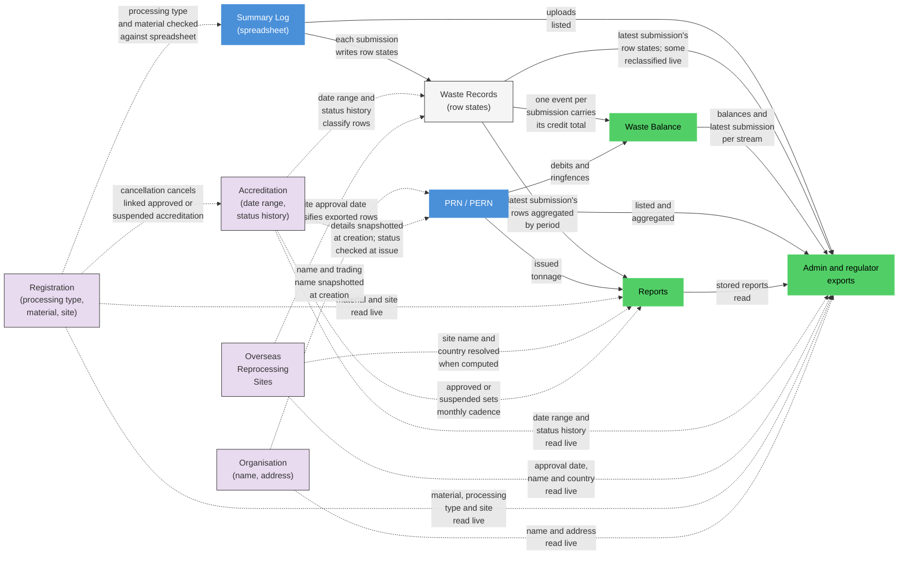
```mermaid
flowchart LR
    classDef source fill:#4a90d9,color:#fff,stroke:none
    classDef core fill:#f5f5f5,stroke:#333
    classDef downstream fill:#51cf66,color:#000,stroke:none
    classDef reference fill:#e8daef,stroke:#333

    SL["Summary Log\n(spreadsheet)"]:::source
    PRN["PRN / PERN"]:::source

    REG["Registration\n(processing type,\nmaterial, site)"]:::reference
    ACC["Accreditation\n(date range,\nstatus history)"]:::reference
    ORS["Overseas\nReprocessing\nSites"]:::reference
    ORG["Organisation\n(name, address)"]:::reference

    WR["Waste Records\n(row states)"]:::core
    WB["Waste Balance"]:::downstream
    RPT["Reports"]:::downstream
    EXP["Admin and regulator\nexports"]:::downstream

    SL -->|"each submission\nwrites row states"| WR
    WR -->|"one event per\nsubmission carries\nits credit total"| WB
    PRN -->|"debits and\nringfences"| WB
    WR -->|"latest submission's\nrows aggregated\nby period"| RPT
    PRN -->|"issued\ntonnage"| RPT

    ACC -.->|"date range and\nstatus history\nclassify rows"| WR
    REG -.->|"processing type\nand material checked\nagainst spreadsheet"| SL
    REG -.->|"cancellation cancels\nlinked approved or\nsuspended accreditation"| ACC
    REG -.->|"material and site\nread live"| RPT
    ORS -.->|"site approval date\nclassifies exported rows"| WR
    ORS -.->|"site name and\ncountry resolved\nwhen computed"| RPT
    ORG -.->|"name and trading\nname snapshotted\nat creation"| PRN
    ACC -.->|"details snapshotted\nat creation; status\nchecked at issue"| PRN
    ACC -.->|"approved or\nsuspended sets\nmonthly cadence"| RPT

    SL -->|"uploads\nlisted"| EXP
    WR -->|"latest submission's\nrow states; some\nreclassified live"| EXP
    WB -->|"balances and\nlatest submission\nper stream"| EXP
    PRN -->|"listed and\naggregated"| EXP
    RPT -->|"stored reports\nread"| EXP
    ACC -.->|"date range and\nstatus history\nread live"| EXP
    ORS -.->|"approval date,\nname and country\nread live"| EXP
    REG -.->|"material, processing\ntype and site\nread live"| EXP
    ORG -.->|"name and address\nread live"| EXP
```

## What Reads What

Each consumer below reads some data live and keeps a copy of the rest. A copy is what goes stale.

### Summary Log validation

Validation checks the spreadsheet against the registration as it is now. The registration number, accreditation number, material and processing type in the spreadsheet must match the registration and its accreditation, or the upload is rejected outright. That includes the template variant: an accredited registration must use an accredited template, and a registered-only one a registered-only template. The spreadsheet's own processing type then selects the table schemas its rows are read against.

Every row submitted before must still be present. The baseline is the row states of the latest submitted summary log on the registration's waste balance stream.

Validation then classifies the rows the way a submission would, to preview the effect on the balance. It uses the current accreditation and, for exporters, the current overseas site approval dates. It also compares each row with the previous submission's row state to count what was added or changed, and sorts rows by reporting period against the registration's reports. Nothing is written to the balance until the operator submits.

### Summary Log submission

Submission is refused if a report for the registration was submitted after the upload was created. Otherwise it classifies every row again against the current accreditation and overseas site data, and writes two things:

- **Row states.** Each row is stored with its classification in the summary log row states collection. A row whose data and classification are both unchanged is not rewritten. The new submission's id is added to its membership instead, and a changed row gets a new row state. See [ADR-0037](../decisions/0037-summary-log-row-states-with-membership.md).
- **One event on the waste balance stream**, carrying the submission's credit total.

A row's classification decides whether its tonnage counts towards the balance. It depends on the row's own data, on whether the accreditation's date range covered the row's date and the accreditation was neither suspended nor cancelled on it, and, for exported rows, on whether the overseas site was approved by the export date. An overseas site is found through the registration's list of sites, and its approval date belongs to the site record.

### Waste Balance — the event-sourced stream

The waste balance is an **event-sourced stream** per organisation, registration and accreditation. A registered-only registration has a stream with no accreditation, and its submissions append events that carry no credit. A submission appends exactly **one `summary-log-submitted` event** carrying a frozen `creditTotal`: the credit contribution of all the submission's rows, classified against the accreditation and overseas site data in force at submit time. The balance shifts by the difference between this submission's `creditTotal` and the previous one's. The current balance is the closing balance on the latest event, so there is no separate balance store to drift. December waste is tracked the same way in a separate dimension of the balance. See [ADR-0036](../decisions/0036-event-sourced-waste-balance-stream.md) for the event taxonomy and the arithmetic, and [ADR-0049](../decisions/0049-december-waste-prns.md) for December waste.

Two consequences matter for data flow:

- **Frozen snapshots set the correction latency.** Because `creditTotal` is fixed at write time, a later change to a contextual factor, such as an amended accreditation date range, does not move the balance until the next submission recomputes its own snapshot. This is the mechanism behind the invalidation behaviour below.
- **The stream says which submission is current.** Anything that needs per-row detail finds the latest `summary-log-submitted` event on the stream, then reads the row states whose membership includes that submission. Validation, submission, reports and exports all read rows this way. The balance itself reads only the stream.

### PRN operations

A PRN checks the balance live at each step that moves it:

- **Creation (draft)** checks the available balance, and refuses a cancelled accreditation. It copies the organisation's name and trading name, and the accreditation's number, year, material, glass process, site address and regulator, into the PRN. These copies are never updated.
- **Raising for authorisation** checks the available balance again and ringfences the tonnage. It also records which pool the PRN draws on: December waste or general.
- **Issue** refuses a suspended or cancelled accreditation, reads the live accreditation's regulator to number the PRN, and debits the balance from the pool the raise recorded.
- **Deleting or cancelling** a PRN credits its tonnage back to that same pool.

### Reports

Cadence comes from the accreditation: monthly while it is approved or suspended, quarterly otherwise. The operator's category, and so which date fields and report sections apply, comes from the registration's processing type together with that test.

A report the operator has not yet created is computed on every read, from live data. It aggregates the row states of the latest submission by period, adds the tonnage of PRNs issued in the period that are not cancelled or awaiting cancellation, and resolves overseas site names and countries from the site records. Once the operator creates the report, it is stored and returned as it was saved. The report detail response adds the registration's current material and site either way.

### Admin and regulator exports read

The admin UI's reports and CSV downloads, and the market insights and waste records downloads on epr-frontend's regulator pages, are built from the current data each time they are requested. An export that reads waste records finds the latest submitted summary log on each waste balance stream and reads that submission's row states. Credited tonnage, the waste records export and the market insights waste balance figures then classify those rows again against the current accreditation and overseas site data, rather than using the classification stamped at submission. Tonnage monitoring sums the rows without classifying them at all.

## Invalidation Map

Each section below answers: **when this changes, what breaks, and how is it fixed?**

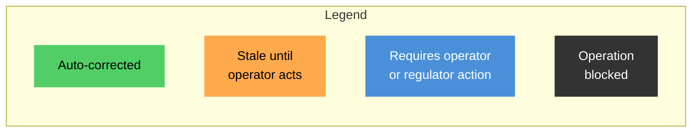
```mermaid
flowchart LR
    classDef auto fill:#51cf66,color:#000,stroke:none
    classDef stale fill:#ffa94d,color:#000,stroke:none
    classDef manual fill:#4a90d9,color:#fff,stroke:none
    classDef blocked fill:#333,color:#fff,stroke:none

    subgraph Legend
        direction TB
        L1["Auto-corrected"]:::auto
        L2["Stale until\noperator acts"]:::stale
        L3["Requires operator\nor regulator action"]:::manual
        L4["Operation\nblocked"]:::blocked
    end
```

### New Summary Log submitted

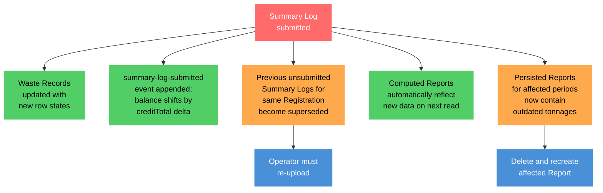
```mermaid
flowchart TD
    classDef trigger fill:#ff6b6b,color:#fff,stroke:none
    classDef stale fill:#ffa94d,color:#000,stroke:none
    classDef auto fill:#51cf66,color:#000,stroke:none
    classDef manual fill:#4a90d9,color:#fff,stroke:none

    T["Summary Log\nsubmitted"]:::trigger

    T --> WR["Waste Records\nupdated with\nnew row states"]:::auto
    T --> WB["summary-log-submitted\nevent appended;\nbalance shifts by\ncreditTotal delta"]:::auto
    T --> PREV["Previous unsubmitted\nSummary Logs for\nsame Registration\nbecome superseded"]:::stale
    T --> RPT_C["Computed Reports\nautomatically reflect\nnew data on next read"]:::auto
    T --> RPT_P["Persisted Reports\nfor affected periods\nnow contain\noutdated tonnages"]:::stale

    PREV --> PREV_FIX["Operator must\nre-upload"]:::manual
    RPT_P --> RPT_FIX["Delete and recreate\naffected Report"]:::manual
```

### PRN lifecycle changes

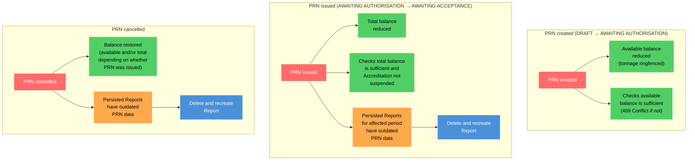
```mermaid
flowchart TD
    classDef trigger fill:#ff6b6b,color:#fff,stroke:none
    classDef stale fill:#ffa94d,color:#000,stroke:none
    classDef auto fill:#51cf66,color:#000,stroke:none
    classDef manual fill:#4a90d9,color:#fff,stroke:none

    subgraph Creation ["PRN created (DRAFT → AWAITING AUTHORISATION)"]
        T1["PRN created"]:::trigger
        T1 --> WB1["Available balance\nreduced\n(tonnage ringfenced)"]:::auto
        T1 --> CHECK1["Checks available\nbalance is sufficient\n(409 Conflict if not)"]:::auto
    end

    subgraph Issue ["PRN issued (AWAITING AUTHORISATION → AWAITING ACCEPTANCE)"]
        T2["PRN issued"]:::trigger
        T2 --> WB2["Total balance\nreduced"]:::auto
        T2 --> CHECK2["Checks total balance\nis sufficient and\nAccreditation not\nsuspended"]:::auto
        T2 --> RPT2["Persisted Reports\nfor affected period\nhave outdated\nPRN data"]:::stale
        RPT2 --> RPT2_FIX["Delete and recreate\nReport"]:::manual
    end

    subgraph Cancel ["PRN cancelled"]
        T3["PRN cancelled"]:::trigger
        T3 --> WB3["Balance restored\n(available and/or total\ndepending on whether\nPRN was issued)"]:::auto
        T3 --> RPT3["Persisted Reports\nhave outdated\nPRN data"]:::stale
        RPT3 --> RPT3_FIX["Delete and recreate\nReport"]:::manual
    end
```

### Accreditation dates changed

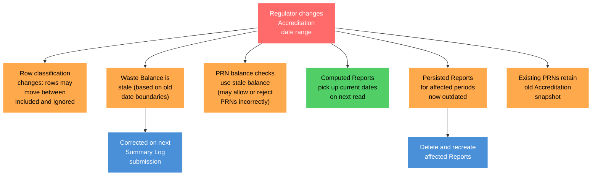
```mermaid
flowchart TD
    classDef trigger fill:#ff6b6b,color:#fff,stroke:none
    classDef stale fill:#ffa94d,color:#000,stroke:none
    classDef auto fill:#51cf66,color:#000,stroke:none
    classDef manual fill:#4a90d9,color:#fff,stroke:none

    T["Regulator changes\nAccreditation\ndate range"]:::trigger

    T --> CLASS["Row classification\nchanges: rows may\nmove between\nIncluded and Ignored"]:::stale
    T --> WB["Waste Balance is\nstale (based on old\ndate boundaries)"]:::stale
    T --> PRN_BAL["PRN balance checks\nuse stale balance\n(may allow or reject\nPRNs incorrectly)"]:::stale
    T --> RPT_C["Computed Reports\npick up current dates\non next read"]:::auto
    T --> RPT_P["Persisted Reports\nfor affected periods\nnow outdated"]:::stale
    T --> PRN_SNAP["Existing PRNs retain\nold Accreditation\nsnapshot"]:::stale

    WB --> WB_FIX["Corrected on next\nSummary Log\nsubmission"]:::manual
    RPT_P --> RPT_FIX["Delete and recreate\naffected Reports"]:::manual
```

### Accreditation suspended

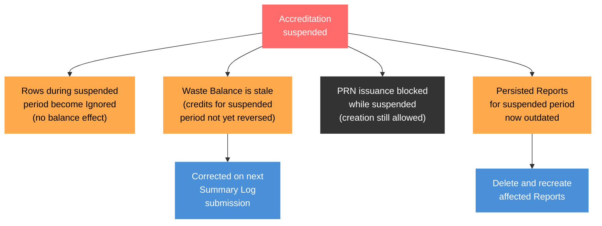
```mermaid
flowchart TD
    classDef trigger fill:#ff6b6b,color:#fff,stroke:none
    classDef stale fill:#ffa94d,color:#000,stroke:none
    classDef auto fill:#51cf66,color:#000,stroke:none
    classDef manual fill:#4a90d9,color:#fff,stroke:none
    classDef blocked fill:#333,color:#fff,stroke:none

    T2["Accreditation\nsuspended"]:::trigger

    T2 --> CLASS["Rows during suspended\nperiod become Ignored\n(no balance effect)"]:::stale
    T2 --> WB["Waste Balance is stale\n(credits for suspended\nperiod not yet reversed)"]:::stale
    T2 --> PRN_BLOCK["PRN issuance blocked\nwhile suspended\n(creation still allowed)"]:::blocked
    T2 --> RPT_P["Persisted Reports\nfor suspended period\nnow outdated"]:::stale

    WB --> WB_FIX["Corrected on next\nSummary Log\nsubmission"]:::manual
    RPT_P --> RPT_FIX["Delete and recreate\naffected Reports"]:::manual
```

### Accreditation granted or removed

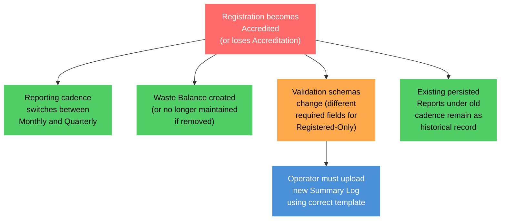
```mermaid
flowchart TD
    classDef trigger fill:#ff6b6b,color:#fff,stroke:none
    classDef stale fill:#ffa94d,color:#000,stroke:none
    classDef auto fill:#51cf66,color:#000,stroke:none
    classDef manual fill:#4a90d9,color:#fff,stroke:none

    T["Registration becomes\nAccredited\n(or loses Accreditation)"]:::trigger

    T --> CADENCE["Reporting cadence\nswitches between\nMonthly and Quarterly"]:::auto
    T --> WB_NEW["Waste Balance created\n(or no longer maintained\nif removed)"]:::auto
    T --> SCHEMA["Validation schemas\nchange (different\nrequired fields for\nRegistered-Only)"]:::stale
    T --> RPT["Existing persisted\nReports under old\ncadence remain as\nhistorical record"]:::auto

    SCHEMA --> SCHEMA_FIX["Operator must upload\nnew Summary Log\nusing correct template"]:::manual
```

### Registration details changed (material, processing type, site address)

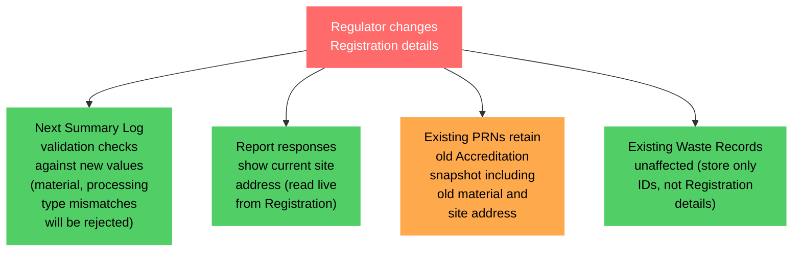
```mermaid
flowchart TD
    classDef trigger fill:#ff6b6b,color:#fff,stroke:none
    classDef stale fill:#ffa94d,color:#000,stroke:none
    classDef auto fill:#51cf66,color:#000,stroke:none
    classDef manual fill:#4a90d9,color:#fff,stroke:none

    T["Regulator changes\nRegistration details"]:::trigger

    T --> VAL["Next Summary Log\nvalidation checks\nagainst new values\n(material, processing\ntype mismatches\nwill be rejected)"]:::auto
    T --> RPT_ADDR["Report responses\nshow current site\naddress (read live\nfrom Registration)"]:::auto
    T --> PRN_SNAP["Existing PRNs retain\nold Accreditation\nsnapshot including\nold material and\nsite address"]:::stale
    T --> WR["Existing Waste Records\nunaffected (store only\nIDs, not Registration\ndetails)"]:::auto
```

### Organisation details changed (name, trading name)

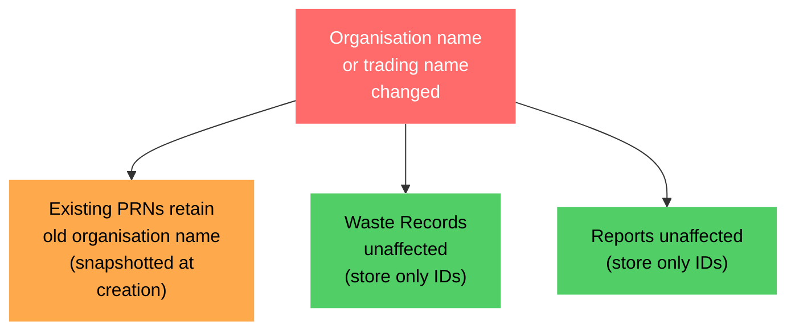
```mermaid
flowchart TD
    classDef trigger fill:#ff6b6b,color:#fff,stroke:none
    classDef stale fill:#ffa94d,color:#000,stroke:none
    classDef auto fill:#51cf66,color:#000,stroke:none

    T["Organisation name\nor trading name\nchanged"]:::trigger

    T --> PRN["Existing PRNs retain\nold organisation name\n(snapshotted at\ncreation)"]:::stale
    T --> WR["Waste Records\nunaffected\n(store only IDs)"]:::auto
    T --> RPT["Reports unaffected\n(store only IDs)"]:::auto
```

### Overseas Reprocessing Site data changed

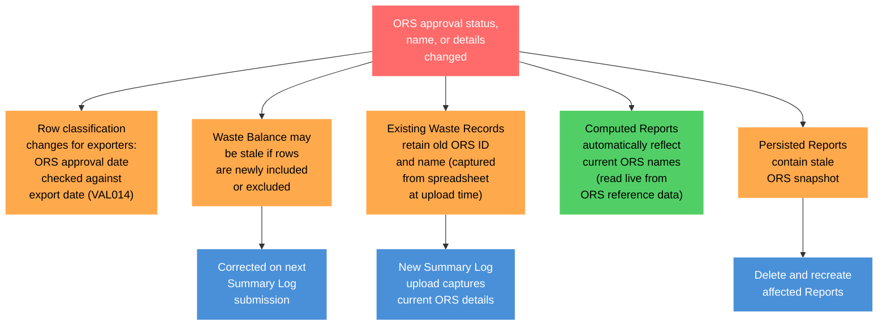
```mermaid
flowchart TD
    classDef trigger fill:#ff6b6b,color:#fff,stroke:none
    classDef stale fill:#ffa94d,color:#000,stroke:none
    classDef auto fill:#51cf66,color:#000,stroke:none
    classDef manual fill:#4a90d9,color:#fff,stroke:none

    T["ORS approval status,\nname, or details\nchanged"]:::trigger

    T --> CLASS["Row classification\nchanges for exporters:\nORS approval date\nchecked against\nexport date (VAL014)"]:::stale
    T --> WB["Waste Balance may\nbe stale if rows\nare newly included\nor excluded"]:::stale
    T --> WR["Existing Waste Records\nretain old ORS ID\nand name (captured\nfrom spreadsheet\nat upload time)"]:::stale
    T --> RPT_C["Computed Reports\nautomatically reflect\ncurrent ORS names\n(read live from\nORS reference data)"]:::auto
    T --> RPT_P["Persisted Reports\ncontain stale\nORS snapshot"]:::stale

    WB --> WB_FIX["Corrected on next\nSummary Log\nsubmission"]:::manual
    WR --> WR_FIX["New Summary Log\nupload captures\ncurrent ORS details"]:::manual
    RPT_P --> RPT_P_FIX["Delete and recreate\naffected Reports"]:::manual
```

### Pending Report blocks submission (VAL012)

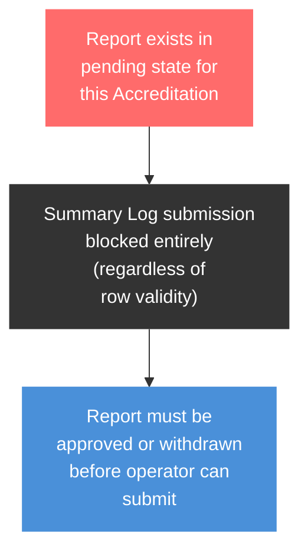
```mermaid
flowchart TD
    classDef trigger fill:#ff6b6b,color:#fff,stroke:none
    classDef blocked fill:#333,color:#fff,stroke:none
    classDef manual fill:#4a90d9,color:#fff,stroke:none

    T["Report exists in\npending state for\nthis Accreditation"]:::trigger

    T --> BLOCK["Summary Log submission\nblocked entirely\n(regardless of\nrow validity)"]:::blocked

    BLOCK --> FIX["Report must be\napproved or withdrawn\nbefore operator can\nsubmit"]:::manual
```

## Invalidation Summary

| Change                            | Waste Records            | Waste Balance                                           | Computed Reports                 | Persisted Reports    | PRNs                   |
| --------------------------------- | ------------------------ | ------------------------------------------------------- | -------------------------------- | -------------------- | ---------------------- |
| **Summary Log submitted**         | Updated (new row states) | Auto-corrected (creditTotal delta)                      | Auto-corrected                   | **Stale** — recreate | —                      |
| **PRN created**                   | —                        | Auto-corrected (ringfence)                              | Auto-corrected                   | —                    | —                      |
| **PRN issued**                    | —                        | Auto-corrected (debit)                                  | Auto-corrected                   | **Stale** — recreate | —                      |
| **PRN cancelled**                 | —                        | Auto-corrected (reversal)                               | Auto-corrected                   | **Stale** — recreate | —                      |
| **Accreditation dates changed**   | Classification changes   | **Stale** until next submission                         | Auto-corrected                   | **Stale** — recreate | Retain old snapshot    |
| **Accreditation suspended**       | Classification changes   | **Stale** until next submission                         | Auto-corrected                   | **Stale** — recreate | Issuance blocked       |
| **Accreditation granted/removed** | Schema changes           | Created or removed                                      | Cadence changes                  | Historical           | —                      |
| **Registration details changed**  | Unaffected (IDs only)    | Unaffected                                              | Site address auto-corrected      | —                    | Retain old snapshot    |
| **Organisation details changed**  | Unaffected (IDs only)    | Unaffected                                              | Unaffected                       | Unaffected           | Retain old snapshot    |
| **ORS data changed**              | Retain old snapshot      | **Stale** until next submission (VAL014 classification) | Auto-corrected (names read live) | **Stale** — recreate | —                      |
| **Pending Report exists**         | —                        | —                                                       | —                                | —                    | — (submission blocked) |

## Key Architectural Insight

The system has three correction mechanisms, each with different latency:

1. **Immediate** — PRN events append to the stream and move the balance straight away.
2. **On next submission** — Each submission re-evaluates all waste records against the current accreditation state and freezes a fresh `creditTotal` snapshot into a new `summary-log-submitted` event. Changes to accreditation dates or suspension status are **not reflected in the waste balance until the operator uploads a new summary log** — they only enter the balance through the next submission's recomputed snapshot.
3. **On read** — Computed reports always aggregate from current waste records, so they self-correct. Persisted reports are snapshots that must be manually deleted and recreated.

**There is no background recalculation.** If a regulator changes accreditation dates and no new summary log is submitted, the waste balance remains incorrect. This also means PRN balance sufficiency checks may use stale figures.

PRNs and waste records deliberately use a **snapshot** pattern for denormalised data (organisation name, accreditation details, ORS names). This preserves what was true at the time of creation for audit purposes, but means these snapshots become stale when upstream entities change.
