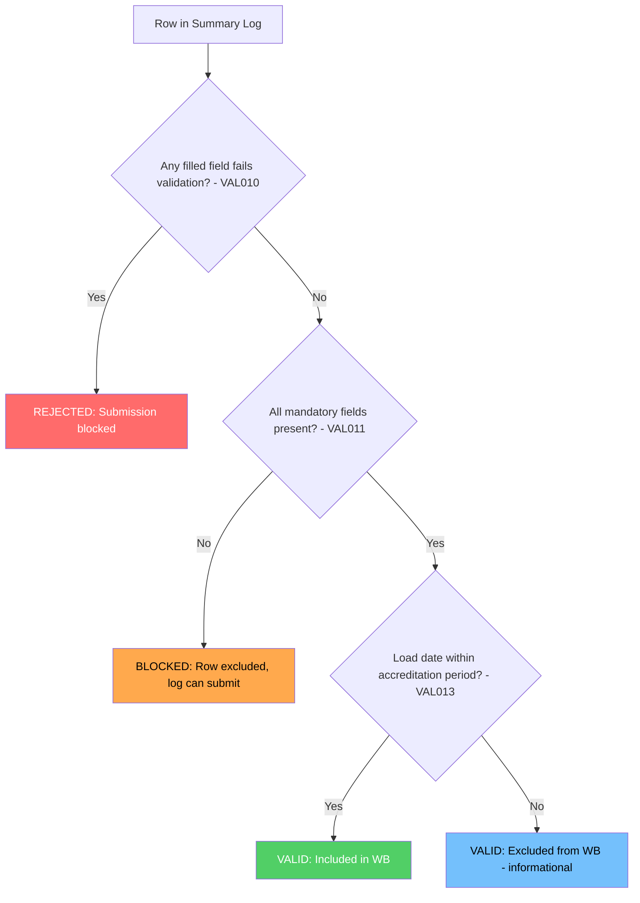

# Summary Log Row Validation Classification

This document describes how individual rows in a Summary Log are classified based on different validation outcomes, and how these classifications affect submission behaviour.

## Overview

When a user uploads a Summary Log, each row undergoes multiple validation checks. The combination of these checks determines whether:

1. The row is included in the submission
2. The row contributes to the Waste Balance calculation
3. The entire Summary Log can be submitted

## Validation Checks

Three independent validation checks apply to each row:

| Check | Reference | What it Validates | Failure Effect |
|-------|-----------|-------------------|----------------|
| **In-Sheet Validation** | VAL010 | Excel template's built-in validation rules on all filled fields | **REJECTED** - blocks entire submission |
| **Mandatory Field Completion** | VAL011 | Whether all mandatory fields have values | **BLOCKED** - row excluded, log can submit |
| **Accreditation Date Range** | VAL013 | Load date falls within accreditation period | **INFORMATIONAL** - row excluded from WB only |

### VAL010: In-Sheet Validation

Applies to **all filled fields**, regardless of whether they are mandatory. If any field contains a value that fails the Excel template's built-in validation rules (e.g. wrong format, out of range, invalid characters), the row is **REJECTED**.

A single rejected row prevents the entire Summary Log from being submitted.

### VAL011: Mandatory Field Completion

Checks whether all mandatory fields have been populated. If any mandatory field is empty, the row is **BLOCKED**.

Blocked rows are excluded from the submission, but the Summary Log itself can still be submitted. The "Check Before You Submit" screen displays blocked rows to inform the user.

### VAL013: Accreditation Date Range

Validates that the load date in the row falls within the accreditation period. This is **informational only** - there is no pass/fail rejection.

Rows where the load date falls outside the accreditation period are excluded from the Waste Balance calculation, but the row is still valid and included in the submission.

## Row Classification Matrix

All possible combinations of validation outcomes:

| # | Mandatory Fields | Filled Fields Validation | Load Date in Accreditation Period | Row Outcome | WB Calc | Summary Log |
|---|-----------------|-------------------------|-----------------------------------|-------------|---------|-------------|
| 1 | ✅ All present | ✅ All pass | ✅ Within period | **VALID** | ✅ Included | ✅ Can submit |
| 2 | ✅ All present | ✅ All pass | ❌ Outside period | **VALID** | ❌ Excluded | ✅ Can submit |
| 3 | ✅ All present | ❌ Some fail | ✅ Within period | **REJECTED** | N/A | ❌ Blocked |
| 4 | ✅ All present | ❌ Some fail | ❌ Outside period | **REJECTED** | N/A | ❌ Blocked |
| 5 | ❌ Some missing | ✅ All pass | ✅ Within period | **BLOCKED** | N/A | ✅ Can submit |
| 6 | ❌ Some missing | ✅ All pass | ❌ Outside period | **BLOCKED** | N/A | ✅ Can submit |
| 7 | ❌ Some missing | ❌ Some fail | ✅ Within period | **REJECTED** | N/A | ❌ Blocked |
| 8 | ❌ Some missing | ❌ Some fail | ❌ Outside period | **REJECTED** | N/A | ❌ Blocked |

## Outcome Summary

| Outcome | Meaning | Caused by | Effect on Summary Log |
|---------|---------|-----------|----------------------|
| **VALID** | Row complete and all values valid | Passes VAL010 + VAL011 | ✅ Included in submission |
| **BLOCKED** | Row incomplete but no validation errors | Fails VAL011 only | ✅ Row excluded, log submits |
| **REJECTED** | One or more filled values fail validation | Fails VAL010 | ❌ Entire submission blocked |

## Decision Flowchart

## Validation Hierarchy

The checks are evaluated in order of severity:

1. **VAL010 (In-Sheet Validation)** - Checked first. If any filled field fails validation, the row is immediately classified as REJECTED. No further checks matter.

2. **VAL011 (Mandatory Field Completion)** - Checked second. If VAL010 passes but mandatory fields are missing, the row is BLOCKED.

3. **VAL013 (Accreditation Date Range)** - Checked last, only for rows that pass VAL010 and VAL011. Determines whether the valid row contributes to the Waste Balance calculation.

## Related Requirements

| Validation | Wireframe Reference | Jira |
|------------|---------------------|------|
| VAL010 | WR14 | PAE-472 |
| VAL011 | WR18, WR19, WR20 | PAE-475, PAE-476, PAE-477 |
| VAL013 | TBD | TBD |

## Additional Context

### VAL012: Report in Progress

Whilst not a row-level validation, VAL012 (WR33) prevents Summary Log submission entirely if there is a Monthly Report in a "pending" state (any state prior to "Approved") against the same accreditation.

This check occurs before row-level validation and will reject the submission attempt regardless of row validity.
