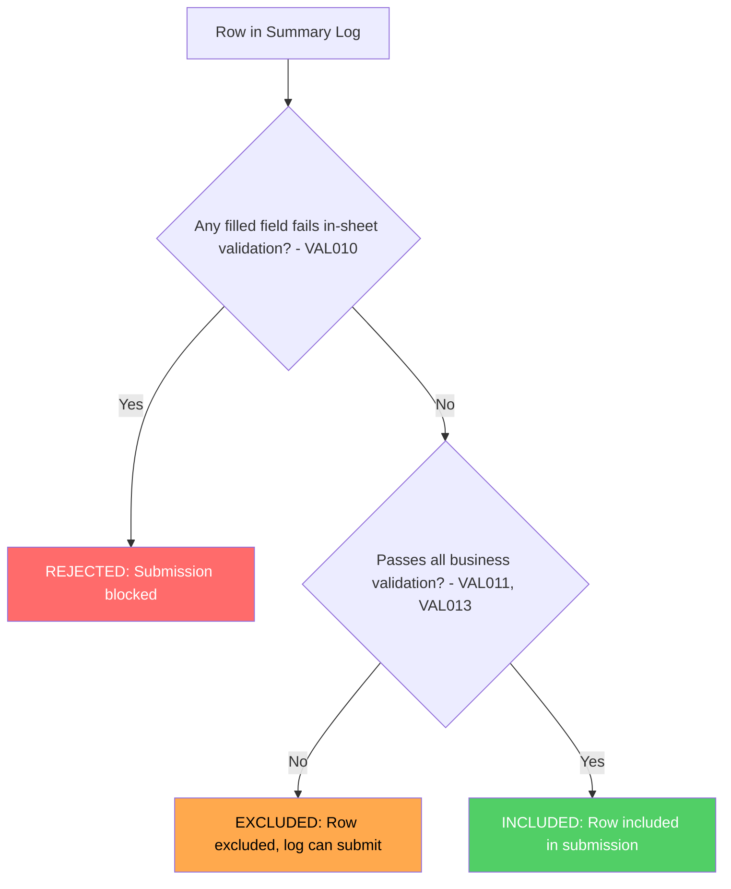

# Summary Log Row Validation Classification

This document describes how individual rows in a Summary Log are classified based on different validation outcomes, and how these classifications affect submission behaviour.

## Overview

When a user uploads a Summary Log, each row undergoes multiple validation checks. The combination of these checks determines whether:

1. The row is included in the submission
2. The entire Summary Log can be submitted

## Validation Categories

Two categories of validation apply to each row:

| Category | References | What it Validates | Failure Effect |
|----------|------------|-------------------|----------------|
| **In-Sheet Validation** | VAL010 | Excel template's built-in validation rules on all filled fields | **REJECTED** - blocks entire submission |
| **Business Validation** | VAL011, VAL013 | Mandatory field completion and business rules (e.g. accreditation date range) | **EXCLUDED** - row excluded, log can submit |

### In-Sheet Validation (VAL010)

Applies to **all filled fields**, regardless of whether they are mandatory. If any field contains a value that fails the Excel template's built-in validation rules (e.g. wrong format, out of range, invalid characters), the row is **REJECTED**.

A single rejected row prevents the entire Summary Log from being submitted.

### Business Validation (VAL011, VAL013)

Covers business rules that determine whether a row can be included in the submission:

- **VAL011 (Mandatory Field Completion)** - All mandatory fields must have values
- **VAL013 (Accreditation Date Range)** - Load date must fall within the accreditation period

Rows failing any business validation are **EXCLUDED** from the submission, but the Summary Log itself can still be submitted. The "Check Before You Submit" screen displays excluded rows to inform the user.

There is no distinction made between different types of business validation failure - all result in the row being excluded.

## Row Classification Matrix

| # | In-Sheet Validation | Business Validation | Row Outcome | Summary Log |
|---|---------------------|---------------------|-------------|-------------|
| 1 | ✅ All pass | ✅ All pass | **INCLUDED** | ✅ Can submit |
| 2 | ✅ All pass | ❌ Some fail | **EXCLUDED** | ✅ Can submit |
| 3 | ❌ Some fail | ✅ All pass | **REJECTED** | ❌ Blocked |
| 4 | ❌ Some fail | ❌ Some fail | **REJECTED** | ❌ Blocked |

## Outcome Summary

| Outcome | Meaning | Caused by | Effect on Summary Log |
|---------|---------|-----------|----------------------|
| **INCLUDED** | Row passes all validation | Passes VAL010 + business validation | ✅ Included in submission |
| **EXCLUDED** | Row fails business validation but no in-sheet errors | Fails VAL011 or VAL013 | ✅ Row excluded, log submits |
| **REJECTED** | One or more filled values fail in-sheet validation | Fails VAL010 | ❌ Entire submission blocked |

## Decision Flowchart

## Validation Hierarchy

The checks are evaluated in order of severity:

1. **In-Sheet Validation (VAL010)** - Checked first. If any filled field fails validation, the row is immediately classified as REJECTED. No further checks matter.

2. **Business Validation (VAL011, VAL013)** - Checked second. If in-sheet validation passes but any business rule fails, the row is EXCLUDED.

## Related Requirements

| Validation | Wireframe Reference | Jira |
|------------|---------------------|------|
| VAL010 | WR14 | PAE-472 |
| VAL011 | WR18, WR19, WR20 | PAE-475, PAE-476, PAE-477 |
| VAL013 | TBD | TBD |

## Additional Context

### VAL012: Report in Progress

Whilst not a row-level validation, VAL012 (WR33) prevents Summary Log submission entirely if there is a Monthly Report in a "pending" state (any state prior to "Approved") against the same accreditation.

This check occurs before row-level validation and will reject the submission attempt regardless of row validity.
