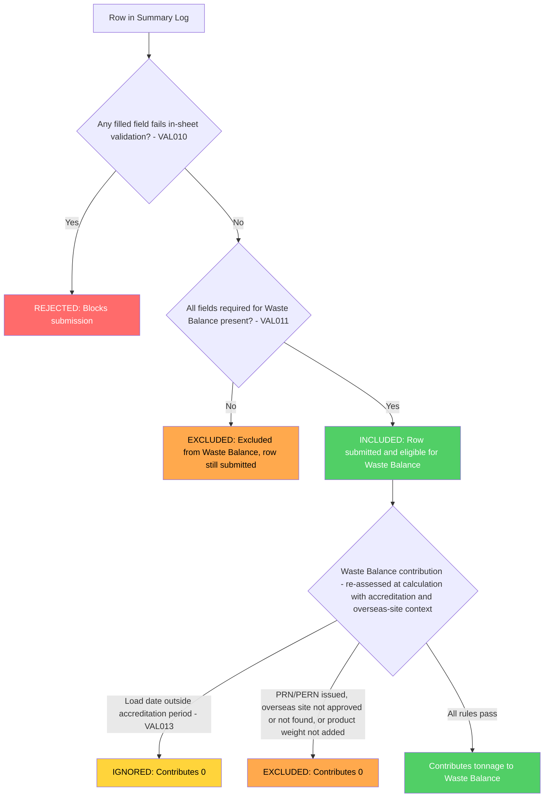

# Summary Log Row Validation Classification

This document describes how individual rows in a Summary Log are classified during validation, and how that classification — together with the later Waste Balance calculation — affects the Waste Balance and submission behaviour.

## Overview

When a user uploads a Summary Log, each row is assessed in two distinct stages:

1. **Row classification** happens during upload validation. It gives every row one of three outcomes — **REJECTED**, **EXCLUDED** or **INCLUDED** — and decides whether the row blocks submission.
2. **Waste Balance contribution** happens later, when the Waste Balance is calculated. This stage has context that row classification does not — the accreditation period and overseas-site approval state — so an INCLUDED row can still be held back here and contribute nothing. A row held back at this stage is **EXCLUDED** or **IGNORED**.

Every row that is not REJECTED is included in the submission. Whether such a row then contributes to the Waste Balance is decided separately, at calculation time.

## Validation Categories

Three groups of checks apply to a row. The first two run during row classification; the third runs during the Waste Balance calculation.

| Category                             | References                        | What it Validates                                                                        | Failure Effect                                                                                                             |
| ------------------------------------ | --------------------------------- | ---------------------------------------------------------------------------------------- | -------------------------------------------------------------------------------------------------------------------------- |
| **In-Sheet Validation**              | VAL010                            | Excel template's built-in validation rules on all filled fields                          | **REJECTED** - blocks entire submission                                                                                    |
| **Required-Field Validation**        | VAL011                            | All fields required for the Waste Balance are present                                    | **EXCLUDED** - row excluded from the Waste Balance, but included in submission                                             |
| **Waste Balance Contribution Rules** | VAL013 and related business rules | Accreditation date range, PRN/PERN status, overseas-site approval, product-weight opt-in | **IGNORED** or **EXCLUDED** at calculation time - row contributes nothing to the Waste Balance, but included in submission |

### In-Sheet Validation (VAL010)

Applies to **all filled fields**, regardless of whether they are mandatory. If any field contains a value that fails the Excel template's built-in validation rules (e.g. wrong format, out of range, invalid characters), the row is **REJECTED**.

A single rejected row prevents the entire Summary Log from being submitted.

### Required-Field Validation (VAL011)

Checks that every field required for the Waste Balance has a value. A row that passes in-sheet validation but is missing one or more required fields is **EXCLUDED** from the Waste Balance, but is still included in the submission. The "Check Before You Submit" screen displays excluded rows to inform the user.

This is the only business rule applied during row classification. The remaining business rules need accreditation and overseas-site context that is not available at upload time, so they are deferred to the Waste Balance calculation.

### Waste Balance Contribution Rules (VAL013 and related)

When the Waste Balance is calculated, each INCLUDED row is re-assessed with the accreditation period and overseas-site approval state applied. A row contributes its tonnage only if it passes every rule; otherwise it carries a specific reason and contributes nothing:

| Reason                         | Outcome  | Description                                                                                                       |
| ------------------------------ | -------- | ----------------------------------------------------------------------------------------------------------------- |
| `OUTSIDE_ACCREDITATION_PERIOD` | IGNORED  | The load date falls outside the accreditation period (VAL013). Applies to exporters and reprocessors.             |
| `MISSING_REQUIRED_FIELD`       | EXCLUDED | A field required for the Waste Balance is absent (the same check as VAL011).                                      |
| `PRN_ISSUED`                   | EXCLUDED | A PRN or PERN has already been issued for the waste. Applies to exporters.                                        |
| `ORS_NOT_APPROVED`             | EXCLUDED | The overseas reprocessing site was not approved as at the date of export. Applies to exporters.                   |
| `ORS_NOT_FOUND`                | EXCLUDED | The OSR_ID is not one of the registration's overseas sites, so no approval can be resolved. Applies to exporters. |
| `PRODUCT_WEIGHT_NOT_ADDED`     | EXCLUDED | The reprocessed load was not opted in to the product-weight calculation. Applies to reprocessors.                 |

Each exclusion or ignore carries a specific reason - there is no single, undifferentiated "business validation failure".

These rules are evaluated in order, and the first one to fail decides the outcome. The accreditation-period check (IGNORED) is evaluated before the PRN/PERN, overseas-site and product-weight checks (EXCLUDED), so a row that is both outside the accreditation period and would fail one of those rules is IGNORED.

## Row Classification Matrix

The **Row Outcome** column is decided at upload (row classification); the **Waste Balance** column is decided later, at calculation time (contribution). Rows 4 and 5 are INCLUDED at upload and only resolve to Ignored or Excluded once the accreditation and overseas-site context is applied.

| #   | In-Sheet (VAL010) | Required fields (VAL011) | Waste Balance rules (VAL013, PRN/PERN, overseas site, product weight)                    | Row Outcome  | Waste Balance  | Summary Log   |
| --- | ----------------- | ------------------------ | ---------------------------------------------------------------------------------------- | ------------ | -------------- | ------------- |
| 1   | ❌ Some fail      | -                        | -                                                                                        | **REJECTED** | N/A            | ❌ Blocked    |
| 2   | ✅ All pass       | ❌ Some missing          | -                                                                                        | **EXCLUDED** | ❌ Excluded    | ✅ Can submit |
| 3   | ✅ All pass       | ✅ All present           | ✅ All pass                                                                              | **INCLUDED** | ✅ Contributes | ✅ Can submit |
| 4   | ✅ All pass       | ✅ All present           | ❌ Load date outside accreditation period                                                | **INCLUDED** | ⚠️ Ignored     | ✅ Can submit |
| 5   | ✅ All pass       | ✅ All present           | ❌ PRN/PERN issued, overseas site not approved or not found, or product weight not added | **INCLUDED** | ❌ Excluded    | ✅ Can submit |

## Outcome Summary

| Outcome      | Meaning                                                                                                                                                                                                       | Caused by                                                                                   | Waste Balance    | Submission           |
| ------------ | ------------------------------------------------------------------------------------------------------------------------------------------------------------------------------------------------------------- | ------------------------------------------------------------------------------------------- | ---------------- | -------------------- |
| **INCLUDED** | Row passes classification and every Waste Balance rule                                                                                                                                                        | Passes VAL010 + required fields present + Waste Balance rules pass                          | ✅ Contributes   | ✅ Included          |
| **EXCLUDED** | Row passes in-sheet validation but is held back from the Waste Balance, at classification (missing required fields) or at calculation (PRN/PERN issued, overseas site not approved, product weight not added) | VAL011, or `PRN_ISSUED` / `ORS_NOT_APPROVED` / `ORS_NOT_FOUND` / `PRODUCT_WEIGHT_NOT_ADDED` | ❌ Excluded      | ✅ Included          |
| **IGNORED**  | Row passes in-sheet validation and has the required fields, but its load date falls outside the accreditation period                                                                                          | VAL013 (`OUTSIDE_ACCREDITATION_PERIOD`)                                                     | ⚠️ Contributes 0 | ✅ Included          |
| **REJECTED** | One or more filled values fail in-sheet validation                                                                                                                                                            | Fails VAL010                                                                                | N/A              | ❌ Blocks submission |

## Decision Flowchart

```mermaid
flowchart TD
    A[Row in Summary Log] --> B{Any filled field fails in-sheet validation? - VAL010}

    B -->|Yes| REJECTED["REJECTED: Blocks submission"]
    B -->|No| C{All fields required for Waste Balance present? - VAL011}

    C -->|No| EXCLUDED["EXCLUDED: Excluded from Waste Balance, row still submitted"]
    C -->|Yes| INCLUDED["INCLUDED: Row submitted and eligible for Waste Balance"]

    INCLUDED --> WB{"Waste Balance contribution - re-assessed at calculation with accreditation and overseas-site context"}

    WB -->|Load date outside accreditation period - VAL013| IGNORED["IGNORED: Contributes 0"]
    WB -->|PRN/PERN issued, overseas site not approved or not found, or product weight not added| EXCL2["EXCLUDED: Contributes 0"]
    WB -->|All rules pass| CONTRIB["Contributes tonnage to Waste Balance"]

    style REJECTED fill:#ff6b6b,color:#fff
    style EXCLUDED fill:#ffa94d,color:#000
    style EXCL2 fill:#ffa94d,color:#000
    style IGNORED fill:#ffd43b,color:#000
    style INCLUDED fill:#51cf66,color:#fff
    style CONTRIB fill:#51cf66,color:#fff
```

## Validation Hierarchy

The checks are evaluated across the two stages:

1. **In-Sheet Validation (VAL010)** - Checked first, during row classification. If any filled field fails validation, the row is immediately classified as REJECTED. No further checks matter.

2. **Required-Field Validation (VAL011)** - Checked second, during row classification. If in-sheet validation passes but a field required for the Waste Balance is missing, the row is EXCLUDED from the Waste Balance but still included in the submission.

3. **Waste Balance Contribution Rules (VAL013 and related)** - Checked later, during the Waste Balance calculation, when the accreditation period and overseas-site approval state are available. An INCLUDED row whose load date falls outside the accreditation period is IGNORED; one that fails another rule (PRN/PERN issued, overseas site not approved or not found, product weight not added) is EXCLUDED. Either way it contributes 0 to the Waste Balance and remains in the submission.

## Related Requirements

| Validation | Wireframe Reference | Jira                      | Status          |
| ---------- | ------------------- | ------------------------- | --------------- |
| VAL010     | WR14                | PAE-472                   | Implemented     |
| VAL011     | WR18, WR19, WR20    | PAE-475, PAE-476, PAE-477 | Implemented     |
| VAL012     | WR33                | -                         | Not implemented |
| VAL013     | -                   | -                         | Implemented     |

## Additional Context

### VAL012: Report in Progress (not yet implemented)

VAL012 (WR33) is a planned check that would prevent Summary Log submission entirely while a Monthly Report is in a "pending" state (any state prior to "Approved") against the same accreditation.

It is **not implemented** in the backend. The behaviour described here is the intended design, not current behaviour; today no Monthly Report state blocks Summary Log submission.
