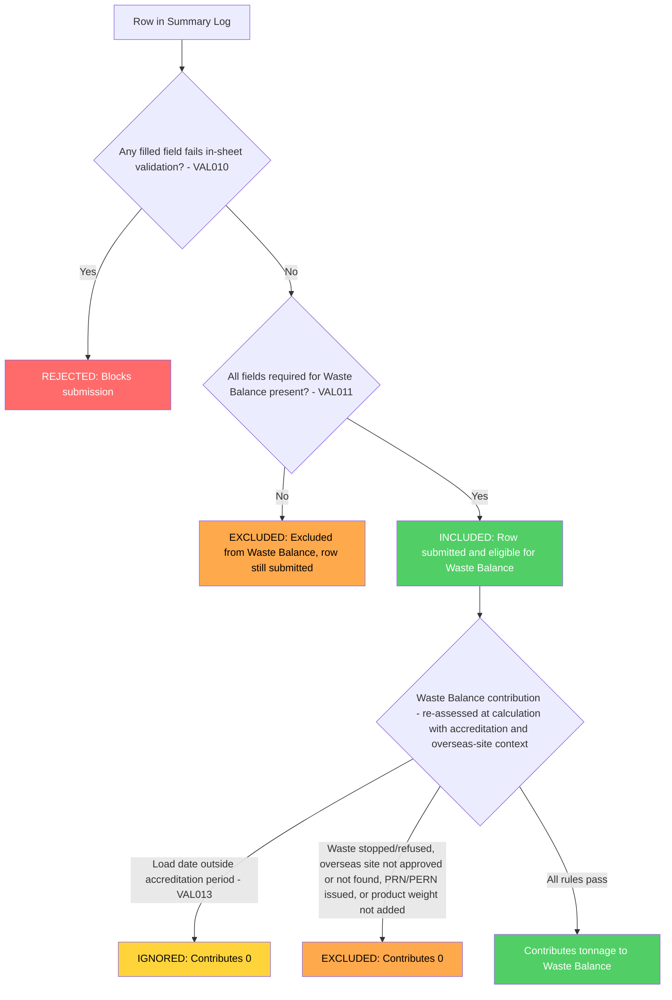

# Summary Log Row Validation Classification

This document describes how individual rows in a Summary Log are classified during validation, and how that classification — together with the later Waste Balance calculation — affects the Waste Balance and submission behaviour.

## Overview

When a user uploads a Summary Log, each row is assessed in two distinct stages:

1. **Row classification** happens during upload validation. It gives every row one of three outcomes — **REJECTED**, **EXCLUDED** or **INCLUDED** — and decides whether the row blocks submission.
2. **Waste Balance contribution** happens later, when the Waste Balance is calculated. This stage has context that row classification does not — the accreditation period and overseas-site approval state — so an INCLUDED row can still be held back here and contribute nothing. A row held back at this stage is **EXCLUDED** or **IGNORED**.

Every row that is not REJECTED is included in the submission. Whether such a row then contributes to the Waste Balance is decided separately, at calculation time.

> **Scope.** This document covers the rules that decide a row's outcome and its Waste Balance contribution. It does **not** cover the separate **report-creation completeness gate**, which blocks creating a Monthly Report when mandatory contact and traceability fields are missing anywhere in the Summary Log. Those rules are a different set with a different purpose (regulatory completeness rather than tonnage computability) and are documented in [Report Creation Mandatory Fields](report-creation-mandatory-fields.md).

## Validation Categories

Three groups of checks apply to a row. The first two run during row classification; the third runs during the Waste Balance calculation.

| Category                             | References                        | What it Validates                                                                                                  | Failure Effect                                                                                                             |
| ------------------------------------ | --------------------------------- | ------------------------------------------------------------------------------------------------------------------ | -------------------------------------------------------------------------------------------------------------------------- |
| **In-Sheet Validation**              | VAL010                            | Excel template's built-in validation rules on all filled fields                                                    | **REJECTED** - blocks entire submission                                                                                    |
| **Required-Field Validation**        | VAL011                            | All fields required for the Waste Balance are present                                                              | **EXCLUDED** - row excluded from the Waste Balance, but included in submission                                             |
| **Waste Balance Contribution Rules** | VAL013 and related business rules | Accreditation date range, waste stopped or refused, overseas-site approval, PRN/PERN status, product-weight opt-in | **IGNORED** or **EXCLUDED** at calculation time - row contributes nothing to the Waste Balance, but included in submission |

### In-Sheet Validation (VAL010)

Applies to **all filled fields**, regardless of whether they are mandatory. If any field contains a value that fails the Excel template's built-in validation rules (e.g. wrong format, out of range, invalid characters), the row is **REJECTED**.

A single rejected row prevents the entire Summary Log from being submitted.

### Required-Field Validation (VAL011)

Checks that every field required for the Waste Balance has a value. A row that passes in-sheet validation but is missing one or more required fields is **EXCLUDED** from the Waste Balance, but is still included in the submission. The "Check Before You Submit" screen displays excluded rows to inform the user.

This is the only business rule applied during row classification. The remaining business rules need accreditation and overseas-site context that is not available at upload time, so they are deferred to the Waste Balance calculation.

### Waste Balance Contribution Rules (VAL013 and related)

When the Waste Balance is calculated, each INCLUDED row is re-assessed with the accreditation period and overseas-site approval state applied. A row contributes its tonnage only if it passes every rule; otherwise it carries a specific reason and contributes nothing:

| Reason                         | Outcome  | Applies to                                         | Description                                                                                          |
| ------------------------------ | -------- | -------------------------------------------------- | ---------------------------------------------------------------------------------------------------- |
| `MISSING_REQUIRED_FIELD`       | EXCLUDED | All contributing sections                          | A field required for the Waste Balance is absent (the same check as VAL011).                         |
| `OUTSIDE_ACCREDITATION_PERIOD` | IGNORED  | All contributing sections                          | The load date falls outside the accreditation period (VAL013).                                       |
| `WASTE_STOPPED`                | EXCLUDED | Accredited exporters                               | The load was recorded as stopped, so the export never completed and its tonnage is not counted.      |
| `WASTE_REFUSED`                | EXCLUDED | Accredited exporters                               | The load was recorded as refused, so the export never completed and its tonnage is not counted.      |
| `ORS_NOT_FOUND`                | EXCLUDED | Accredited exporters                               | The OSR_ID is not one of the registration's overseas sites, so no approval can be resolved (VAL015). |
| `ORS_NOT_APPROVED`             | EXCLUDED | Accredited exporters                               | The overseas reprocessing site was not approved as at the date of export (VAL014).                   |
| `PRN_ISSUED`                   | EXCLUDED | Accredited exporters, accredited reprocessor input | A PRN or PERN has already been issued for the waste.                                                 |
| `PRODUCT_WEIGHT_NOT_ADDED`     | EXCLUDED | Accredited reprocessor output                      | The reprocessed load was not opted in to the product-weight calculation.                             |

Each exclusion or ignore carries a specific reason - there is no single, undifferentiated "business validation failure".

Not every section is subject to these rules. Only the sections that feed the Waste Balance are re-assessed here; sections that never contribute by design (for example the exporter "Sent on" section, or the reprocessor "Processed" section on an input template) are reported separately with the `TEMPLATE_SECTION_DOES_NOT_CONTRIBUTE_TO_WASTE_BALANCE` reason rather than as a data problem. See the note below.

These rules are evaluated in order, and the first one to fail decides the outcome. For an accredited exporter load the order is: missing required fields (EXCLUDED), then accreditation period (IGNORED), then waste stopped, waste refused, overseas site not found, overseas site not approved and PRN/PERN issued (all EXCLUDED). The accreditation-period check (IGNORED) is always evaluated before the EXCLUDED checks, so a row that is both outside the accreditation period and would also fail one of those rules is IGNORED. Reprocessor sections apply the subset relevant to their template (see the "Applies to" column).

## Row Classification Matrix

The **Row Outcome** column is decided at upload (row classification); the **Waste Balance** column is decided later, at calculation time (contribution). Rows 4 and 5 are INCLUDED at upload and only resolve to Ignored or Excluded once the accreditation and overseas-site context is applied.

| #   | In-Sheet (VAL010) | Required fields (VAL011) | Waste Balance rules (VAL013, waste stopped/refused, overseas site, PRN/PERN, product weight)                    | Row Outcome  | Waste Balance  | Summary Log   |
| --- | ----------------- | ------------------------ | --------------------------------------------------------------------------------------------------------------- | ------------ | -------------- | ------------- |
| 1   | ❌ Some fail      | -                        | -                                                                                                               | **REJECTED** | N/A            | ❌ Blocked    |
| 2   | ✅ All pass       | ❌ Some missing          | -                                                                                                               | **EXCLUDED** | ❌ Excluded    | ✅ Can submit |
| 3   | ✅ All pass       | ✅ All present           | ✅ All pass                                                                                                     | **INCLUDED** | ✅ Contributes | ✅ Can submit |
| 4   | ✅ All pass       | ✅ All present           | ❌ Load date outside accreditation period                                                                       | **INCLUDED** | ⚠️ Ignored     | ✅ Can submit |
| 5   | ✅ All pass       | ✅ All present           | ❌ Waste stopped/refused, overseas site not approved or not found, PRN/PERN issued, or product weight not added | **INCLUDED** | ❌ Excluded    | ✅ Can submit |

## Outcome Summary

| Outcome      | Meaning                                                                                                                                                                                                                                              | Caused by                                                                                                                       | Waste Balance    | Submission           |
| ------------ | ---------------------------------------------------------------------------------------------------------------------------------------------------------------------------------------------------------------------------------------------------- | ------------------------------------------------------------------------------------------------------------------------------- | ---------------- | -------------------- |
| **INCLUDED** | Row passes classification and every Waste Balance rule                                                                                                                                                                                               | Passes VAL010 + required fields present + Waste Balance rules pass                                                              | ✅ Contributes   | ✅ Included          |
| **EXCLUDED** | Row passes in-sheet validation but is held back from the Waste Balance, at classification (missing required fields) or at calculation (waste stopped or refused, overseas site not approved or not found, PRN/PERN issued, product weight not added) | VAL011, or `WASTE_STOPPED` / `WASTE_REFUSED` / `ORS_NOT_FOUND` / `ORS_NOT_APPROVED` / `PRN_ISSUED` / `PRODUCT_WEIGHT_NOT_ADDED` | ❌ Excluded      | ✅ Included          |
| **IGNORED**  | Row passes in-sheet validation and has the required fields, but its load date falls outside the accreditation period                                                                                                                                 | VAL013 (`OUTSIDE_ACCREDITATION_PERIOD`)                                                                                         | ⚠️ Contributes 0 | ✅ Included          |
| **REJECTED** | One or more filled values fail in-sheet validation                                                                                                                                                                                                   | Fails VAL010                                                                                                                    | N/A              | ❌ Blocks submission |

## Decision Flowchart

```mermaid
flowchart TD
    A[Row in Summary Log] --> B{Any filled field fails in-sheet validation? - VAL010}

    B -->|Yes| REJECTED["REJECTED: Blocks submission"]
    B -->|No| C{All fields required for Waste Balance present? - VAL011}

    C -->|No| EXCLUDED["EXCLUDED: Excluded from Waste Balance, row still submitted"]
    C -->|Yes| INCLUDED["INCLUDED: Row submitted and eligible for Waste Balance"]

    INCLUDED --> WB{"Waste Balance contribution - re-assessed at calculation with accreditation and overseas-site context"}

    WB -->|Load date outside accreditation period - VAL013| IGNORED["IGNORED: Contributes 0"]
    WB -->|Waste stopped/refused, overseas site not approved or not found, PRN/PERN issued, or product weight not added| EXCL2["EXCLUDED: Contributes 0"]
    WB -->|All rules pass| CONTRIB["Contributes tonnage to Waste Balance"]

    style REJECTED fill:#ff6b6b,color:#fff
    style EXCLUDED fill:#ffa94d,color:#000
    style EXCL2 fill:#ffa94d,color:#000
    style IGNORED fill:#ffd43b,color:#000
    style INCLUDED fill:#51cf66,color:#fff
    style CONTRIB fill:#51cf66,color:#fff
```

## Validation Hierarchy

The checks are evaluated across the two stages:

1. **In-Sheet Validation (VAL010)** - Checked first, during row classification. If any filled field fails validation, the row is immediately classified as REJECTED. No further checks matter.

2. **Required-Field Validation (VAL011)** - Checked second, during row classification. If in-sheet validation passes but a field required for the Waste Balance is missing, the row is EXCLUDED from the Waste Balance but still included in the submission.

3. **Waste Balance Contribution Rules (VAL013 and related)** - Checked later, during the Waste Balance calculation, when the accreditation period and overseas-site approval state are available. An INCLUDED row whose load date falls outside the accreditation period is IGNORED; one that fails another rule (waste stopped or refused, overseas site not approved or not found, PRN/PERN issued, product weight not added) is EXCLUDED. Either way it contributes 0 to the Waste Balance and remains in the submission.

## Related Requirements

| Validation | Wireframe Reference | Jira                      | Status          |
| ---------- | ------------------- | ------------------------- | --------------- |
| VAL010     | WR14                | PAE-472                   | Implemented     |
| VAL011     | WR18, WR19, WR20    | PAE-475, PAE-476, PAE-477 | Implemented     |
| VAL012     | WR33                | -                         | Not implemented |
| VAL013     | -                   | -                         | Implemented     |
| VAL014     | -                   | -                         | Implemented     |
| VAL015     | -                   | PAE-1647                  | Implemented     |

## Additional Context

### VAL012: Report in Progress (not yet implemented)

VAL012 (WR33) is a planned check that would prevent Summary Log submission entirely while a Monthly Report is in a "pending" state (any state prior to "Approved") against the same accreditation.

It is **not implemented** in the backend. The behaviour described here is the intended design, not current behaviour; today no Monthly Report state blocks Summary Log submission.

### VAL014 and VAL015: Overseas reprocessing site checks (exporters)

For exporters, each load names an OSR_ID that must resolve to one of the registration's overseas reprocessing sites, and that site must be approved as at the date of export. These are two separate checks with distinct reasons:

- **VAL014 (`ORS_NOT_APPROVED`)** - the OSR_ID resolves to a registered overseas site, but its approval does not yet cover the date of export (the site has no approval date, or one later than the export date). This is a timing failure; the site is known, it is simply not approved at that point in time.
- **VAL015 (`ORS_NOT_FOUND`)** - the OSR_ID is not one of the registration's overseas sites at all, so there is no site against which to resolve approval. This is a membership failure, typically a data-entry error in the OSR_ID rather than an approval-timing issue.

Both exclude the row from the Waste Balance at calculation time while leaving it in the submission. Splitting them lets the "Check Before You Submit" screen distinguish "this site is not yet approved" from "this OSR_ID is not recognised", which call for different operator action.

### Waste stopped or refused (exporters)

Accredited exporter loads carry two yes/no columns recording whether the waste was stopped or refused after being received for export. When either is answered "yes" the export never completed, so the load contributes nothing to the Waste Balance and the row is EXCLUDED with the `WASTE_STOPPED` or `WASTE_REFUSED` reason. These two checks are evaluated after the accreditation-period check and before the overseas-site and PRN/PERN checks, so a stopped or refused load is reported as such rather than as an overseas-site problem the operator cannot act on. Neither carries a VAL requirement code. They apply only to the accredited exporter template.

### By-design non-contributing sections (`TEMPLATE_SECTION_DOES_NOT_CONTRIBUTE_TO_WASTE_BALANCE`)

Some template sections never feed the Waste Balance by design rather than because of a data problem: for example the exporter "Sent on" section, the reprocessor "Processed" section on an input template, and every section of the registered-only templates. Rows in these sections are not run through the contribution rules above. Instead they are reported with the `TEMPLATE_SECTION_DOES_NOT_CONTRIBUTE_TO_WASTE_BALANCE` reason, which distinguishes "this section is not part of the balance" from a row that was assessed and excluded for missing data. This keeps the "Check Before You Submit" figures honest: these rows are not counted as data failures.
