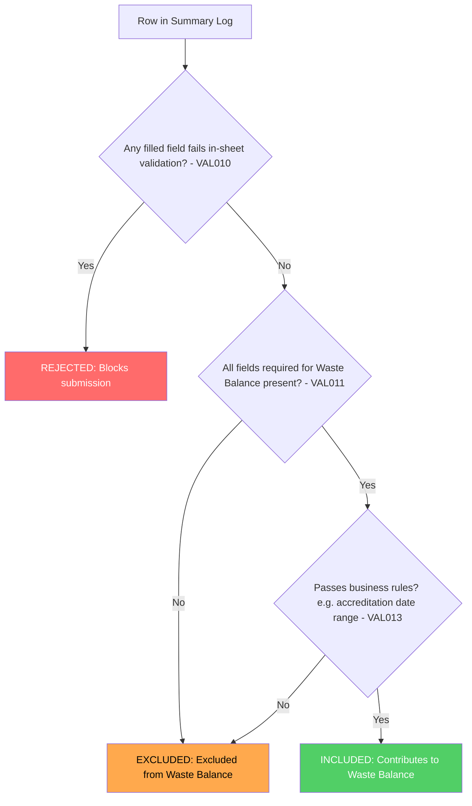

# Summary Log Row Validation Classification

This document describes how individual rows in a Summary Log are classified based on different validation outcomes, and how these classifications affect the Waste Balance calculation and submission behaviour.

## Overview

When a user uploads a Summary Log, each row undergoes multiple validation checks. The combination of these checks determines:

1. Whether the row is included in the Waste Balance calculation
2. Whether the entire Summary Log can be submitted

All rows that pass in-sheet validation are included in the submission. The INCLUDED/EXCLUDED classification determines whether they contribute to the Waste Balance.

## Validation Categories

Two categories of validation apply to each row:

| Category | References | What it Validates | Failure Effect |
|----------|------------|-------------------|----------------|
| **In-Sheet Validation** | VAL010 | Excel template's built-in validation rules on all filled fields | **REJECTED** - blocks entire submission |
| **Business Validation** | VAL011, VAL013 | Fields required for Waste Balance and business rules (e.g. accreditation date range) | **EXCLUDED** - row excluded from Waste Balance, but included in submission |

### In-Sheet Validation (VAL010)

Applies to **all filled fields**, regardless of whether they are mandatory. If any field contains a value that fails the Excel template's built-in validation rules (e.g. wrong format, out of range, invalid characters), the row is **REJECTED**.

A single rejected row prevents the entire Summary Log from being submitted.

### Business Validation (VAL011, VAL013)

Covers business rules that determine whether a row contributes to the Waste Balance:

- **VAL011 (Fields Required for Waste Balance)** - All fields required for Waste Balance must have values
- **VAL013 (Accreditation Date Range)** - Load date must fall within the accreditation period

Rows failing any business validation are **EXCLUDED** from the Waste Balance calculation, but are still included in the submission. The "Check Before You Submit" screen displays excluded rows to inform the user.

There is no distinction made between different types of business validation failure - all result in the row being excluded from the Waste Balance.

## Row Classification Matrix

| # | In-Sheet Validation | Business Validation | Row Outcome | Waste Balance | Summary Log |
|---|---------------------|---------------------|-------------|---------------|-------------|
| 1 | ✅ All pass | ✅ All pass | **INCLUDED** | ✅ Contributes | ✅ Can submit |
| 2 | ✅ All pass | ❌ Some fail | **EXCLUDED** | ❌ Excluded | ✅ Can submit |
| 3 | ❌ Some fail | ✅ All pass | **REJECTED** | N/A | ❌ Blocked |
| 4 | ❌ Some fail | ❌ Some fail | **REJECTED** | N/A | ❌ Blocked |

## Outcome Summary

| Outcome | Meaning | Caused by | Waste Balance | Submission |
|---------|---------|-----------|---------------|------------|
| **INCLUDED** | Row passes all validation | Passes VAL010 + business validation | ✅ Contributes | ✅ Included |
| **EXCLUDED** | Row fails business validation but no in-sheet errors | Fails VAL011 or VAL013 | ❌ Excluded | ✅ Included |
| **REJECTED** | One or more filled values fail in-sheet validation | Fails VAL010 | N/A | ❌ Blocks submission |

## Decision Flowchart

## Validation Hierarchy

The checks are evaluated in order of severity:

1. **In-Sheet Validation (VAL010)** - Checked first. If any filled field fails validation, the row is immediately classified as REJECTED. No further checks matter.

2. **Business Validation (VAL011, VAL013)** - Checked second. If in-sheet validation passes but any business rule fails, the row is EXCLUDED from the Waste Balance but still included in the submission.

## Related Requirements

| Validation | Wireframe Reference | Jira |
|------------|---------------------|------|
| VAL010 | WR14 | PAE-472 |
| VAL011 | WR18, WR19, WR20 | PAE-475, PAE-476, PAE-477 |
| VAL013 | TBD | TBD |

## Additional Context

### VAL012: Report in Progress

Whilst not a row-level validation, VAL012 (WR33) prevents Summary Log submission entirely if there is a Monthly Report in a "pending" state (any state prior to "Approved") against the same accreditation.

This check occurs before row-level validation and will reject the submission attempt regardless of row validity.
