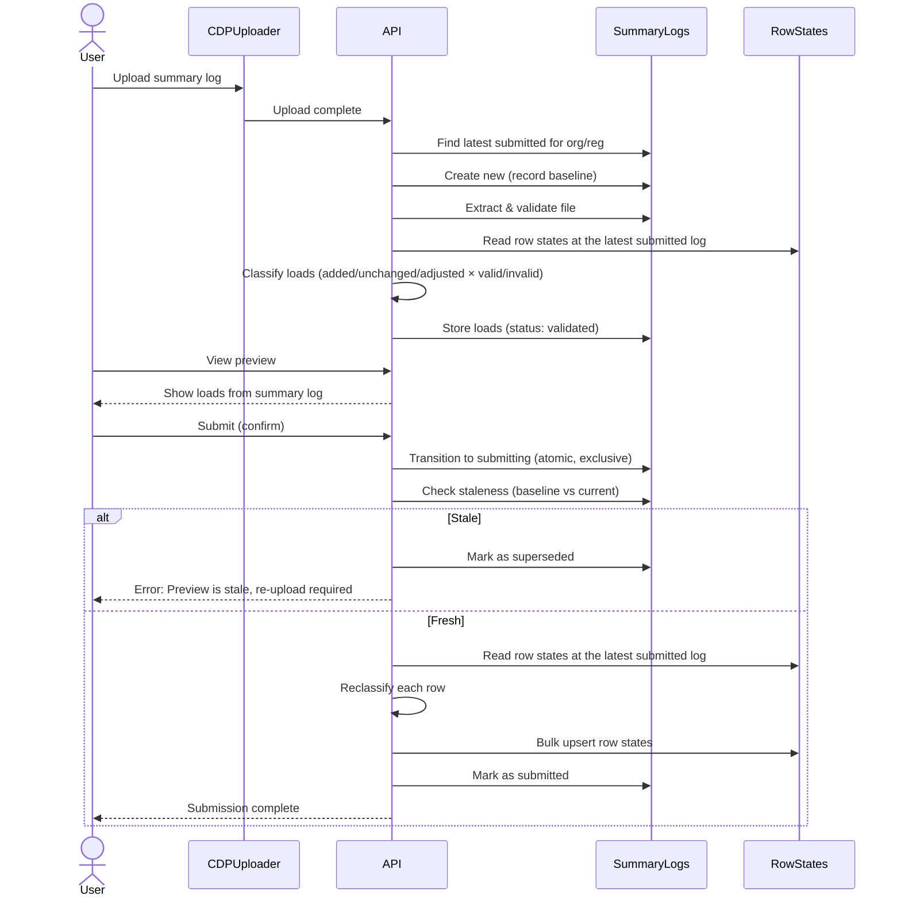
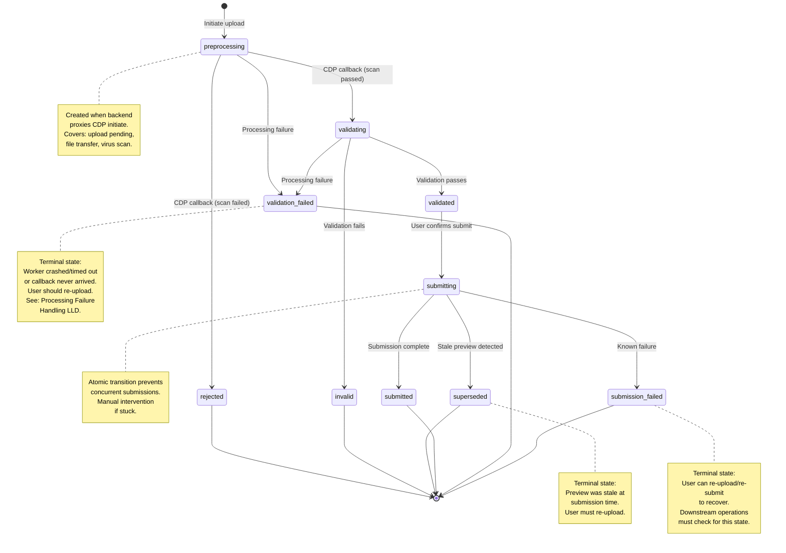
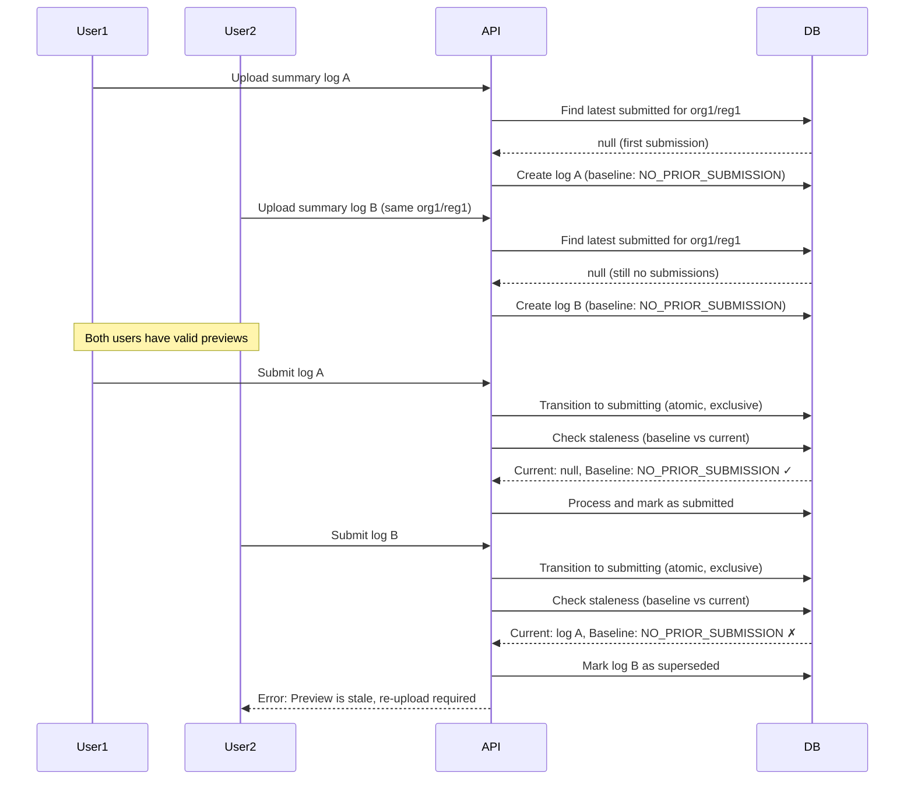
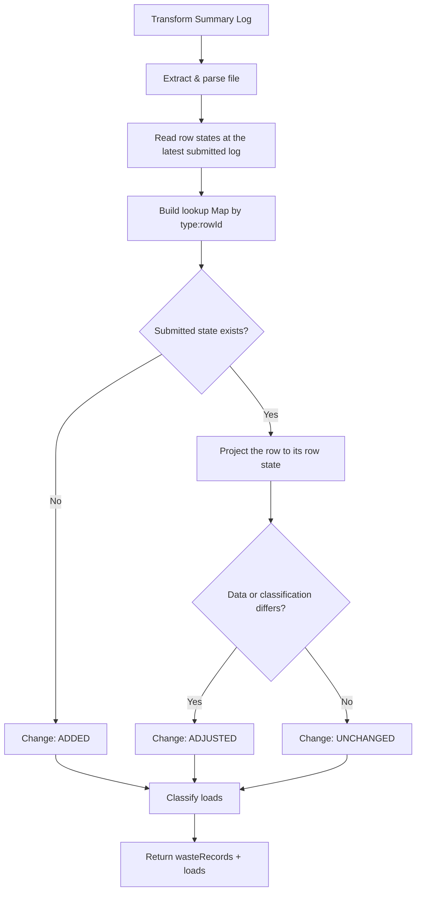
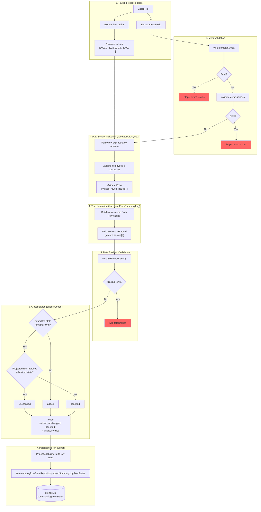
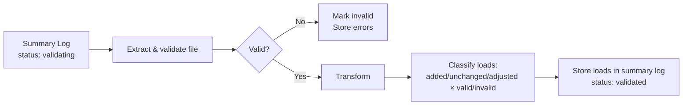
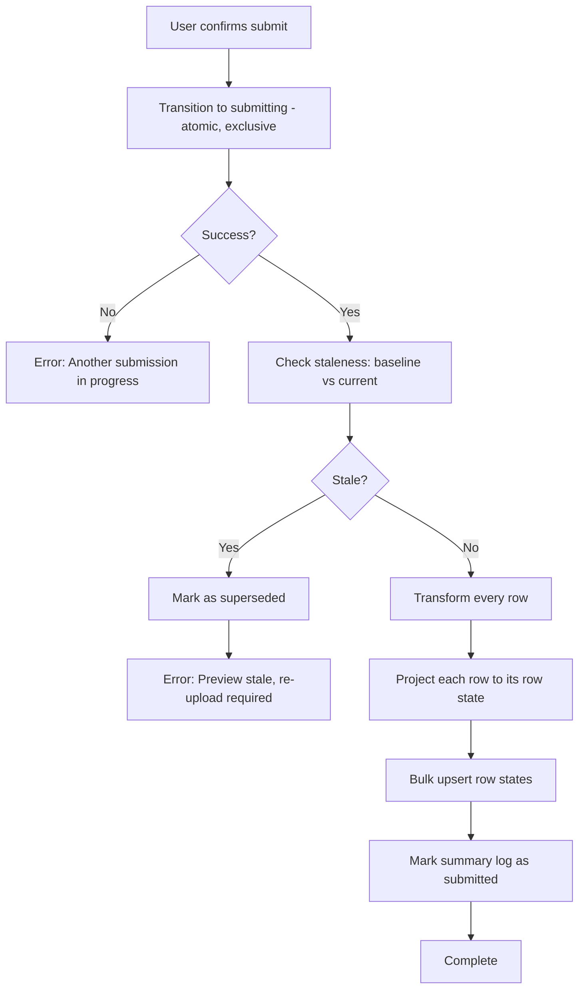

# Summary Log Submission: Low Level Design

This document describes the implementation approach for submitting summary logs with idempotent operations and retry mechanisms.

For related context, see:

- [ADR 21: Idempotent Operations and Retry Mechanisms for Resilient Data Processing](../decisions/0021-idempotent-operations-and-retry-mechanisms.md)
- [Summary Log Processing Failure Handling LLD](./summary-log-processing-failure-handling.md) - handling failures during upload/validation phase

<!-- prettier-ignore-start -->
<!-- TOC -->
* [Summary Log Submission: Low Level Design](#summary-log-submission-low-level-design)
  * [Project scope](#project-scope)
    * [Functional requirements](#functional-requirements)
    * [Non-functional requirements](#non-functional-requirements)
  * [Technical approach](#technical-approach)
    * [Overall workflow](#overall-workflow)
    * [Summary log status transitions](#summary-log-status-transitions)
    * [Deferred staleness detection](#deferred-staleness-detection)
    * [Repository port design](#repository-port-design)
    * [Shared transformation logic](#shared-transformation-logic)
    * [Row transformation detail](#row-transformation-detail)
    * [Validation phase](#validation-phase)
    * [Submission phase](#submission-phase)
    * [MongoDB adapter implementation](#mongodb-adapter-implementation)
  * [Incremental delivery](#incremental-delivery)
    * [Phase 1: Core submission (MVP)](#phase-1-core-submission-mvp)
    * [Phase 2: Robust retry mechanism](#phase-2-robust-retry-mechanism)
    * [Phase 3: Detectable failure handling](#phase-3-detectable-failure-handling)
    * [Recommended approach](#recommended-approach)
<!-- TOC -->

<!-- prettier-ignore-end -->

## Project scope

### Functional requirements

1. Accept summary log uploads containing up to 15,000 waste records
2. Validate uploaded data and calculate preview statistics (created/updated/unchanged records) and summary
3. Allow users to review preview before confirming submission
4. Submit validated data by recording the submitted state of every row
5. Prevent concurrent submissions for the same organisation/registration pair
6. Detect and reject stale previews at submission time

### Non-functional requirements

1. **Scale**: Process up to 15,000 waste records per summary log
2. **Performance**: Complete submission within reasonable time
3. **Consistency**: Avoid ambiguous state in production to reduce need for accessing sensitive data during investigation
4. **Resilience**: Recover from partial failures through idempotent retry mechanisms
5. **Operational clarity**: Clear status transitions and error states for support investigation
6. **MongoDB constraints**: Work within 16MB transaction size limit and 60 second transaction time limit

## Technical approach

### Overall workflow



### Summary log status transitions



### Deferred staleness detection

Multiple validated summary logs can coexist for the same organisation/registration pair. Staleness is detected at submission time by comparing the baseline (recorded when the summary log was created) to the current latest submitted log.



**Key operations:**

On upload, record the baseline (latest submitted log at upload time):

```javascript
// Find the latest submitted summary log for this org/reg
const latestSubmitted = await findLatestSubmittedForOrgReg(
  organisationId,
  registrationId
)

// Record the baseline when creating the summary log
const summaryLog = {
  // ... other fields
  validatedAgainstSummaryLogId: latestSubmitted?.id ?? NO_PRIOR_SUBMISSION
}
```

On submit, atomically transition and check staleness:

```javascript
// 1. Atomically transition to submitting (fails if another submission in progress)
const result = await transitionToSubmittingExclusive(summaryLogId)
if (!result.success) {
  throw Boom.conflict('Another submission is in progress. Please try again.')
}

// 2. Check staleness
const currentLatest = await findLatestSubmittedForOrgReg(
  organisationId,
  registrationId
)
const baseline = summaryLog.validatedAgainstSummaryLogId
const current = currentLatest?.id ?? NO_PRIOR_SUBMISSION

if (baseline !== current) {
  // Mark as superseded - stale preview cannot be resubmitted
  await update(summaryLogId, { status: 'superseded' })
  throw Boom.conflict(
    'Waste records have changed since preview was generated. Please re-upload.'
  )
}

// 3. Proceed with submission
```

**Rationale:**

- Never blocks uploads - users can always start a new upload
- Multiple users can work on previews simultaneously
- Staleness detected at submission time, not on upload
- Stale previews marked as `superseded` - cannot be resubmitted
- Atomic transition prevents concurrent submissions for the same org/reg
- Clear error messages guide users to re-upload

### Repository port design

The operations the submission path uses from the row states repository, plus the row history read the same documents serve (the port also carries a read the CSV export uses to compose its dynamic header):

```javascript
interface SummaryLogRowStateRepository {
  // Write a whole submission's row states, returning the resulting state per entry
  upsertSummaryLogRowStates(ledgerId, entries: SummaryLogRowStateEntry[],
                            summaryLogId): Promise<SummaryLogRowState[]>

  // Read the row states a ledger holds at one submission
  findRowStatesForSummaryLog(ledgerId, summaryLogId): Promise<SummaryLogRowState[]>

  // Read every state ever recorded for one row identity
  findRowHistory(organisationId, registrationId, rowId, wasteRecordType): Promise<SummaryLogRowState[]>
}
```

**Rationale:**

- Application layer: business logic (classification, change detection)
- Repository layer: persistence (deduplication against existing states, bulk operations)
- `ledgerId` is `(organisationId, registrationId, accreditationId)` — the same identity the waste balance ledger uses, so a row state cannot drift from the balance it contributed to
- The whole submission goes in one call, so a submission costs one round trip rather than one per row
- Reads are keyed either by submission (what this log reported) or by row identity (how one row has changed over time)

### Shared transformation logic

Both validation and submission use identical transformation logic to ensure deterministic results.



**Load classification:**

Each row is classified on two dimensions:

1. **Change type** (comparison against the latest submitted log's row states):
   - `added` - No submitted state for this row identity
   - `adjusted` - A submitted state exists, but its data or its classification differs
   - `unchanged` - A submitted state exists and both its data and its classification match

2. **Validity** (based on validation issues):
   - `valid` - No validation issues
   - `invalid` - Has validation issues

Result structure:

```javascript
loads: {
  added: {
    valid: { count: number, rowIds: string[] },    // rowIds truncated at 100
    invalid: { count: number, rowIds: string[] }
  },
  unchanged: { valid: { count, rowIds }, invalid: { count, rowIds } },
  adjusted: { valid: { count, rowIds }, invalid: { count, rowIds } }
}
```

**Rationale:**

- Single source of truth for transformation logic
- Both phases use identical code path - no divergence possible
- The comparison uses the same projection the write deduplicates on, so a row the preview calls unchanged is one the write folds onto its existing state — with one gap: the write's identity also covers the template the row reported under, so a registration that switches template between logs writes a new state for a row the preview called unchanged
- Anchoring to the latest submitted log, rather than to whatever was written last, keeps a failed or raced earlier write from showing up as a phantom adjustment
- Returns both waste records (for submission) and loads (for preview)
- Recalculation prevents possiblity of partially-stored preview data

### Row transformation detail

The following diagram shows the journey a single row takes from the spreadsheet through validation and transformation to become a persisted row state:



**Key data structures through the pipeline:**

| Stage       | Structure              | Key Fields                                                                          |
| ----------- | ---------------------- | ----------------------------------------------------------------------------------- |
| Parsing     | Raw row                | `[value1, value2, ...]` array matching header order                                 |
| Data Syntax | `ValidatedRow`         | `{ values: {ROW_ID, DATE_RECEIVED, ...}, rowId, issues[] }`                         |
| Transform   | `ValidatedWasteRecord` | `{ record: WasteRecord, issues[] }`                                                 |
| Classify    | `Loads`                | `{ added: {valid, invalid}, unchanged: {...}, adjusted: {...} }`                    |
| Persist     | `SummaryLogRowState`   | `{ wasteRecordType, rowId, processingType, data, classification, summaryLogIds[] }` |

**Issue attachment flow:**

Issues are attached to rows during data syntax validation and flow through transformation:

1. `validateDataSyntax` validates each row and attaches issues to create `ValidatedRow`
2. `transformFromSummaryLog` preserves issues when creating `ValidatedWasteRecord`
3. `classifyLoads` uses `issues.length` to determine valid/invalid counts
4. Issues are stored in the summary log for user feedback

This design eliminates the need to correlate issues back to rows by location after the fact.

### Validation phase

During validation, classify loads and calculate counts for user review:



**Key points:**

- Loads stored in summary log: `{ loads: { added: {valid: {count, rowIds}, invalid: {count, rowIds}}, unchanged: {...}, adjusted: {...} } }`
- Full waste records NOT stored (would exceed 16MB for 15k records, or could be partially stored if split up)
- User views preview page showing the stored `loads`

### Submission phase

After user confirms preview, persist the changes:



**Key points:**

- Uses same transformation logic as validation phase
- Atomic transition prevents concurrent submissions for same org/reg
- Staleness check compares baseline (`validatedAgainstSummaryLogId`) to current latest submitted
- Stale previews marked as `superseded` - user must re-upload
- Bulk operation handles up to 15k records efficiently
- On failure, leaves in 'submitting' state for recovery

**Idempotency implementation:**

There is no idempotency check to run. A row state's identity is its ledger identity plus its row identity plus a hash of its content, so re-running a submission upserts onto the documents it wrote the first time and re-adds a summary log id already in the set. The write is idempotent by construction rather than by inspection.

```javascript
// Identity of a row state — also the unique index the upsert filters on
const identityFilter = {
  organisationId,
  registrationId,
  accreditationId,
  rowId,
  wasteRecordType,
  contentHash // sha256 over { processingType, data, classification }
}
```

### MongoDB adapter implementation

The adapter writes the whole submission as one `bulkWrite` of content-addressed upserts:

```javascript
// For each projected row state:
{
  updateOne: {
    filter: identityFilter, // the unique index fields above
    update: {
      // Identity fields materialise from the filter on insert, so they stay
      // out of $setOnInsert to avoid the filter/setOnInsert path conflict
      $setOnInsert: { processingType, data, classification },
      $addToSet: { summaryLogIds: summaryLogId }
    },
    upsert: true
  }
}

// Execute with: bulkWrite(ops, { ordered: false })
```

**Key MongoDB operations:**

- `$setOnInsert`: Content written once, on the insert that creates the state
- `$addToSet`: Record this submission in the state's membership without duplicating it
- `upsert: true`: Create the state document if this content has not been reported before
- `ordered: false`: Continue processing if one operation fails
- Unique index on the identity fields: concurrent writers converge on one document, because MongoDB retries the upsert against the winning insert rather than surfacing a duplicate key error

**Implementation notes:**

1. `data` and `classification` are never rewritten once stored, and `summaryLogIds` only grows — a stored state is what was submitted, and stays that way
2. A row's history is every state document carrying its `(organisationId, registrationId, rowId, wasteRecordType)`, served by the `row_history` index
3. Loads stored in summary log: `{ loads: { added: {valid: {count, rowIds}, invalid: {count, rowIds}}, unchanged: {...}, adjusted: {...} } }`
4. The write is one `bulkWrite` plus one read-back however many rows a submission carries, rather than a round trip per row. The operation list and the read-back still grow with the rows, so memory above 15k rows is worth watching
5. Multiple validated logs can coexist - staleness checked at submission time
6. Baseline (`validatedAgainstSummaryLogId`) recorded at upload time, compared to current at submission
7. The `superseded` status is a terminal state for stale previews (no further transitions allowed)
8. Atomic `transitionToSubmittingExclusive` prevents concurrent submissions via MongoDB unique partial index

## Incremental delivery

### Phase 1: Core submission (MVP)

**Goal**: Deliver basic submission workflow with clear error states

**Scope**:

- Deferred staleness detection at submission time
- Atomic transition to `submitting` prevents concurrent submissions
- Two-phase workflow (validate/preview + submit)
- Idempotent row state writes
- Summary log status transitions: `preprocessing` → `validating` → `validated` → `submitting` → `submitted`
- `superseded` state for stale previews detected at submission
- Manual recovery for stuck submissions (left in `submitting` state)

**Benefits**:

- Never blocks uploads - users can always start new uploads
- Multiple users can work on previews simultaneously
- Stale previews detected and rejected at submission time
- Prevents concurrent submission race conditions
- Handles 15k+ records efficiently
- Safe retry on failure

**Limitations**:

- All errors require manual intervention
- No distinction between failure types
- No automated recovery

**Delivery risk**: Low - well-defined scope, no external dependencies

---

### Phase 2: Robust retry mechanism

**Goal**: Handle transient failures automatically

**Scope**:

- Add message queue for submission processing
- Implement retry logic with exponential backoff
- Dead Letter Queue (DLQ) for exhausted retries
- Monitoring and alerting for DLQ items

**Benefits**:

- Automatic recovery for transient failures
- Reduced manual intervention
- Better visibility into failure patterns
- No domain changes - purely infrastructure enhancement

**Dependencies**:

- Phase 1 complete
- Queue infrastructure provisioned

**Delivery risk**: Medium - additional infrastructure complexity, but no domain changes

---

### Phase 3: Detectable failure handling

**Goal**: Enable user self-service recovery for detectable failures

**Scope**:

- Add `submission_failed` terminal state
- Transition to `submission_failed` for detectable failures where we can update the summary log state
- Distinct from infrastructure failures (e.g. MongoDB connectivity issues) that leave the log stuck in `submitting`
- Clear error messages to guide user to re-upload/re-submit
- Update downstream operations to check for `submission_failed` state

**Benefits**:

- Minimal - persistent failures are unlikely to be fixable by users, and transient failures are handled in Phase 2
- Improved UX - users can fix and retry themselves
- Reduced support burden for detectable failure scenarios
- Better operational clarity (stuck in `submitting` vs marked as `submission_failed`)

**Dependencies**:

- Phase 1 complete
- Downstream operations updated (e.g. PRN issuance checks)

**Delivery risk**: Low - clear scope, but requires coordination with downstream operations

---

### Recommended approach

1. **Start with Phase 1** - delivers core value, low risk
2. **Implement Phase 2 (Queue)** - purely infrastructure, no domain changes, handles transient failures and automatic retries
3. **Evaluate Phase 3 based on data**:
   - If unfixable, detectable failures are common and causing support burden → implement `submission_failed` state
   - Phase 3 can be skipped if most failures are transient (handled by Phase 2)

**Note**: Phase 2 and Phase 3 are independent and could be delivered in parallel if desired. Phase 2 is simpler (infrastructure only) whilst Phase 3 requires coordination with downstream operations.

This approach balances delivering value early whilst learning from production behaviour before committing to complex recovery mechanisms.
