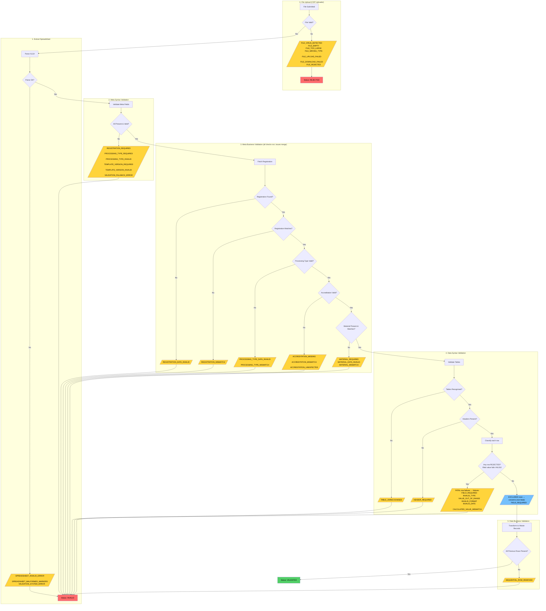

# Summary Log Validation Failure Codes

This document provides a complete reference for all validation failure codes that can appear in the `failures` array of a summary log validation response.

For the response format specification, see [ADR 20: Summary Log Validation Output Formats](../decisions/0020-summary-log-validation-output-formats.md).

<!-- prettier-ignore-start -->
<!-- TOC -->

- [Summary Log Validation Failure Codes](#summary-log-validation-failure-codes)
  - [Overview](#overview)
  - [`code` and `errorCode`](#code-and-errorcode)
  - [Validation pipeline flowchart](#validation-pipeline-flowchart)
  - [File upload failures (CDP Uploader rejection)](#file-upload-failures-cdp-uploader-rejection)
  - [Meta-level validation failures (FATAL severity)](#meta-level-validation-failures-fatal-severity)
    - [Meta syntax validation](#meta-syntax-validation)
    - [Meta business validation](#meta-business-validation)
  - [Data-level FATAL failures](#data-level-fatal-failures)
    - [Structural failures (before row validation)](#structural-failures-before-row-validation)
    - [Rejected-row failures (VAL010)](#rejected-row-failures-val010)
    - [Data business failure](#data-business-failure)
  - [System failures](#system-failures)
  - [Key behaviours](#key-behaviours)
    <!-- TOC -->
    <!-- prettier-ignore-end -->

## Overview

Summary log validation uses a **short-circuit strategy**: each validation level must pass before the next runs. This means the frontend will only ever see failures from one level at a time.

There are two distinct failure groupings in the HTTP response:

- **`failures`** - Fatal errors that block submission (this document)
- **`concerns`** - Row-level issues grouped by table (see [Summary Log Row Validation Classification](./summary-log-row-validation-classification.md))

These are mutually exclusive: if `failures` contains any items, `concerns` will be empty.

## `code` and `errorCode`

Every issue — whether in `failures` or in `concerns` — carries two code fields:

- **`code`** — the broad category listed throughout this document (for example `INVALID_TYPE`, `HEADER_REQUIRED`).
- **`errorCode`** — the specific, copy-ready reason the frontend translates into user-facing text (for example `MUST_BE_A_NUMBER`, `MUST_BE_VALID_EWC_CODE`, `NET_WEIGHT_CALCULATION_MISMATCH`). It is always present: where an issue has no more specific reason, `errorCode` falls back to the value of `code`.

For row-level data failures the broad `code` values `INVALID_TYPE`, `VALUE_OUT_OF_RANGE`, `INVALID_FORMAT`, `INVALID_DATE` and `CALCULATED_VALUE_MISMATCH` are **deprecated**. They are retained for backward compatibility, but the specific `errorCode` is the source of truth — see the `@deprecated` markers on the `VALIDATION_CODE` enum and [ADR 20](../decisions/0020-summary-log-validation-output-formats.md). New frontend logic should branch on `errorCode`, not `code`.

## Validation pipeline flowchart

## File upload failures (CDP Uploader rejection)

These failures occur before validation begins, when CDP Uploader rejects the file. The summary log status becomes `rejected`.

| Code                   | Trigger                            |
| ---------------------- | ---------------------------------- |
| `FILE_VIRUS_DETECTED`  | File contains a virus              |
| `FILE_EMPTY`           | File is empty                      |
| `FILE_TOO_LARGE`       | File exceeds size limit            |
| `FILE_WRONG_TYPE`      | Wrong file type (not xlsx etc.)    |
| `FILE_UPLOAD_FAILED`   | Upload to CDP failed               |
| `FILE_DOWNLOAD_FAILED` | Could not download from CDP        |
| `FILE_REJECTED`        | Fallback for unknown upload errors |

## Meta-level validation failures (FATAL severity)

These failures occur during validation of the spreadsheet's metadata (Cover sheet). The summary log status becomes `invalid`.

### Meta syntax validation

Validates that required meta fields are present and have valid formats:

| Code                        | Trigger                                 |
| --------------------------- | --------------------------------------- |
| `REGISTRATION_REQUIRED`     | Missing registration number in metadata |
| `PROCESSING_TYPE_REQUIRED`  | Missing processing type in metadata     |
| `PROCESSING_TYPE_INVALID`   | Invalid processing type value           |
| `TEMPLATE_VERSION_REQUIRED` | Missing template version                |
| `TEMPLATE_VERSION_INVALID`  | Invalid/unsupported template version    |
| `VALIDATION_FALLBACK_ERROR` | Unmapped Joi validation type            |

### Meta business validation

Validates that meta field values match the registration data. The four meta-business checks — registration number, processing type, accreditation and material — all run and their issues are merged, so a single upload can return more than one meta-business code at once. The arrows in the flowchart show the execution order, not a short-circuit between checks.

| Code                           | Trigger                                               |
| ------------------------------ | ----------------------------------------------------- |
| `REGISTRATION_DATA_INVALID`    | Registration lookup failed                            |
| `REGISTRATION_MISMATCH`        | Registration does not match the one on the upload URL |
| `PROCESSING_TYPE_DATA_INVALID` | Processing type lookup failed                         |
| `PROCESSING_TYPE_MISMATCH`     | Processing type does not match registration           |
| `ACCREDITATION_MISSING`        | Required accreditation number missing                 |
| `ACCREDITATION_MISMATCH`       | Accreditation does not match                          |
| `ACCREDITATION_UNEXPECTED`     | Accreditation provided but not expected               |
| `MATERIAL_REQUIRED`            | Material missing or not a recognised material type    |
| `MATERIAL_DATA_INVALID`        | Registration holds an invalid material                |
| `MATERIAL_MISMATCH`            | Material does not match registration's material       |

## Data-level FATAL failures

Data-level validation has structural checks, per-row validation, and a data-business check. Whether a data issue is fatal is determined by the **row outcome**, not by the code:

- A row is **REJECTED** when any filled value fails the row schema (VAL010). Every issue on a rejected row is fatal and goes to `failures`; a single rejected row makes the whole summary log `invalid`.
- A row is **EXCLUDED** when its filled values are valid but a field required for the Waste Balance is missing (VAL011). These issues are non-fatal and go to `concerns` — see [Summary Log Row Validation Classification](./summary-log-row-validation-classification.md).

`FIELD_REQUIRED` is therefore the one code that can appear in either grouping: fatal when a `.required()` schema field is absent from a rejected row, non-fatal when a Waste Balance field is missing from an excluded row. The remaining row codes below only ever appear as fatal failures, because any failed value forces the row to be rejected. ROW_ID has no dedicated fatal check — it is validated through the row schema like any other field.

### Structural failures (before row validation)

| Code                 | Trigger                                  |
| -------------------- | ---------------------------------------- |
| `TABLE_UNRECOGNISED` | Unknown table name / no schema for table |
| `HEADER_REQUIRED`    | Missing required column header           |

### Rejected-row failures (VAL010)

Each fatal row failure carries a specific `errorCode` identifying the exact rule that failed; the broad `code` is one of the deprecated values described above.

| Code                        | Trigger                                                   | Example `errorCode`                                                                                               |
| --------------------------- | --------------------------------------------------------- | ----------------------------------------------------------------------------------------------------------------- |
| `FIELD_REQUIRED`            | A `.required()` schema field is absent from a filled row  | (falls back to `code`)                                                                                            |
| `INVALID_TYPE`              | Wrong type, non-integer, or value not in an allowed list  | `MUST_BE_A_NUMBER`, `MUST_BE_VALID_EWC_CODE`                                                                      |
| `VALUE_OUT_OF_RANGE`        | Number or string length outside the permitted range       | `MUST_BE_AT_LEAST_ZERO`, `MUST_BE_AT_MOST_1000`                                                                   |
| `INVALID_FORMAT`            | String does not match the required pattern                | `MUST_CONTAIN_ONLY_PERMITTED_CHARACTERS`                                                                          |
| `INVALID_DATE`              | Value is not a valid date or is outside the allowed range | `MUST_BE_A_VALID_DATE`                                                                                            |
| `CALCULATED_VALUE_MISMATCH` | A cross-field calculation check fails                     | `NET_WEIGHT_CALCULATION_MISMATCH`, `TONNAGE_CALCULATION_MISMATCH`, `UK_PACKAGING_PROPORTION_CALCULATION_MISMATCH` |

### Data business failure

| Code                     | Trigger                                                    |
| ------------------------ | ---------------------------------------------------------- |
| `SEQUENTIAL_ROW_REMOVED` | Gap in row sequence (row was deleted from previous upload) |

## System failures

These occur when something goes wrong during validation processing:

| Code                            | Trigger                                                        |
| ------------------------------- | -------------------------------------------------------------- |
| `SPREADSHEET_INVALID_ERROR`     | Spreadsheet fails structural validation (cannot be parsed)     |
| `SPREADSHEET_MALFORMED_MARKERS` | Template markers are duplicated or misplaced during extraction |
| `VALIDATION_SYSTEM_ERROR`       | System failure during validation                               |

## Key behaviours

1. **Short-circuit validation** - Each level must pass before the next runs. If meta syntax fails, you will not see meta business errors until those are fixed.

2. **Two terminal states**:
   - `rejected` - File upload failed (before validation starts)
   - `invalid` - Validation failed (any FATAL issue)

3. **`failures` vs `concerns`**:
   - `failures` array contains fatal errors that block submission
   - `concerns` object contains row-level issues (grouped by table) that do not block submission

4. **Single level of failures** - The frontend will only ever see failures from one validation level at a time due to short-circuiting.
