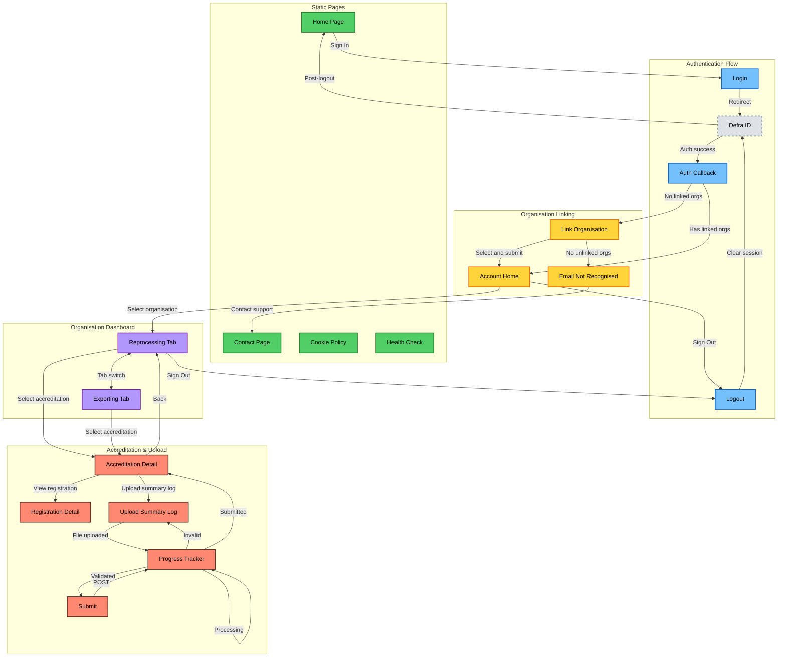

# EPR Frontend Page Navigation

> [!NOTE]
> This document provides a comprehensive overview of the EPR Frontend application's page structure and navigation flows.

<!-- prettier-ignore-start -->
<!-- TOC -->
* [EPR Frontend Page Navigation](#epr-frontend-page-navigation)
  * [Overview](#overview)
  * [All Routes](#all-routes)
  * [Navigation Flow Diagram](#navigation-flow-diagram)
  * [Key Conditional Logic](#key-conditional-logic)
    * [Authentication & Organisation Linking](#authentication--organisation-linking)
    * [Summary Log Processing States](#summary-log-processing-states)
  * [Authentication Requirements](#authentication-requirements)
  * [Session & State Management](#session--state-management)
<!-- TOC -->
<!-- prettier-ignore-end -->

## Overview

The EPR Frontend is a Hapi.js application that provides the user interface for the Extended Producer Responsibility (EPR) service. Users authenticate via Defra ID (OIDC) and can then manage their organisations, view accreditations, and upload summary logs.

## All Routes

| Path | Method | Purpose | Auth Required |
|------|--------|---------|---------------|
| `/health` | GET | Health check endpoint | No |
| `/` | GET | Home/landing page | No |
| `/login` | GET | Initiates OIDC login flow | No |
| `/auth/callback` | GET | OIDC callback handler | No |
| `/auth/organisation` | GET | Fallback safeguard | No |
| `/logout` | GET | Clears session & redirects to Defra ID logout | Yes |
| `/account` | GET | User account/organisations page | Yes |
| `/account/linking` | GET | Account linking form | Yes |
| `/account/linking` | POST | Process organisation linking | Yes |
| `/email-not-recognised` | GET | Email not recognised page | Yes |
| `/organisations/{id}` | GET | Organisation dashboard (reprocessing tab) | Yes |
| `/organisations/{id}/exporting` | GET | Organisation dashboard (exporting tab) | Yes |
| `/organisations/{organisationId}/accreditations/{accreditationId}` | GET | Accreditation detail dashboard | Yes |
| `/organisations/{organisationId}/registrations/{registrationId}` | GET | Registration detail page | Yes |
| `/organisations/{organisationId}/registrations/{registrationId}/summary-logs/upload` | GET | Summary log upload page | Yes |
| `/organisations/{organisationId}/registrations/{registrationId}/summary-logs/{summaryLogId}` | GET | Summary log progress tracker | Yes |
| `/organisations/{organisationId}/registrations/{registrationId}/summary-logs/{summaryLogId}/submit` | POST | Submit summary log | Yes |
| `/contact` | GET | Contact page | No |
| `/cookies` | GET | Cookie policy page | No |

## Navigation Flow Diagram

## Key Conditional Logic

### Authentication & Organisation Linking

**After OIDC Callback (`/auth/callback`):**

1. Session is created and stored in cache
2. User organisations are fetched from the backend API
3. If the user has **no linked organisations** → redirect to `/account/linking`
4. If the user has **linked organisations** → continue to referrer or `/`

**On `/account/linking` (GET):**

1. Fetch user organisations (prerequisite)
2. Check if `organisations.unlinked.length > 0`
3. If **no unlinked organisations** → redirect to `/email-not-recognised`
4. If **unlinked organisations exist** → show form with radio buttons

**On `/account/linking` (POST):**

1. Validate `organisationId` in payload
2. If validation fails → re-render form with error
3. If validation passes → call `linkOrganisation()` API → redirect to `/account`

### Summary Log Processing States

The summary log upload workflow uses asynchronous processing with status polling:

| State | UI Behaviour |
|-------|-------------|
| `preprocessing` | Shows "Processing..." with polling |
| `validating` | Shows "Processing..." with polling |
| `validated` | Shows check page with row counts, user can submit |
| `submitting` | Shows "Submitting..." with polling |
| `submitted` | Shows success page |
| `invalid` | Shows validation errors, re-upload link |
| `rejected` | Shows validation errors, re-upload link |
| `validationFailed` | Shows validation errors, re-upload link |
| `superseded` | Shows message that a newer upload exists |

## Authentication Requirements

**Protected routes** (require authenticated session):

- `/account`
- `/account/linking`
- `/email-not-recognised`
- `/organisations/**`
- All summary log routes

**Public routes:**

- `/` (home)
- `/health`
- `/login`
- `/auth/callback`
- `/contact`
- `/cookies`

Unauthenticated users attempting to access protected routes are redirected to `/login`.

## Session & State Management

- **Session storage**: Redis cache (configured in `server.app.cache`)
- **Session identifier**: UUID stored in cookie (`sessionId`)
- **Flash messages**: Used for storing referrer URL during login flow
- **Yar sessions**: Used for storing `summaryLogs` data (uploadId, freshData)
