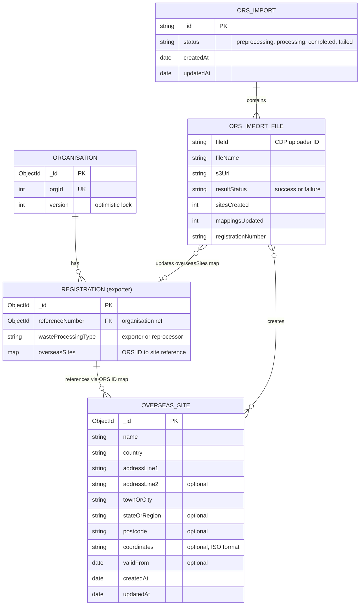
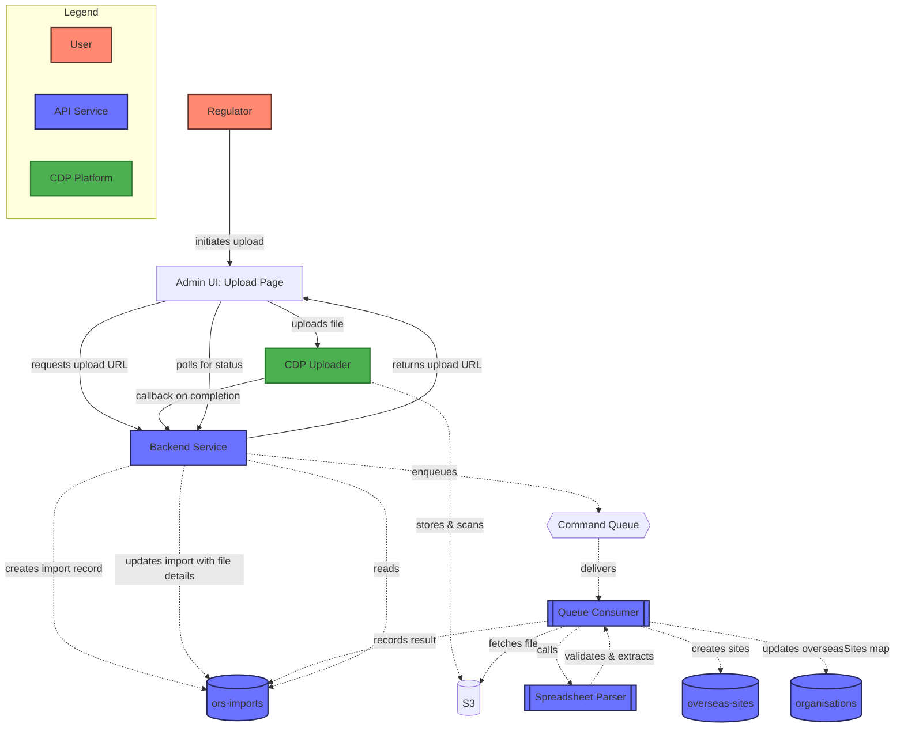
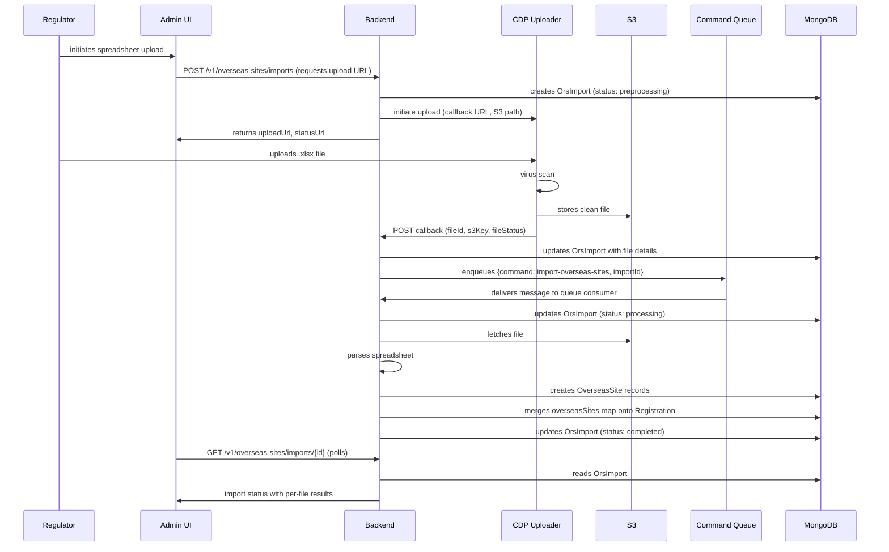

# 2025 Overseas Reprocessing Sites (ORS) Management

Exporters must declare the overseas sites to which they send packaging waste for reprocessing. The EA maintains
this data in spreadsheets today. ORS Management brings this data into the pEPR platform as structured records,
provides bulk import via spreadsheet upload, and exposes a CRUD API for ongoing maintenance by regulators.

Please see the [Registration & Accreditation HLD](../defined/2025-reg-acc-hld.md) for the broader context of how
organisations, registrations and accreditations relate to one another.

<!-- prettier-ignore-start -->
<!-- TOC -->
* [2025 Overseas Reprocessing Sites (ORS) Management](#2025-overseas-reprocessing-sites-ors-management)
  * [Project scope](#project-scope)
    * [Functional requirements](#functional-requirements)
    * [Non-functional requirements](#non-functional-requirements)
  * [Data model](#data-model)
    * [Entity relationship diagram](#entity-relationship-diagram)
    * [Key design decisions](#key-design-decisions)
  * [Technical approach](#technical-approach)
    * [Module structure](#module-structure)
    * [Spreadsheet import pipeline](#spreadsheet-import-pipeline)
    * [CRUD API](#crud-api)
      * [Endpoint: `GET` `/v1/overseas-sites`](#endpoint-get-v1overseas-sites)
      * [Endpoint: `GET` `/v1/overseas-sites/{id}`](#endpoint-get-v1overseas-sitesid)
      * [Endpoint: `POST` `/v1/overseas-sites`](#endpoint-post-v1overseas-sites)
      * [Endpoint: `PUT` `/v1/overseas-sites/{id}`](#endpoint-put-v1overseas-sitesid)
      * [Endpoint: `DELETE` `/v1/overseas-sites/{id}`](#endpoint-delete-v1overseas-sitesid)
    * [Registration ORS mapping](#registration-ors-mapping)
      * [Endpoint: `PUT` `/v1/organisations/{id}`](#endpoint-put-v1organisationsid)
    * [Import endpoints](#import-endpoints)
      * [Endpoint: `POST` `/v1/overseas-sites/imports`](#endpoint-post-v1ors-imports)
      * [Endpoint: `GET` `/v1/overseas-sites/imports/{id}`](#endpoint-get-v1ors-importsid)
  * [Admin UI](#admin-ui)
    * [Overseas sites list and edit](#overseas-sites-list-and-edit)
    * [Registration ORS section](#registration-ors-section)
    * [Spreadsheet upload page](#spreadsheet-upload-page)
<!-- TOC -->
<!-- prettier-ignore-end -->

## Project scope

### Functional requirements

1. Store overseas reprocessing site data as structured records in MongoDB
2. Accept bulk import of site data via EA spreadsheet upload (Excel `.xlsx`)
3. Parse spreadsheet metadata (organisation ID, registration number, accreditation number, waste category)
   and site rows (name, address, country, coordinates, valid-from date)
4. Link imported sites to the relevant registration via an ORS ID map
5. Provide CRUD endpoints for individual site management
6. Track import progress with per-file success/failure reporting
7. Expose import status via a polling endpoint for the admin UI
8. Display ORS data on the registration detail page in the admin UI
9. Provide a spreadsheet upload page in the admin UI

### Non-functional requirements

1. Gated behind a feature flag (`orsEnabled`) for incremental rollout
2. Follows the modular monolith pattern (ADR pending) with all code under `src/overseas-sites/`
3. Asynchronous import processing via SQS to avoid blocking the HTTP request
4. Optimistic locking on registration updates to prevent lost writes
5. 100% test coverage maintained

## Data model

### Entity relationship diagram



### Key design decisions

- **ORS IDs are zero-padded 3-digit strings** (e.g. `"001"`, `"042"`, `"999"`). These are the map keys on the
  registration's `overseasSites` field, matching the IDs used in the EA spreadsheet.
- **`overseasSites` is a map, not an array**, keyed by ORS ID. This allows direct lookup and idempotent upsert
  during import without scanning.
- **Only exporter registrations** carry `overseasSites`. Reprocessor registrations do not reference overseas sites.
- **Import files are tracked individually** within an `OrsImport` document. If one file in a batch fails, others
  are still processed and their results recorded independently.
- **Optimistic locking** via the organisation `version` field prevents concurrent imports from silently overwriting
  each other's registration mappings.
- **Site deduplication during import** — overseas sites are often copied between spreadsheets, so the same site
  appears in multiple uploads. During import, before creating a new site record, the parser checks for an
  existing site matching all fields (name, address, country, coordinates, valid-from). If a match is found,
  the existing record is reused and only the registration mapping is created. This is a deliberately simple
  approach for the first iteration — exact match only, no fuzzy matching. If the business later requires more
  sophisticated deduplication (e.g. matching on a subset of fields, merging near-duplicates), that can be
  built as separate tooling once the requirements are better understood.

## Technical approach

### Module structure

All ORS code lives under `src/overseas-sites/` following the modular monolith pattern:

```
src/overseas-sites/
├── domain/              # Import status enum, domain logic
├── repository/          # OverseasSite MongoDB collection
├── imports/repository/  # OrsImport MongoDB collection
├── routes/              # CRUD HTTP endpoints
├── parsers/             # Spreadsheet parser
├── application/         # Import processing orchestration
└── index.js             # Module entry point (barrel exports)
```

The `import-overseas-sites` command handler is registered with the shared queue consumer in
`src/server/queue-consumer/`, not within this module. The handler delegates to the application layer above.

External consumers import from the barrel at `src/overseas-sites/index.js`, never from internal paths.

### Spreadsheet import pipeline

> [!NOTE]
> The file upload, S3 storage, SQS queuing and status polling infrastructure already exists for summary log
> processing. It is significantly more sophisticated than ORS import requires on its own (ORS spreadsheets are
> small, single-file uploads with simple tabular data). We reuse the existing pipeline rather than building
> something simpler, which means ORS import gets progress tracking, per-file error reporting and async
> processing essentially for free.
>
> The spreadsheet import is intended for initial data seeding only. Once regulators have populated the system
> with existing ORS data, the import functionality will be removed and ongoing maintenance will be handled
> through the CRUD API and admin UI.
>
> ORS import uses the existing command queue (`epr_backend_commands`) rather than a dedicated queue. The
> import is just another command type (`import-overseas-sites`) handled by the existing queue consumer. This
> keeps infrastructure simple and makes cleanup straightforward when the import is retired — remove the
> command handler, no queue infrastructure to tear down.



This follows the same upload pattern used by summary log processing. CDP Uploader is a separate CDP platform
service that handles file storage and virus scanning. The backend service handles the upload initiation,
callback processing, and queue consumption.

**Processing sequence:**



### CRUD API

#### Endpoint: `GET` `/v1/overseas-sites`

Returns all overseas site records. Supports pagination.

#### Endpoint: `GET` `/v1/overseas-sites/{id}`

Returns a single overseas site by ID.

#### Endpoint: `POST` `/v1/overseas-sites`

Creates a new overseas site record. Validates the request body against the site schema (name, country,
address fields required; coordinates, validFrom, address line 2, state/region, postcode optional).

#### Endpoint: `PUT` `/v1/overseas-sites/{id}`

Updates an existing overseas site. Full replacement of mutable fields.

#### Endpoint: `DELETE` `/v1/overseas-sites/{id}`

> [!WARNING]
> Delete semantics are not yet decided. Options to consider include hard delete, soft delete (e.g. a
> `deletedAt` timestamp), and the impact on registrations that reference the site via their `overseasSites`
> map. This will be defined when the team picks up the delete work.

### Registration ORS mapping

#### Endpoint: `PUT` `/v1/organisations/{id}`

The existing organisation update endpoint is extended to support merging `overseasSites` onto a registration.
The payload specifies a registration (by reference number) and a map of ORS ID to site reference. Uses
optimistic locking on the organisation version to prevent concurrent write conflicts.

The admin UI calls this endpoint for individual edits. The spreadsheet import pipeline updates registration
mappings directly via the repository since it runs within the backend process.

### Import endpoints

#### Endpoint: `POST` `/v1/overseas-sites/imports`

Initiates a new import. Creates an import record (status: `preprocessing`), registers the upload with CDP
Uploader (providing a callback URL and S3 path), and returns the upload URL for the frontend to submit the
file to. Processing is triggered later when CDP Uploader calls back on completion.

**Response:**
```json
{
  "id": "uuid",
  "status": "preprocessing",
  "uploadUrl": "https://cdp-uploader/upload-and-scan/{uploadId}",
  "statusUrl": "https://cdp-uploader/status/{uploadId}"
}
```

#### Endpoint: `GET` `/v1/overseas-sites/imports/{id}`

Returns the current status of an import, including per-file results once processing is complete.

**Response:**
```json
{
  "id": "uuid",
  "status": "completed",
  "files": [{
    "fileId": "...",
    "fileName": "...",
    "result": {
      "status": "success",
      "sitesCreated": 42,
      "mappingsUpdated": 42,
      "registrationNumber": "REG-001",
      "errors": []
    }
  }]
}
```

## Admin UI

New pages in the `epr-re-ex-admin-frontend`, all behind the ORS feature flag:

### Overseas sites list and edit

Standalone pages for managing overseas site records, independent of any registration. Follows the same
pattern as the existing organisation list/edit pages.

- **List page** (`/overseas-sites`) — searchable table of all overseas sites showing name, country, and
  address. Search by site name. Each row links to the detail page.
- **Detail/edit page** (`/overseas-sites/{id}`) — form-based view of a single site record. Regulators can
  edit name, address, country, coordinates and valid-from date. Changes affect all registrations that
  reference the site.
- **Create page** (`/overseas-sites/create`) — form for creating a new overseas site record.

### Registration ORS section

New section on the existing registration detail page (`/organisations/{orgId}/registrations/{regId}`) for
exporter registrations. Shows a table of the registration's ORS mappings: three-digit ORS ID, site name,
country and approval date.

Actions:
- **Add** — enter a three-digit ORS ID, then search for an existing site or create a new one
- **Remove** — unlink an ORS mapping from the registration (does not delete the site record)
- **Edit** — click through to the overseas site detail page to update the shared record. Show a confirmation
  warning that edits affect all registrations referencing this site.

### Spreadsheet upload page

Allows regulators to upload `.xlsx` files for initial data seeding. Shows progress via polling and displays
per-file results (sites created, mappings updated, errors). This page will be removed once seeding is
complete — see [Spreadsheet import pipeline](#spreadsheet-import-pipeline).
