# pEPR: High Level Design

<!-- prettier-ignore-start -->
<!-- TOC -->
* [pEPR: High Level Design](#pepr-high-level-design)
  * [Architecture](#architecture)
  * [Basic structure](#basic-structure)
  * [Who is using this service](#who-is-using-this-service)
    * [Producers](#producers)
    * [Operators](#operators)
      * [Reprocessors](#reprocessors)
      * [Exporters](#exporters)
    * [Consultants](#consultants)
    * [Regulators](#regulators)
    * [Service Maintainers](#service-maintainers)
  * [How do users access this service?](#how-do-users-access-this-service)
  * [What can these users do?](#what-can-these-users-do)
  * [What are the statuses of each entity?](#what-are-the-statuses-of-each-entity)
    * [Organisation](#organisation)
    * [Registration](#registration)
    * [Accreditation](#accreditation)
    * [User](#user)
    * [Summary Log](#summary-log)
    * [Waste Record Version](#waste-record-version)
    * [PRN](#prn)
    * [Report](#report)
  * [Workflows](#workflows)
    * [Organisation, Registration & Accreditation management](#organisation-registration--accreditation-management)
      * [Regulator approval and edit of Organisation, Registration and Accreditation](#regulator-approval-and-edit-of-organisation-registration-and-accreditation)
      * [Regulator suspension of Organisation](#regulator-suspension-of-organisation)
      * [Regulator suspension of Registration](#regulator-suspension-of-registration)
      * [Regulator suspension of Accreditation](#regulator-suspension-of-accreditation)
    * [User Management](#user-management)
      * [Automated addition of an Approved Person or PRN Signatory](#automated-addition-of-an-approved-person-or-prn-signatory)
      * [Regulator adds an Approved Person or PRN Signatory](#regulator-adds-an-approved-person-or-prn-signatory)
      * [Regulator removes access from an Approved Person or PRN Signatory](#regulator-removes-access-from-an-approved-person-or-prn-signatory)
      * [Approved Person adds a User](#approved-person-adds-a-user)
      * [Approved Person removes access from a User](#approved-person-removes-access-from-a-user)
    * [Summary Log submission](#summary-log-submission)
      * [User makes open month waste adjustments](#user-makes-open-month-waste-adjustments)
      * [User makes closed month waste adjustments](#user-makes-closed-month-waste-adjustments)
    * [PRNs](#prns)
      * [PRN issuance](#prn-issuance)
      * [PRN approval](#prn-approval)
      * [PRN rejection](#prn-rejection)
      * [PRN cancellation in open month](#prn-cancellation-in-open-month)
      * [PRN cancellation in closed month](#prn-cancellation-in-closed-month)
    * [Reports](#reports)
      * [Report issuance](#report-issuance)
      * [Report submission](#report-submission)
      * [Report approval](#report-approval)
<!-- TOC -->

<!-- prettier-ignore-end -->

## Architecture

## Basic structure

This structure contains entities that cover the majority of use cases for 2026 deadlines.

```mermaid
erDiagram

%% Entities
USER["👤 Operator: User"]
PRN-SIGNATORY["👤 Operator: PRN Signatory"]
APPROVER["👤 Operator: Approved Person"]
REGULATOR["👤 Regulator"]
PRODUCER["👤 Producer"]
ORGANISATION["Organisation"]
ACCREDITATION["Accreditation"]
NOTIFICATION["Notification"]
SUMMARY-LOG-FILE["📁 Summary Log File"]
SUMMARY-LOG["Summary Log"]
WASTE-RECORD["Waste Record"]
WASTE-BALANCE["Waste Balance"]
PRN
REPORT["Report"]

%% Structure
NOTIFICATION }|--|{ USER : "sent to"
NOTIFICATION }|--|{ APPROVER : "sent to"
NOTIFICATION }|--|{ PRN-SIGNATORY : "sent to"
NOTIFICATION }|--|{ REGULATOR : "sent to"
ACCREDITATION }|--|| ORGANISATION : "child of"
WASTE-RECORD }|--|| ACCREDITATION : "linked to"
WASTE-BALANCE ||--|| ACCREDITATION : "child of"
WASTE-RECORD }|--|| REPORT : "linked to"
PRN }|--|{ REPORT : "linked to"
WASTE-BALANCE ||--|| WASTE-RECORD : "linked to"

%% Actions
PRODUCER }|--o{ PRN : accepts
PRODUCER }|--o{ PRN : rejects
USER }|--|{ SUMMARY-LOG-FILE : uploads
USER }|--|{ SUMMARY-LOG : submits
USER }|--o{ PRN : issues
USER }|--o{ PRN : cancels
USER }|--o{ PRN : downloads
PRN-SIGNATORY }|--|{ PRN : authorises
APPROVER }|--|{ WASTE-RECORD : approves
REGULATOR }|--|{ REPORT : receives
REGULATOR }|--|{ PRN : cancels
USER }|--|{ REPORT : creates
APPROVER }|--|{ REPORT : submits

%% Effects
SUMMARY-LOG-FILE ||..|| SUMMARY-LOG : "creates (does not create Waste Record)"
SUMMARY-LOG ||--|| WASTE-RECORD : creates
SUMMARY-LOG ||--o| WASTE-RECORD : adjusts
WASTE-RECORD }|--|| WASTE-BALANCE : updates
PRN }|--|| WASTE-BALANCE : updates
```

## Who is using this service

### Producers

Producers are organisations who use packaging for products sold to consumers.

This packaging can be recycled for use in a circular economy, which is a sustainable economic model that aims to eliminate waste and pollution.

Producers purchase PRNs/PERNs (Packaging Recycling Notes/Packaging Export Recycling Notes) from Operators to fulfil their obligations to regulators.

> [!INFO]
> Producers do not have direct access to this service,
> their access to PRNs is via another service called RPD and there is an integration between these services.

### Operators

Operators are the regulated organisations who handle waste material.

They fall into two categories of activity: reprocessors and exporters.

These activities are not mutually exclusive, operators can perform both activities on the same or different materials.

#### Reprocessors

Reprocessors receive waste material and recycle it into a raw material for use in the economy, e.g. paper waste is recycled into cardboard boxes.

#### Exporters

Exporters export waste material to a third party, e.g. a waste processing plant in another country.

### Consultants

Consultants act on behalf of multiple operators, they can usually perform the same actions as privileged users.

### Regulators

The regulators are the authorities responsible for the regulation of waste material. There are four nations in the UK that have regulatory bodies:

1. England: Environment Agency
2. Northern Ireland: Northern Ireland Environment Agency
3. Scotland: Scottish Environment Protection Agency
4. Wales: Natural Resources Wales

### Service Maintainers

The Defra team(s) responsible for maintaining the service used by operators, consultants and regulators.

## How do users access this service?

Operators & consultants access this service via [this auth mechanism](pepr-lld-auth-ui.md).

Service Maintainers and Regulators access this service via [this auth mechanism](pepr-lld-auth-admin-ui.md).

All requests to the EPR Backend API are verified with [this auth mechanism](pepr-lld-auth-api.md).

## What can these users do?

The following actions depend on the user's role:

1. Create or update a user
2. Upload a summary log, which in turn creates or updates a waste record and may update the waste balance
3. Create or update a PRN
4. Create or update a report

Note that updating an entity _may_ include changing its `status`. See a summary of entity statuses below, or see the [Low Level Design](pepr-lld.md) for more details.

## What are the statuses of each entity?

### Organisation

1. `created`: organisation has been created but has not yet been approved by the regulator
2. `approved`: organisation has been approved by the regulator
3. `rejected`: organisation has been rejected by the regulator
4. `suspended`: organisation has been suspended by the regulator
5. `archived`: organisation has been archived and can no longer be used

### Registration

1. `created`: registration has been created but has not yet been approved by the regulator
2. `approved`: registration has been approved by the regulator
3. `rejected`: registration has been rejected by the regulator
4. `suspended`: registration has been suspended by the regulator
5. `archived`: registration has been archived and can no longer be used

### Accreditation

1. `created`: accreditation has been created but has not yet been approved by the regulator
2. `approved`: accreditation has been approved by the regulator
3. `rejected`: accreditation has been rejected by the regulator
4. `suspended`: accreditation has been suspended by the regulator
5. `archived`: accreditation has been archived and can no longer be used

### User

1. `created`: user has been created but has not yet completed a login process
2. `active`: user has completed the login process
3. `archived`: user has been archived and can no longer be used

### Summary Log

Summary logs transition through the following states based on what has been accomplished:

1. `preprocessing`: file uploaded to CDP Uploader, undergoing virus scan and file validation
2. `rejected`: CDP Uploader preprocessing failed (malware detected, invalid file type, or size exceeded)
3. `validating`: CDP preprocessing passed, content validation against business rules in progress
4. `invalid`: content validation found errors
5. `validated`: validation completed successfully, prospective modifications ready for user review
6. `submitting`: user has submitted the summary log, waste record sync in progress
7. `submitted`: waste records have been synced successfully

### Waste Record Version

1. `created`: the first version of a waste record that created the entity, this version can be used to understand the original data
2. `updated`: subsequent updates to the waste record, this version can be used to understand the changes made to the original data
3. `pending`: updates that are not yet approved by the regulator because they affect closed reporting periods

### PRN

1. `raised`: PRN has been raised but has not yet been issued to the producer
2. `issued`: PRN has been issued to the producer but has not yet been accepted by the producer
3. `accepted`: PRN has been accepted by the producer
4. `rejected`: PRN has been rejected by the producer
5. `cancellation-requested`: PRN has been requested for cancellation by the operator
6. `cancelled`: PRN has been cancelled by the regulator

### Report

1. `created`: report has been created but has not yet been submitted to the regulator
2. `submitted`: report has been submitted to the regulator
3. `approved`: report has been approved by the regulator
4. `rejected`: report has been rejected by the regulator

## Workflows

### Organisation, Registration & Accreditation management

#### Regulator approval and edit of Organisation, Registration and Accreditation

Use case: As a Regulator, I want to edit and approve an organisation, registration and accreditation so that the service can be used by Approved Persons & PRN Signatories.

#### Regulator suspension of Organisation

TBD as all MVP 1.2

#### Regulator suspension of Registration

TBD as all MVP 1.2

#### Regulator suspension of Accreditation

TBD as all MVP 1.2

### User Management

#### Automated addition of an Approved Person or PRN Signatory

Use case: As a Regulator, I want to create an Approved Person or PRN Signatory automatically when the registration or accreditation is approved so that they can access the service.

#### Regulator adds an Approved Person or PRN Signatory

Use case: As a Regulator, I want to add an Approved Person or PRN Signatory manually after the registration or accreditation has been approved so this new user can access the service.

#### Regulator removes access from an Approved Person or PRN Signatory

Use case: As a Regulator, I want to remove an Approved Person or PRN Signatory manually after the registration or accreditation has been approved so this user can no longer access the service.

#### Approved Person adds a User

Use case: As an Approved Person, I want to add a basic user so that they can access the service.

#### Approved Person removes access from a User

Use case: As an Approved Person, I want to remove access from a basic user so that they can no longer access the service.

### Summary Log submission

#### User makes open month waste adjustments

Use case: As a User, I want to upload a summary log with open month waste adjustments so that I can update existing waste records and see any impact on the waste balance.

#### User makes closed month waste adjustments

TBD as all MVP 1.2

### PRNs

#### PRN issuance

TBD

#### PRN approval

TBD

#### PRN rejection

TBD

#### PRN cancellation in open month

TBD

#### PRN cancellation in closed month

TBD

### Reports

TBD as all MVP 1.2

#### Report issuance

TBD

#### Report submission

TBD

#### Report approval

TBD
