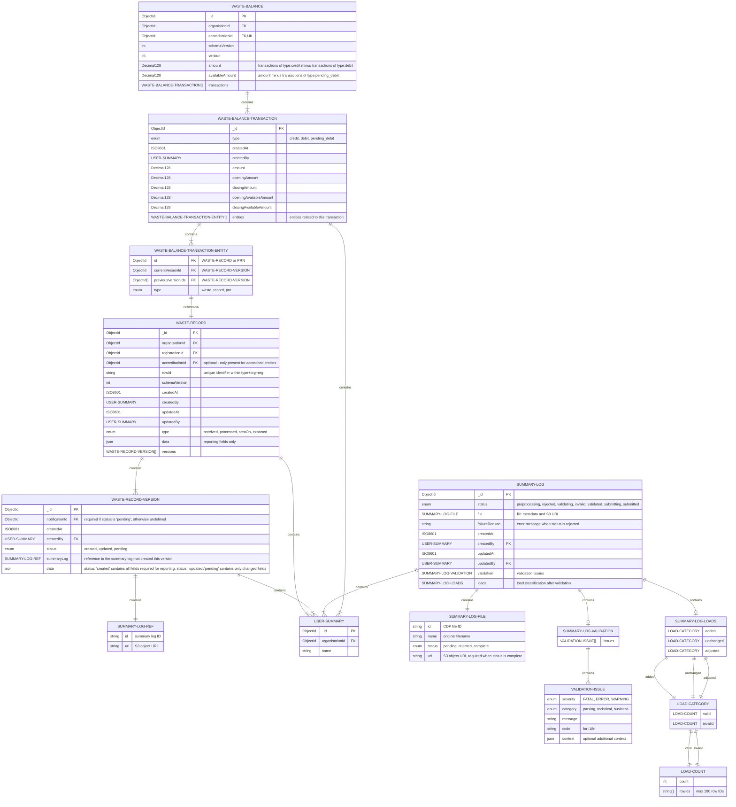

# pEPR Low level design

> [!WARNING]
> This document is a work in progress and is subject to change.

<!-- prettier-ignore-start -->
<!-- TOC -->
* [pEPR Low level design](#pepr-low-level-design)
  * [API Endpoints](#api-endpoints)
  * [CRUD by Entity Type](#crud-by-entity-type)
  * [Role-Based Access Control](#role-based-access-control)
  * [Entity Relationships](#entity-relationships)
    * [Users](#users)
    * [Waste Record & Waste Balance](#waste-record--waste-balance)
      * [Disambiguation](#disambiguation)
      * [User Journey](#user-journey)
      * [Summary Log LLDs](#summary-log-llds)
      * [Entity Relationships](#entity-relationships-1)
      * [Waste Record Type: Received](#waste-record-type-received)
      * [Waste Record Type: processed](#waste-record-type-processed)
      * [Waste Record Type: sentOn](#waste-record-type-senton)
      * [Waste Balance](#waste-balance)
    * [PRN](#prn)
      * [PRN creation schema & sequence diagram](#prn-creation-schema--sequence-diagram)
    * [Report](#report)
    * [Summary Log upload & ingest](#summary-log-upload--ingest)
      * [Phase 1: upload & async processes: preprocessing, file parsing & data validation](#phase-1-upload--async-processes-preprocessing-file-parsing--data-validation)
      * [Phase 2: validation results & submission](#phase-2-validation-results--submission)
<!-- TOC -->

<!-- prettier-ignore-end -->

## API Endpoints

The swagger documentation can be found [here](../api-definitions/index.md)

## CRUD by Entity Type

| Entity Type   | Admin: SuperUser | Admin: Regulator | Public: User | Notes                                                                                             |
| ------------- | ---------------- | ---------------- | ------------ | ------------------------------------------------------------------------------------------------- |
| User          | CRU-             | CRU-             | -R--         | Users can only be soft deleted via status change                                                  |
| Organisation  | -RU-             | -RU-             | -R--         | Created on application                                                                            |
| Registration  | -RU-             | -RU-             | -R--         | Created on application, unique to Activity & Site, contains Accreditation                         |
| Accreditation | -RU-             | -RU-             | -R--         | Created on application, nested under Material                                                     |
| Summary-Log   | -R--             | -R--             | CR--         | Summary Logs are immutable and stored in S3 for history purposes                                  |
| Waste-Record  | -R--             | -R--             | -RU-         | Update is result of Summary-Log create                                                            |
| Waste-Balance | -R--             | -R--             | -RU-         | Update is result of Summary-Log create or PRN create/update                                       |
| PRN           | -RU-             | -RU-             | CRU-         |                                                                                                   |
| Report        | -R--             | -R--             | CRU-         |                                                                                                   |
| Notification  | -RU-             | -RU-             | -RU-         | All Notifications are system generated, updates take place via status changes on related entities |
| System-Log    | -R--             | ----             | ----         | For monitoring purposes, not to be confused with SOC auditing                                     |

## Role-Based Access Control

| Permission                      | Super User    | Regulator     | Approved Person     | PRN Signatory     | User     |
| ------------------------------- | ------------- | ------------- | ------------------- | ----------------- | -------- |
| **User:ApprovedPerson:view**    | ✅            | ✅            | ✅                  | ✅                | ✅       |
| **User:ApprovedPerson:add**     | ✅            | ✅            |                     |                   |          |
| **User:ApprovedPerson:edit**    | ✅            | ✅            |                     |                   |          |
| **User:PRNSignatory:view**      | ✅            | ✅            | ✅                  | ✅                | ✅       |
| **User:PRNSignatory:add**       | ✅            | ✅            |                     |                   |          |
| **User:PRNSignatory:edit**      | ✅            | ✅            |                     |                   |          |
| **User:view**                   | ✅            | ✅            | ✅                  | ✅                | ✅       |
| **User:add**                    | ✅            | ✅            | ✅                  |                   |          |
| **User:edit**                   | ✅            | ✅            | ✅                  |                   |          |
| =============================== | ============= | ============= | =================   | ===============   | ======   |
| **Organisation:view**           | ✅            | ✅            | ✅                  | ✅                | ✅       |
| **Organisation:edit**           | ✅            | ✅            |                     |                   |          |
| **Organisation:approve**        | ✅            | ✅            |                     |                   |          |
| **Organisation:reject**         | ✅            | ✅            |                     |                   |          |
| ============================    | ============= | ============= | =================== | ================= | ======   |
| **Registration:view**           | ✅            | ✅            | ✅                  | ✅                | ✅       |
| **Registration:edit**           | ✅            | ✅            |                     |                   |          |
| **Registration:approve**        | ✅            | ✅            |                     |                   |          |
| **Registration:reject**         | ✅            | ✅            |                     |                   |          |
| ========================        | ============= | ============= | =================== | ================= | ======== |
| **Accreditation:view**          | ✅            | ✅            | ✅                  | ✅                | ✅       |
| **Accreditation:edit**          | ✅            | ✅            |                     |                   |          |
| **Accreditation:approve**       | ✅            | ✅            |                     |                   |          |
| **Accreditation:reject**        | ✅            | ✅            |                     |                   |          |
| ========================        | ============= | ============= | =================== | ================= | ======== |
| **Summary-Log:view**            | ✅            | ✅            | ✅                  | ✅                | ✅       |
| **Summary-Log:validate**        |               |               | ✅                  | ✅                | ✅       |
| **Summary-Log:submit**          |               |               | ✅                  | ✅                | ✅       |
| ========================        | ============= | ============= | =================== | ================= | ======== |
| **Waste-Record:view**           | ✅            | ✅            | ✅                  | ✅                | ✅       |
| ========================        | ============= | ============= | =================== | ================= | ======== |
| **Waste-Balance:view**          | ✅            | ✅            | ✅                  | ✅                | ✅       |
| ========================        | ============= | ============= | =================== | ================= | ======== |
| **PRN:view**                    | ✅            | ✅            | ✅                  | ✅                | ✅       |
| **PRN:add**                     |               |               | ✅                  | ✅                | ✅       |
| **PRN:edit**                    |               |               | ✅                  | ✅                | ✅       |
| **PRN:approve**                 |               |               |                     | ✅                |          |
| **PRN:reject**                  |               |               |                     | ✅                |          |
| ========================        | ============= | ============= | =================== | ================= | ======== |
| **Report:view**                 | ✅            | ✅            | ✅                  | ✅                | ✅       |
| **Report:add**                  |               |               | ✅                  | ✅                | ✅       |
| **Report:edit**                 |               |               | ✅                  | ✅                | ✅       |
| **Report:approve**              |               |               | ✅                  |                   |          |
| **Report:reject**               |               |               | ✅                  |                   |          |
| ========================        | ============= | ============= | =================== | ================= | ======== |
| **Notification:view**           | ✅            | ✅            | ✅                  | ✅                | ✅       |
| ========================        | ============= | ============= | =================== | ================= | ======== |
| **System-Log:view**             | ✅            |               |                     |                   |          |

## Entity Relationships

### Users

TBD

### Waste Record & Waste Balance

#### Disambiguation
The Waste Record is the entity used to track key reporting data uploaded by Summary Logs.
The Waste Balance is the running total in tonnes of waste received minus PRNs issued.

#### User Journey


#### Summary Log LLDs
For detailed Summary Log LLDs, see the following:

1. [Summary Log validation](./summary-log-validation-lld.md)
1. [Summary Log row validation classification](./summary-log-row-validation-classification.md)
1. [Summary Log submission](./summary-log-submission-lld.md)


#### Entity Relationships
> [!NOTE]
> `accreditationId` is optional on waste records to support organisations that have a registration but no accreditation.



#### Waste Record Type: Received

In this example:

1. Alice has created a `received` waste record
2. Bob has updated the waste record, but introduced a mistake
3. Alice has corrected the mistake, but the reporting period is closed and the record is now pending

```json5
{
  _id: 'a1234567890a12345a01',
  organisationId: 'e1234567890a12345a01',
  registrationId: 'f1234567890a12345a01',
  accreditationId: 'b1234567890a12345a01', // optional
  rowId: '12345678910',
  type: 'received',
  createdAt: '2026-01-08T12:00:00.000Z',
  createdBy: {
    _id: 'c1234567890a12345a01',
    name: 'Alice'
  },
  updatedAt: '2026-01-09T12:00:00.000Z',
  updatedBy: {
    _id: 'c1234567890a12345a02',
    name: 'Bob'
  },
  data: {
    dateReceived: '2026-01-01',
    grossWeight: 10.0,
    tonnageForPrn: 0.5
    // ...
  },
  versions: [
    {
      id: 'd1234567890a12345a01',
      status: 'created',
      createdAt: '2026-01-08T12:00:00.000Z',
      createdBy: {
        _id: 'c1234567890a12345a01',
        name: 'Alice'
      },
      summaryLog: {
        id: 's1234567890a12345a01',
        uri: 's3://bucket/path/to/summary/log/upload/1'
      },
      data: {
        dateReceived: '2026-01-01',
        grossWeight: 1.0,
        tonnageForPrn: 0.5
        // ...
      }
    },
    {
      id: 'd1234567890a12345a02',
      status: 'updated',
      createdAt: '2026-01-09T12:00:00.000Z',
      createdBy: {
        _id: 'c1234567890a12345a02',
        name: 'Bob'
      },
      summaryLog: {
        id: 's1234567890a12345a02',
        uri: 's3://bucket/path/to/summary/log/upload/2'
      },
      data: {
        grossWeight: 10.0
      }
    },
    {
      id: 'd1234567890a12345a03',
      notificationId: 'e1234567890a12345a01',
      status: 'pending',
      createdAt: '2026-02-28T12:00:00.000Z',
      createdBy: {
        _id: 'c1234567890a12345a01',
        name: 'Alice'
      },
      summaryLog: {
        id: 's1234567890a12345a03',
        uri: 's3://bucket/path/to/summary/log/upload/3'
      },
      data: {
        grossWeight: 1.0
      }
    }
  ]
}
```

#### Waste Record Type: processed

In this example Alice has created a `processed` waste record

```json5
{
  _id: 'a1234567890a12345a02',
  organisationId: 'e1234567890a12345a01',
  registrationId: 'f1234567890a12345a01',
  accreditationId: 'b1234567890a12345a01', // optional
  rowId: '12345678911',
  type: 'processed',
  createdAt: '2026-01-08T12:00:00.000Z',
  createdBy: {
    _id: 'c1234567890a12345a01',
    name: 'Alice'
  },
  updatedAt: null,
  updatedBy: null,
  data: {
    dateLoadLeftSite: '2026-01-01',
    sentTo: 'name',
    weight: 1.0
    // ...
  },
  versions: [
    {
      id: 'd1234567890a12345a01',
      status: 'created',
      createdAt: '2026-01-08T12:00:00.000Z',
      createdBy: {
        _id: 'c1234567890a12345a01',
        name: 'Alice'
      },
      summaryLog: {
        id: 's1234567890a12345a01',
        uri: 's3://bucket/path/to/summary/log/upload/1'
      },
      data: {
        dateLoadLeftSite: '2026-01-01',
        sentTo: 'name',
        weight: 1.0
        // ...
      }
    }
  ]
}
```

#### Waste Record Type: sentOn

In this example Alice has created a `sentOn` waste record

```json5
{
  _id: 'a1234567890a12345a03',
  organisationId: 'e1234567890a12345a01',
  registrationId: 'f1234567890a12345a01',
  accreditationId: 'b1234567890a12345a01', // optional
  rowId: '12345678912',
  type: 'sentOn',
  createdAt: '2026-01-08T12:00:00.000Z',
  createdBy: {
    _id: 'c1234567890a12345a01',
    name: 'Alice'
  },
  updatedAt: null,
  updatedBy: null,
  data: {
    dateLoadLeftSite: '2026-01-01',
    sentTo: 'name',
    weight: 1.0
    // ...
  },
  versions: [
    {
      id: 'd1234567890a12345a01',
      status: 'created',
      createdAt: '2026-01-08T12:00:00.000Z',
      createdBy: {
        _id: 'c1234567890a12345a01',
        name: 'Alice'
      },
      summaryLog: {
        id: 's1234567890a12345a01',
        uri: 's3://bucket/path/to/summary/log/upload/1'
      },
      data: {
        dateLoadLeftSite: '2026-01-01',
        sentTo: 'name',
        weight: 1.0
        // ...
      }
    }
  ]
}
```

#### Waste Balance

An example of an object in the Waste Balance collection

```json5
{
  _id: 'a1234567890a12345a03',
  accreditationId: 'b1234567890a12345a01',
  organisationId: 'e1234567890a12345a01',
  amount: 48.99,
  availableAmount: 23.99,
  transactions: [
    // Alice creates a prn, decreasing the available balance
    {
      id: 'K7mP9xQ2vL4nR8wF6tY3',
      type: 'pending_debit',
      createdAt: '2026-01-04T09:00:00.000Z',
      createdBy: {
        _id: 'c1234567890a12345a01',
        name: 'Alice'
      },
      amount: 25.00,
      openingAmount: 48.99,
      closingAmount: 48.99,
      openingAvailableAmount: 48.99,
      closingAvailableAmount: 23.99,
      entities: [
        {
          id: 'd1234567890a12345a05',
          type: 'prn:created',
        }
      ]
    },
    // Charlie adds waste sent_on, decreasing the balance
    {
      id: 'Zh5Bn2Qx8Wj4Lp7Ck9Vm',
      type: 'debit',
      createdAt: '2026-01-03T09:00:00.000Z',
      createdBy: {
        _id: 'c1234567890a12345a03',
        name: 'Charlie'
      },
      amount: 1.01,
      openingAmount: 50.00,
      closingAmount: 48.99,
      openingAvailableAmount: 50.00,
      closingAvailableAmount: 48.99,
      entities: [
        {
          id: 'd1234567890a12345a04',
          type: 'waste_record:sent_on',
        }
      ]
    },
    // Bob adds waste received, increasing the balance
    {
      id: 'Fd3Rt6Gy9Mn1Zx4Hk8Qw',
      type: 'credit',
      createdAt: '2026-01-02T09:00:00.000Z',
      createdBy: {
        _id: 'd1234567890a12345a04',
        name: 'Bob'
      },
      amount: 40.00,
      openingAmount: 10.00,
      closingAmount: 50.00,
      openingAvailableAmount: 10.00,
      closingAvailableAmount: 50.00,
      entities: [
        {
          id: 'd1234567890a12345a03',
          type: 'waste_record:received',
        },
        {
          id: 'd1234567890a12345a02',
          type: 'waste_record:received',
        }
      ]
    },
    // Alice adds waste received, increasing the balance
    {
      id: 'Np2Vb7Xc5Jm9Rt4Lw6Fq',
      type: 'credit',
      createdAt: '2026-01-01T09:00:00.000Z',
      createdBy: {
        _id: 'c1234567890a12345a01',
        name: 'Alice'
      },
      amount: 10.00,
      openingAmount: 0,
      closingAmount: 10.00,
      openingAvailableAmount: 0,
      closingAvailableAmount: 10.00,
      entities: [
        {
          id: 'd1234567890a12345a01',
          type: 'waste_record:received',
        }
      ]
    }
  ]
}
```

### PRN


### PRN creation schema & sequence diagram

The journey goes through three stages, creation, decoration and submission, which sets the PRN status to `AWAITING_AUTHORISATION`. This is acheived through three endpoints

#### POST /packaging-recycling-notes

**payload values**
  - organisationId, uuid, required
  - accreditationId, uuid, required

**example**
```javascript
{
  organisationId: 'b0b08519-bbc8-4222-a5c8-44d7ade5b995'
  accreditationId: '753c5bf9-1bbc-40e8-9b88-475f6e5efba9'
}
```

**returns**
ID of created PRN.

```javascript
{
  prnId: '167bd693-3e8a-4291-b2c0-4d1740744180'
}
```

#### PATCH /packaging-recycling-notes/{id}

**payload values**
  - tonnage, floating point number to two decimal places, optional
  - issuedToOrganisation, object, optional
    - id: string, uuid, required
    - name: string, required
    - tradingName: string, optional
  - notes, string, max length 200, optional

**returns**
204 OK

**example**
```javascript
{
  tonnage: '100.00',
  issuedToOrganisation: {
    id: 'ebdfb7d9-3d55-4788-ad33-dbd7c885ef20',
    name: 'Sauce Makers Limited',
    tradingName: 'Awesome Sauce',
  },
  notes: 'REF: 101010'
}
```

#### POST /packaging-recycling-notes/{id}/status
Update the status of a PRN.

**payload values**

  - status: enum, required

**status values**
  - DRAFT
  - AWAITING_AUTHORISATION
  - AWAITING_ACCEPTANCE
  - AWAITING_CANCELLATION
  - ACCEPTED
  - CANCELLED
  - DELETED

**example**
```javascript
{
  status: 'AWAITING_AUTHORISATION'
}
```

**returns**
204 OK


### Report

TBD

### Summary Log upload & ingest

> [!NOTE]
> The frontend only needs a single page to handle the entire upload and validation flow. The page polls the backend state document and updates the UI based on the current status, without requiring redirects between different URLs.

#### Phase 1: upload & async processes: preprocessing, file parsing & data validation


#### Phase 2: validation results & submission


