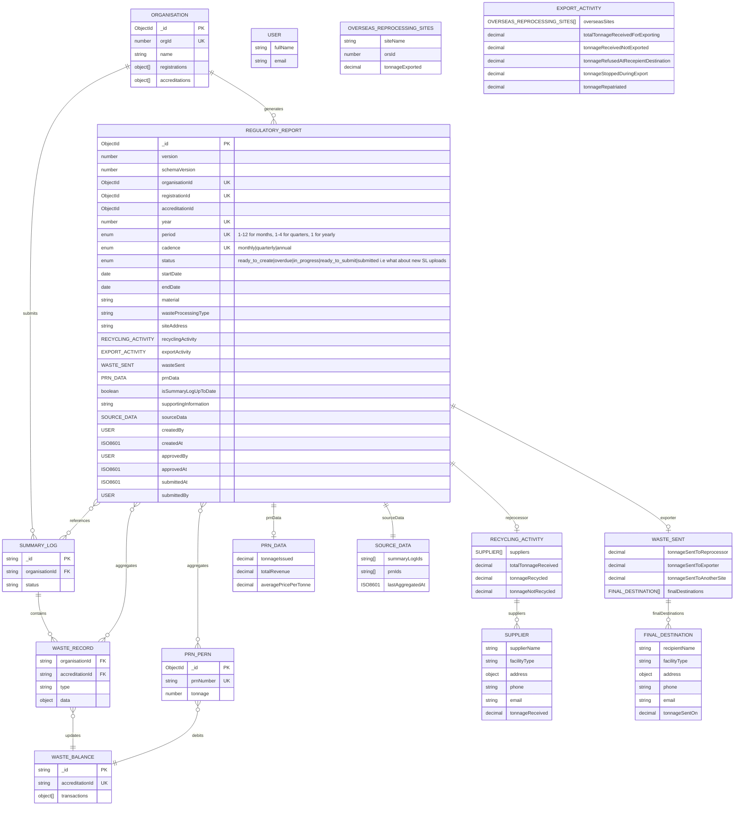

# Regulatory Reporting Data Model

## Status

Proposed

## Context

Reprocessors and exporters must submit monthly (accredited) or quarterly (registered) reports to regulatory agencies containing:

- Tonnage data (received, recycled/exported, sent on)
- Supplier and destination facility details
- PRN/PERN issuance and financial data

Current system has operational collections (`summary-logs`, `waste-records`, `waste-balances`, `packaging-recycling-notes`) but needs optimized reporting collection for regulatory exports.

## Decision

Create `regulatory-reports` collection to store pre-aggregated reporting data.

## Data Flow

```
Summary Log (submitted) ──┐
                          ├──> Waste Records ──┐
PRN/PERN (issued) ────────┤                    ├──> Monthly Report
                          │                    │    (aggregated)
Organisation Data ────────┴────────────────────┘
```

**Aggregation triggers**:

- Summary log submission
- PRN/PERN issuance
- Manual regeneration

**Source collections**:

- `waste-records` (type: received/sentOn/exported)
- `packaging-recycling-notes` (status: accepted)
- `epr-organisations` (denormalized)

## Entity Relationship Diagram


