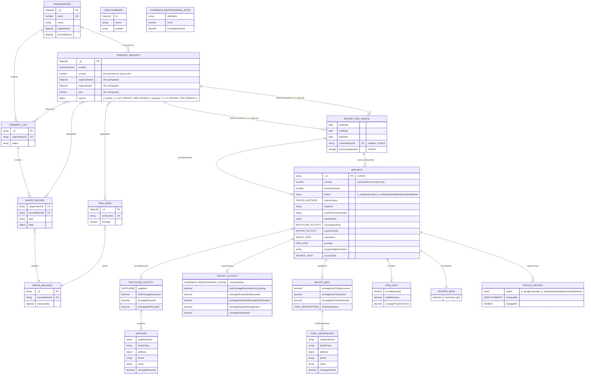

# Regulatory Reporting Data Model

## Status

Accepted

## Context

Reprocessors and exporters must submit monthly (accredited) or quarterly (registered) reports to regulatory agencies containing:

- Tonnage data (received, recycled/exported, sent on)
- Supplier and destination facility details
- PRN/PERN issuance and financial data

Current system has operational collections (`summary-logs`, `waste-records`, `waste-balances`, `packaging-recycling-notes`) but needs optimized reporting collection for regulatory exports.

## Decision

Create two collections:

- `periodic-reports` — one document per `(organisationId, registrationId, year)`; nested `reports` map keyed by cadence then period number; each slot holds `startDate`, `endDate`, `dueDate`, `currentReportId`, `previousReportIds`.
- `reports` — standalone submission documents containing all field data and full status audit trail.

## Design Decisions

### `reports` field: map over array

The `reports` field on `periodic-reports` uses a nested map `{ cadence: { period: slot } }` rather than an array of period objects.

**Considered alternative — array**

```json
"periods": [
  { "cadence": "monthly", "period": 4, "startDate": "2026-04-01", "endDate": "2026-04-30", "currentReportId": "...", "previousReportIds": [] },
  { "cadence": "monthly", "period": 5, "startDate": "2026-05-01", "endDate": "2026-05-31", "currentReportId": null,  "previousReportIds": [] }
]
```

**Why map was chosen**

- **Data integrity**: Object keys are unique by definition in BSON. The map shape makes it structurally impossible to insert two slots for the same `cadence + period`. MongoDB cannot enforce a compound unique constraint on element combinations within a single document's array, so the array shape would require application-level guards with no database-level backstop.
- **Atomic writes**: `$set` on `reports.monthly.4.currentReportId` targets exactly one slot with no risk of updating the wrong array index.
- **Aggregation**: Cross-period aggregation (e.g. annual tonnage totals) does not require a single pipeline. The pattern is: fetch `periodic-reports` to collect all `currentReportId` values, then run a standard `$match` + `$group` aggregation on the `reports` collection using those IDs. Two indexed round trips; the `reports` collection carries all numeric fields.

## Data Flow

```
Summary Log (submitted) ──┐
                          ├──> Waste Records ──┐
PRN/PERN (issued) ────────┤                    ├──> Reports
                          │                    │    (aggregated)
Organisation Data ────────┴────────────────────┘
```

**Aggregation triggers**:

- Summary log submission
- PRN/PERN issuance
- Manual regeneration

**Source collections**:

- `waste-records` (type: received/sentOn/exported)
- `packaging-recycling-notes` (status: accepted)
- `epr-organisations` (denormalized)

## Entity Relationship Diagram



## Example

**periodic-reports document**

```json
{
  "_id": "ObjectId(\"682a1c4e2f8b3d0012345678\")",
  "version": 3,
  "organisationId": "ObjectId(\"507f1f77bcf86cd799439011\")",
  "registrationId": "ObjectId(\"507f1f77bcf86cd799439022\")",
  "year": 2026,
  "reports": {
    "monthly": {
      "4": {
        "startDate": "2026-04-01",
        "endDate": "2026-04-30",
        "dueDate": "2026-05-28",
        "currentReportId": "a1b2c3d4-0004-0000-0000-000000000000",
        "previousReportIds": []
      },
      "5": {
        "startDate": "2026-05-01",
        "endDate": "2026-05-31",
        "dueDate": "2026-06-28",
        "currentReportId": null,
        "previousReportIds": []
      },
      "6": {
        "startDate": "2026-06-01",
        "endDate": "2026-06-30",
        "dueDate": "2026-07-28",
        "currentReportId": "a1b2c3d4-e5f6-7890-abcd-ef1234567890",
        "previousReportIds": ["a1b2c3d4-0005-0000-0000-000000000000"]
      }
    },
    "quarterly": {
      "1": {
        "startDate": "2026-01-01",
        "endDate": "2026-03-31",
        "dueDate": "2026-04-28",
        "currentReportId": "a1b2c3d4-0010-0000-0000-000000000000",
        "previousReportIds": []
      }
    }
  }
}
```

**reports document** (referenced by `currentReportId` above)

```json
{
  "_id": "a1b2c3d4-e5f6-7890-abcd-ef1234567890",
  "version": 2,
  "schemaVersion": 1,
  "status": "submitted",
  "material": "plastic",
  "wasteProcessingType": "reprocessor",
  "siteAddress": "1 Recycling Way, Leeds, LS1 1AA",
  "recyclingActivity": {
    "suppliers": [
      {
        "supplierName": "Acme Waste Ltd",
        "facilityType": "MRF",
        "address": {
          "line1": "10 Depot Rd",
          "city": "Manchester",
          "postcode": "M1 1AA"
        },
        "phone": "0161 000 0000",
        "email": "contact@acmewaste.co.uk",
        "tonnageReceived": 120.5
      }
    ],
    "totalTonnageReceived": 120.5,
    "tonnageRecycled": 110.0,
    "tonnageNotRecycled": 10.5
  },
  "wasteSent": {
    "tonnageSentToReprocessor": 50.0,
    "tonnageSentToExporter": 30.0,
    "tonnageSentToAnotherSite": 30.0,
    "finalDestinations": [
      {
        "recipientName": "GreenCycle GmbH",
        "facilityType": "reprocessor",
        "address": { "line1": "Recyclingstr. 4", "city": "Hamburg" },
        "phone": "+49 40 000000",
        "email": "ops@greencycle.de",
        "tonnageSentOn": 50.0
      }
    ]
  },
  "exportActivity": null,
  "prnData": {
    "tonnageIssued": 110.0,
    "totalRevenue": 5500.0,
    "averagePricePerTonne": 50.0
  },
  "supportingInformation": "No issues to report.",
  "sourceData": {
    "summaryLogId": "ObjectId(\"507f1f77bcf86cd799439099\")"
  },
  "statusHistory": [
    {
      "status": "in_progress",
      "changedBy": {
        "id": "ObjectId(\"507f1f77bcf86cd799430001\")",
        "name": "Jane Smith",
        "position": "Compliance Officer"
      },
      "changedAt": "2026-06-15T09:00:00Z"
    },
    {
      "status": "ready_to_submit",
      "changedBy": {
        "id": "ObjectId(\"507f1f77bcf86cd799430001\")",
        "name": "Jane Smith",
        "position": "Compliance Officer"
      },
      "changedAt": "2026-06-28T14:30:00Z"
    },
    {
      "status": "submitted",
      "changedBy": {
        "id": "ObjectId(\"507f1f77bcf86cd799430002\")",
        "name": "Bob Jones",
        "position": "Senior Manager"
      },
      "changedAt": "2026-06-30T11:00:00Z"
    }
  ]
}
```
