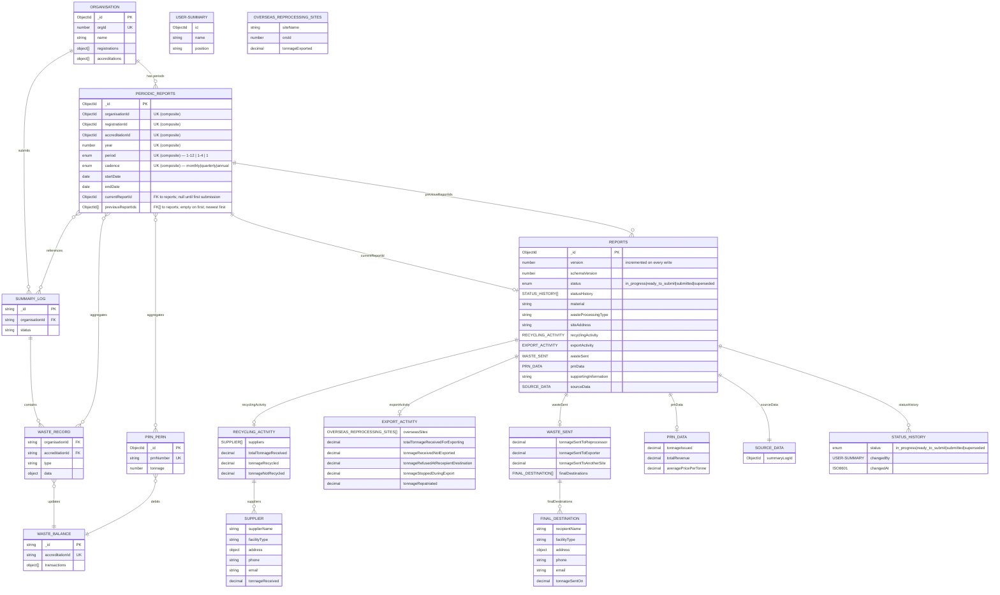

# Regulatory Reporting Data Model

## Status

Proposed

## Context

Reprocessors and exporters must submit monthly (accredited) or quarterly (registered) reports to regulatory agencies containing:

- Tonnage data (received, recycled/exported, sent on)
- Supplier and destination facility details
- PRN/PERN issuance and financial data

Current system has operational collections (`summary-logs`, `waste-records`, `waste-balances`, `packaging-recycling-notes`) but needs optimized reporting collection for regulatory exports.

## Decision

Create two collections:

- `periodic-reports` — lean period identity anchor; composite unique key; holds pointers to current and previous report submissions.
- `reports` — standalone submission documents containing all field data and full status audit trail.

## Data Flow

```
Summary Log (submitted) ──┐
                          ├──> Waste Records ──┐
PRN/PERN (issued) ────────┤                    ├──> Periodic Report
                          │                    │    (aggregated)
Organisation Data ────────┴────────────────────┘
```

**Aggregation triggers**:

- Summary log submission
- PRN/PERN issuance
- Manual regeneration

**Source collections**:

- `waste-records` (type: received/sentOn/exported)
- `packaging-recycling-notes` (status: accepted)
- `epr-organisations` (denormalized)

## Entity Relationship Diagram



## Resubmission Flow

1. Insert new `REPORTS` document (status `in_progress`; first `STATUS_HISTORY` entry)
2. Set old `REPORTS` status → `superseded` (append entry to `statusHistory`)
3. Update `PERIODIC_REPORTS` atomically:
   - `previousReportIds = [currentReportId, ...previousReportIds]`
   - `currentReportId = new report _id`
