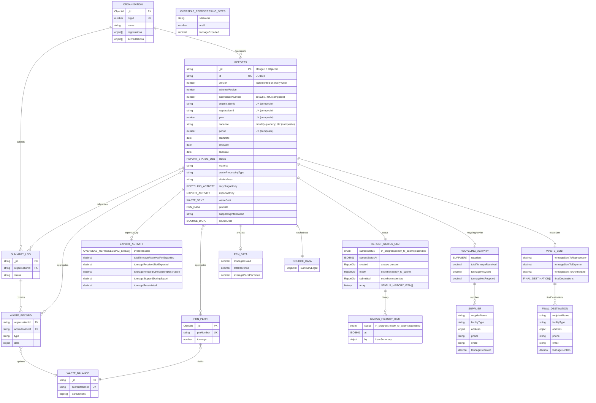

# Regulatory Reporting Data Model

## Status

Accepted

## Context

Reprocessors and exporters must submit monthly (accredited) or quarterly (registered) reports to regulatory agencies containing:

- Tonnage data (received, recycled/exported, sent on)
- Supplier and destination facility details
- PRN/PERN issuance and financial data

Current system has operational collections (`summary-logs`, `waste-records`, `waste-balances`, `packaging-recycling-notes`) but needs optimised reporting collection for regulatory exports.

## Decision

Create a single `reports` collection where each document is a standalone submission containing:

- All period-key fields denormalised directly on the document (`organisationId`, `registrationId`, `year`, `cadence`, `period`, `startDate`, `endDate`, `dueDate`)
- A `submissionNumber` to support multiple submissions per period (e.g. closed-month adjustments)
- All field data and a full status audit trail in a PRN-style status object

The `periodic-reports` listing view (one entry per `(organisationId, registrationId, year)`, with nested period slots) is computed at read time by grouping and projecting report documents in the application layer rather than being stored as a separate collection.

## Design Decisions

### Single collection over two

**Previous approach** maintained two collections:

- `periodic-reports` — one document per `(organisationId, registrationId, year)`; nested `reports` map keyed by cadence then period; each slot held `startDate`, `endDate`, `dueDate`, `currentReportId`, `previousReportIds`.
- `reports` — standalone submission documents with all field data and status history.

The `periodic-reports` collection was intended to optimise the initial read that lists all available reporting periods for an organisation/registration across years. That optimisation can be achieved equally well at read time: `findPeriodicReports` queries only a small projection of fields from the `reports` collection (id, submissionNumber, period keys, `status.currentStatus`) and groups them in-application. The extra write path, the two-phase create (insert report then upsert slot), and the dual-collection operational overhead are eliminated.

**Why single collection was chosen**

- **Simpler writes**: `createReport` is a single document insert; no separate slot upsert on `periodic-reports`.
- **Simpler deletes**: `deleteReport` is a hard `findOneAndDelete`; no slot bookkeeping.
- **Read-time grouping is cheap**: `findPeriodicReports` uses a partial projection and groups in-application. The query is covered by the compound `(organisationId, registrationId)` index.
- **Integrity via unique index**: a unique index on `(organisationId, registrationId, year, cadence, period, submissionNumber)` is enforced by MongoDB, giving the same uniqueness guarantee the old `periodic-reports` unique key provided, without a separate collection.

### `submissionNumber`

Each report document carries a `submissionNumber` (integer, default `1`). The unique index includes `submissionNumber`, which means a second submission for the same period can be stored as `submissionNumber: 2` once the original has been submitted. This supports future closed-month adjustment workflows without a schema change.

### PRN-style status object

The `status` field is an object rather than a flat string + history array:

```json
{
  "currentStatus": "submitted",
  "currentStatusAt": "2026-06-30T11:00:00Z",
  "created": {
    "at": "2026-06-15T09:00:00Z",
    "by": {
      "id": "507f1f77bcf86cd799430001",
      "name": "Jane Smith",
      "position": "Compliance Officer"
    }
  },
  "ready": {
    "at": "2026-06-28T14:30:00Z",
    "by": {
      "id": "507f1f77bcf86cd799430001",
      "name": "Jane Smith",
      "position": "Compliance Officer"
    }
  },
  "submitted": {
    "at": "2026-06-30T11:00:00Z",
    "by": {
      "id": "507f1f77bcf86cd799430002",
      "name": "Bob Jones",
      "position": "Senior Manager"
    }
  },
  "history": [
    {
      "status": "in_progress",
      "at": "2026-06-15T09:00:00Z",
      "by": {
        "id": "507f1f77bcf86cd799430001",
        "name": "Jane Smith",
        "position": "Compliance Officer"
      }
    },
    {
      "status": "ready_to_submit",
      "at": "2026-06-28T14:30:00Z",
      "by": {
        "id": "507f1f77bcf86cd799430001",
        "name": "Jane Smith",
        "position": "Compliance Officer"
      }
    },
    {
      "status": "submitted",
      "at": "2026-06-30T11:00:00Z",
      "by": {
        "id": "507f1f77bcf86cd799430002",
        "name": "Bob Jones",
        "position": "Senior Manager"
      }
    }
  ]
}
```

Named slots (`created`, `ready`, `submitted`) allow direct field access without scanning the history array. The `STATUS_TO_SLOT` map drives this: `{ in_progress → created, ready_to_submit → ready, submitted → submitted }`.

Active statuses are `in_progress` and `ready_to_submit`; `submitted` is terminal. `superseded` and `deleted` statuses have been removed — deletion is a hard delete of the document.

### `ReportPerPeriod` computed view

`findPeriodicReports` returns a nested `PeriodicReport[]` structure computed in-application. Each period slot contains:

- `current` — a `ReportSummary` (`{ id, status, submissionNumber }`) for the active (non-submitted) report, or `null`
- `previousSubmissions` — array of `ReportSummary` objects for all submitted reports on that slot, sorted by `submissionNumber` descending

## Data Flow

```
Summary Log (submitted) ──┐
                          ├──> Waste Records ──┐
PRN/PERN (issued) ────────┤                    ├──> Reports
                          │                    │    (aggregated)
Organisation Data ────────┴────────────────────┘
```

**Aggregation triggers**:

- Summary log submission
- PRN/PERN issuance
- Manual regeneration

**Source collections**:

- `waste-records` (type: received/sentOn/exported)
- `packaging-recycling-notes` (status: accepted)
- `epr-organisations` (denormalized)

## Entity Relationship Diagram



## MongoDB Indexes

| Collection | Index fields                                                                                    | Options                                                                    |
| ---------- | ----------------------------------------------------------------------------------------------- | -------------------------------------------------------------------------- |
| `reports`  | `{ id: 1 }`                                                                                     | unique                                                                     |
| `reports`  | `{ organisationId: 1, registrationId: 1 }`                                                      | —                                                                          |
| `reports`  | `{ organisationId: 1, registrationId: 1, year: 1, cadence: 1, period: 1, submissionNumber: 1 }` | unique                                                                     |
| `reports`  | `{ organisationId: 1, registrationId: 1, year: 1, cadence: 1, period: 1 }`                      | unique, partial: `status.currentStatus $in [in_progress, ready_to_submit]` |

The compound unique index enforces one document per submission slot. The partial unique index (`reports_one_active_draft_per_slot`) enforces that at most one active draft (`in_progress` or `ready_to_submit`) can exist for a given `(organisationId, registrationId, year, cadence, period)` at any time, regardless of `submissionNumber`. Both violations produce a duplicate key error (code 11000), translated to a `409 Conflict` response.

## Example

**reports document**

```json
{
  "id": "a1b2c3d4-e5f6-7890-abcd-ef1234567890",
  "version": 3,
  "schemaVersion": 1,
  "submissionNumber": 1,
  "organisationId": "507f1f77bcf86cd799439011",
  "registrationId": "507f1f77bcf86cd799439022",
  "year": 2026,
  "cadence": "monthly",
  "period": 6,
  "startDate": "2026-06-01",
  "endDate": "2026-06-30",
  "dueDate": "2026-07-28",
  "material": "plastic",
  "wasteProcessingType": "reprocessor",
  "siteAddress": "1 Recycling Way, Leeds, LS1 1AA",
  "status": {
    "currentStatus": "submitted",
    "currentStatusAt": "2026-06-30T11:00:00Z",
    "created": {
      "at": "2026-06-15T09:00:00Z",
      "by": {
        "id": "507f1f77bcf86cd799430001",
        "name": "Jane Smith",
        "position": "Compliance Officer"
      }
    },
    "ready": {
      "at": "2026-06-28T14:30:00Z",
      "by": {
        "id": "507f1f77bcf86cd799430001",
        "name": "Jane Smith",
        "position": "Compliance Officer"
      }
    },
    "submitted": {
      "at": "2026-06-30T11:00:00Z",
      "by": {
        "id": "507f1f77bcf86cd799430002",
        "name": "Bob Jones",
        "position": "Senior Manager"
      }
    },
    "history": [
      {
        "status": "in_progress",
        "at": "2026-06-15T09:00:00Z",
        "by": {
          "id": "507f1f77bcf86cd799430001",
          "name": "Jane Smith",
          "position": "Compliance Officer"
        }
      },
      {
        "status": "ready_to_submit",
        "at": "2026-06-28T14:30:00Z",
        "by": {
          "id": "507f1f77bcf86cd799430001",
          "name": "Jane Smith",
          "position": "Compliance Officer"
        }
      },
      {
        "status": "submitted",
        "at": "2026-06-30T11:00:00Z",
        "by": {
          "id": "507f1f77bcf86cd799430002",
          "name": "Bob Jones",
          "position": "Senior Manager"
        }
      }
    ]
  },
  "recyclingActivity": {
    "suppliers": [
      {
        "supplierName": "Acme Waste Ltd",
        "facilityType": "MRF",
        "address": {
          "line1": "10 Depot Rd",
          "city": "Manchester",
          "postcode": "M1 1AA"
        },
        "phone": "0161 000 0000",
        "email": "contact@acmewaste.co.uk",
        "tonnageReceived": 120.5
      }
    ],
    "totalTonnageReceived": 120.5,
    "tonnageRecycled": 110.0,
    "tonnageNotRecycled": 10.5
  },
  "wasteSent": {
    "tonnageSentToReprocessor": 50.0,
    "tonnageSentToExporter": 30.0,
    "tonnageSentToAnotherSite": 30.0,
    "finalDestinations": [
      {
        "recipientName": "GreenCycle GmbH",
        "facilityType": "reprocessor",
        "address": { "line1": "Recyclingstr. 4", "city": "Hamburg" },
        "phone": "+49 40 000000",
        "email": "ops@greencycle.de",
        "tonnageSentOn": 50.0
      }
    ]
  },
  "exportActivity": null,
  "prnData": {
    "tonnageIssued": 110.0,
    "totalRevenue": 5500.0,
    "averagePricePerTonne": 50.0
  },
  "supportingInformation": "No issues to report.",
  "sourceData": {
    "summaryLogId": "507f1f77bcf86cd799439099"
  }
}
```

**`findPeriodicReports` response** (computed read model, not stored)

```json
[
  {
    "organisationId": "507f1f77bcf86cd799439011",
    "registrationId": "507f1f77bcf86cd799439022",
    "year": 2026,
    "reports": {
      "monthly": {
        "4": {
          "startDate": "2026-04-01",
          "endDate": "2026-04-30",
          "dueDate": "2026-05-28",
          "current": {
            "id": "a1b2c3d4-0004-0000-0000-000000000000",
            "status": "in_progress",
            "submissionNumber": 1
          },
          "previousSubmissions": []
        },
        "6": {
          "startDate": "2026-06-01",
          "endDate": "2026-06-30",
          "dueDate": "2026-07-28",
          "current": null,
          "previousSubmissions": [
            {
              "id": "a1b2c3d4-e5f6-7890-abcd-ef1234567890",
              "status": "submitted",
              "submissionNumber": 1
            }
          ]
        }
      },
      "quarterly": {
        "1": {
          "startDate": "2026-01-01",
          "endDate": "2026-03-31",
          "dueDate": "2026-04-28",
          "current": {
            "id": "a1b2c3d4-0010-0000-0000-000000000000",
            "status": "ready_to_submit",
            "submissionNumber": 1
          },
          "previousSubmissions": []
        }
      }
    }
  }
]
```
