# Summary Log Preview Integrity

This document describes how the system ensures that the preview shown to users before confirming a summary log submission accurately reflects what will happen when they confirm.

For related context, see:

- [Summary Log Submission LLD](./summary-log-submission-lld.md) - full submission workflow
- [ADR 21: Idempotent Operations](../decisions/0021-idempotent-operations-and-retry-mechanisms.md) - resilience patterns

<!-- prettier-ignore-start -->
<!-- TOC -->

- [Summary Log Preview Integrity](#summary-log-preview-integrity)
  - [Goals](#goals)
  - [Problem statement](#problem-statement)
    - [Problem 1: Stale preview](#problem-1-stale-preview)
    - [Problem 2: Validation reading partial data](#problem-2-validation-reading-partial-data)
    - [Problem 3: Abandoned previews](#problem-3-abandoned-previews)
  - [Key constraint](#key-constraint)
  - [Solution](#solution)
    - [Mechanism 1: Supersede on new upload](#mechanism-1-supersede-on-new-upload)
    - [Mechanism 2: Block uploads during submission](#mechanism-2-block-uploads-during-submission)
    - [Mechanism 3: Verify still current on confirm](#mechanism-3-verify-still-current-on-confirm)
  - [How the mechanisms work together](#how-the-mechanisms-work-together)
  - [Scenarios](#scenarios)
    _ [Scenario 1: User confirms promptly](#scenario-1-user-confirms-promptly)
    _ [Scenario 2: Another user uploads before confirm](#scenario-2-another-user-uploads-before-confirm)
    \_ [Scenario 3: Another user tries to upload during submission](#scenario-3-another-user-tries-to-upload-during-submission)
    - [Scenario 4: User abandons preview](#scenario-4-user-abandons-preview)
  - [Race conditions](#race-conditions)
    - [Race 1: Concurrent uploads for same org/reg](#race-1-concurrent-uploads-for-same-orgreg)
    - [Race 2: Upload between verify and transition](#race-2-upload-between-verify-and-transition)
    - [Race 3: Concurrent confirms of the same log](#race-3-concurrent-confirms-of-the-same-log)
    - [Race 4: Upload during validation of another upload](#race-4-upload-during-validation-of-another-upload)
  - [Summary](#summary)
  - [Design consideration: CDP initiate timing](#design-consideration-cdp-initiate-timing)
    - [The problem](#the-problem)
    - [Proposed solution: Change preprocessing supersede rules](#proposed-solution-change-preprocessing-supersede-rules)
    - [Updated state machine](#updated-state-machine)
    - [Supersede and blocking rules](#supersede-and-blocking-rules-1)
    - [Scenario: Multiple users on upload page](#scenario-multiple-users-on-upload-page)
    - [Impact on race conditions](#impact-on-race-conditions)
  - [Alternative design: Deferred staleness detection](#alternative-design-deferred-staleness-detection)
    - [Core principle](#core-principle)
    - [Mechanism: Validated-against tracking](#mechanism-validated-against-tracking)
    - [Why log IDs rather than timestamps](#why-log-ids-rather-than-timestamps)
    - [Why validation doesn't need blocking](#why-validation-doesnt-need-blocking)
    - [Optional: Early staleness detection on view](#optional-early-staleness-detection-on-view)
    - [Concurrent submission handling](#concurrent-submission-handling)
    - [Comparison with original design](#comparison-with-original-design)
    - [Updated flow diagram](#updated-flow-diagram)
    - [Scenarios under this design](#scenarios-under-this-design)
    - [Trade-offs](#trade-offs)
    - [When to prefer this design](#when-to-prefer-this-design)
      <!-- TOC -->
      <!-- prettier-ignore-end -->

## Goals

The system must achieve three goals:

1. **Accurate previews**: The preview shown to users must accurately reflect what will happen when they confirm
2. **No partial data reads**: Validation must not read partially-updated waste records during another submission
3. **No stuck states**: An abandoned preview must not block other users from uploading

These goals are in tension. Blocking uploads during submission (goal 2) could cause stuck states if submission fails. Allowing uploads at any time could produce inaccurate previews (goal 1) or read partial data (goal 2). The solution must balance all three.

## Problem statement

### Problem 1: Stale preview

When a user uploads a summary log, they see a preview showing what will happen when they confirm:

- **Added**: New waste records that will be created
- **Adjusted**: Existing records that will be updated
- **Unchanged**: Records that match existing data

The preview is generated by comparing the uploaded summary log against the current state of waste records. If those waste records change before the user confirms, the preview becomes inaccurate.

### Problem 2: Validation reading partial data

Summary log submission involves bulk-writing potentially thousands of waste record versions. This operation takes time. If another user uploads a summary log while submission is in progress, the validation phase (which reads waste records to generate the preview) could read partially-updated data, producing an incorrect preview.

### Problem 3: Abandoned previews

A user might upload a summary log, see the preview, and then never confirm - they might close the browser, go on holiday, or simply decide not to proceed. If the system blocked other users from uploading while a preview exists, organisations could become stuck indefinitely.

## Key constraint

**Summary log submission is the only way to modify waste records.**

This constraint simplifies the integrity problem: the only way waste records can change is via another summary log submission for the same organisation/registration pair.

## Solution

Three mechanisms work together to ensure preview integrity:

### Mechanism 1: Supersede on new upload

When a new summary log is uploaded for an organisation/registration pair, all previous unsubmitted logs for that pair are marked as `superseded` (a terminal state).

```javascript
// On upload: supersede unsubmitted logs
await updateMany(
  {
    organisationId,
    registrationId,
    status: { $in: ['preprocessing', 'validating', 'validated'] }
  },
  { $set: { status: 'superseded' } }
)
```

**Effect**: If User A has a validated preview and User B uploads a new summary log, User A's log becomes superseded. User A cannot confirm a stale preview because their log is no longer in a confirmable state.

### Mechanism 2: Block uploads during submission

When a submission is in progress for an organisation/registration pair, new uploads for that pair are blocked.

```javascript
// On upload: check for active submission
const submitting = await findOne({
  organisationId,
  registrationId,
  status: 'submitting'
})
if (submitting) {
  throw Boom.conflict('A submission is in progress. Please wait.')
}
```

**Effect**: While waste records are being updated, no new uploads can start. This prevents the validation phase from reading partially-updated waste records.

### Mechanism 3: Verify still current on confirm

Before processing a confirmation, the system verifies the summary log is still the current validated log for its organisation/registration pair.

```javascript
// On confirm: verify still current
const currentLog = await findOne({
  organisationId,
  registrationId,
  status: 'validated'
})
if (!currentLog || currentLog.id !== submittedLogId) {
  throw Boom.conflict('A newer summary log has been uploaded')
}
```

**Effect**: Race condition protection. Even if superseding happened between the user clicking confirm and the request arriving, the confirmation is rejected.

## How the mechanisms work together

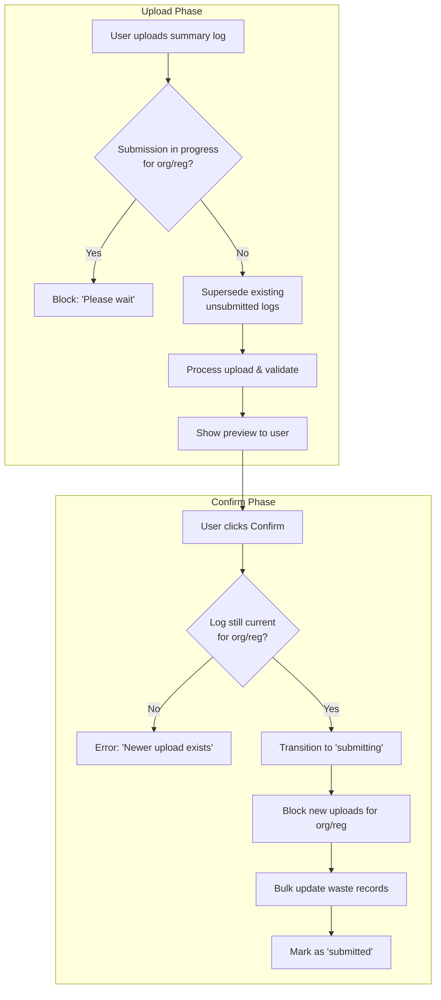

## Scenarios

### Scenario 1: User confirms promptly

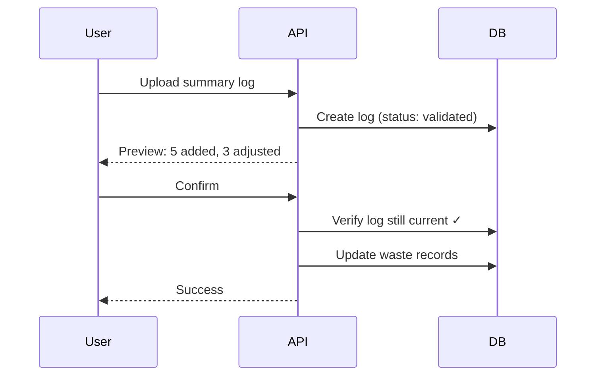

**Outcome**: Preview matches result. No integrity issues.

### Scenario 2: Another user uploads before confirm

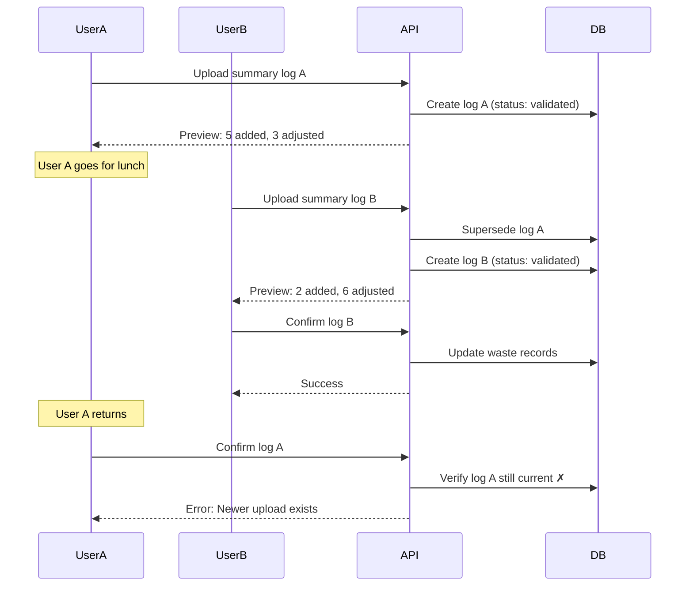

**Outcome**: User A cannot confirm stale preview. They must re-upload to see the current state.

### Scenario 3: Another user tries to upload during submission

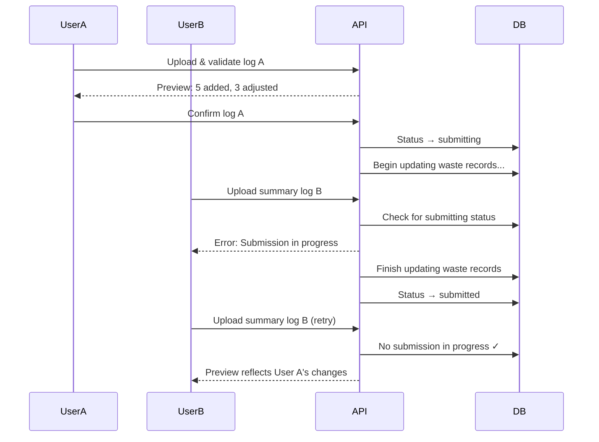

**Outcome**: User B cannot generate a preview from partial data. They must wait, then their preview reflects the completed submission.

### Scenario 4: User abandons preview

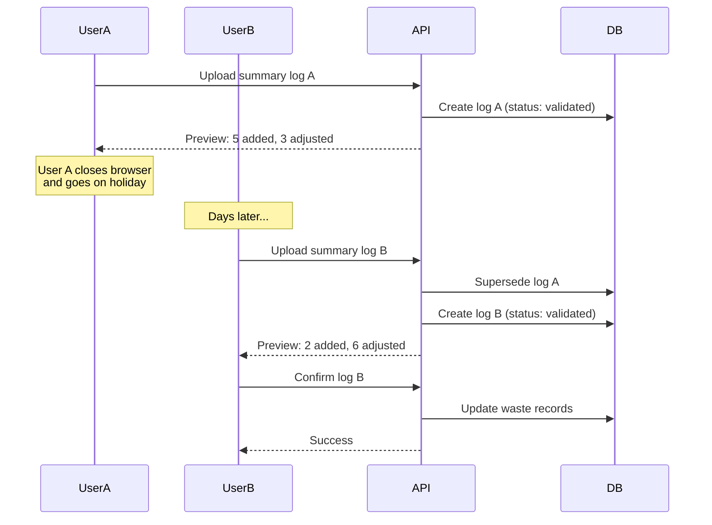

**Outcome**: User A's abandoned preview does not block User B. The supersede mechanism allows new uploads at any time (except during active submission), preventing stuck states.

## Race conditions

The mechanisms described above involve multiple database operations. Without careful implementation, race conditions could undermine the integrity guarantees. This section documents the race conditions and required mitigations.

For the complete summary log state machine, see the [Summary Log Submission LLD](./summary-log-submission-lld.md#summary-log-status-transitions). The key states relevant to preview integrity are:

- `preprocessing` → `validating` → `validated` → `submitting` → `submitted`
- `preprocessing`, `validating`, `validated` can transition to `superseded`
- `submitting` **cannot** be superseded - uploads are blocked instead

**Assumption**: MongoDB operations on a single document are atomic. Operations spanning multiple documents (e.g. bulk waste record writes) are not atomic, but the blocking mechanism prevents concurrent access during those operations.

### Race 1: Concurrent uploads for same org/reg

Two users upload summary logs for the same organisation/registration at the same time. The CDP callback triggers the supersede + create sequence.

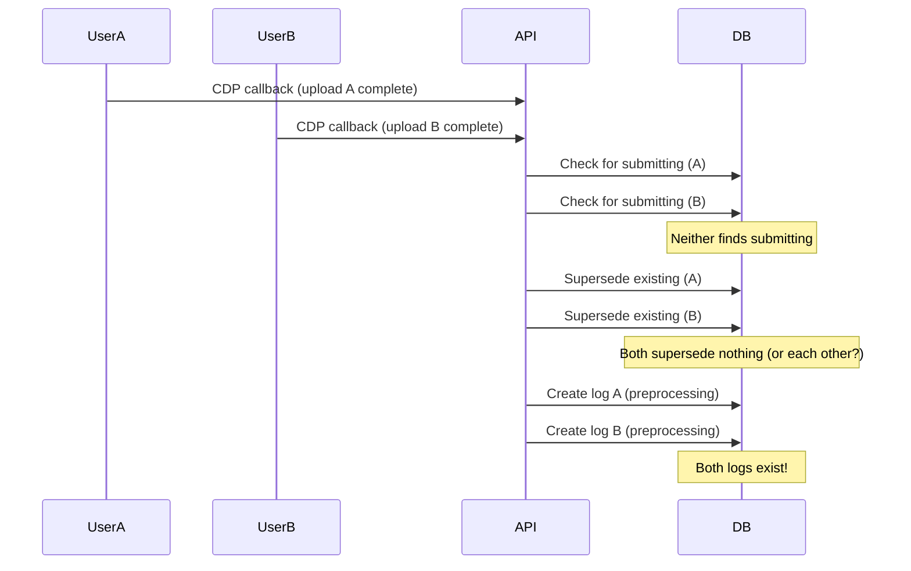

**Risk**: Both logs proceed through `validating` → `validated`, violating the "one active log per org/reg" invariant.

**Mitigation**: The check + supersede + create operations must be atomic. Options:

- Use a transaction for the entire sequence
- Add a unique partial index on `(organisationId, registrationId)` for non-terminal statuses, causing one insert to fail

### Race 2: Upload between verify and transition

An upload arrives after confirm verifies "still current" but before transitioning to `submitting`.

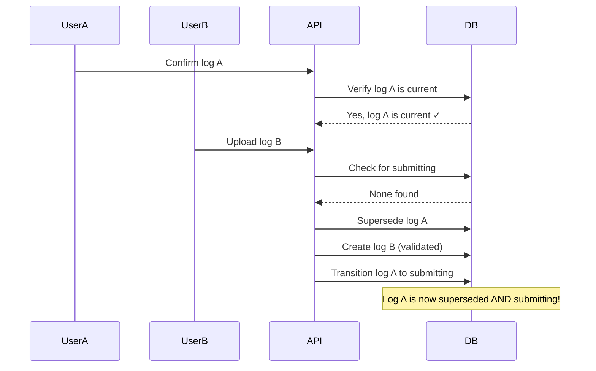

**Risk**: User A submits a superseded log with a stale preview.

**Mitigation**: The "verify current" and "transition to submitting" must be atomic:

```javascript
// Atomic verify + transition
const result = await findOneAndUpdate(
  {
    _id: logId,
    organisationId,
    registrationId,
    status: 'validated' // Only succeeds if still validated
  },
  { $set: { status: 'submitting' } }
)
if (!result) {
  throw Boom.conflict('Summary log is no longer current')
}
```

### Race 3: Concurrent confirms of the same log

Two browser tabs (or users with access to the same log) click confirm simultaneously.

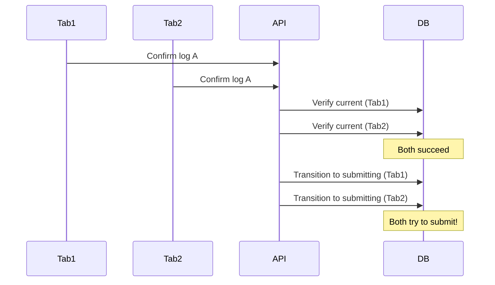

**Risk**: Double submission attempt. Could result in duplicate waste record versions.

**Mitigation**: Same as Race 2 - atomic `findOneAndUpdate` with `status: 'validated'` condition. Only one request succeeds; the other finds the status is no longer `validated` and fails.

### Race 4: Upload during validation of another upload

A new upload supersedes a log that is still being validated (processing a large file).

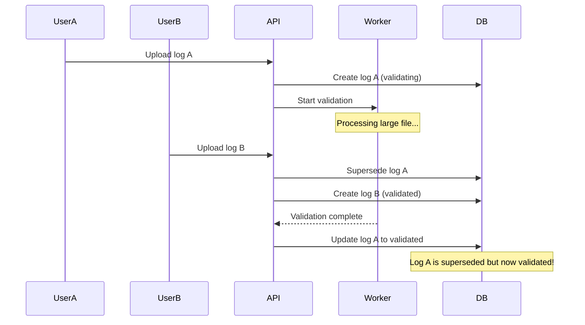

**Risk**: A superseded log transitions to `validated`, potentially allowing confirmation of stale data.

**Mitigation**: Before saving `validated` status, verify the log hasn't been superseded:

```javascript
// Atomic validation completion
const result = await findOneAndUpdate(
  {
    _id: logId,
    status: 'validating' // Only succeeds if still validating
  },
  { $set: { status: 'validated', loads: calculatedLoads } }
)
if (!result) {
  // Log was superseded during validation - discard results
  return
}
```

## Summary

| Race | Description              | Mitigation                                        |
| ---- | ------------------------ | ------------------------------------------------- |
| 1    | Concurrent uploads       | Transaction or unique partial index               |
| 2    | Upload during confirm    | Atomic verify + transition (`findOneAndUpdate`)   |
| 3    | Concurrent confirms      | Atomic verify + transition (`findOneAndUpdate`)   |
| 4    | Upload during validation | Atomic validation completion (`findOneAndUpdate`) |

Races 2-4 follow the same pattern: use `findOneAndUpdate` with a status condition to make check-then-act operations atomic. This is possible because each race involves a single summary log document, and MongoDB guarantees atomicity for single-document operations.

Race 1 is different because it involves multiple operations (check for submitting, supersede existing, create new). Options include using a transaction or a unique partial index on `(organisationId, registrationId)` for non-terminal statuses.

The blocking mechanism (check for `submitting` before upload) handles the waste records partial-read problem separately. The races documented here are about summary log state transitions, which can be made atomic within MongoDB's guarantees.

## Design consideration: CDP initiate timing

The solution described above assumes that the summary log is created when the user clicks the upload button. However, CDP Uploader works differently: the upload is **initiated when the user visits the upload page**, not when they click upload. This creates a timing gap that affects the design.

### The problem

**Assumed flow:**

```
User clicks upload → Initiate called → Summary log created
                  → File uploads to CDP
                  → CDP callback
```

**Actual flow:**

```
User visits upload page → Initiate called → Summary log created
[TIME GAP - could be minutes or hours]
User clicks upload → File uploads to CDP
                  → CDP callback
```

This creates several issues:

1. **Premature superseding**: If we supersede at initiation, User A visiting the upload page would supersede User B's validated preview - even though User A hasn't uploaded anything yet.

2. **Multiple users on upload page**: Two users could visit the upload page simultaneously. If we supersede at initiation, they would supersede each other before either has uploaded a file.

3. **Abandoned page visits**: A user might visit the upload page and never upload a file, leaving a summary log in limbo.

### Proposed solution: Change preprocessing supersede rules

Rather than adding a new state, we change the behaviour of the existing `preprocessing` state:

| Rule                     | Original     | Proposed                                          |
| ------------------------ | ------------ | ------------------------------------------------- |
| Created at               | CDP initiate | CDP initiate (unchanged)                          |
| Multiple can exist       | No           | Yes - multiple users can be on upload page        |
| Superseded by new upload | Yes          | No - only `validating`/`validated` are superseded |
| Cleanup                  | None         | TTL expiry for abandoned uploads                  |

This minimises changes to the existing state machine while addressing the CDP initiate timing issue.

### Updated state machine

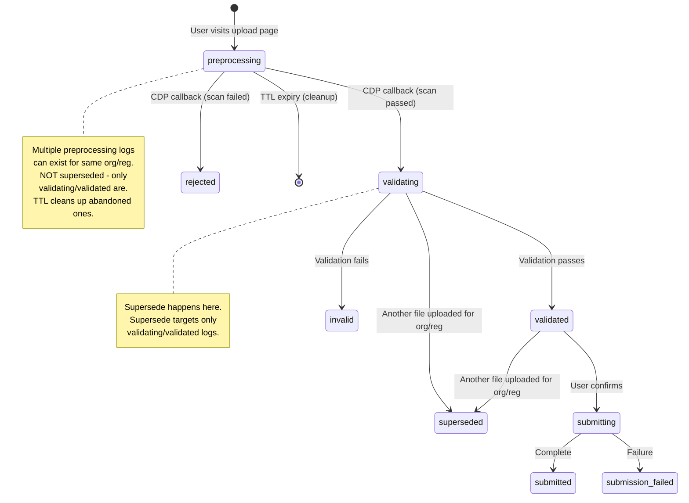

### Supersede and blocking rules

**At initiation (user visits upload page):**

- Create summary log in `preprocessing` state
- Do NOT supersede any existing logs
- Do NOT check for `submitting` (allow page visit even during submission)

**At CDP callback (file upload complete):**

1. Check if own log is `superseded` → if so, stop (do not validate)
2. Check for `submitting` status → if found, block with error
3. Supersede existing `validating`, `validated` logs for same org/reg (NOT `preprocessing`)
4. Transition own log from `preprocessing` to `validating`

**Key rules:**

- `preprocessing` logs are NEVER superseded - multiple users can be on the upload page simultaneously
- Only `validating` and `validated` logs are superseded when another user's CDP callback arrives
- The supersede check (step 1) catches the case where our log already transitioned to `validating` but was then superseded by another upload before we completed
- `preprocessing` logs have a TTL (e.g. 24 hours) to clean up abandoned page visits

### Scenario: Multiple users on upload page

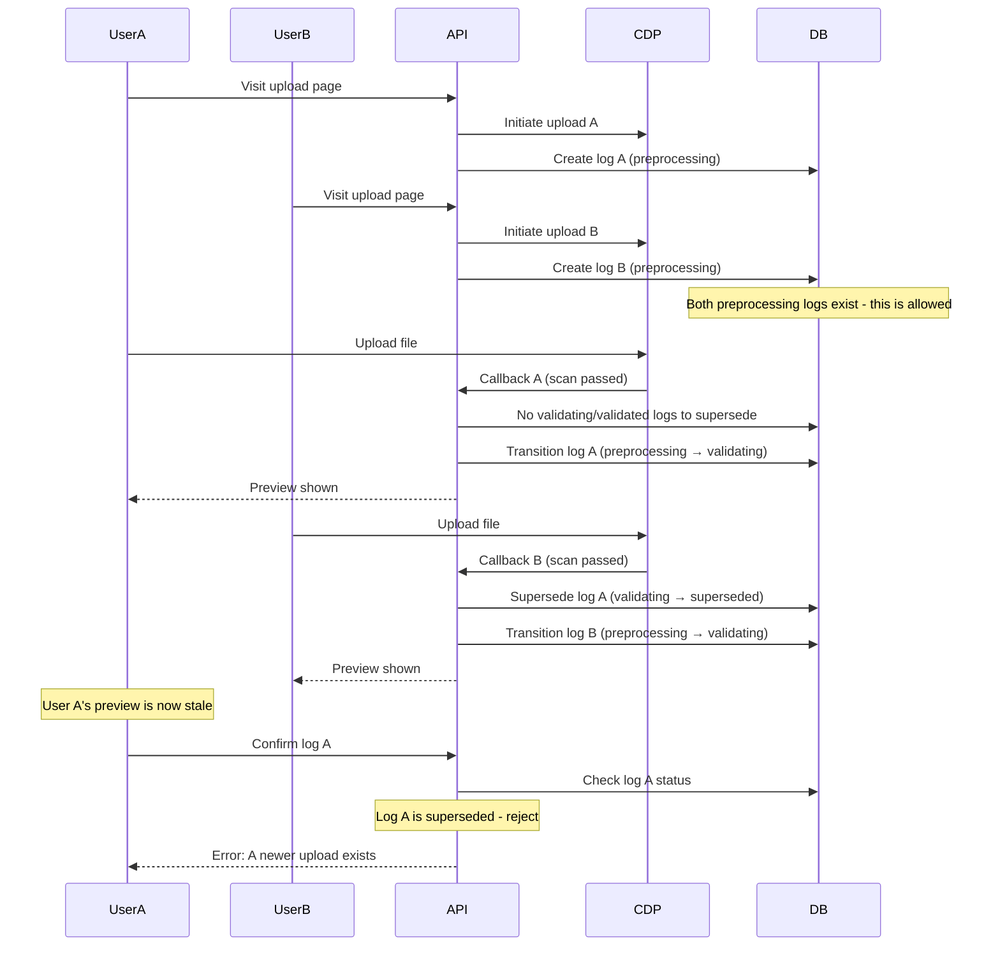

**Outcome**: Both users can upload. Last upload wins - User B's upload supersedes User A's. When User A tries to confirm, they're told a newer upload exists.

### Impact on race conditions

The changed `preprocessing` behaviour affects Race 1 (concurrent uploads):

**Previous understanding**: CDP callbacks arrive at the same time, both try to supersede + create.

**New understanding**: Both users have `preprocessing` logs (created when they visited the upload page). When CDP callbacks arrive:

- First callback transitions to `validating` and supersedes other `validating`/`validated` logs (but not `preprocessing`)
- Second callback transitions to `validating` and supersedes the first user's `validating` log

This simplifies Race 1 because:

- The summary log already exists (created at initiation)
- The CDP callback just needs to atomically transition own status + supersede others
- `preprocessing` logs are not superseded, so the race is between transitions to `validating`

```javascript
// At CDP callback: atomic transition + supersede
const ownLog = await findOneAndUpdate(
  {
    _id: logId,
    status: 'preprocessing' // Only proceed if still preprocessing
  },
  { $set: { status: 'validating' } }
)

if (!ownLog) {
  // Log is no longer preprocessing (shouldn't happen, but handle it)
  return { error: 'Upload state changed unexpectedly' }
}

// Now supersede other validating/validated logs for this org/reg
// Note: preprocessing logs are NOT superseded
await updateMany(
  {
    organisationId,
    registrationId,
    _id: { $ne: logId },
    status: { $in: ['validating', 'validated'] }
  },
  { $set: { status: 'superseded' } }
)
```

**Note**: This approach needs further analysis against all race conditions to verify it doesn't introduce new issues.

## Alternative design: Deferred staleness detection

This section describes a simpler alternative to the supersede-on-upload and block-uploads-during-submission mechanisms. Instead of eagerly invalidating previews, this design allows multiple validated previews to coexist and only checks for staleness at submission time.

### Core principle

Rather than blocking uploads or superseding logs during the upload/validation phase, we:

1. Allow multiple validated logs to exist for the same organisation/registration
2. Track which submission state each preview was generated against
3. Only reject at submission time if the underlying data has changed

### Mechanism: Validated-against tracking

When validation begins, we record the ID of the most recently submitted summary log for this organisation/registration pair:

```javascript
// On validation start: record the current submission baseline
const latestSubmitted = await SummaryLog.findOne({
  organisationId,
  registrationId,
  status: 'submitted'
}).sort({ submittedAt: -1 })

summaryLog.validatedAgainstLogId = latestSubmitted?._id ?? null
```

On confirm, we check whether the baseline has changed:

```javascript
// On confirm: verify baseline hasn't changed
const currentLatest = await SummaryLog.findOne({
  organisationId,
  registrationId,
  status: 'submitted'
}).sort({ submittedAt: -1 })

const baseline = summaryLog.validatedAgainstLogId?.toString() ?? null
const current = currentLatest?._id?.toString() ?? null

if (baseline !== current) {
  throw Boom.conflict('Waste records have changed since preview was generated')
}
```

### Why log IDs rather than timestamps

Comparing log IDs is more robust than timestamp comparison:

- **No granularity issues** - timestamps can have millisecond collisions
- **Clear lineage** - explicit reference to which submission the preview was based on
- **Simpler queries** - no date range comparisons, just ID equality
- **No waste record queries** - only query summary logs

### Why validation doesn't need blocking

In the original design, uploads were blocked during submission to prevent validation reading partially-updated waste records. In this design, that protection is unnecessary:

1. User A confirms and starts submitting (writing waste records)
2. User B uploads during this - validation records `validatedAgainstLogId = X` (the last submitted log _before_ A's submission)
3. User B's validation may read partial data and generate an inaccurate preview
4. User A's submission completes - A is now the latest submitted log
5. User B tries to confirm - staleness check compares `validatedAgainstLogId (X)` against latest `(A)` - **rejected**

The key insight: even if the preview is wrong (generated against partial data), it doesn't matter. The `validatedAgainstLogId` was recorded at validation start, before the concurrent submission completed. Once that submission completes, the baseline has changed and the staleness check catches it.

This eliminates the need to block uploads or validation during submission - the staleness check at confirmation time provides the safety net.

### Optional: Early staleness detection on view

While the staleness check at confirmation is sufficient for data integrity, we can improve user experience by also checking staleness when the user views a summary log:

```javascript
// On GET summary log: check if preview is stale
const currentLatest = await SummaryLog.findOne({
  organisationId,
  registrationId,
  status: 'submitted'
}).sort({ submittedAt: -1 })

const isStale =
  summaryLog.validatedAgainstLogId?.toString() !==
  (currentLatest?._id?.toString() ?? null)

return {
  ...summaryLog,
  isStale
}
```

The frontend can then display a warning: "This preview may be outdated. Another submission has occurred since this preview was generated."

This is purely a UX enhancement - the confirmation staleness check remains the authoritative gate. Benefits:

- Users discover staleness immediately on page load rather than after reviewing
- Reduces wasted time reviewing outdated previews
- No additional blocking or state transitions required

### Concurrent submission handling

The staleness check alone doesn't prevent concurrent submissions. If two users have previews validated against the same baseline, both could pass the staleness check simultaneously.

To prevent this, submissions are still serialised:

```javascript
// On confirm: ensure no submission in progress
const submitting = await SummaryLog.exists({
  organisationId,
  registrationId,
  status: 'submitting'
})

if (submitting) {
  throw Boom.conflict('A submission is in progress. Please wait and try again.')
}

// Then: atomic transition to submitting
// Then: staleness check
// Then: proceed with submission
```

This is a lighter touch than blocking uploads - users can always upload and validate new summary logs, only the final submission is serialised.

### Comparison with original design

| Aspect                   | Original design        | Alternative design |
| ------------------------ | ---------------------- | ------------------ |
| Upload blocking          | During submission      | Never              |
| Superseding on upload    | Yes                    | No                 |
| Multiple validated logs  | No (superseded)        | Yes                |
| When staleness detected  | On upload (superseded) | On submit          |
| Submission serialisation | Yes                    | Yes                |

### Updated flow diagram

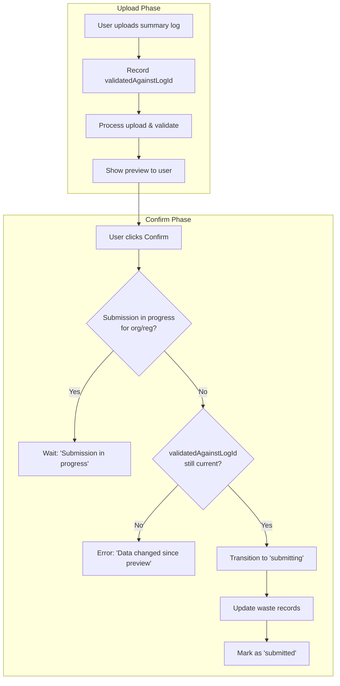

### Scenarios under this design

#### Scenario: Two users upload, second confirms first

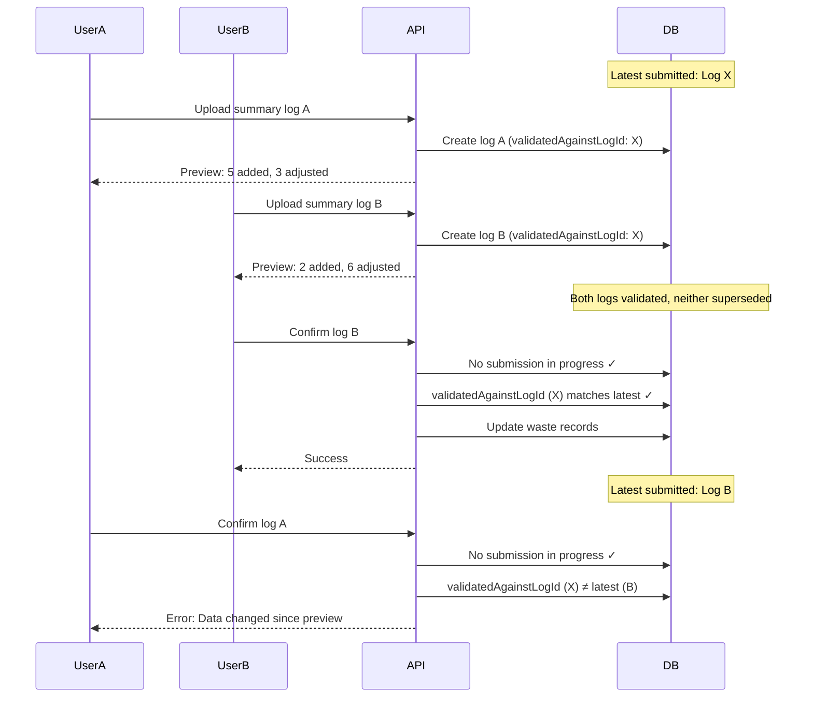

**Outcome**: User A must re-upload to see the current state reflecting User B's changes.

#### Scenario: Upload during submission

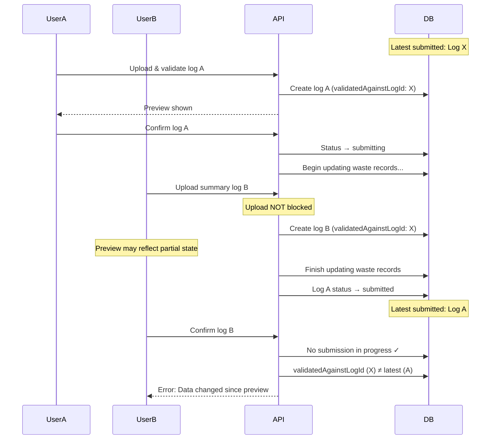

**Outcome**: User B's upload wasn't blocked, but their preview (potentially based on partial data) cannot be submitted. They must re-upload to see the correct state.

### Trade-offs

**Advantages:**

- Simpler state machine - no supersede transitions during upload phase
- Better upload availability - users are never blocked from uploading
- Cleaner mental model - "upload freely, we check at submission time"

**Disadvantages:**

- Deferred feedback - users don't know their preview is stale until they try to submit (mitigated by [early staleness detection on view](#optional-early-staleness-detection-on-view))
- Wasted review time - users might spend time reviewing a preview that's already outdated (mitigated by early staleness detection)
- More validated logs in the system - need TTL or cleanup mechanism for abandoned logs

### When to prefer this design

This design is appropriate when:

- Upload availability is prioritised over immediate staleness feedback
- Users typically confirm soon after previewing (stale previews are rare)
- The cost of re-uploading is low

The original design is preferable when:

- Immediate feedback about superseded previews is important
- Users may leave previews open for extended periods
- Detailed preview review is common (wasted review time is costly)
