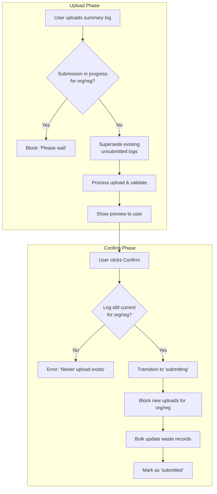
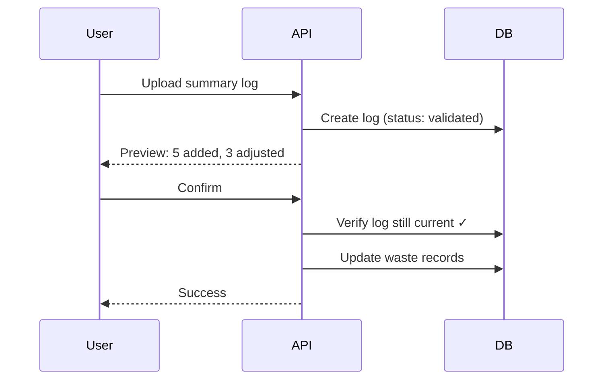
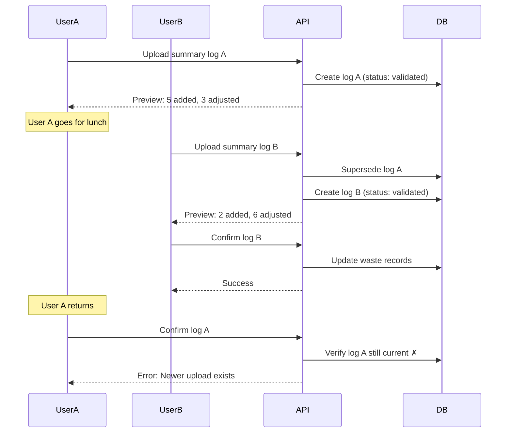
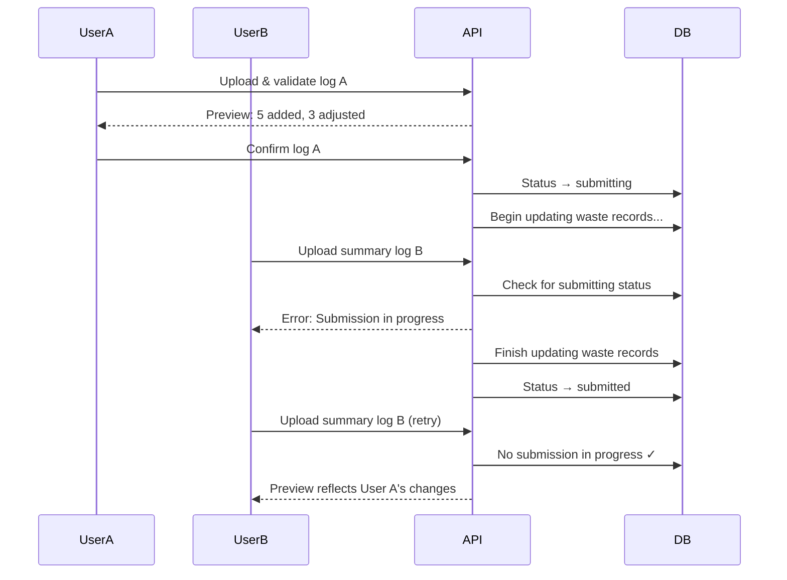
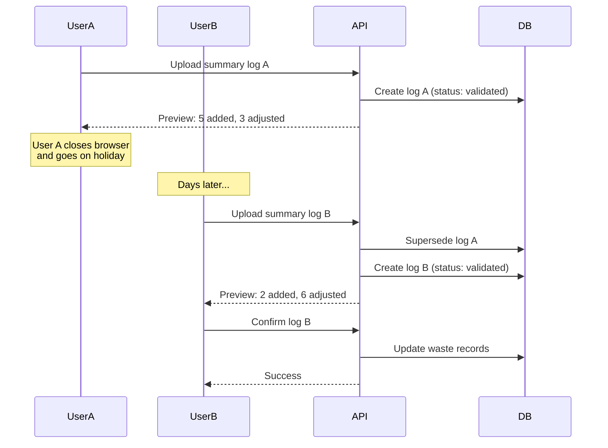
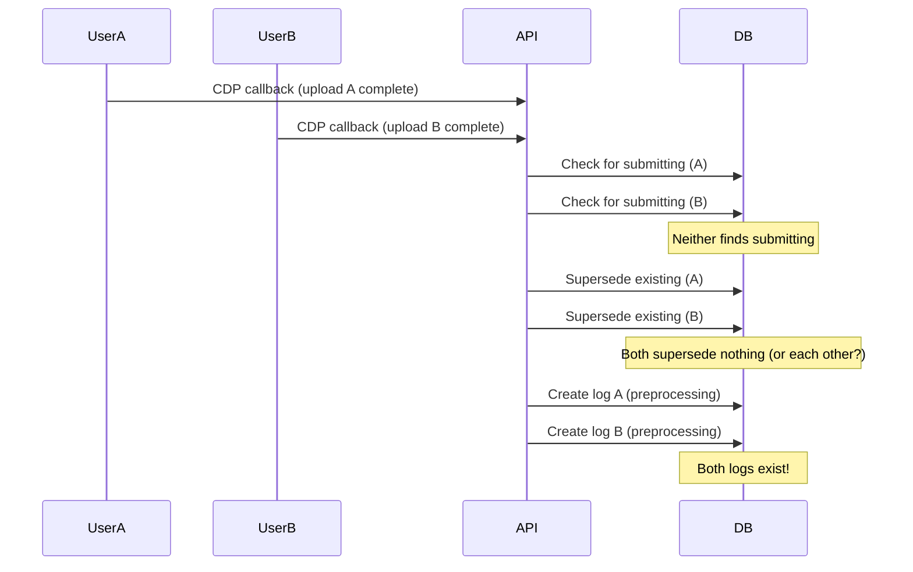
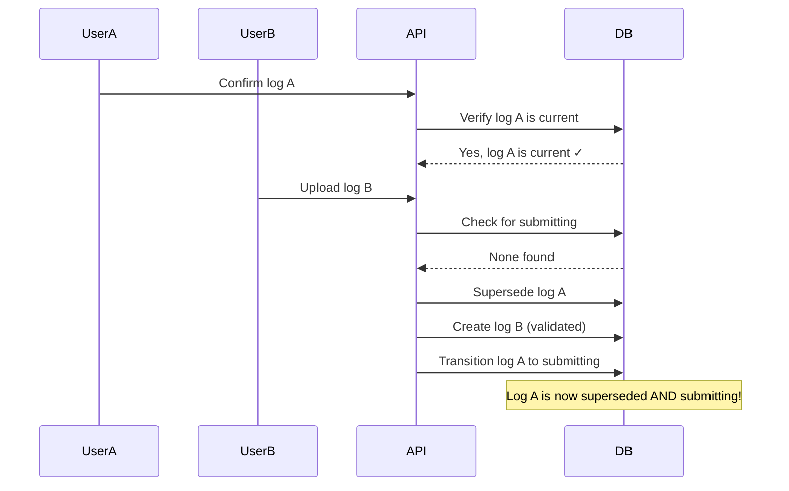
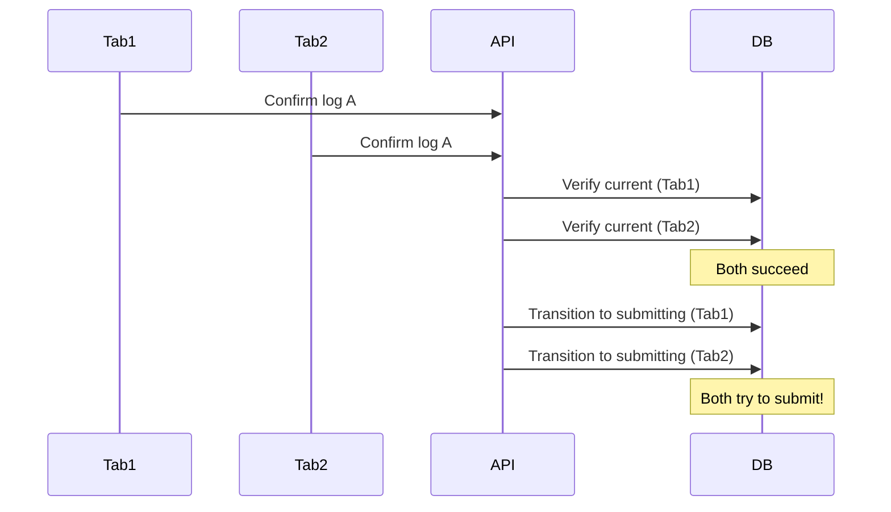
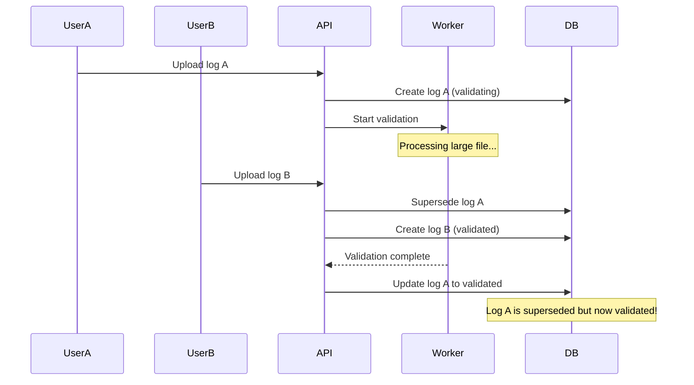

# Summary Log Preview Integrity

This document describes how the system ensures that the preview shown to users before confirming a summary log submission accurately reflects what will happen when they confirm.

For related context, see:

- [Summary Log Submission LLD](./summary-log-submission-lld.md) - full submission workflow
- [ADR 21: Idempotent Operations](../decisions/0021-idempotent-operations-and-retry-mechanisms.md) - resilience patterns

<!-- prettier-ignore-start -->
<!-- TOC -->

- [Summary Log Preview Integrity](#summary-log-preview-integrity)
  - [Goals](#goals)
  - [Problem statement](#problem-statement)
    - [Problem 1: Stale preview](#problem-1-stale-preview)
    - [Problem 2: Validation reading partial data](#problem-2-validation-reading-partial-data)
    - [Problem 3: Abandoned previews](#problem-3-abandoned-previews)
  - [Key constraint](#key-constraint)
  - [Solution](#solution)
    - [Mechanism 1: Supersede on new upload](#mechanism-1-supersede-on-new-upload)
    - [Mechanism 2: Block uploads during submission](#mechanism-2-block-uploads-during-submission)
    - [Mechanism 3: Verify still current on confirm](#mechanism-3-verify-still-current-on-confirm)
  - [How the mechanisms work together](#how-the-mechanisms-work-together)
  - [Scenarios](#scenarios)
    _ [Scenario 1: User confirms promptly](#scenario-1-user-confirms-promptly)
    _ [Scenario 2: Another user uploads before confirm](#scenario-2-another-user-uploads-before-confirm)
    \_ [Scenario 3: Another user tries to upload during submission](#scenario-3-another-user-tries-to-upload-during-submission)
    - [Scenario 4: User abandons preview](#scenario-4-user-abandons-preview)
  - [Race conditions](#race-conditions)
    - [Race 1: Concurrent uploads for same org/reg](#race-1-concurrent-uploads-for-same-orgreg)
    - [Race 2: Upload between verify and transition](#race-2-upload-between-verify-and-transition)
    - [Race 3: Concurrent confirms of the same log](#race-3-concurrent-confirms-of-the-same-log)
    - [Race 4: Upload during validation of another upload](#race-4-upload-during-validation-of-another-upload)
  - [Summary](#summary)
    <!-- TOC -->
    <!-- prettier-ignore-end -->

## Goals

The system must achieve three goals:

1. **Accurate previews**: The preview shown to users must accurately reflect what will happen when they confirm
2. **No partial data reads**: Validation must not read partially-updated waste records during another submission
3. **No stuck states**: An abandoned preview must not block other users from uploading

These goals are in tension. Blocking uploads during submission (goal 2) could cause stuck states if submission fails. Allowing uploads at any time could produce inaccurate previews (goal 1) or read partial data (goal 2). The solution must balance all three.

## Problem statement

### Problem 1: Stale preview

When a user uploads a summary log, they see a preview showing what will happen when they confirm:

- **Added**: New waste records that will be created
- **Adjusted**: Existing records that will be updated
- **Unchanged**: Records that match existing data

The preview is generated by comparing the uploaded summary log against the current state of waste records. If those waste records change before the user confirms, the preview becomes inaccurate.

### Problem 2: Validation reading partial data

Summary log submission involves bulk-writing potentially thousands of waste record versions. This operation takes time. If another user uploads a summary log while submission is in progress, the validation phase (which reads waste records to generate the preview) could read partially-updated data, producing an incorrect preview.

### Problem 3: Abandoned previews

A user might upload a summary log, see the preview, and then never confirm - they might close the browser, go on holiday, or simply decide not to proceed. If the system blocked other users from uploading while a preview exists, organisations could become stuck indefinitely.

## Key constraint

**Summary log submission is the only way to modify waste records.**

This constraint simplifies the integrity problem: the only way waste records can change is via another summary log submission for the same organisation/registration pair.

## Solution

Three mechanisms work together to ensure preview integrity:

### Mechanism 1: Supersede on new upload

When a new summary log is uploaded for an organisation/registration pair, all previous unsubmitted logs for that pair are marked as `superseded` (a terminal state).

```javascript
// On upload: supersede unsubmitted logs
await updateMany(
  {
    organisationId,
    registrationId,
    status: { $in: ['preprocessing', 'validating', 'validated'] }
  },
  { $set: { status: 'superseded' } }
)
```

**Effect**: If User A has a validated preview and User B uploads a new summary log, User A's log becomes superseded. User A cannot confirm a stale preview because their log is no longer in a confirmable state.

### Mechanism 2: Block uploads during submission

When a submission is in progress for an organisation/registration pair, new uploads for that pair are blocked.

```javascript
// On upload: check for active submission
const submitting = await findOne({
  organisationId,
  registrationId,
  status: 'submitting'
})
if (submitting) {
  throw Boom.conflict('A submission is in progress. Please wait.')
}
```

**Effect**: While waste records are being updated, no new uploads can start. This prevents the validation phase from reading partially-updated waste records.

### Mechanism 3: Verify still current on confirm

Before processing a confirmation, the system verifies the summary log is still the current validated log for its organisation/registration pair.

```javascript
// On confirm: verify still current
const currentLog = await findOne({
  organisationId,
  registrationId,
  status: 'validated'
})
if (!currentLog || currentLog.id !== submittedLogId) {
  throw Boom.conflict('A newer summary log has been uploaded')
}
```

**Effect**: Race condition protection. Even if superseding happened between the user clicking confirm and the request arriving, the confirmation is rejected.

## How the mechanisms work together



## Scenarios

### Scenario 1: User confirms promptly



**Outcome**: Preview matches result. No integrity issues.

### Scenario 2: Another user uploads before confirm



**Outcome**: User A cannot confirm stale preview. They must re-upload to see the current state.

### Scenario 3: Another user tries to upload during submission



**Outcome**: User B cannot generate a preview from partial data. They must wait, then their preview reflects the completed submission.

### Scenario 4: User abandons preview



**Outcome**: User A's abandoned preview does not block User B. The supersede mechanism allows new uploads at any time (except during active submission), preventing stuck states.

## Race conditions

The mechanisms described above involve multiple database operations. Without careful implementation, race conditions could undermine the integrity guarantees. This section documents the race conditions and required mitigations.

For the complete summary log state machine, see the [Summary Log Submission LLD](./summary-log-submission-lld.md#summary-log-status-transitions). The key states relevant to preview integrity are:

- `preprocessing` → `validating` → `validated` → `submitting` → `submitted`
- `preprocessing`, `validating`, `validated` can transition to `superseded`
- `submitting` **cannot** be superseded - uploads are blocked instead

**Assumption**: MongoDB operations on a single document are atomic. Operations spanning multiple documents (e.g. bulk waste record writes) are not atomic, but the blocking mechanism prevents concurrent access during those operations.

### Race 1: Concurrent uploads for same org/reg

Two users upload summary logs for the same organisation/registration at the same time. The CDP callback triggers the supersede + create sequence.



**Risk**: Both logs proceed through `validating` → `validated`, violating the "one active log per org/reg" invariant.

**Mitigation**: The check + supersede + create operations must be atomic. Options:

- Use a transaction for the entire sequence
- Add a unique partial index on `(organisationId, registrationId)` for non-terminal statuses, causing one insert to fail

### Race 2: Upload between verify and transition

An upload arrives after confirm verifies "still current" but before transitioning to `submitting`.



**Risk**: User A submits a superseded log with a stale preview.

**Mitigation**: The "verify current" and "transition to submitting" must be atomic:

```javascript
// Atomic verify + transition
const result = await findOneAndUpdate(
  {
    _id: logId,
    organisationId,
    registrationId,
    status: 'validated' // Only succeeds if still validated
  },
  { $set: { status: 'submitting' } }
)
if (!result) {
  throw Boom.conflict('Summary log is no longer current')
}
```

### Race 3: Concurrent confirms of the same log

Two browser tabs (or users with access to the same log) click confirm simultaneously.



**Risk**: Double submission attempt. Could result in duplicate waste record versions.

**Mitigation**: Same as Race 2 - atomic `findOneAndUpdate` with `status: 'validated'` condition. Only one request succeeds; the other finds the status is no longer `validated` and fails.

### Race 4: Upload during validation of another upload

A new upload supersedes a log that is still being validated (processing a large file).



**Risk**: A superseded log transitions to `validated`, potentially allowing confirmation of stale data.

**Mitigation**: Before saving `validated` status, verify the log hasn't been superseded:

```javascript
// Atomic validation completion
const result = await findOneAndUpdate(
  {
    _id: logId,
    status: 'validating' // Only succeeds if still validating
  },
  { $set: { status: 'validated', loads: calculatedLoads } }
)
if (!result) {
  // Log was superseded during validation - discard results
  return
}
```

## Summary

| Race | Description              | Mitigation                                        |
| ---- | ------------------------ | ------------------------------------------------- |
| 1    | Concurrent uploads       | Transaction or unique partial index               |
| 2    | Upload during confirm    | Atomic verify + transition (`findOneAndUpdate`)   |
| 3    | Concurrent confirms      | Atomic verify + transition (`findOneAndUpdate`)   |
| 4    | Upload during validation | Atomic validation completion (`findOneAndUpdate`) |

Races 2-4 follow the same pattern: use `findOneAndUpdate` with a status condition to make check-then-act operations atomic. This is possible because each race involves a single summary log document, and MongoDB guarantees atomicity for single-document operations.

Race 1 is different because it involves multiple operations (check for submitting, supersede existing, create new). Options include using a transaction or a unique partial index on `(organisationId, registrationId)` for non-terminal statuses.

The blocking mechanism (check for `submitting` before upload) handles the waste records partial-read problem separately. The races documented here are about summary log state transitions, which can be made atomic within MongoDB's guarantees.
