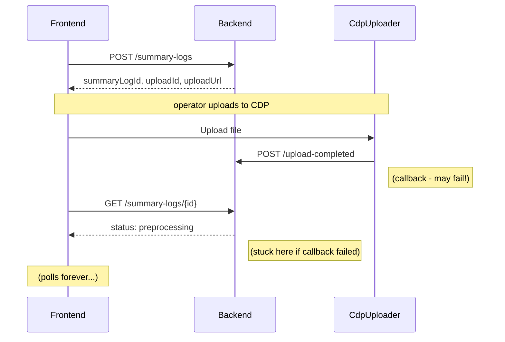
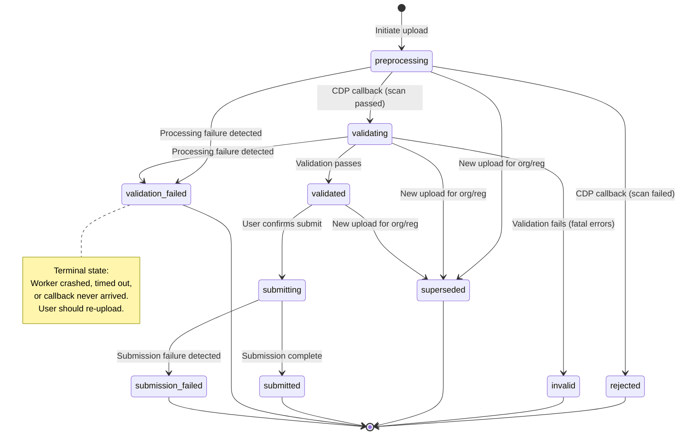
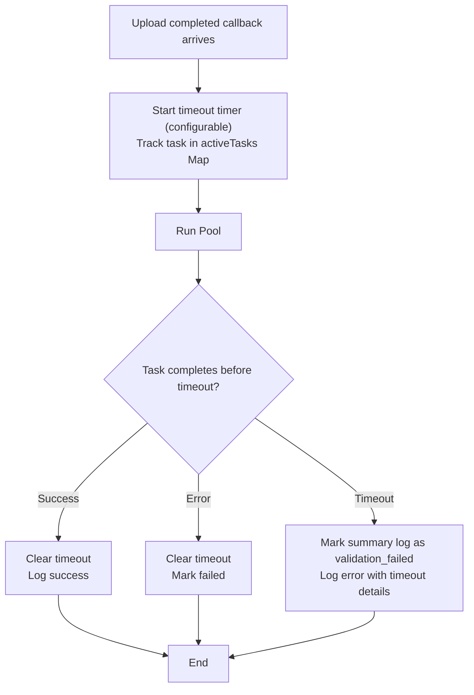
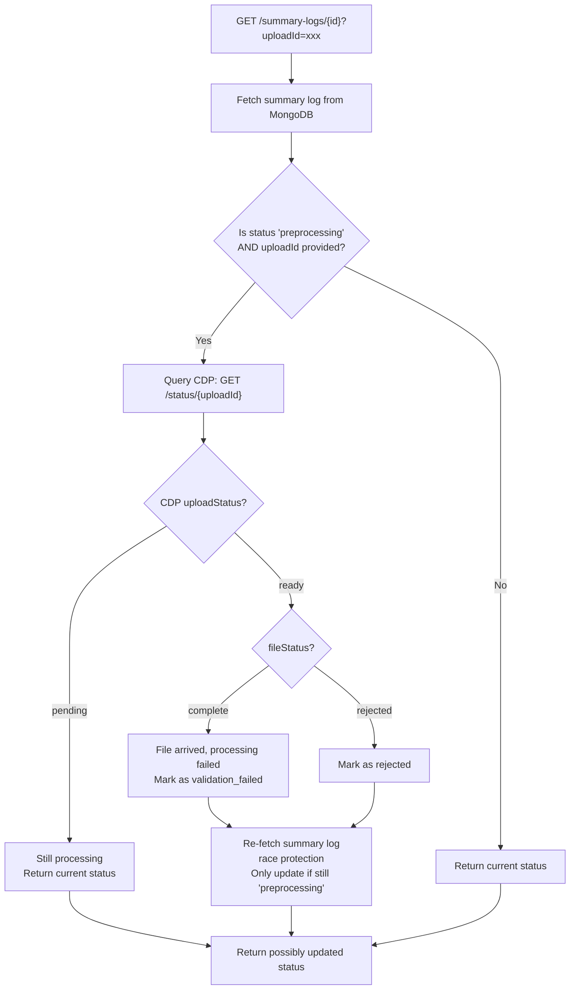

# Summary Log Processing Failure Handling: Low Level Design

This document describes the implementation approach for handling processing failures during summary log upload and validation, preventing the frontend from polling indefinitely.

For related context, see:

- [Summary Log Validation LLD](./summary-log-validation-lld.md) - validation pipeline details
- [Summary Log Submission LLD](./summary-log-submission-lld.md) - submission workflow and Phase 3 `submission_failed` state

<!-- prettier-ignore-start -->
<!-- TOC -->
* [Summary Log Processing Failure Handling: Low Level Design](#summary-log-processing-failure-handling-low-level-design)
  * [Problem statement](#problem-statement)
    * [Observed failure scenarios](#observed-failure-scenarios)
    * [Impact](#impact)
  * [Analysis](#analysis)
    * [Current flow](#current-flow)
    * [Failure points](#failure-points)
    * [Key insight](#key-insight)
  * [Solution design](#solution-design)
    * [Two-component approach](#two-component-approach)
    * [Coverage matrix](#coverage-matrix)
  * [Status transitions](#status-transitions)
    * [Updated state diagram](#updated-state-diagram)
    * [New terminal states](#new-terminal-states)
    * [Distinction between failure states](#distinction-between-failure-states)
  * [Component 1: Background timeout tracker](#component-1-background-timeout-tracker)
    * [How it works](#how-it-works)
    * [Behaviour](#behaviour)
    * [Limitations](#limitations)
  * [Component 2: CDP status check](#component-2-cdp-status-check)
    * [How it works](#how-it-works-1)
    * [Behaviour](#behaviour-1)
    * [Limitations](#limitations-1)
  * [Frontend changes](#frontend-changes)
<!-- TOC -->

<!-- prettier-ignore-end -->

## Problem statement

The frontend polls the backend `GET /summary-logs/{id}` endpoint waiting for the status to transition from `preprocessing` or `validating` to a terminal state (`validated`, `invalid`, or `rejected`). If the backend never updates the status, the operator is stuck in an infinite polling loop.

### Observed failure scenarios

| Scenario | Root cause | Status stuck at |
| -------- | ---------- | --------------- |
| CDP callback never arrives | Incorrect CDP Uploader configuration | `preprocessing` |
| Worker thread crashes | Out-of-memory processing large spreadsheet | `validating` |

Both issues have been fixed, but the system remains vulnerable to similar failures.

### Impact

- Operator sees a loading spinner indefinitely
- No error message or recovery option presented
- Requires manual intervention to diagnose and resolve

## Analysis

### Current flow



### Failure points

1. **CDP callback to backend** - Network issues, misconfiguration, backend downtime
2. **Worker thread processing** - OOM, unhandled exceptions, infinite loops
3. **Database updates** - Connection issues, write failures
4. **Server restarts** - In-flight processing lost

### Key insight

The backend has no way to detect that processing has failed. It simply returns the current status from the database, which remains unchanged when failures occur silently.

## Solution design

### Two-component approach

| Component | Type | Catches |
| --------- | ---- | ------- |
| **Background timeout tracker** | Proactive | Worker crashes, worker hangs, worker OOM |
| **CDP status check** | Reactive | Missed callbacks, server restarts mid-processing |

Neither component alone covers all failure scenarios. Together they provide complete protection.

### Coverage matrix

| Scenario | Background timeout tracker | CDP status check |
| -------- | -------------------------- | ---------------- |
| CDP callback never arrives | No - worker never spawned | **Yes** - detects file ready but status stuck |
| Worker crashes (OOM, etc.) | **Yes** - promise rejects | Yes - but slower (reactive) |
| Worker hangs forever | **Yes** - timeout fires | Yes - but slower (reactive) |
| Server restarts mid-processing | No - in-memory state lost | **Yes** - survives restart |

## Status transitions

### Updated state diagram



### New terminal states

| State | Phase | Caused by | User action |
| ----- | ----- | --------- | ----------- |
| `validation_failed` | Upload/Validation | Worker crash, timeout, missed callback | Re-upload |
| `submission_failed` | Submission | Detectable submission failure | Re-upload or retry |

### Distinction between failure states

| State | Meaning | How detected |
| ----- | ------- | ------------ |
| `rejected` | CDP rejected the file (virus, wrong type, too large) | CDP callback with rejection |
| `invalid` | Validation completed but found fatal errors in data | Validation pipeline completed |
| `validation_failed` | Processing failed before validation could complete | Timeout tracker or CDP status check |
| `submission_failed` | Submission failed after validation passed | Submission error handling (Phase 3) |

**Key distinction**: `invalid` means "we validated your file and found problems with the data". `validation_failed` means "we couldn't complete validation due to a technical issue".

## Component 1: Background timeout tracker

### How it works



### Behaviour

- Fires when worker task exceeds configured timeout
- Catches promise rejection from worker crashes
- Updates summary log status to `validation_failed` immediately
- Maintains fire-and-forget pattern (non-blocking)

### Limitations

- In-memory state lost on server restart
- Only tracks tasks that were dispatched (not missed callbacks)

## Component 2: CDP status check

### How it works




### Behaviour

- Triggered when frontend polls with `uploadId` query parameter
- Only queries CDP when status appears stale
- Updates summary log status based on CDP response
- Graceful degradation if CDP unavailable

### Limitations

- Reactive (only checks when polled)
- Requires frontend to pass `uploadId`
- Depends on CDP status endpoint availability

## Frontend changes

The frontend must store and pass the `uploadId` received during upload initiation:

1. **Store uploadId**: When `POST /summary-logs` returns, store `uploadId` in session
2. **Pass uploadId**: Include as query parameter in status polling requests
3. **Handle new status**: Treat `validation_failed` like `rejected` - show error page with re-upload option

```
GET /summary-logs/{id}?uploadId={uploadId}
```

