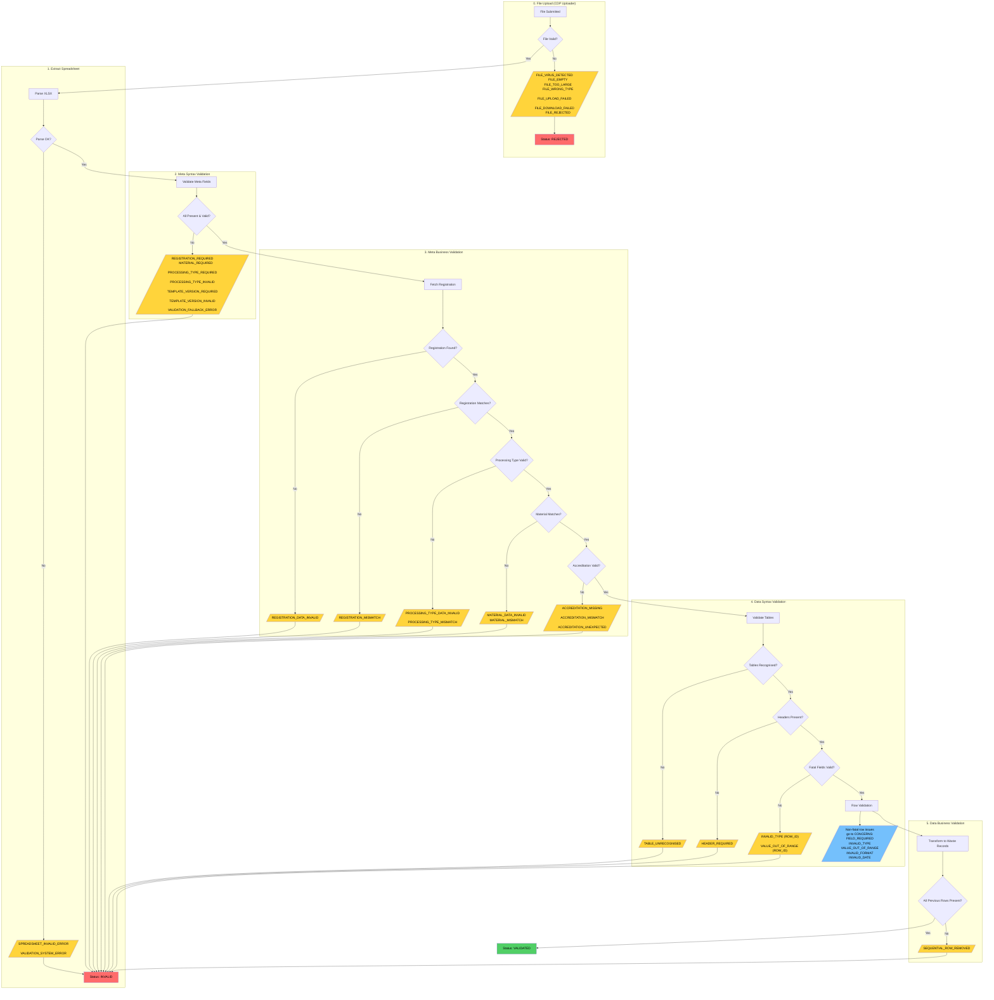

# Summary Log Validation Failure Codes

This document provides a complete reference for all validation failure codes that can appear in the `failures` array of a summary log validation response.

For the response format specification, see [ADR 20: Summary Log Validation Output Formats](../decisions/0020-summary-log-validation-output-formats.md).

<!-- prettier-ignore-start -->
<!-- TOC -->

- [Summary Log Validation Failure Codes](#summary-log-validation-failure-codes)
  - [Overview](#overview)
  - [Validation pipeline flowchart](#validation-pipeline-flowchart)
  - [File upload failures (CDP Uploader rejection)](#file-upload-failures-cdp-uploader-rejection)
  - [Meta-level validation failures (FATAL severity)](#meta-level-validation-failures-fatal-severity)
    - [Meta syntax validation](#meta-syntax-validation)
    - [Meta business validation](#meta-business-validation)
  - [Data-level FATAL failures](#data-level-fatal-failures)
  - [System failures](#system-failures)
  - [Key behaviours](#key-behaviours)
    <!-- TOC -->
    <!-- prettier-ignore-end -->

## Overview

Summary log validation uses a **short-circuit strategy**: each validation level must pass before the next runs. This means the frontend will only ever see failures from one level at a time.

There are two distinct failure groupings in the HTTP response:

- **`failures`** - Fatal errors that block submission (this document)
- **`concerns`** - Row-level issues grouped by table (see [Summary Log Row Validation Classification](./summary-log-row-validation-classification.md))

These are mutually exclusive: if `failures` contains any items, `concerns` will be empty.

## Validation pipeline flowchart

## File upload failures (CDP Uploader rejection)

These failures occur before validation begins, when CDP Uploader rejects the file. The summary log status becomes `rejected`.

| Code                   | Trigger                            |
| ---------------------- | ---------------------------------- |
| `FILE_VIRUS_DETECTED`  | File contains a virus              |
| `FILE_EMPTY`           | File is empty                      |
| `FILE_TOO_LARGE`       | File exceeds size limit            |
| `FILE_WRONG_TYPE`      | Wrong file type (not xlsx etc.)    |
| `FILE_UPLOAD_FAILED`   | Upload to CDP failed               |
| `FILE_DOWNLOAD_FAILED` | Could not download from CDP        |
| `FILE_REJECTED`        | Fallback for unknown upload errors |

## Meta-level validation failures (FATAL severity)

These failures occur during validation of the spreadsheet's metadata (Cover sheet). The summary log status becomes `invalid`.

### Meta syntax validation

Validates that required meta fields are present and have valid formats:

| Code                        | Trigger                                 |
| --------------------------- | --------------------------------------- |
| `REGISTRATION_REQUIRED`     | Missing registration number in metadata |
| `MATERIAL_REQUIRED`         | Missing material type in metadata       |
| `PROCESSING_TYPE_REQUIRED`  | Missing processing type in metadata     |
| `PROCESSING_TYPE_INVALID`   | Invalid processing type value           |
| `TEMPLATE_VERSION_REQUIRED` | Missing template version                |
| `TEMPLATE_VERSION_INVALID`  | Invalid/unsupported template version    |
| `VALIDATION_FALLBACK_ERROR` | Unmapped Joi validation type            |

### Meta business validation

Validates that meta field values match the registration data:

| Code                           | Trigger                                               |
| ------------------------------ | ----------------------------------------------------- |
| `REGISTRATION_DATA_INVALID`    | Registration lookup failed                            |
| `REGISTRATION_MISMATCH`        | Registration does not match the one on the upload URL |
| `PROCESSING_TYPE_DATA_INVALID` | Processing type lookup failed                         |
| `PROCESSING_TYPE_MISMATCH`     | Processing type does not match registration           |
| `MATERIAL_DATA_INVALID`        | Material lookup failed                                |
| `MATERIAL_MISMATCH`            | Material does not match registration's material       |
| `ACCREDITATION_MISSING`        | Required accreditation number missing                 |
| `ACCREDITATION_MISMATCH`       | Accreditation does not match                          |
| `ACCREDITATION_UNEXPECTED`     | Accreditation provided but not expected               |

## Data-level FATAL failures

These are structural issues with data tables that prevent processing:

| Code                     | Trigger                                                    |
| ------------------------ | ---------------------------------------------------------- |
| `TABLE_UNRECOGNISED`     | Unknown table name / no schema for table                   |
| `HEADER_REQUIRED`        | Missing required column header                             |
| `INVALID_TYPE`           | ROW_ID not a number                                        |
| `VALUE_OUT_OF_RANGE`     | ROW_ID below minimum (1000)                                |
| `SEQUENTIAL_ROW_REMOVED` | Gap in row sequence (row was deleted from previous upload) |

## System failures

These occur when something goes wrong during validation processing:

| Code                        | Trigger                                                    |
| --------------------------- | ---------------------------------------------------------- |
| `SPREADSHEET_INVALID_ERROR` | Spreadsheet fails structural validation (cannot be parsed) |
| `VALIDATION_SYSTEM_ERROR`   | System failure during validation                           |

## Key behaviours

1. **Short-circuit validation** - Each level must pass before the next runs. If meta syntax fails, you will not see meta business errors until those are fixed.

2. **Two terminal states**:
   - `rejected` - File upload failed (before validation starts)
   - `invalid` - Validation failed (any FATAL issue)

3. **`failures` vs `concerns`**:
   - `failures` array contains fatal errors that block submission
   - `concerns` object contains row-level issues (grouped by table) that do not block submission

4. **Single level of failures** - The frontend will only ever see failures from one validation level at a time due to short-circuiting.
