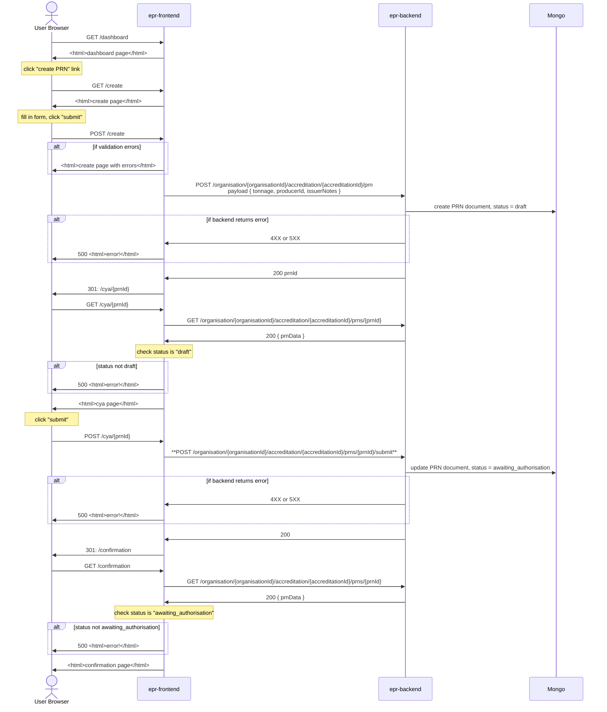

## PRN creation page + data flow

### New APIs

#### POST /organisations/{organisationId}/accreditations/{accreditationId}/prn
body: `{ tonnage, producerId, issuerNotes }`

creates PRN document with `status: draft`
returns PRN ID
validation
 - `accreditationId` owned by `organisationId`
 - sufficient waste balance available for specified tonnage

***NOTE: delivered by PAE-926***

#### GET /organisations/{organisationId}/accreditations/{accreditationId}/prns/{prnId}

surfaces latest data for specified PRN
validation
- `accreditationId` owned by `organisationId` (prevent API access to PRNs belong to other organisations)

***NOTE: delivered by PAE-926***

####POST /organisations/{organisationId}/accreditations/{accreditationId}/prns/{prnId}/submit
body: `empty`

performs the transition from `status: draft -> awaiting_authorisation`
validation
 - `accreditationId` owned by `organisationId`
 - prn in `draft` status
 - sufficient waste balance available for specified tonnage

#### POST /organisation/{organisationId}/accreditation/{accreditationId}/prns/{prnId}/issue
body: `empty`

performs the transition from `status: awaiting_authorisation -> awaiting_acceptance`
validation
 - `accreditationId` owned by `organisationId`
 - prn in `draft` status
 - sufficient waste balance available for specified tonnage

