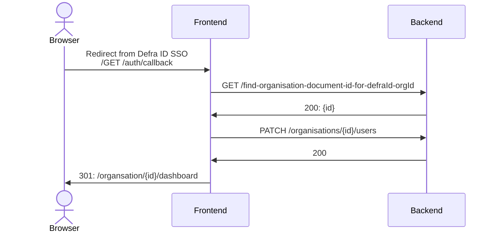
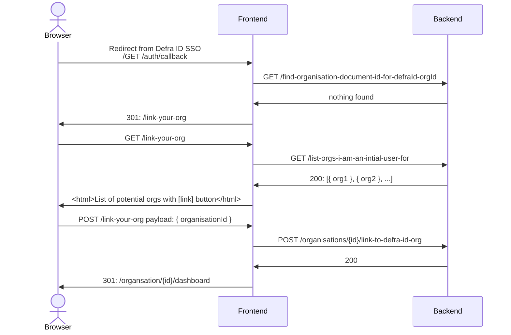

# API simplification proposal


## Sequence diagrams


  ### Access to linked org




### Access to unlinked org



## Endpoints

### GET /find-organisation-document-id-for-defraId-orgId

(better name needed - this name is to convey intent)

**Auth scopes:** `operator`

**Implementation**
```js
const defraIdOrgId = defraIdAccessToken.currentRelationShip.orgId
eprOrganisationsRepository.findBy({ defraIdOrgId }, { projection: { _id }})`
```

### PATCH /organisations/{id}/users

**Auth scopes:** `operator && organisationMember`

**Payload:** `{ id, email }`

**Implementation**
```js
const user = {
  id: defraAccessToken.id,
  email: defraAccessToken.email,
  initialUser: false
}
const eprOrg = eprOrganisationsRepository.find(id)

// some thought needed here - is it just an ID match? Is an update needed if the id matches but the email does not?
if (!eprOrg.users.some(existing => existing.id === user.id)) {
  eprOrg.users.push(user)
  eprOrganisationsRepository.updated(eprOrg)
}
```

### GET /list-orgs-i-am-an-intial-user-for

(better name needed - this name is to convey intent)

**Auth scopes:** `operator`

**Implementation**

```js
eprOrganisationsRepository
  .findAll()
  .filter(org => org.users.some(existing => existing.id === user.id && !!existing.initialUser))
```

### POST /organisations/{id}/link-to-defra-id-org

**Auth scopes:** `operator && organisationInitialUser`

**Implementation**
```js
const eprOrg = eprOrganisationsRepository.findById()

org.defraIdOrgId = defraIdAccessToken.currentRelationShip.orgId

eprOrganisationsRepository.update(eprOrg)
```


## Scopes implementation

```js
function getDefraIdRoles(request, defraIdAccessToken, organisationIdFromUrl) {
  // if the user has an authenticated Defra ID access token assume they are an operator
  const roles = ['operator']

  const { eprOrganisationsRepository } = request

  const eprOrg = eprOrganisationsRepository.findById(organisationIdFromUrl)

  if (
    eprOrg // org exists
    && !!eprOrg.defraIdOrgId // org is linked to Defra ID org
    && eprOrg.defraIdOrgId === defraIdAccessToken.currentRelationShip.orgId
  ) {
    roles.push('organisationMember')
  }

  if (
    eprOrg // org exists
    && eprOrg.users.some(existing => existing.id === defraIdAccessToken.userId && existing.initialUser)
  ) {
    roles.push('organisationInitialUser')
  }

  return roles
}
```
