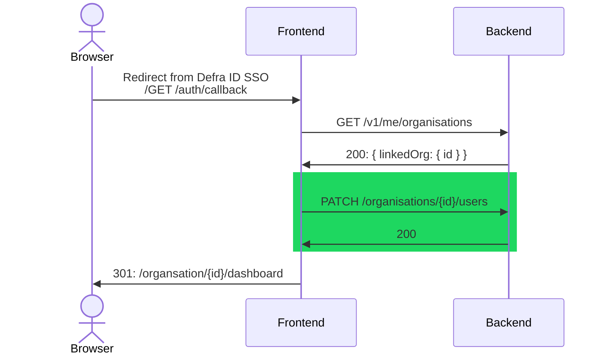
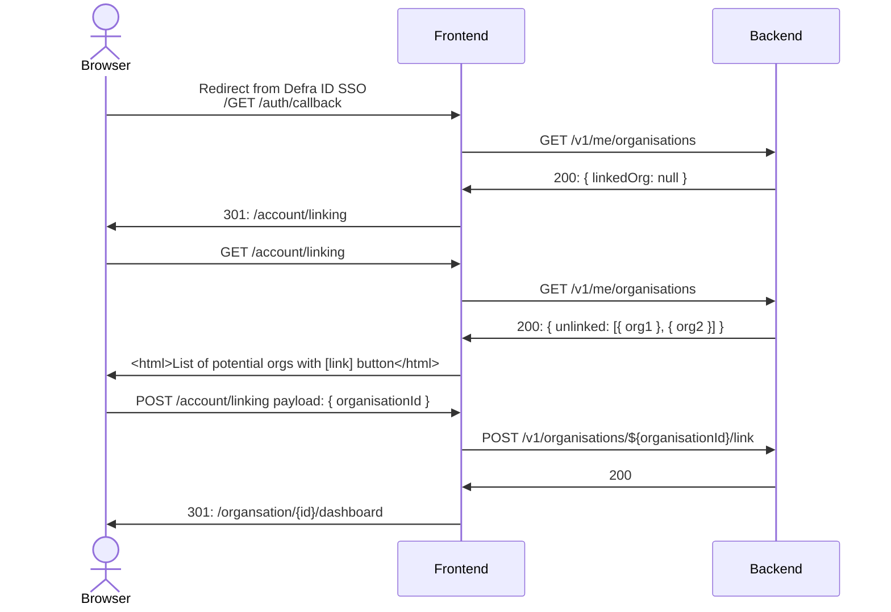

# Operator user linking simplification proposal

This proposal aims to simplify how a "standard user" is added to an `epr-organisation` such that the implementation does not rely on side-effects, giving
- simpler (more maintainable) code
- simpler to apply targeted auditing/metrics instrumentation

The proposed change is called out with a green background in the below sequence diagrams, and some subtle rethinking on how roles/scopes are assigned to a user in `epr-backend`

_Out of scope - proposal for how to pull approvals out of PUT /organisations/{id}_

## Sequence diagrams


  ### Access to linked org




### Access to unlinked org



## Endpoints

### GET /v1/me/organisations

**Auth scopes:** `operator`

**Implementation**
```js
const defraIdOrgId = defraIdAccessToken.currentRelationShip.orgId

const linked = eprOrganisationsRepository
	.find({ 'linked.defraIdOrgId': defraIdOrgId })

const unlinkedOrgsIAmAnInitialUserFor = eprOrganisationsRepository
  .findAll()
  .filter(org => !org.linked)
  .filter(org => org.users.some(user => user.initialUser && user.email === defraIdAccessToken.email))

return { linked, unlinked: unlinkedOrgsIAmAnInitialUserFor }

```

### PATCH /organisations/{organisationId}/users

**Auth scopes:** `operator && organisationMember`

**Payload:** `{ id, email }`

**Implementation**
```js
const user = {
  id: defraAccessToken.id,
  email: defraAccessToken.email,
  initialUser: false
}
const eprOrg = eprOrganisationsRepository.find(organisationId)

// some thought needed here - is it just an ID match? Is an update needed if the id matches but the email does not?
// more thought needed here - initialUsers won't have an id

if (!eprOrg.users.some(existing => existing.id === user.id)) {
  eprOrg.users.push(user)
  eprOrganisationsRepository.update(eprOrg)
}
```

### POST /organisations/{organisationId}/link-to-defra-id-org

**Auth scopes:** `operator && organisationInitialUser`

**Implementation**
```js
const eprOrg = eprOrganisationsRepository.findById(organisationId)

org.linked = {
  defraIdOrgId: defraIdAccessToken.currentRelationShip.orgId
}

eprOrganisationsRepository.update(eprOrg)
```


## Scopes implementation

```js
function getDefraIdRoles(request, defraIdAccessToken, organisationIdFromUrl) {
  // if the user has an authenticated Defra ID access token assume they are an operator
  const roles = ['operator'] // aka ROLES.inquirer

  const { eprOrganisationsRepository } = request

  const eprOrg = eprOrganisationsRepository.findById(organisationIdFromUrl)

  if (
    eprOrg // org exists
    && eprOrg.linked?.defraIdOrgId === defraIdAccessToken.currentRelationShip.orgId
  ) {
    roles.push('organisationMember') // aka ROLES.standardUser
  }

  if (
    eprOrg // org exists
    && eprOrg.users.some(user => user.initialUser && user.email === defraIdAccessToken.email)
  ) {
    roles.push('organisationMember') // aka ROLES.standardUser
    roles.push('organisationInitialUser') // aka ROLES.linker
  }

  return roles // should de-dupe here as above implementation allows organisationMember to be added twice
}
```
